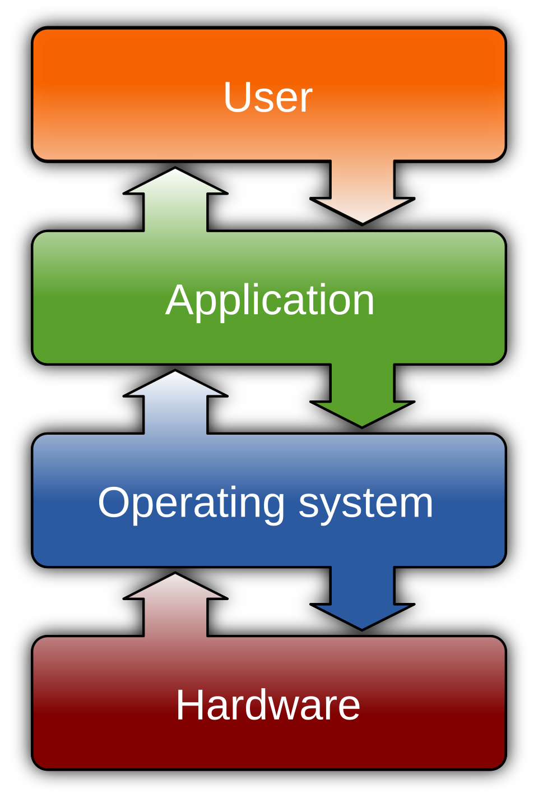

# Apps vs the OS

*The operating system as the strict landlord every app must obey — memory, permissions, updates — and why that hierarchy explains half of your settings screens.*

> An app cannot draw a single pixel, save a single byte, or hear a single click by
> itself. Everything — EVERYTHING — an app does, it does by politely asking the
> operating system. The OS can say no. The OS frequently says no. Once you see this
> landlord-and-tenants arrangement, half the mysteries of your settings screens
> dissolve: **permissions**: OS-enforced keys an app needs before touching protected hardware or data — camera, mic, location, files., updates, "this app has been closed to protect your system" —
> it's all one power structure. Let's meet the landlord.

> **In real life**
>
> The OS is the **landlord of a large building**; apps are **tenants**. The landlord
> owns the utilities (hardware access), assigns each tenant their unit (memory — with
> walls, remember?), keeps the master keys (permissions), and evicts troublemakers
> (force-close). Tenants never rewire the building themselves — they file a request
> and the landlord's staff does it. A tenant who TRIES to rewire gets evicted on the
> spot. It's not tyranny; it's why the building doesn't burn down weekly.

## What the landlord actually controls

Windows, macOS, Linux, Android, iOS — different landlords, same responsibilities:

- **Hardware access** — apps never touch the disk, screen, or network directly; they call the OS, the OS calls the drivers (the translators — the whole chain assembles!).
- **Memory walls** — each process gets its own unit and CANNOT read a neighbor's (last topic's isolation, revealed as landlord policy).
- **The master keys (permissions)** — camera, mic, location, files: apps must ASK, you and the OS decide. That settings screen you checked in the input topic? The landlord's key cabinet.
- **Scheduling** — hundreds of processes, a handful of CPU cores: the OS decides who runs when, in slices so thin it looks simultaneous. The kitchen's shift manager.
- **Eviction** — an app misbehaves (crashes, hogs, hangs), the OS contains and removes it without burning the building. "Not Responding → End Task" is you co-signing an eviction.

## The building, in one diagram

The whole power structure, standardized — this exact diagram appears in every
computing course on Earth. Tap each floor:


*Diagram: Wikimedia Commons, CC BY-SA 3.0. [Source](https://commons.wikimedia.org/wiki/File:Operating_system_placement.svg)*
- **User — you, the reason for everything** — You only ever touch the layer below (apps). You never negotiate with the OS or hardware directly — every wish travels DOWN the floors and every answer travels back UP.
- **Application — the tenants** — Where every app lives: browser, games, editors... and the apps you'll test. Note what's above (users with their chaos) and below (the landlord with the keys). Apps live squeezed between both — which is precisely where bugs breed.
- **Operating system — the landlord's floor** — EVERYTHING passes through here: every click going down, every pixel coming up. Permissions, memory walls, scheduling — enforced at this floor. This is also the floor that differs between Windows/Mac/Android/iOS: same diagram, different landlord.
- **Hardware — the foundation** — The physical kitchen from Chapters 1-2. It executes; it doesn't decide. Apps can't touch it directly — the arrows HAVE to pass through the OS floor. That enforced detour is the whole security model.
- **The arrows — where bugs travel** — Every request and response crosses these arrows. A wrong answer at ANY crossing = a bug somewhere in the stack. 'Which layer broke?' is the professional version of every diagnosis you've learned this module.

🎬 [Crash Course — operating systems: the landlord's full job description](https://www.youtube.com/watch?v=RhHMgkUdhdk) (12 min)

## Why this explains your daily life

- **"App X wants to access your camera"** = tenant requesting a key. The landlord (OS) enforces your answer — the app literally cannot bypass it. (Testing that it truly can't = real security QA.)
- **OS update vs app update** = renovating the building vs redecorating one unit. Building renovations (OS updates) are the risky, reboot-requiring, don't-power-off ones — they touch what every tenant depends on.
- **"This app isn't compatible with your OS version"** = tenant needs building features this old building lacks. The building's version sets the floor for every tenant — why bug reports ALWAYS include the OS version, right next to the app version.
- **Same app, different OS, different behavior** = same tenant, different landlord, different house rules. THE classic cross-platform bug source — and why real test plans list "Windows 11 / macOS 15 / Android 16 / iOS 19" as separate test targets.

> **Tip**
>
> That last bullet is your future beat: **cross-platform testing.** The app's code may
> be 95% identical, but the landlord differs — file paths, permission dialogs, back
> buttons, font rendering. "Works on Android, crashes on iOS" bugs are landlord
> disputes, and testers who understand the OS layer diagnose them in hours instead of
> days. Track A is quietly building you that lens.

### Your first time: Your mission: audit the landlord's key cabinet

- [ ] Open the key cabinet — Windows: Settings → Privacy & security. Mac: System Settings → Privacy & Security. Phone: Settings → Privacy/Permissions. Same cabinet, every landlord.
- [ ] Audit ONE key: the camera — See the list of every tenant holding the camera key. Anyone you don't remember approving? Revoke freely — tenants must re-ask.
- [ ] Watch a request happen — Open a video-call site in your browser: the permission popup IS the tenant asking the landlord asking YOU. Three-party handshake, in the wild.
- [ ] Find your OS version — Settings → About. Write it down next to the specs you've been collecting — machine, RAM, storage, and now the landlord's version. Your environment line is nearly complete.
- [ ] Spot one landlord difference — If you have a phone + computer: notice how EACH asks for permissions differently (timing, wording, options). Same concept, different house rules — cross-platform testing in miniature.

Key cabinet audited, one live request witnessed, OS version filed. You've seen the
power structure operating in real time.

- **The app worked yesterday; after the big system update it won't start.**
  Building renovation broke a tenant's assumptions — extremely common right after OS updates. Check for an app update FIRST (developers usually ship compatibility fixes fast), then the app's site/community for '[app] broken on [OS version]' — you will rarely be alone. This is why cautious people wait a week before major OS updates. Testers, meanwhile, get PAID to find these breaks before release.
- **The app can't see my files / camera / mic, but the hardware works everywhere else.**
  Landlord said no — permission denied, probably silently. The key cabinet (Privacy settings) → find the app → grant the key → restart the app. The input topic taught you the one-app-vs-everywhere fork; now you know WHO was blocking: not the hardware, the landlord.
- **'This app has been closed to protect your system.'**
  An eviction notice — the app tried something outside its lease (bad memory access, forbidden operation) and the OS contained it. One-off: shrug, reopen. Recurring: the app has a real bug (report it — you know how by now) or its installation is corrupted (reinstall = fresh lease). The OS did its job; the tenant had the problem.
- **The same app behaves differently on my laptop vs my phone.**
  Different landlord, different house rules — file locations, permissions, screen constraints, background-app policies (phones evict background tenants aggressively to save battery!). Not necessarily a bug: check the app's docs for platform differences. But if a FEATURE silently vanished on one platform — that's a legit cross-platform bug, and now you can name its habitat.

### Where to check

The landlord's office keeps everything visible:

- **Key cabinet:** Privacy/Permissions settings — every key, every tenant holding it.
- **Building version:** Settings → About — the OS version that sets every tenant's floor.
- **Tenant registry:** Settings → Apps — every installed tenant, its version, its storage footprint, and the uninstall (eviction-by-choice) button.
- **Eviction records:** Windows Event Viewer / macOS Console log every crash and forced close — the landlord's incident book, timestamped.

App version + OS version together fingerprint any software situation — which is
why every bug template asks for both, and why you now collect both by reflex.

> **Common mistake**
>
> Blaming the app for the landlord's decisions (or vice versa). "This app is broken —
> it can't access my photos!" when the OS was told to deny it. "My OS is trash — this
> app keeps crashing!" when the tenant has a memory bug. The fork: works after
> granting a permission = landlord issue (was it CLEAR though? UX bug territory).
> Crashes with permissions fine = tenant issue. Assigning blame to the right layer is
> half of every cross-platform bug report — and most users guess wrong every time.

**A permission request's journey — press Play**

1. **📱 App asks** — 'I'd like the camera, please.' The tenant files a request — it CANNOT just take the key. The architecture forbids it.
2. **🎩 OS checks the cabinet** — Has this app been granted the camera key before? Granted → proceed. Denied → refuse silently (the 'works everywhere but here' mystery). Never asked → escalate to the VIP.
3. **🙋 You decide** — The permission popup — the only moment the whole hierarchy pauses and asks the top floor. Your tap becomes policy.
4. **🔒 OS enforces forever** — The answer is stored and ENFORCED on every future access. Apps can re-ask; they can't override. Testing that they truly can't = real security QA.

*Try it — the key cabinet as code*

```python
# The OS's permission check, miniaturized. Edit the cabinet and re-run.
key_cabinet = {"camera": True, "microphone": False, "location": False}

def app_requests(key):
    if key_cabinet.get(key):
        print(f"✓ {key}: granted — the app may proceed")
    else:
        print(f"✗ {key}: DENIED by the OS — app sees nothing, hardware stays silent")

for k in ["camera", "microphone", "location"]:
    app_requests(k)
print("The app never touches the cabinet — it only ever receives verdicts.")
```

### Worked example: the banking app that died after an OS update

Real-world compatibility triage, step by step:

1. **Fingerprint both layers:** app v4.2 on the freshly-updated OS 18 — crashes at launch. Same app v4.2 on a friend's OS 17 — runs fine.
2. **Isolate the variable:** identical tenant, different building. The renovation broke this tenant's assumptions.
3. **Check the obvious exit:** the app store shows v4.3 released two days after the OS update — its changelog literally says "compatibility fixes for OS 18".
4. **Verdict:** update the app, crash gone. The whole case was solved by version numbers and one comparison device — no reinstalls, no factory resets, no shouting. App version + OS version: the fingerprint that closes cases.

**Quiz.** A user upgrades their phone OS. Afterwards, a banking app crashes at launch, every time. The same app version runs fine on a friend's phone with the OLD OS. Where does suspicion belong?

- [ ] The user's phone hardware is dying
- [x] App–OS compatibility: the new building broke this tenant's assumptions — an update from the app is likely needed
- [ ] The bank was hacked
- [ ] The friend's phone is lying

*Same app version + old OS = works; new OS = crashes. The variable that changed is the landlord. This is a textbook compatibility bug — and the exact scenario app teams test AGAINST before each OS release, in jobs with titles like 'QA engineer'. The evidence-isolating logic you just used is the entire method.*

- **Operating system (OS)** — The landlord: owns hardware access, walls memory, keeps permission keys, schedules CPU time, evicts misbehaving apps. Windows/macOS/Linux/Android/iOS.
- **Permissions** — The master keys — camera, mic, location, files. Apps must ask; the OS enforces. 'Blocked in one app only' = check the key cabinet first.
- **OS update vs app update** — Renovating the building vs redecorating a unit. OS updates touch what every app depends on — hence reboots, risk, and post-update breakage.
- **Compatibility bug** — App assumptions broken by a different/newer OS. Fingerprinted by app version + OS version — the pair every bug report demands.
- **Cross-platform testing** — Same app, different landlords, different house rules. Why test plans list each OS separately, and why 'works on Android' proves nothing about iOS.

### Challenge

Complete your environment line — it's been assembling all module long: **machine +
CPU + RAM + storage + OS version + app version (pick any app).** Write the full
sentence once. That line is the standard opening of a professional bug report, and
you built every piece of it by understanding, not by copying. Module 1's secret
agenda, nearly complete.

### Ask the community

> App [name + version] on [OS + version]: [exact behavior]. Permissions: [checked/granted]. Works on [other OS/device?]. Started after [OS update/app update/nothing]. Which layer — app, OS, or compatibility?

Look at the shape of that question: versions of both layers, permission state,
cross-device evidence, timeline. That's a compatibility triage form — the kind
support engineers fill for a living. You just... know how to write it now.

- [GCFGlobal — understanding operating systems](https://edu.gcfglobal.org/en/computerbasics/understanding-operating-systems/1/)
- [Crash Course — operating systems](https://www.youtube.com/watch?v=RhHMgkUdhdk)
- [How-To Geek — sandboxing: the walls, formalized](https://www.howtogeek.com/346637/what-is-a-sandbox-and-why-does-it-matter/)

- Apps do nothing directly — every pixel, byte and click goes through the OS. Landlord and tenants, always.
- Permissions are enforced by the OS, not promised by apps. The key cabinet settles 'blocked in one app' mysteries.
- OS updates renovate the building; expect (and testers: hunt) tenant breakage right after.
- App version + OS version = the fingerprint every bug report requires. You now collect both by reflex.
- Different OS, different house rules — cross-platform differences are landlord disputes, and diagnosing them is a paid skill.


---
_Source: `packages/curriculum/content/notes/how-a-computer-works/how-software-runs/apps-vs-the-os.mdx`_
