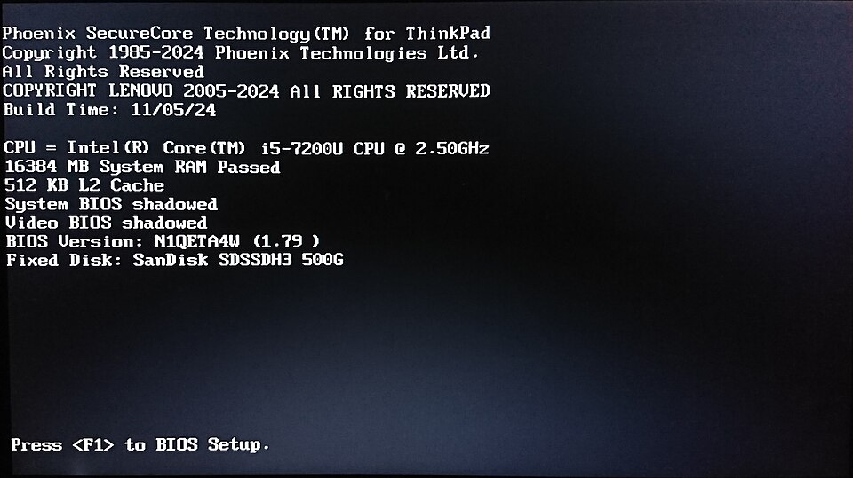

# Booting up

*The full story of the 30 seconds between the power button and your desktop — firmware, bootloader, OS, login — and how each stage fails with its own accent.*

> Here's a paradox to ruin your coffee: when you press the power button, the CPU wakes
> up knowing NOTHING. It can't read the disk — that needs software. But software lives
> ON the disk. So the machine must run software... to become able to load software.
> How does anything ever start?! The answer is a beautiful chain of bootstrapping —
> literally "pulling itself up by its bootstraps," which is where the word **boot**
> comes from. Yes, really.

> **In real life**
>
> Booting is a **relay race in the dark**. Runner one — a tiny program permanently
> burned into a chip on the motherboard — wakes with the power, carries the torch just
> far enough to find runner two (the bootloader) on the disk. Runner two knows exactly
> one route: where the OS sleeps. Runner three — the OS itself — takes the torch and
> lights up the whole stadium: drivers, services, login screen. Each runner exists
> only to wake someone smarter than itself.

## The relay, leg by leg

You met the 4-step overview in "Turning it on safely". Now the full anatomy:

1. **Firmware (BIOS/UEFI)** — the burned-in first runner. It lives on the motherboard, not the disk — which solves the paradox: SOME software must be physically part of the hardware. It checks the essentials (the POST self-check) and finds a bootable disk.
2. **Bootloader** — a tiny program at a special spot on the disk whose entire life purpose is: locate the OS, load its core into RAM, hand over. Dual-boot machines (Windows + Linux) put their "choose your OS" menu exactly here.
3. **OS kernel loads** — the core of the operating system takes command: memory management, process walls (last topic!), device drivers waking one by one. The logo-and-spinner phase.
4. **Services & login** — background staff clock in (the ~200-process crowd assembling), then the login screen. After you sign in: startup apps (the hoarders from Chapter 2) pile on last.

Total: seconds on an SSD, geological time on an old spinning disk with 40 startup
apps — every Chapter 2 lesson compounding at once.


*The universal power symbol — where the whole relay begins. One press, four runners, one lit stadium.*

**The relay race in the dark — press Play**

1. **⚡ Firmware** — Burned into the motherboard, wakes with the power. Runs POST — the self-check — and finds a bootable disk. The only runner who exists before any disk is readable.
2. **🏃 Bootloader** — A tiny program at a special spot on the disk. One job: locate the OS, load its core into RAM, hand over the torch. 'No bootable device' = this runner was never found.
3. **🧠 OS kernel** — The operating system's core takes command: memory walls up, drivers waking one by one, processes starting. The logo-and-spinner phase you stare at.
4. **🔑 Login** — Background services clock in, the login screen appears — and after you sign in, the startup apps pile on. The stadium is lit; the race is won.

## Leg 1, caught on camera

Blink and you miss it — but here's a real POST screen (a ThinkPad, mid-leg-1),
frozen for inspection. The firmware literally shows its work:


*Photo: Wikimedia Commons, public domain. [Source](https://commons.wikimedia.org/wiki/File:Phoenix_Technologies_UEFI_BIOS_POST_test_-_v.1.79,_ThinkPad_X230.jpg)*
- **CPU identified** — 'Intel Core i5-7200U @ 2.50GHz' — the firmware just met the chef and read its name tag. Chapter 2's spec line, being born in real time.
- **'16384 MB System RAM Passed'** — THE self-check, in writing: the firmware counted and tested every megabyte of the counter. This exact line failing (or beeping) = the RAM accent of a leg-1 failure.
- **BIOS Version: 1.79** — Firmware has VERSIONS — it's software (burned into hardware, but software). Yes, firmware gets updates. Yes, interrupting THOSE is the one truly scary update. Don't.
- **Fixed Disk: the baton handoff target** — The firmware found the disk — this is where it will look for runner two, the bootloader. 'No bootable device' means THIS line's discovery came up empty.
- **'Press F1 to BIOS Setup' — the doorbell** — The firmware offering its settings room. This prompt exists for exactly the seconds leg 1 runs — miss it, and the relay moves on. Now you know why mashing F1/F2/DEL at power-on is a tech ritual.

🎬 [Techquickie — BIOS/UEFI: the first runner, explained](https://www.youtube.com/watch?v=KgnvVJx5vLU) (6 min)

## Why you care: each leg fails with its own accent

This is the payoff. **Where the boot dies tells you WHO dropped the torch:**

- Dead silence, no lights → power, before the race even started (Chapter 1 knowledge).
- Beeps / error text on a black screen → firmware leg: POST found missing/broken hardware. The beeps are literally a code.
- "No bootable device" / "Operating system not found" → bootloader leg: the disk (or its special spot) is unreadable. Scary message, sometimes just a USB stick left plugged in that the firmware tried to boot from. Check that first. Always that first.
- Logo shown, spinner forever → OS leg: kernel or a driver is stuck mid-wake.
- Login works, then 5 minutes of molasses → the last leg: startup apps. Not broken — hoarding (and you already know the fix).

One skill, free of charge: you can now read a boot failure's ACCENT and name the
suspect before touching anything. That's not trivia — that's triage.

> **Tip**
>
> The tester angle: booting is a **dependency chain** — each stage needs the previous
> one healthy. Web apps have the exact same shape: DNS → server → app → database →
> page. When testers debug "the site is down", they walk the chain and find the dead
> link, exactly like you just learned to walk firmware → bootloader → OS → login.
> Master the pattern on a laptop; reuse it on production systems for a salary.

### Your first time: Your mission: watch the relay like an engineer

- [ ] Reboot your machine and narrate the legs — Firmware flash (maybe a manufacturer logo) → OS logo + spinner → login → desktop settling. Name each phase as it passes. It's a different experience when you know the runners.
- [ ] Time it — Phone stopwatch from button-press to usable desktop. Under 30s with SSD = healthy. Minutes = the last leg is hoarding (you know the Startup-apps drill).
- [ ] Find the firmware's doorbell — The 'Press F2/DEL for setup' flash at power-on — that's the firmware offering its settings menu. Just SEE it today, don't enter. (If you enter: change nothing, exit without saving. It's the machine's engine room.)
- [ ] Spot the boot order concept — The firmware tries disks in a configured ORDER — it's why a forgotten USB stick can hijack a boot. You don't need to change it; you need to know it exists.
- [ ] Identify your machine's boot drive — Task Manager → Performance → Disk usually shows which disk the OS lives on (the C: one, Windows). That disk's special spot is where runner two sleeps.

You've watched the relay with named runners, timed it, and located the baton. Boot
failures just lost their mystery.

- **'No bootable device found' — my computer forgot it has Windows?!**
  Breathe. First: is there a USB stick or external drive plugged in? Remove it, reboot — the firmware likely tried to boot from IT (boot order strikes). Still failing? The disk or bootloader has a real problem — that's recovery-mode territory, but you've correctly localized it to leg 2, which is exactly what a repair tech needs to hear.
- **It beeps at me — actual beeps — and shows nothing.**
  That's the firmware's POST reporting broken hardware in Morse-ish code — often RAM not seated properly. The beep PATTERN means something specific per manufacturer (search '[brand] beep codes'). Desktop + recent internal work = reseat the RAM sticks. The machine isn't dying; it's describing its pain precisely. Listen.
- **Stuck on the logo with the spinner, forever, every time.**
  Leg 3 — OS/driver stuck mid-wake. The escalation: force shutdown and retry once (transient hangs happen) → boot into Safe Mode (minimal drivers — if Safe Mode works, a recently-installed driver/update is your suspect) → system restore/recovery. Safe Mode existing AT ALL is the OS admitting drivers are the usual culprits.
- **Boots fine, but the first 5 minutes after login are unusable.**
  The last leg — startup hoarders fighting for the counter and the chef simultaneously. Task Manager → Startup apps → disable the freeloaders (Chapter 2's most satisfying fix, still undefeated). The boot was healthy; the after-party was overbooked.

### Where to check

The relay leaves records:

- **Boot time trend:** Task Manager → Startup apps shows 'last BIOS time' on some machines, and each app's startup impact — the receipts for a slow last leg.
- **The event log:** Windows Event Viewer logs every boot, shutdown, and unexpected restart with timestamps (the machine's diary from the power topic — boots are its biggest entries).
- **Safe Mode** — not a log but a diagnostic INSTRUMENT: minimal-driver boot that isolates leg 3 problems. Works in Safe Mode + fails normally = a driver/startup item is guilty. That's a controlled experiment, and you now know how to run it.

> **Common mistake**
>
> Panic-reinstalling the OS at the first boot problem. It's the nuclear option people
> reach for because boot failures LOOK apocalyptic — but you now know most have small
> causes with small fixes: a hijacking USB stick, unseated RAM, one bad driver, a
> bloated startup list. Read the accent, name the leg, try the leg's own fix.
> Reinstalling is the LAST resort — it's demolishing the stadium because one runner
> tripped.

*Try it — simulate the boot relay (break it on purpose)*

```python
# The boot relay in code. Change fail_at to see each leg's failure 'accent'.
fail_at = None   # try: "firmware", "bootloader", "os", or None

legs = ["firmware", "bootloader", "os", "login"]
accents = {
    "firmware": "beeps / black screen — POST found broken hardware",
    "bootloader": "'No bootable device' — the disk handoff failed",
    "os": "logo + spinner forever — a driver is stuck mid-wake",
}
for leg in legs:
    if leg == fail_at:
        print(f"✗ {leg.upper()} FAILED → {accents[leg]}")
        break
    print(f"✓ {leg} passed the torch")
else:
    print("🖥 Desktop reached — a healthy relay, all four runners home.")
```

### Worked example: 'Operating system not found' on a Monday morning

The scariest message in computing, walked calmly:

1. **Read the accent:** an error MESSAGE means firmware ran and POST passed — legs 1 and 2 of hardware are largely cleared. This failure speaks leg-2's dialect: finding the boot disk.
2. **Cheapest suspect first:** a USB stick from Friday is still plugged in. The **boot order**: The firmware's configured list of which disks to try booting from, in order. tried the stick, found no OS on it, and gave up before reaching the real disk.
3. **Act:** remove the stick, reboot.
4. **Verdict:** Windows appears as if nothing happened — because nothing did. A message that LOOKS like a dead computer was a photobombing USB stick. Accent-reading saved a morning of panic (and possibly an unnecessary repair bill).

**Quiz.** A machine powers on, shows the manufacturer logo, then displays 'Operating system not found'. A friend insists the RAM must be broken. Using the relay model, why is the friend wrong?

- [ ] RAM can never cause any problems
- [x] The message proves legs 1 (firmware/POST) passed — broken RAM would fail EARLIER with beeps or no display. This is a leg-2 (disk/bootloader) accent.
- [ ] The friend is right, replace the RAM
- [ ] It's a monitor problem

*The relay is sequential: reaching a firmware ERROR MESSAGE means firmware ran — which means POST passed — which largely clears the RAM. The failure speaks leg-2's dialect: disk/bootloader (or a mischievous USB stick). Eliminating suspects by WHERE in a sequence the failure appears — that's real fault isolation, and you just did it.*

- **Boot / bootstrapping** — The self-starting chain: burned-in firmware wakes → finds bootloader on disk → loads the OS → services & login. Software pulling itself up by its bootstraps.
- **Firmware (BIOS/UEFI)** — The first runner — software burned into the motherboard, solving the 'software needs software' paradox. Runs POST, picks the boot disk.
- **Bootloader** — Tiny disk-dwelling program with one job: find the OS, load it, hand over. 'No bootable device' is its leg failing (or a USB stick photobombing).
- **Safe Mode** — Minimal-driver boot = a controlled experiment. Works there but not normally? A driver or startup item is your suspect.
- **Boot accents** — Silence=power · beeps=hardware/POST · 'no bootable device'=disk/bootloader · eternal spinner=OS/drivers · slow after login=startup apps. The WHERE names the WHO.

### Challenge

Write the five boot-failure accents from memory (peek at the flashcards after, not
before): what does each stage's failure look like, and who's the suspect? Then time
your own boot and note which leg is slowest. You now hold a mental flowchart that
most computer OWNERS never acquire — and that support techs use daily. It took you
one topic.

### Ask the community

> Boot failure at leg: [silence/beeps/'no bootable device'/stuck spinner/slow after login]. Machine: [type]. Recent events: [update/new hardware/drop/USB plugged in]. Tried: [what]. Does my leg diagnosis look right?

Boot questions asked with the leg named ("stuck at leg 3, Safe Mode works") skip
three rounds of back-and-forth. You're not describing chaos anymore — you're
reporting a located fault. The difference in answer quality will be immediate.

- [Techquickie — what does BIOS/UEFI actually do?](https://www.youtube.com/watch?v=KgnvVJx5vLU)
- [GCFGlobal — starting a computer, gently](https://edu.gcfglobal.org/en/computerbasics/getting-started-with-your-first-computer/1/)
- [How-To Geek — Safe Mode as a diagnostic tool](https://www.howtogeek.com/329605/how-to-use-safe-mode-to-fix-your-windows-pc/)

- Boot = a relay: firmware (burned-in) → bootloader (on disk) → OS kernel → services & login. Each runner wakes someone smarter.
- The bootstrapping paradox is solved by firmware living IN the hardware — some software must be physically present.
- Each leg fails with its own accent — silence, beeps, 'no bootable device', eternal spinner, slow after login. The accent names the suspect.
- Safe Mode is a controlled experiment: minimal drivers, isolating leg 3. Works there = driver/startup guilt.
- Boot chains are dependency chains — the same walk-the-chain diagnosis runs web stacks. You'll reuse this on systems that pay you.


---
_Source: `packages/curriculum/content/notes/how-a-computer-works/how-software-runs/booting-up.mdx`_
