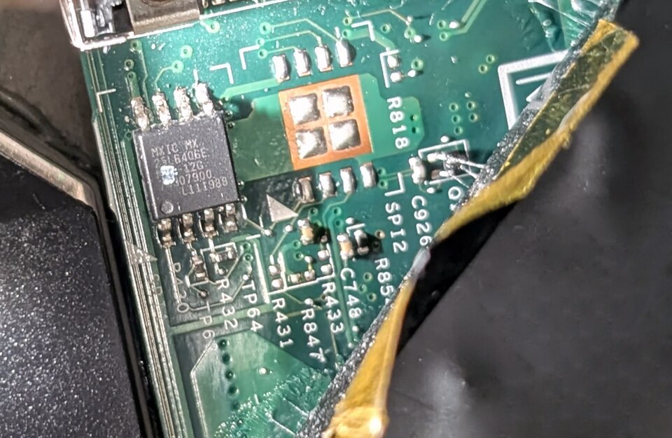

# Hardware vs software

*The body and the thoughts — what's physical, what's information, and why 'have you tried turning it off and on' only ever heals one of the two.*

> Riddle: what can you fix by restarting, but never fix with a screwdriver? And what
> can you fix with a screwdriver, but never by restarting? Congratulations — you've
> just met the deepest split in all of computing. Everything in a computer is either
> **hardware** or **software**, the two break in completely different ways, and knowing
> which one you're staring at is diagnosis lesson zero.

> **In real life**
>
> Hardware is the **kitchen**; software is the **recipes**. The kitchen is physical —
> it can burn, rust, fill with dust (we have PHOTOS). Recipes are information — they
> can't rust, but they can be wrong, contradictory, or misread. A restaurant fails
> either way: broken stove (hardware) or a recipe that says "salt: 2 kg" (software).
> Different failures, different fixes, different people to call.

## The split, cleanly

- **Hardware** — everything with mass: CPU, RAM, disks, screens, cables, the dust sweater on that fan. It obeys physics: it heats, wears, breaks when dropped.
- **Software** — pure information: the OS, apps, games, this website, the settings you change. It has no mass. You can't drop it. But it can be WRONG — and it's wrong in exactly the same way on every machine that runs the same version.

That last sentence is quietly enormous, so again: **hardware fails individually;
software fails identically.** One laptop's disk dies — its neighbor is fine. But a
bug in an app is present in every single copy of that app on Earth. Which is why one
tester finding one bug protects a million users. (Foreshadowing? Foreshadowing.)

## Where exactly do they meet?

Software lives ON hardware — recipes stored in the pantry (disk), spread on the
counter (RAM), executed by the chef (CPU). Chapter 2's whole cast returns:

1. Software at rest = files on storage (pantry).
2. Software running = loaded into RAM (counter), instructions streaming through the CPU (chef, at billions per second, understanding nothing, executing everything).
3. Every keystroke crosses the border: physical key (hardware) → electrical signal → interpreted by the OS (software) → letter on screen (back to hardware). Round trip, both worlds, every tap.

## The border, photographed

Want to SEE the exact place hardware and software touch? This is a real motherboard,
and that little 8-legged chip holds the firmware — **software physically burned into
hardware.** The border, in the flesh:


*Photo: Wikimedia Commons, CC BY-SA 4.0. [Source](https://commons.wikimedia.org/wiki/File:BIOS_chip_MXIC_25L6406E_on_a_ThinkPad_X220_motherboard.jpg)*
- **The firmware chip — the border itself** — Inside this 8-legged chip lives the BIOS/UEFI — software (instructions!) stored so permanently it survives with zero power. It breaks like hardware (physically) AND like software (corrupted updates). The border-dweller in person.
- **Copper traces — pure hardware** — These lines are just metal — wires printed onto the board, carrying electricity. No logic, no versions, no bugs. Physics only. This is what 100% hardware looks like.
- **Solder pads — where repair means screwdrivers** — Components are melted onto the board here. When THIS side fails, no update can help — someone needs a soldering iron. The fix tells you the side: downloads fix software; tools fix hardware.

🎬 [Crash Course — programs, hardware and the boundary between them](https://www.youtube.com/watch?v=O5nskjZ_GoI) (12 min)

*Try it — software is JUST instructions (edit one and prove it)*

```python
# This is software: pure instructions, no mass, no screwdriver needed.
# Change the name, change the number, press Run — the 'recipe' obeys instantly.
name = "tester"
lucky_number = 7

print("Hello,", name + "!")
print("Your lucky number times ten is:", lucky_number * 10)
print("No hardware was modified in the making of this output.")
```

**The two-question sorter — press Play**

1. **❓ Symptom** — Something's wrong, side unknown. Resist the urge to guess — run the sorter.
2. **🔄 Restart test** — Does a restart change it? Software states reset on restart; physics doesn't. A crack survives; a glitch often doesn't.
3. **🔁 Reproduce test** — Does it happen on another machine / account / copy? Software bugs TRAVEL with the software; hardware quirks stay home.
4. **⚖️ Verdict** — Travels = software (updates, settings, reinstalls). Stays home + survives restarts = hardware (screwdrivers, replacements). Two questions, one side convicted.

### Worked example: the keyboard typing @ instead of quotation marks

A colleague's keyboard 'broke' overnight: symbols come out wrong. The two-question sorter, applied:

1. **Restart test:** the wrongness survives a reboot — but that alone doesn't convict either side.
2. **Split test:** the on-screen keyboard (pure software) types the SAME wrong symbols. A physically broken key can't corrupt a software keyboard — so the fault is on the software side.
3. **Locate it:** the **keyboard layout**: The mapping between physical keys and characters — UK, US and other layouts place symbols differently. switched from UK to US overnight (an accidental shortcut). The @ and " keys swap between those layouts.
4. **Verdict:** two clicks in language settings. No new keyboard needed — the hardware was never on trial after the split test spoke. One test, one side eliminated: that's the whole method.

**Quiz.** Warm-up round: your laptop's screen has a crack spreading from the corner. Hardware or software?

- [ ] Software — restart it
- [x] Hardware — physics happened to a physical thing
- [ ] Both
- [ ] Neither, it's cosmetic

*Cracks obey physics, not logic. No restart, update or reinstall touches it — matter must be replaced. Easy one; they get sneakier below.*

**Quiz.** Sneakier: your keyboard types 'q' when you press 'a'. Hardware or software?

- [ ] Definitely hardware — the key is broken
- [ ] Definitely software — keyboards can't be wrong
- [x] Could be either — a broken key (hardware) OR a wrong keyboard layout setting (software). You need one test to split them.
- [ ] It's a virus

*This is the real lesson: symptoms don't announce their side. A French AZERTY layout setting swaps a/q in software — but a damaged key matrix does weird substitutions in hardware. The split test: on-screen keyboard types fine → hardware key. Same wrongness on-screen → software layout. One test, verdict delivered. THIS is why the split matters.*

**Quiz.** Final boss: the same app crashes at the same step on YOUR machine and your friend's machine. Which side is guilty?

- [ ] Hardware — both machines are broken
- [x] Software — identical failure on different hardware is the software signature
- [ ] Coincidence
- [ ] The users are doing it wrong

*Hardware fails individually; software fails identically. Same crash, same step, different physical machines = the recipe is wrong, not the kitchens. Reproducing a bug on a second machine to prove it's software — you've just described a standard QA verification step. You'll do it hundreds of times.*

> **Tip**
>
> Tester's phrasebook, first entry: **"Does it reproduce on another machine?"** That
> single question sorts hardware from software in one move — and it's why bug reports
> have an environment line at all. Software bugs travel with the software; hardware
> quirks stay home. Every 'works on my machine' dispute is settled by this exact
> question.

### Your first time: Your mission: sort ten things

- [ ] Sort these five: CPU, wallpaper setting, RAM stick, saved photo, Wi-Fi antenna — Answers: hardware, software, hardware, software (the photo is data — information!), hardware. The photo trips everyone once.
- [ ] Sort five of your own — Look around your machine and name 3 hardware + 2 software things you interact with daily. Say them out loud. Feel the line.
- [ ] Run the keyboard split test for real — Open your OS's on-screen keyboard (search 'on-screen keyboard' / Accessibility). This software keyboard bypasses the physical one — it's the a/q verdict machine from the quiz, ready when you need it.
- [ ] Catch software being identical — Any app on your phone AND a friend's — same version, same screens, same buttons in the same places. Different hardware, identical software. Now you've SEEN the principle.
- [ ] Name the border crossing — Press one key and narrate: physical press → signal → OS interprets → letter renders. One keystroke, four hops, both worlds. That's the whole computer in a sentence.

Ten things sorted, one split test armed, one principle witnessed. The deepest line in
computing is now drawn in your head.

- **Something's wrong and I don't know which side to even suspect.**
  The universal sorter, in order: (1) restart — heals software states, never hardware; (2) reproduce on another machine/user account — travels = software, stays = hardware-ish; (3) physical inspection — heat, noise, damage, loose cables. Three moves, and you've usually got your side.
- **It only breaks SOMETIMES. Randomly. I'm losing my mind.**
  Intermittent is the hardest class — but heat-correlated randomness (fails when hot, fine when cool) leans hardware (Chapter 2's throttling and dying components), while pattern-correlated randomness (fails after specific actions/duration) leans software (memory creep, race conditions). Start a log: WHEN it fails and what preceded it. Patterns convict; you just have to book-keep them. (Testers call this a repro hunt. It's the job.)
- **Support asked me to update the driver. Is that hardware or software?**
  Trick question — drivers are software that SERVES hardware (the translators from last chapter). They break like software (bugs, corruption, version mismatch), and they're fixed like software (update/reinstall). Hardware problems get screwdrivers; driver problems get downloads. The device can be innocent while its translator is drunk.
- **After a fall, my laptop is 'acting weird' in ways that make no sense.**
  Drops are hardware events — suspect physical damage first: loose connections, cracked solder, a shocked drive (remember the jumbo jet at grass height?). Software weirdness FROM hardware damage is real and confusing: corrupted disk sectors produce bizarre software symptoms. When there's a physical event in the story, physics goes to the top of the suspect list.

### Where to check

Each side keeps its own records:

- **Hardware census:** Device Manager / System Report — what physically exists, with ⚠ flags.
- **Software census:** Settings → Apps (Windows) / Applications folder (Mac) — every recipe installed, with versions.
- **The border:** driver lists (in Device Manager, per device) — software-serving-hardware, version numbers included.
- **The universal experiment:** another machine, another user account, another copy of the app. Reproduction scope IS the diagnosis.

Notice that "which version?" only makes sense for software — hardware has serial
numbers, software has versions. When a bug report asks for both, now you know it's
fingerprinting both worlds.

> **Common mistake**
>
> Trying software fixes on hardware problems (reinstalling the OS to cure a dying
> disk) — or hardware money on software problems (new laptop because an app is
> buggy). Each wastes the exact resource the other side needed. The split test costs
> minutes; the wrong-side fix costs days or dollars. Sort FIRST. It's two questions:
> does restarting change it? does it travel to another machine?

- **Hardware** — Everything with mass — obeys physics, heats, wears, breaks individually. Fixed with replacement and screwdrivers, never with restarts.
- **Software** — Pure information — can't rust, CAN be wrong, and is wrong identically in every copy. Fixed with updates, settings, reinstalls.
- **Hardware fails individually; software fails identically** — One disk dies alone; one bug ships to every user. Why reproduction on another machine is the great sorter — and why one tester protects millions.
- **Driver** — Software serving hardware — the border-dweller. Breaks and heals like software, even though a device wears its name.
- **The two-question sorter** — Does a restart change it? Does it reproduce elsewhere? Answers place the fault on its side of the line in minutes.

### Challenge

Be the family diagnostician: take any current complaint about a device in your home
("the TV app is weird", "grandpa's phone is slow") and run the two-question sorter on
it. Write your verdict — hardware, software, or border (driver) — and ONE piece of
evidence. You've just issued your first formal diagnosis. Frame optional.

### Ask the community

> Symptom: [exact behavior]. Sorter results: restart [changes/doesn't change] it; reproduces on [other machine/account: yes/no/untested]. Physical events in history: [drop/spill/none]. Which side do you suspect?

Bring the sorter results and you're not asking "what's wrong" — you're presenting a
half-finished diagnosis for review. Communities engage completely differently with
that. (You may have noticed every AskCommunity in this module teaches the same
lesson. That's not laziness. That's the lesson.)

- [GCFGlobal — hardware, software and the OS between them](https://edu.gcfglobal.org/en/computerbasics/understanding-operating-systems/1/)
- [Crash Course — programs, hardware and the boundary](https://www.youtube.com/watch?v=O5nskjZ_GoI)
- [How-To Geek — the split, spelled out](https://www.howtogeek.com/803044/hardware-vs-software-whats-the-difference/)

- Hardware = mass + physics; software = information + logic. Different failures, different cures, different bills.
- Hardware fails individually; software fails identically — the sentence that explains why testing scales.
- The two-question sorter: does restart change it? does it reproduce elsewhere? Minutes to a verdict.
- Drivers live on the border: hardware's name, software's nature. Detected-but-useless = their signature.
- Never spend hardware money on software problems or software rituals on hardware damage. Sort first.


---
_Source: `packages/curriculum/content/notes/how-a-computer-works/how-software-runs/hardware-vs-software.mdx`_
