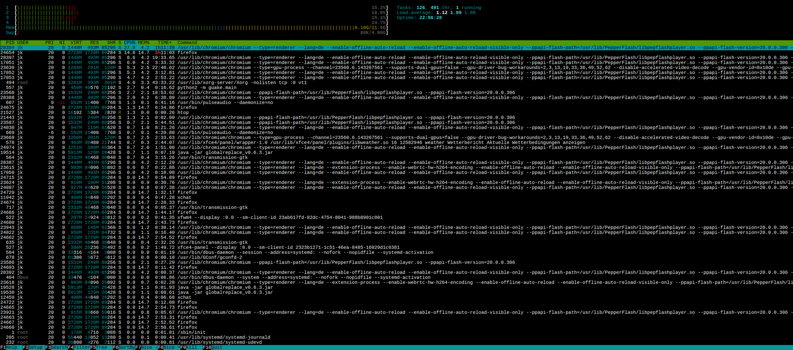

# Programs & processes

*The difference between an app on disk and an app alive in memory — and why your browser is secretly 23 processes in a trenchcoat.*

> Open Task Manager right now and count how many processes are running. Fifty?
> Two hundred? You opened, what, four apps? Where did the other hundred-and-change
> come from, who invited them, and why does Chrome alone appear FOURTEEN times?
> Today we solve the mystery of the invisible crowd — and hand you the single most
> satisfying power move in computing: ending a task.

> **In real life**
>
> A **program** is a recipe in the book (a file, sitting quietly on disk). A
> **process** is that recipe BEING COOKED — ingredients on the counter (RAM), a chef's
> attention (CPU time), heat in the pan. One recipe can be cooked many times at once
> (open two Notepad windows: one program, two processes). And a kitchen at dinner
> service has WAY more pans going than dishes on the menu — sauces, sides, prep work.
> Those are your two hundred processes.

## Program vs process — the two states of software

- **Program** — software at rest: an installed app, a file on storage. Doing nothing. Costing nothing (except disk space).
- **Process** — software alive: loaded into RAM, receiving CPU time, holding resources. Every process has an ID, a memory footprint and a CPU appetite — all visible in Task Manager, which is basically the kitchen's CCTV.

The lifecycle: double-click (program) → OS creates a process → it lives, works,
consumes → it exits cleanly (or gets dramatic — see below) → resources returned.
Every app you've ever closed ran this exact arc.

## The invisible crowd, explained

Those ~200 processes with no windows:

- **System processes** — the OS's own staff: drawing the screen, managing the network, watching the battery. The restaurant's cleaners, accountants and security. They were here before you and they'll be here after.
- **Background services** — updaters, sync clients, notification listeners. The startup-app hoarders from Chapter 2, now visible by their true names.
- **Your apps' entourage** — and here's the trenchcoat reveal: modern browsers run **one process per tab** (plus extensions, plus the GPU helper). Chrome × 14 isn't a glitch — it's a design so ONE crashed tab doesn't take the whole browser down. Isolation, on purpose.

That isolation idea is worth a pause: **processes are walled off from each other.**
One process crashing doesn't corrupt its neighbors — the OS keeps each pan on its
own burner. It's why "restart the app" works without restarting the machine: you're
throwing away one pan, not the kitchen. (And two topics from now, the OS reveals
itself as the enforcer of those walls.)

*Try it — watch a program become a process*

```python
# When you press Run, this PROGRAM becomes a PROCESS on a real machine —
# it gets a process ID, memory, CPU time... then exits and returns it all.
import os

print("I am alive! My process ID is:", os.getpid())
print("I exist only while running — run me again and I get a NEW ID.")
print("Program = the recipe. Process = this exact cooking, happening now.")
```

## The kitchen CCTV, annotated

This is a real process monitor (htop, the Linux flavor) on a 16-core machine under
heavy load. Everything from this module, live on one screen — tap around:


*htop 2.0 — Wikimedia Commons, GPL. [Source](https://commons.wikimedia.org/wiki/File:Htop-2.0.0.png)*
- **Four CPU bars — the chefs, live** — This machine has four CPU cores, and each bar is one of them, filling and emptying several times a second. Four cores means four things genuinely happening at the same instant — everything else is the OS switching between programs so fast it looks simultaneous. Notice none of them is pinned at 100%: a slow computer is usually not a busy CPU.
- **Mem bar — 6.10G of 11.5G used** — Memory in use versus installed. Unlike the CPU, this fills up and stays full: closing a program returns its memory, but a leaking one never does. A machine that gets slower the longer it runs, and recovers on reboot, is describing a memory leak — the single most reproducible bug pattern in this panel.
- **Tasks: 126, 491 thr; 1 running** — 126 processes exist. Exactly ONE is running this instant. The other 125 are asleep, waiting for a keystroke, a network reply, a timer. This is the sentence that explains desktop computing: almost everything you have open is doing nothing at all, almost all of the time.
- **Load average — the queue at the counter** — 1.12, 1.09, 1.00 over the last 1, 5 and 15 minutes: the average number of processes wanting a CPU. On this 4-core machine, ~1.1 means barely a queue. Above your core count and work is genuinely waiting. It's a queue length, not a percentage — which is why 'load 4' is fine on 4 cores and alarming on one.
- **One process row — the full ID card** — PID (its unique number), USER (whose authority it runs with), VIRT/RES (memory it asked for versus actually holds), S (state: S sleeping, R running), CPU%, and the exact command that started it. When you kill a process, the PID is what you name — and when a tester reports 'the app hung', this row is the evidence.
- **The same program, many processes** — Look at the Command column: chromium appears again and again with different PIDs. One browser, one tab each, deliberately — so a crash in one tab cannot take the others down. A program is a file on disk; a process is one running copy of it, and one program can be many processes at once.

🎬 [Techquickie — why does Chrome split into so many processes?](https://www.youtube.com/watch?v=4rLW7zg21gI) (6 min)

> **Tip**
>
> Tester vocabulary unlocked: **crash** = a process dying unplanned. **Hang / freeze**
> = a process alive but stuck (the pan is on the heat, nobody's stirring). **Memory
> leak** = a process that keeps claiming counter space and never gives it back
> (Chapter 2's slow-creep mystery, now with its culprit named). Three different
> process diseases, three different bug reports — and you'll file all three in your
> career, many times.

### Your first time: Your mission: meet the crowd, end a task

- [ ] Open the kitchen CCTV — Ctrl+Shift+Esc (Windows Task Manager) or Activity Monitor (Mac). Yes, the same tool from Chapter 2 — it's the gift that keeps giving.
- [ ] Count the trenchcoat — Find your browser in the list and expand it (Windows groups them). Count the processes for ONE browser. Now you know what your tabs really cost.
- [ ] Sort by memory, meet the hungriest — Top of the list = who's hogging the counter. Recognize everyone in the top 5? Any strangers worth a web search?
- [ ] Perform the power move — Open something disposable (Notepad, Calculator), find its process, End Task / Quit. Watch it vanish. That is the exact move you'll use on frozen apps forever — practiced now, on a victim with no unsaved work.
- [ ] Spot one process with no window — Pick any background process and search its name online. 'What is svchost.exe' is a rite of passage. (Spoiler: it's legit. Usually.)

Crowd met, trenchcoat counted, one process terminated with dignity. Task Manager is
officially your home turf now.

- **The app is frozen — 'Not Responding' — but I can still move the mouse.**
  One process is hung; the rest of the kitchen is fine (isolation doing its job). Give it 60 seconds — it may be genuinely busy, not stuck. Still dead? Task Manager → End Task on that process only. Unsaved work in that app is at risk, which is why Ctrl+S is a lifestyle (Chapter 2 called it).
- **I closed the app but it's STILL in Task Manager / still hogging memory.**
  Closing the window ≠ ending the process — many apps keep a background process for 'quick launch' or notifications (looking at you, chat apps). Check the app's own settings for 'run in background', or End Task the leftover. Window closed, process alive: now you know the difference, most users never do.
- **A process I've never heard of is eating 30% CPU.**
  Don't panic-kill it — search the exact name first. Most mystery processes are legitimate OS staff with terrible names (Windows Modules Installer Worker, we see you). Genuinely suspicious (misspelled system names, random letters)? Full antivirus scan. Killing unknown SYSTEM processes can freeze the machine — search first, execute second.
- **One browser tab crashed — 'Aw, snap!' — but the other tabs survived.**
  Nothing to fix — that's the trenchcoat design WORKING. One tab = one process; it died alone, the walls held. Reload the tab. But note what you witnessed: process isolation saving twelve tabs from one crash. When you test web apps, 'does one failure cascade?' is a real question — you've now seen the right answer.

### Where to check

The process world is fully observable — no guessing required:

- **The live view:** Task Manager (Ctrl+Shift+Esc) / Activity Monitor — every process, its CPU, memory, disk and network appetite, live.
- **Who spawned what:** Windows' Details tab and Mac's hierarchical view show parent-child process relationships — the trenchcoat's org chart.
- **The history:** Windows' 'App history' tab — cumulative resource use over time, great for catching quiet gluttons.

Diagnostic pattern (you can predict it by now): app slow → is ITS process eating
CPU (busy) or frozen at 0% (hung) or ballooning in memory (leaking)? Three numbers,
three different bugs. The CCTV always knows.

> **Common mistake**
>
> Force-killing processes as the FIRST move, every time, for everything. End Task is a
> power move, not a lifestyle: it skips the app's cleanup (save prompts, file
> unlocking, graceful goodbyes), which is occasionally how files corrupt. The order of
> civilization: close the window → wait 60 seconds → app's own quit → THEN End Task.
> The fire escape rule from the power topic, one floor up the stack.

**A process's whole life — press Play**

1. **📄 Program at rest** — A file on disk. Doing nothing, costing nothing. A recipe in the book.
2. **🚀 Launch** — Double-click: the OS loads it into RAM, assigns a process ID, grants CPU turns. The recipe is now cooking.
3. **🍳 Running** — It works, consumes, maybe spawns helper processes (the trenchcoat). Visible on the CCTV with its vital signs.
4. **🏁 Exit — clean or dramatic** — Quit = resources returned politely. Crash = the OS reclaims everything anyway (isolation!). Hang = alive but stuck, awaiting your End Task verdict.

### Worked example: the evening slowdown, caught by its trend

"My machine is fine in the morning and unusable by evening." The vital signs, tracked:

1. **Baseline:** 9 AM, browser freshly opened — 1.2 GB of RAM across its processes.
2. **Recheck:** 6 PM, same tabs — 6.8 GB. The memory GREW without new work, and closing tabs barely returns any.
3. **Interpret:** growth-without-release is the signature of a **memory leak**: A process that keeps claiming memory and never returns it — usage climbs for as long as it runs. — the machine is healthy; one tenant is hoarding.
4. **Verdict:** restarting the browser (not the machine!) resets it to 1.2 GB. Report filed against the guilty extension with the two measurements attached. Numbers turned a vague complaint into a fixable, evidenced bug — the whole trade in one afternoon.

**Quiz.** A tester notes: 'The app's memory usage grows by ~50 MB every hour of use and never shrinks, until the machine crawls.' What have they documented?

- [ ] Normal behavior — apps deserve more memory over time
- [x] A memory leak — the process claims resources and never releases them
- [ ] A virus
- [ ] A hardware problem with the RAM sticks

*Steady growth without release = the definition of a memory leak, one of software's classic diseases. Note WHAT made this report good: a measurement (50 MB), a rate (per hour), a pattern (never shrinks), a consequence (crawls). Numbers turned 'app gets slow' into a fixable bug. That phrasing skill is the job.*

- **Program vs process** — Program = recipe on disk, at rest. Process = recipe being cooked: RAM + CPU + a process ID. One program can run as many processes.
- **Process isolation** — Processes are walled off — one crashing doesn't corrupt neighbors. Why one tab dies and twelve survive, by design.
- **Crash vs hang vs leak** — Crash = dies unplanned. Hang = alive but stuck ('Not Responding'). Leak = hoards memory forever. Three diseases, three different bug reports.
- **End Task** — The power move: force-kill a process. Fire-escape rules apply — after closing, waiting, and the app's own quit have failed.
- **Window closed ≠ process ended** — Many apps linger in the background after their window dies. The CCTV (Task Manager) shows the truth; the taskbar lies by omission.

### Challenge

Run a one-hour leak watch: pick your browser, note its total memory in Task Manager,
use it normally for an hour, note it again. Did it grow? Shrink after closing tabs?
Write the two numbers and a one-line verdict. You've just executed a baby version of
**soak testing** — watching software resource behavior over time — which is a real
discipline with real job postings. Your version cost one hour and zero dollars.

### Ask the community

> App: [name]. Process behavior: [CPU %, memory MB, growing/stable/frozen]. Symptom: [crash/hang/slow]. Isolation check: [other apps affected? yes/no]. What's my next diagnostic step?

Process questions with the three numbers (CPU, memory, trend) are basically
pre-triaged bugs. You're describing software's vital signs like a nurse briefing a
doctor — and that's exactly the professional register bug reports are written in.

- [Techquickie — why does Chrome use so many processes?](https://www.youtube.com/watch?v=4rLW7zg21gI)
- [GCFGlobal — the OS and its processes](https://edu.gcfglobal.org/en/computerbasics/understanding-operating-systems/1/)
- [How-To Geek — Task Manager, the complete guide](https://www.howtogeek.com/405806/windows-task-manager-the-complete-guide/)

- Program = software at rest on disk; process = software alive in RAM with CPU time. One program, many possible processes.
- The ~200-process crowd = OS staff + background services + your apps' entourage. Browsers are many processes on purpose.
- Isolation means one process dies alone — why tab crashes don't kill browsers and app restarts don't need reboots.
- Crash, hang, leak: three distinct process diseases. Numbers (CPU %, MB, trend) tell them apart.
- End Task is the fire escape, not the front door. Close → wait → quit → kill, in that order.


---
_Source: `packages/curriculum/content/notes/how-a-computer-works/how-software-runs/programs-and-processes.mdx`_
