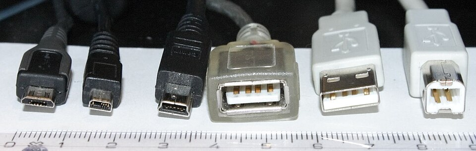

# Connecting a device

*What actually happens in the three seconds after you plug something in — detection, drivers, and the handshake — plus the Bluetooth pairing ritual, demystified.*

> You plug in a USB drive. *Ding!* — a window appears. Three seconds, zero effort. But
> in those three seconds, the computer noticed a stranger, asked for identification,
> found (or fetched!) a translator, and introduced the newcomer to every program on the
> system. It's a tiny diplomatic ceremony, it runs thousands of times a day worldwide —
> and when it fails, YOU'RE about to be the person who knows which step broke.

> **In real life**
>
> Connecting a device is a **foreign dignitary arriving at the palace**. The port is
> the gate (Chapter 1). The guard notices the arrival instantly (detection). Then the
> crucial bit: the palace summons a **translator** who speaks the visitor's language —
> that's the **driver**: A small piece of software that teaches the OS how to talk to one specific device. No driver, no conversation..
> Guard fine + no translator = a guest standing in the hallway being smiled at. Which
> is exactly what a 'device not working' usually is.

## The handshake, step by step

1. **Physical connection** — plug meets port (or radio meets radio, for wireless). Electricity flows, both sides notice.
2. **Detection** — the OS registers the stranger: "something's on USB port 3." The *ding* sound is this step celebrating itself.
3. **Identification** — the device announces what it is: "keyboard", "storage", "printer" (every USB device carries an ID card).
4. **Driver match** — the OS finds the translator: built-in for common things (keyboards, mice, drives — that's the magic of **plug and play**: Devices that work instantly because the OS ships with generic drivers for their whole category.), downloaded for exotic things (fancy printers, audio gear).
5. **Ready** — apps can now use it. Three seconds, five steps, one *ding*.

The genius of this pipeline for troubleshooting: **each step can fail separately,
and each failure looks different.** No detection = steps 1–2 (physical). Detected
but useless = step 4 (translator). Works but misbehaves = the device or app.
Diagnosis is just asking: which step died?

**The 3-second ceremony — press Play**

1. **🔌 Contact** — Plug meets port (or radio meets radio). Electricity flows; both sides notice something happened.
2. **👀 Detect** — The OS registers a stranger on the port. The famous *ding* is this exact moment celebrating itself.
3. **🪪 Identify** — The device presents its ID card: 'I am a keyboard' / 'I am storage'. Every USB device carries one.
4. **🗣 Driver** — The OS summons the translator — built-in for common guests, downloaded for exotic ones. The step where most 'connected but not working' stories die.
5. **✅ Ready** — Apps can use it. Three seconds, five steps, one ding — and now you can name the step that fails when it fails.

## Know your handshakers

Each of these plugs starts the exact same 5-step ceremony — but each identifies as
a different KIND of guest. Tap to meet them in handshake terms:


*Photo: Viljo Viitanen — Wikimedia Commons, public domain. [Source](https://commons.wikimedia.org/wiki/File:Usb_connectors.JPG)*
- **Micro-USB — the budget guest** — Announces itself as phones, power banks, small gadgets. Its handshake usually requests POWER first, data second — which is why a charge-only micro cable fools you: step 1 works (charging!), steps 2-5 never happen (no data wires inside).
- **USB-A socket — the door itself** — This is the port side of the ceremony — where detection begins. A dead socket fails step 1 silently: no ding, no entry, no ceremony. That's why 'try another port' is always the first move.
- **USB-A plug — the standard guest** — Keyboards, mice, drives — the plug-and-play royalty. The OS carries generic translators for their whole categories, so their handshakes complete before your finger leaves the port.
- **USB-B — the printer's calling card** — When THIS guest arrives, the OS knows to expect a printer — and printers famously need SPECIFIC translators (drivers), not generic ones. Step 4 is where printer handshakes go to sulk. You've seen the garbage-print result.

🎬 [Techquickie — how USB actually works (the handshake, animated)](https://www.youtube.com/watch?v=aKGuBcopO7w) (6 min)

## The Bluetooth version — same play, radio edition

Wireless devices run the same ceremony over radio, with one extra scene:
**pairing** — a one-time mutual introduction so both sides remember each other.

- Device enters *pairing mode* (the button-hold-until-blinking ritual — every gadget's little dance).
- Computer scans, finds it, sometimes exchanges a code (proving no stranger is hijacking the intro).
- They're now bonded: auto-reconnect whenever both are on and near.

The eternal Bluetooth gotcha: **a device usually bonds to ONE host at a time.** Your
earbuds "won't connect" because they're still faithfully connected to your phone in
your pocket. Bluetooth isn't broken; it's monogamous.

### Your first time: Your mission: witness one handshake of each kind

- [ ] Plug in any USB device and narrate the steps — Listen for the ding (detection), watch it appear in the system (identification), use it (driver matched). Five steps, three seconds, now visible to you.
- [ ] Find the ceremony's paper trail — Windows: Device Manager — your device is now in the tree. Mac: System Report → USB. That entry is the palace guest book.
- [ ] Pair one Bluetooth device from scratch — Settings → Bluetooth → put the device in pairing mode (the blinking-light dance) → connect. You've now done the radio version of the handshake, consciously.
- [ ] Break it on purpose (gently) — Eject + unplug the USB device: the entry vanishes. Turn Bluetooth off: the bond survives, the connection drops. Connection is live; pairing is remembered. Two different things — now you've SEEN the difference.
- [ ] Check for one unhappy translator — Device Manager: any yellow ⚠ triangle = detected-but-driverless — a dignitary in the hallway. (None found? Congratulations, a fully-staffed palace.)

Two handshakes witnessed, one guest book read, one hallway checked. The three-second
miracle now has moving parts you can name.

- **I plug it in and NOTHING happens — no ding, no reaction, no entry anywhere.**
  Steps 1–2 (physical) died. Different port, then different cable (charge-only cables strike again — the ports topic warned you), then the device on another machine. No detection anywhere = the device itself. The silence tells you WHERE it broke: before the palace even noticed.
- **It dings and shows up, but 'the device cannot start' / it just doesn't DO anything.**
  Steps 1–3 fine, step 4 (translator) failed. Windows: right-click it in Device Manager → Update driver; or download the driver from the maker's site (that model-number sticker knowledge from Chapter 1, cashing in). Detected-but-useless is ALWAYS a driver story until proven otherwise.
- **My Bluetooth earbuds refuse to connect to my laptop.**
  They're probably still bonded-and-connected to your phone — Bluetooth monogamy. Disconnect (or turn off Bluetooth) on the phone, THEN connect on the laptop. Still stubborn? The nuclear ritual: 'Forget device' on both, re-pair from scratch. Re-pairing fixes 90% of Bluetooth sulks.
- **The wireless keyboard connects but lags or drops randomly.**
  Radio problems: distance, batteries, interference. Fresh batteries first (the universal fix), dongle to a closer/front port, and keep 2.4GHz dongles away from USB 3 ports (real interference — the peripherals topic wasn't joking). Microwaves and busy Wi-Fi also crowd the same radio neighborhood.
- **It works on my machine but not on my friend's — identical device!**
  Same device + different result = different environment. Their OS may lack the driver (older system?), block it (permissions/security policy), or have a USB port issue. Congratulations: you're debugging an environment difference — literally the daily bread of QA. The device didn't change; the world around it did.

### Where to check

The whole ceremony is auditable:

- **The guest book:** Device Manager (Windows) / System Report (Mac) — every detected device, with ⚠ triangles marking translator problems.
- **Bluetooth bonds:** Settings → Bluetooth — paired (remembered) vs connected (live right now). Two different states, one screen.
- **The ding itself:** detection's soundtrack. Ding + nothing visible = identification/driver issue. No ding at all = physical. Your EARS are a diagnostic tool now.

Which step died → which fix applies. The pipeline isn't just knowledge; it's a
flowchart you now own.

> **Common mistake**
>
> Reinstalling the app, rebooting, and buying a new device — before checking Device
> Manager. The guest book takes ten seconds and instantly splits every connection
> problem into detected/not-detected — the fork that determines EVERYTHING downstream.
> Skipping the cheap evidence for expensive guesses: the exact anti-pattern this whole
> module has been training out of you. (It's working, by the way.)

*Try it — simulate the handshake (break it on purpose)*

```python
# The 5-step ceremony in code. Change fail_at to see each failure's symptom.
fail_at = "driver"   # try: "physical", "detect", "driver", or None

steps = ["physical", "detect", "identify", "driver", "ready"]
symptoms = {
    "physical": "total silence — no ding, no entry. Try another port/cable.",
    "detect": "no ding — the OS never noticed. Physical layer suspect.",
    "driver": "ding + yellow ⚠ in Device Manager — guest in the hallway, no translator.",
}
for step in steps:
    if step == fail_at:
        print(f"✗ {step.upper()} FAILED → {symptoms.get(step, 'device misbehaves in apps')}")
        break
    print(f"✓ {step}")
else:
    print("🔌 Device ready — all five steps clean, one ding, three seconds.")
```

### Worked example: the printer that dinged but never printed

New office printer, USB connected, ding heard — then silence forever. The pipeline, walked:

1. **Steps 1–3 verified:** ding sounded, the printer appears in Device Manager. Detection and identification passed.
2. **Step 4 inspected:** a yellow ⚠ triangle on its entry — 'driver unavailable'. The dignitary is standing in the hallway.
3. **Act:** the model number from the printer's sticker → manufacturer's site → exact driver downloaded and installed. The ⚠ clears.
4. **Verdict:** test page prints. The handshake's OWN evidence (ding + entry + triangle) named step 4 before anyone touched a setting. The pipeline isn't theory — it's a map of where to look.

**Quiz.** A USB microphone: plugged in, the system dings, it appears in Device Manager with a yellow ⚠. Apps can't see it. Which step of the handshake failed?

- [ ] Step 1-2: physical connection/detection
- [x] Step 4: driver — detected fine, but no working translator
- [ ] Step 5: the apps are all broken
- [ ] It's a Bluetooth pairing issue

*Ding + guest book entry = steps 1-3 succeeded. The ⚠ triangle is the OS saying 'guest in the hallway, no translator available'. Fix the driver, everything downstream unblocks. You just localized a fault to one pipeline stage from two symptoms — that's real diagnostic reasoning, the transferable kind.*

- **Driver** — The translator: software teaching the OS to talk to one specific device. Detected-but-useless = driver problem, near-always.
- **Plug and play** — Instant-working devices, thanks to generic drivers the OS ships for whole categories (keyboards, mice, storage).
- **The 5-step handshake** — Physical → detection (ding!) → identification → driver match → ready. Each step fails differently; the symptom names the step.
- **Pairing vs connecting** — Pairing = one-time mutual memory (survives power-off). Connecting = live link right now. Bluetooth 'issues' are usually confusion between the two.
- **Bluetooth monogamy** — Most devices hold one live connection — earbuds 'broken' on the laptop are usually just faithful to the phone in your pocket.

> **Tip**
>
> Zoom out: this pipeline — **request → detection → identification → translation →
> ready** — isn't just USB. It's structurally how browsers load pages, how apps call
> APIs, how printers receive jobs. Layered handshakes where each layer fails
> distinctly, and diagnosis = finding the dead layer. You'll meet this exact shape in
> API testing (Track E) wearing different clothes. Learn it here where you can touch it.

### Challenge

Run the full diagnostic drill on one device you own: name its connection type,
find it in the guest book, state which handshake steps you can PROVE succeeded
(ding? entry? functioning?), and write the one-line verdict. Example: *"Wireless
mouse: detected + identified + working = all 5 steps green."* Boring when healthy —
but you've now run the same audit you'll run when it isn't. That's the point of
drills.

### Ask the community

> Device: [what]. Connection: [USB/Bluetooth]. Handshake evidence: [ding? shows in Device Manager? yellow ⚠? works partially?]. Tried: [ports/cables/re-pair/driver]. Which step is failing?

Notice your question now names pipeline steps and brings evidence per step. That's
not a beginner asking for rescue — that's a colleague requesting a second opinion on
a diagnosis. Same facts, entirely different conversation. Welcome to the other side.

- [How-To Geek — what is a driver, actually?](https://www.howtogeek.com/175487/what-is-a-driver/)
- [Microsoft — Bluetooth pairing, the official ritual](https://support.microsoft.com/en-us/windows/pair-a-bluetooth-device-in-windows-2be7b51f-6ae9-b757-a3b9-95ee40c3e242)
- [Techquickie — how does USB actually work?](https://www.youtube.com/watch?v=aKGuBcopO7w)

- Plugging in runs a 5-step handshake: physical → detection → identification → driver → ready. Each step fails differently.
- The driver is the translator — detected-but-useless devices are driver stories until proven otherwise.
- Pairing is memory, connecting is now. Bluetooth devices are monogamous — check the phone in your pocket.
- The guest book (Device Manager / System Report) is ten seconds of evidence that beats hours of guessing.
- Layered handshakes with per-layer failures = a pattern you'll re-meet in browsers, APIs and networks. This was the touchable version.


---
_Source: `packages/curriculum/content/notes/how-a-computer-works/input-and-output-devices/connecting-a-device.mdx`_
