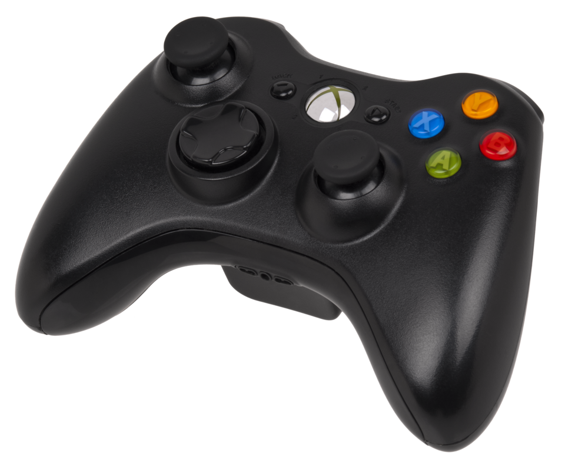

# Input devices

*Every way a human can talk to a computer — keys, clicks, taps, voices, sticks and swipes — and why each one is a place where software meets chaos.*

> You are, right now, operating an input device. You've operated one for years. You're
> basically a professional. Yet here's the question that turns it into a career: every
> time a human touches a computer, they can do something the programmer never expected —
> and **input devices are where all of that chaos enters**. Learn the doors, and later
> you'll learn to guard them.

> **In real life**
>
> Input devices are the computer's **senses pointed at you**. The keyboard is its ears
> for text, the mouse its eyes for pointing, the microphone its actual ears, the
> touchscreen its skin. The computer is deaf, blind and numb without them — a genius in
> a sensory deprivation tank. Every input device is a channel you open into that tank.

## The core four (you've met two already)

- **Keyboard** — text and shortcuts. Covered in glorious detail two chapters ago (F12 gang, rise up).
- **Mouse / trackpad** — pointing, clicking, scrolling. Also covered — middle-click club, you know who you are.
- **Touchscreen** — your finger IS the mouse. Plot twist coming below.
- **Microphone & camera** — voice and vision input. Every video call is these two, working overtime.

## The fun one: a controller anatomy

Game controllers are secretly a masterclass in input design — several input TYPES
packed into one object. Tap around:


*Photo: Evan-Amos — Wikimedia Commons, public domain. [Source](https://commons.wikimedia.org/wiki/File:Xbox-360-S-Controller.png)*
- **Analog stick** — ANALOG input — not just 'left or not-left' but HOW FAR left, in hundreds of tiny steps. Compare with a keyboard key, which only knows pressed/not-pressed. Two totally different kinds of data entering the machine.
- **D-pad** — DIGITAL input — up/down/left/right, each a clean on/off, like four keyboard keys in a cross. Digital = crisp states. Analog = smooth ranges. Software must handle both correctly.
- **Face buttons (A/B/X/Y)** — Simple on/off buttons — but pressed in COMBINATIONS and SEQUENCES. 'What if the user presses two at once?' is a genuine test case in games AND in regular apps (Ctrl+S while a dialog is open, anyone?).
- **The Xbox guide button** — A 'system-level' button — it talks to the console itself, not the game. Same idea as your phone's home gesture: some inputs bypass the app entirely. Apps must survive being interrupted by them.
- **Right analog stick** — Two analog sticks at once = two continuous input streams simultaneously. Modern software juggles many parallel inputs — and testers ask what happens when they conflict.

## The plot twist: some devices are BOTH

A **touchscreen** is an input device (your taps) glued onto an output device (the
display). Same for a smartwatch, a car dashboard, a smart speaker (mic in, sound out).
The input/output split is about **direction of data**, not about gadgets:

- Into the computer = input. Out of the computer = output.
- One object can carry both directions at once. Most modern ones do.

> **Tip**
>
> Why testers obsess over input: **users type emoji into name fields. They paste entire
> novels into search boxes. They click Submit 14 times. They speak Nepali to an
> English-only voice assistant. They rotate the phone mid-form.** Every input device
> multiplies the ways reality can differ from the developer's imagination — and finding
> those gaps is literally the job you're training for. Input = attack surface, in both
> the testing and security sense (Track E will make that formal).

### Your first time: Your mission: input inventory

- [ ] Count every input device within arm's reach — Keyboard, mouse/trackpad, touchscreen(s), mic, camera, game controller, fingerprint reader... phones count. Most people find 6+ and are surprised.
- [ ] Find the weird input on your phone — Rotate it (gyroscope = input!), shake it (accelerometer!), check fingerprint/face unlock (biometric input). Sensors are inputs users never think about — testers do.
- [ ] Type an emoji somewhere unexpected — Put 😀 in a search box or a form field and see what happens. Congratulations, you just ran your first informal input test. (Most things survive. Some things REALLY don't.)
- [ ] Try voice input once — Phone keyboard mic button, or your assistant of choice. Notice the transcription errors — every one of those is input data the software must handle gracefully.
- [ ] Watch an input fail politely — In any form, try submitting while a required field is empty. That error message = software guarding an input door. Judging THOSE messages will one day be your professional opinion.

You just inventoried input channels and poked two of them with unexpected data.
That's exploratory input testing, size XS.

- **My mic doesn't work in ONE app but works everywhere else.**
  Permission, almost certainly — the OS guards mic/camera per-app. Settings → Privacy → Microphone and check that app's toggle. Same story for camera. 'Works everywhere except X' usually means X was never given the key.
- **Touchscreen ignores me in one corner / registers ghost touches.**
  Clean the screen first (seriously — a drop of water or a sweaty palm edge causes ghost touches). Remove any bubbling screen protector. Still haunted? Restart. STILL haunted? Now it's a digitizer hardware issue — that's warranty territory.
- **My controller works in the menu but not in the game.**
  The game may expect a different controller 'profile' or another controller stole slot 1. Reconnect it, check the game's input settings, and close other input software (remapping tools love causing this). Input works in layers — knowing that is the diagnosis.
- **Voice assistant misunderstands everything I say.**
  Check the language + accent setting first — wrong language model = confident nonsense. Reduce background noise, speak at normal speed. If it's still bad, that's honestly the state of the art having a rough day — voice input is the hardest input to get right, which is why testing it is a whole specialty.

### Where to check

Every input device registers with the OS — and you can see the guest list:

- **Windows:** Settings → Bluetooth & devices (all of them) + Privacy settings (who may use mic/camera).
- **macOS:** System Settings → Keyboard/Trackpad/etc + Privacy & Security → Microphone/Camera per-app.
- **Any browser:** the address-bar lock/permissions icon shows exactly which sites can use your mic and camera. Audit it — you'll be surprised who asked.

Detected-but-blocked (permissions) vs not-detected (connection/driver) vs
detected-and-misbehaving (app bug) — three different problems, one settings screen
to tell them apart. The pattern from the ports topic, again. It's always the pattern.

> **Common mistake**
>
> Assuming all users use the input YOU use. Designers who only test with a mouse ship
> apps unusable by keyboard — and that locks out power users AND people who physically
> can't use a mouse. That's not hypothetical: keyboard-only navigation is a legal
> accessibility requirement in much of the world, and testing it is a real QA task
> (Track C has a whole module waiting for you). Try Tab-ing through a form today —
> you'll never unsee bad tab order again.

**Input's journey into the machine — press Play**

1. **👆 Human acts** — Tap, click, keypress, voice, tilt — a physical event happens at a sensor. Chaos enters here.
2. **🗣 Driver translates** — The device's translator turns electrical signals into something the OS understands: 'finger at x,y', 'key 42 down'.
3. **🎩 OS routes** — The manager decides WHO gets this input — which app has focus, whether a permission gate applies (mic and camera check keys here).
4. **📨 App handles it** — The app receives the event and reacts — correctly, or in the ways testers get paid to discover. Every input path ends at code someone wrote on a deadline.

*Try it — process an input event stream*

```python
# Apps receive inputs as a stream of events. Handle one — including the weird ones.
events = ["click", "click", "key:A", "emoji:😀", "click", "shake"]

for e in events:
    if e == "click":
        print("→ normal click, handled")
    elif e.startswith("key:"):
        print(f"→ typed {e[4:]}, handled")
    else:
        print(f"→ UNEXPECTED input '{e}' — does the app survive? THIS is where bugs live.")
```

### Worked example: the mic that worked everywhere except the meeting app

Five minutes before a call: "my mic is broken!" The split, executed:

1. **Scope it:** voice recorder app → mic records fine. So the hardware, cable and OS driver are all innocent. The problem lives in ONE app.
2. **Check the gate:** OS Privacy settings → Microphone → the meeting app's toggle is OFF. It asked once, got dismissed in a hurry, and never asked again.
3. **Act:** grant the **permission**: The OS-enforced key an app needs to use protected hardware like mic, camera or location., restart the app. Mic works.
4. **Verdict:** four minutes, no reinstalls, no new headset ordered. 'Everywhere except one app' pointed straight at the permission gate — it almost always does.

🎬 [Crash Course — peripherals & input devices](https://www.youtube.com/watch?v=wdgULBpRoXk) (11 min)

**Quiz.** A user reports: 'The app's voice search doesn't work.' Which is the SHARPEST first question?

- [ ] What color is the microphone?
- [x] Does the mic work in other apps — and does this app have mic permission?
- [ ] Have you tried shouting?
- [ ] Is the app up to date?

*One question, two forks: mic broken everywhere = hardware/OS problem, not the app. Mic fine elsewhere = check the permission gate, THEN suspect the app. You just split the problem space in half with one sentence — that's what good triage questions do, and it's a skill interviewers actually probe.*

- **Input device** — Any channel of data INTO the computer: keys, clicks, taps, voice, camera, sensors. Direction defines it, not the gadget.
- **Analog vs digital input** — Analog = smooth range (how far the stick tilts). Digital = clean on/off (key pressed or not). Different data, different bugs.
- **Touchscreen** — Input (touch) glued onto output (display) — one object, both directions. Most modern devices are both at once.
- **Input permissions** — The OS guards mic/camera per-app. 'Works everywhere except one app' = that app lacks the key, not a broken mic.
- **Input = test surface** — Every input channel is a door where user chaos enters — emoji in name fields, double submits, rotations mid-form. Guarding doors = the job.

### Challenge

Pick any app you use daily and list every input channel it accepts: taps? typing?
voice? camera? file uploads? shake-to-undo? Then circle the one you think is LEAST
tested by its developers. You've just done what test leads call **input surface
mapping** — usually on a whiteboard, usually paid.

### Ask the community

> My [input device] does [exact behavior] in [app/everywhere]. It works/doesn't work in other apps. Permissions show [state]. What's the next check?

Input problems triage beautifully if you bring the everywhere-or-just-one-app detail —
it's the single most diagnostic fact. You know the drill by now: exact symptom, scope,
what you tried. The community answers fast when the question is pre-sorted.

- [GCFGlobal — parts of a computer (input tour included)](https://edu.gcfglobal.org/en/computerbasics/basic-parts-of-a-computer/1/)
- [W3C — keyboard compatibility (why input diversity matters)](https://www.w3.org/WAI/perspective-videos/keyboard/)
- [Crash Course — computer peripherals & input](https://www.youtube.com/watch?v=wdgULBpRoXk)

- Input = any data INTO the machine. The gadget doesn't define it; the direction does.
- Analog (ranges) vs digital (on/off) are different data types — and different bug farms.
- Touchscreens and friends are input + output in one object. Both directions, simultaneously.
- Mic/camera problems in ONE app = permissions before hardware. Everywhere = hardware before permissions.
- Every input channel is a door for user chaos — mapping and guarding those doors is the actual QA job you're heading toward.


---
_Source: `packages/curriculum/content/notes/how-a-computer-works/input-and-output-devices/input-devices.mdx`_
