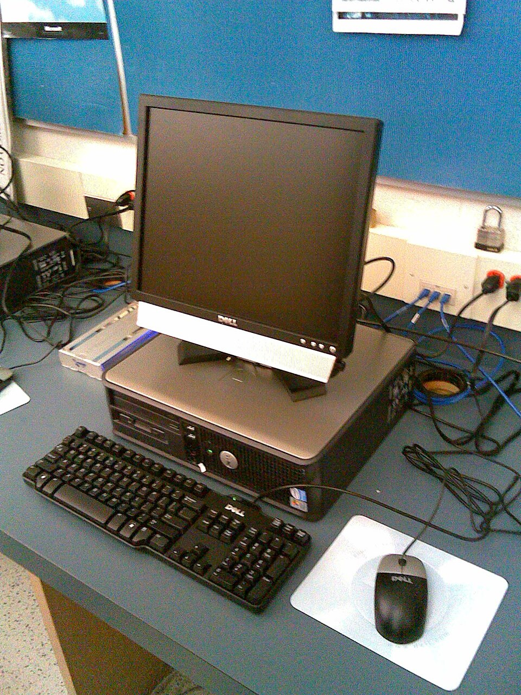

# Peripherals

*The core-vs-peripheral split — what the computer IS versus what's merely visiting — and why that line predicts what you can unplug, upgrade and blame.*

> Quick test: if you unplug it and the computer keeps computing — what was it? A
> **peripheral**. The monitor? Peripheral. The keyboard? Peripheral. The printer?
> Peripheral (and grateful for the break). This one distinction — the machine itself
> versus its entourage — quietly explains what you can swap, what you can upgrade, and
> where to point the finger when something misbehaves.

> **In real life**
>
> The computer is a **head of state**; peripherals are the entourage. The core (CPU,
> RAM, motherboard, storage) IS the office — remove any of those and there's no
> government. The entourage — drivers, translators, photographers (keyboard, printer,
> webcam) — is replaceable, upgradeable, and occasionally scandal-prone. The state
> functions without any single one of them. Awkwardly, but it functions.

## Drawing the line on real hardware

Same photo as Chapter 1's first note — new lens. This time, sort the core from the
entourage:


*Photo: Jeremy Banks — Wikimedia Commons, CC BY 2.0. [Source](https://commons.wikimedia.org/wiki/File:Desktop_personal_computer.jpg)*
- **The tower — CORE** — CPU, RAM, motherboard, storage: the computer itself. Everything else in this photo could vanish and this box would keep computing into the void, unbothered.
- **Monitor — peripheral** — Feels essential, isn't core. Unplug it and the machine keeps running (servers live their whole lives like this — next chapter proves it). Essential for YOU ≠ essential for IT.
- **Keyboard — peripheral** — Input entourage. Swappable in seconds, no shutdown needed. That hot-swap casualness is the peripheral signature.
- **Mouse — peripheral** — Same deal. Note the pattern: peripherals connect through PORTS (Chapter 1 pays off again) — the plug IS the boundary between core and entourage.
- **The cables — the border crossing** — Every cable here crosses the core/peripheral border. Data goes through a port, and the OS needs a translator for whatever's on the other end. That translator has a name: a driver. Next topic's whole story.

## Why the line matters (three practical payoffs)

1. **Swap freedom.** Peripherals hot-swap: new mouse, second monitor, different keyboard — no surgery, no shutdown. Core parts (CPU, RAM) mean opening the case, compatibility homework, and static-electricity paranoia.
2. **Upgrade math.** "Should I upgrade or replace?" splits on the line: slow because of core (old CPU, cramped RAM) = serious money. Bad experience because of peripherals (mushy keyboard, dim monitor) = cheap fix, huge quality-of-life win.
3. **Blame routing.** When something misbehaves, the line is your first fork: is it the peripheral, the cable/port (the border), or the core/software? Swap-test the peripheral on another machine — works there? The peripheral is innocent. The investigation moves inward. That's the **swap test**, and support pros run it instinctively.

> **Tip**
>
> Tester translation: peripherals are ENVIRONMENT. The same web app must survive a
> learner's 1366×768 laptop screen, an office 4K monitor, a wireless mouse with a
> dying battery and a Bluetooth keyboard with lag. "Works with MY entourage" is the
> hardware version of "works on my machine" — and env lines in bug reports exist
> precisely to capture whose entourage was present when it broke.

### Your first time: Your mission: sort your own setup

- [ ] List everything attached to your machine — Physical AND wireless: mouse, keyboard, monitor(s), headphones, webcam, printer, USB drives, the lot.
- [ ] Label each: core or peripheral — Rule: unplug it mentally — does computing continue? Laptop twist: the built-in screen/keyboard are integrated, but functionally still 'entourage with a permanent contract' (external ones replace them fine).
- [ ] Run one real swap test — Move your mouse (or any USB device) to a different port. Still works? You just proved port + device with one move. This is the diagnostic reflex, installed.
- [ ] Find a device's translator — Windows: Device Manager → pick your mouse → Driver tab. Mac: System Report → USB. You're looking at the software half of a hardware handshake — full story next topic.
- [ ] Spot the priciest UPGRADE on your desk — Which peripheral, if upgraded, would improve your daily life most? (It's usually the monitor. It's basically always the monitor.)

Core sorted from entourage, one swap test executed. The blame-routing fork is now
part of your reflexes.

- **My wireless mouse lags / stutters / teleports.**
  Battery first (dying batteries cause EXACTLY this before dying fully). Then distance & interference — the dongle in a rear port with the mouse two meters away is a long-distance relationship; move the dongle to a front port. USB 3 ports can even interfere with 2.4GHz dongles — try a USB 2 port. Yes really.
- **New keyboard types double letters / misses keys.**
  Swap test immediately: another machine. Doubles there too = defective unit, return it while the return window breathes. Fine there = YOUR machine's settings (key repeat rate) or port. The swap test just saved you a week of wrong guesses.
- **The second monitor works, but everything on it looks slightly blurry.**
  Resolution mismatch — the OS is stretching a non-native resolution across the panel. Settings → Display → set the monitor to its NATIVE resolution (the one marked 'recommended'). Scaling (125%, 150%) is the second suspect. Crisp = native; anything else = soup.
- **Everything was fine until I plugged in the new device; now another device acts up.**
  Peripherals share resources — USB bandwidth, power budget, sometimes drivers. A power-hungry newcomer on the same hub can brown-out its neighbors. Spread devices across ports, use a POWERED hub for hungry ones (external drives especially). One-in-one-breaks is a resource-sharing tell.

### Where to check

The OS keeps a full register of the entourage:

- **Windows:** Device Manager — the family tree of every core and peripheral device, with yellow warning triangles on the troubled ones. Bookmark this mentally; it's the hardware truth window.
- **macOS:** System Report — same census, Apple flavor.
- **The swap test** — no settings screen beats it: same device + different port/machine isolates the fault in under a minute.

Peripheral misbehaving → swap test → border (port/cable) test → then and only then
blame software. The fork order never changes; only the devices do.

> **Common mistake**
>
> Buying core solutions for peripheral problems. "My computer is bad, I need a new one"
> — when the actual daily pain is a 60Hz dim monitor, a mushy $8 keyboard and a mouse
> that skips. A fraction of a new-machine budget spent on the entourage transforms the
> experience; the core was never the bottleneck. Diagnose before spending — the same
> rule as diagnose before debugging, with the same savings.

**The swap test, animated — press Play**

1. **🤔 Symptom** — A peripheral misbehaves — webcam black, keyboard doubling, mouse teleporting. Three possible culprits: device, border (port/cable), or computer.
2. **🔁 Swap the device** — Same device, different machine (or different port). One minute of effort, maximum information.
3. **⚖️ Read the verdict** — Fails elsewhere too → the DEVICE is guilty. Works elsewhere → your machine or port is the suspect, device acquitted.
4. **🎯 Act precisely** — Return the guilty device / fix the guilty port / check the guilty driver. No money spent on the innocent. The fork resolved in minutes, not weekends.

*Try it — the swap test as logic*

```python
# Flip these two facts and watch the verdict change.
works_on_other_machine = False
detected_by_system = True

if not detected_by_system:
    print("Verdict: physical layer — port, cable or dead device. No ceremony even started.")
elif works_on_other_machine:
    print("Verdict: YOUR machine is the suspect — port or driver. Device acquitted.")
else:
    print("Verdict: the device itself is guilty. Return it with evidence attached.")
```

### Worked example: the webcam convicted by a swap test

Video calls show a black square instead of a face. The blame-routing fork, executed:

1. **The border check:** the system detects the webcam (it's in the guest list) — so port and cable pass. Detected-but-black narrows the field.
2. **The permission check:** camera permission granted to the app. Software gate open.
3. **The swap test:** same webcam on a second laptop — black there too, in every app.
4. **Verdict:** the **peripheral**: Any external device the computer functions without — replaceable, swappable, and testable in isolation. itself is guilty: a failed sensor. Total diagnosis time: five minutes, and the return request ships with evidence attached. No hours wasted reinstalling apps on the innocent machine.

🎬 [Crash Course — peripherals & connections](https://www.youtube.com/watch?v=wdgULBpRoXk) (11 min)

**Quiz.** A user's external webcam shows a black image in video calls. It's detected by the system. Following the blame-routing fork, what's the FIRST move?

- [ ] Reinstall the operating system
- [x] Try the webcam on another machine (swap test) — and check app camera permissions
- [ ] Buy a new webcam immediately
- [ ] Blame the video call app on social media

*Detected-but-black narrows it already (connection works). The swap test rules the device in or out in one minute; permissions are the other classic black-image cause (input topic knowledge, back again). The fork: device → border → software. New-webcam money waits until the old one is actually convicted.*

- **Peripheral** — External device the computer functions without: monitor, keyboard, mouse, printer, webcam. The entourage — swappable, upgradeable, hot-pluggable.
- **Core components** — CPU, RAM, motherboard, storage — the computer itself. Remove one and there's no computing, only furniture.
- **The swap test** — Same device, different port/machine → isolates device vs border vs computer in a minute. The support pro's opening move.
- **Native resolution** — The one resolution a monitor renders crisply (marked 'recommended'). Everything else is stretched soup.
- **Peripherals = environment** — Bug reports record the entourage (screen, input devices) because 'works with MY setup' proves nothing about anyone else's.

### Challenge

Write the full environment line for YOUR setup, entourage included: machine + OS,
monitor (size/resolution), keyboard, mouse (wired/wireless), audio device. Save it —
that's the reusable header for every bug you'll ever report from this desk. Then run
one honest swap test on any device, just to feel how fast the fork resolves. One
minute, one verdict.

### Ask the community

> Peripheral: [device]. Behavior: [exact symptom]. Swap test result: [works/fails on other port/machine]. System shows it as [detected/not detected]. What's next?

A peripheral question WITH a swap-test result is 80% pre-solved — you've already
eliminated half the suspects. Communities adore askers who bring eliminations, and
that instinct — narrow before asking — is the same one that'll make your future bug
reports land.

- [GCFGlobal — computer parts, core and entourage](https://edu.gcfglobal.org/en/computerbasics/basic-parts-of-a-computer/1/)
- [How-To Geek — when a USB device won't behave](https://www.howtogeek.com/180175/what-to-do-when-your-usb-device-doesnt-work/)
- [Crash Course — peripherals & connections](https://www.youtube.com/watch?v=wdgULBpRoXk)

- Core = CPU/RAM/motherboard/storage: the computer. Peripherals = everything the machine survives losing: the entourage.
- The line predicts everything practical: hot-swap freedom, upgrade cost, and where to point blame first.
- The swap test isolates device vs border (port/cable) vs computer in one minute. It's the opening move, always.
- Peripheral pain has peripheral prices — don't buy a new computer to fix an $8 keyboard experience.
- Peripherals are environment: bug reports list the entourage because behavior travels with it.


---
_Source: `packages/curriculum/content/notes/how-a-computer-works/input-and-output-devices/peripherals.mdx`_
