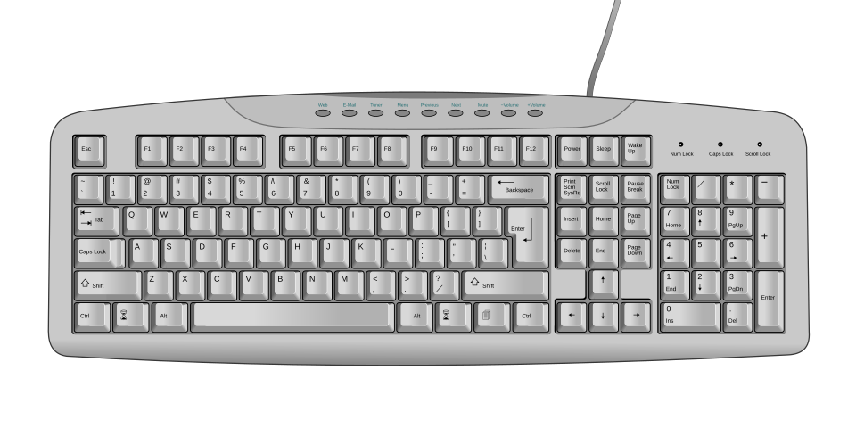
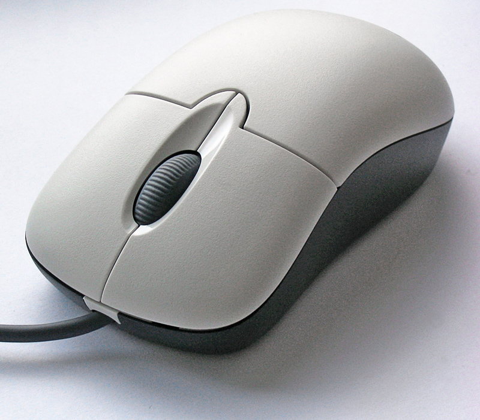

# Monitor, keyboard, mouse

*The three things you actually touch all day — what they really do, the parts inside them, and the tester tricks hiding in plain sight.*

> You'll spend more hours of your life touching these three objects than almost anything
> else you own. Most people never learn what they're actually holding. You're about to —
> including why testers secretly judge people by how they use them.

> **In real life**
>
> Monitor, keyboard and mouse are the computer's **face, ears and hands** — sorry, YOUR
> face, ears and hands. The computer itself is locked in a box with no senses. The
> keyboard and mouse are how you talk to it; the monitor is how it talks back. Remove all
> three and the computer keeps working fine — it just becomes a very expensive space
> heater having a private conversation with itself.

## The monitor — the part that gets all the credit

The monitor's whole job: paint the picture it's told to paint, many times per second.
It's the newsreader of the setup — face of the operation, writes none of the news.

Three numbers matter, and you'll meet all of them again in bug reports:

- **Size** — measured diagonally in inches, like a TV. A "14-inch laptop" is the screen's diagonal, not the laptop's width.
- **Resolution** — how many **pixels**: One tiny dot of the picture. Your screen is a grid of millions of them, each mixing red, green and blue. the screen has, like `1920 × 1080`. More pixels = sharper picture. It's the difference between a mosaic made of bricks and one made of rice grains.
- **Refresh rate** — how many times per second the picture updates (60Hz = 60 times). Gamers pay rent-money for higher numbers.

> **Tip**
>
> Why testers care: **the same app looks different at different sizes and resolutions.**
> A button that's perfect on your 24-inch monitor may be half-hidden on a small laptop.
> "Looks fine on my screen" is the display version of "works on my machine" — and now
> you know to ask: *which* screen?

## The keyboard — a hundred buttons, five that matter most

Time to actually look at the thing. Tap around — every zone has a job, and a few of
them are about to become your daily tools:


*Diagram: Wikimedia Commons, public domain. [Source](https://commons.wikimedia.org/wiki/File:Computer_keyboard_US.svg)*
- **Esc — the 'nope' key** — Cancels dialogs, closes popups, exits full-screen. When something unexpected takes over your screen, Esc is the polite way out. Testers press it constantly — usually while muttering.
- **Function row (F1–F12)** — Shortcut keys with special powers. The star of the row: F12 — in a browser it opens Developer Tools, the single most important tester tool that normal people never discover. Remember F12. Tattoo optional.
- **Backspace** — Deletes backwards, one character per press. Also, in most browsers, goes back a page — which has ruined more half-filled forms than any bug in history.
- **Enter — the commitment key** — Confirms, submits, executes. Half of all accidental form submissions are this key. As a tester, 'what happens if I press Enter here?' is a genuinely professional question.
- **Shift** — Hold for CAPITALS and the upper symbols. Also a tester's friend: Shift+click and Shift+select do multi-selection tricks everywhere.
- **Ctrl (Cmd on Mac)** — The combo king. Ctrl+C copy, Ctrl+V paste, Ctrl+Z undo (the most emotionally important shortcut ever made), Ctrl+F find. People who know these finish twice as fast. That's not a joke, it's a measurement.
- **Space bar** — The biggest key on the board — inserts a space, scrolls pages in a browser, pauses videos. Maximum size, minimum respect.
- **Arrow keys** — Move the cursor without the mouse. Also: the entire childhood of everyone who grew up on computer games.
- **Number pad** — Calculator-style numbers for fast entry. Laptops usually sacrifice it to stay slim. Accountants notice. Accountants always notice.

> **Common mistake**
>
> Typing with two fingers while staring at the keyboard. No shame — everyone starts
> there — but every hour invested in touch typing pays back for the rest of your career.
> Testers write bug reports, test cases and messages ALL DAY. Slow typing is a career
> tax. There's a free practice link at the bottom — future-you is begging you to click it.

## The mouse — three buttons, three personalities


*Photo: Darkone — Wikimedia Commons, CC BY-SA 2.5. [Source](https://commons.wikimedia.org/wiki/File:3-Tasten-Maus_Microsoft.jpg)*
- **Left button — the yes button** — Select, open, confirm, drag. 95% of all clicks. Double-click opens things — and 'how fast is a double-click' is a real setting real users really break.
- **Right button — the menu button** — Opens the context menu: copy, paste, inspect... Wait — Inspect? Yes. Right-click → Inspect is the second door into Developer Tools. Testers right-click on EVERYTHING. It's a lifestyle.
- **Scroll wheel** — Rolls pages up and down. Plot twist: it's also a THIRD BUTTON — click it on a link and the link opens in a new tab. The day people learn middle-click, their browsing changes forever. Today is your day.
- **The body** — Under your palm lives a sensor tracking movement (older ones had a ball that collected an archaeology of desk dirt). Cursor moving weirdly? Check what surface you're on — glass tables are mouse kryptonite.
- **The tail (cable)** — Where the name comes from — body plus tail equals mouse. Wireless mice traded the tail for two new failure modes: batteries and forgetting the tiny USB receiver.

### Your first time: Your mission: a 3-minute skills upgrade

- [ ] Press F12 in your browser right now — A panel full of code appears — Developer Tools. Don't touch anything, just look at it. You just opened the tester's most important tool. Press F12 again to close.
- [ ] Right-click any text on this page and find 'Inspect' — Same panel, different door. This is how testers see what a page is REALLY made of.
- [ ] Middle-click (press the scroll wheel) on any link — It opens in a new background tab. You're welcome.
- [ ] Try the holy trinity: Ctrl+C, Ctrl+V, Ctrl+Z — Copy something, paste it, undo it. (Cmd instead of Ctrl on a Mac.) If you already knew: respect. If not: you just leveled up.
- [ ] Press Ctrl+F and search this page for the word 'pixel' — Find-on-page works almost everywhere. Testers use it to hunt through logs, docs and giant pages daily.

Five habits, three minutes, permanent upgrade. That F12 one alone puts you ahead of
most of the internet.

- **My keyboard is typing the wrong symbols — I press @ and get something else entirely.**
  Your keyboard LAYOUT switched (US vs UK vs others) — probably via an accidental shortcut. Check the language/input setting in the taskbar or menu bar and switch back. The keys never moved; the computer's map of them did.
- **EVERYTHING I TYPE IS SHOUTING.**
  Caps Lock. It's always Caps Lock. There's usually a little light on the key or keyboard corner telling you. Press it once and apologize to the group chat.
- **My cursor is jumpy / drifts / teleports across the screen.**
  Check the surface first — glossy, glass or patterned surfaces confuse the sensor. Try a plain mousepad or even a sheet of paper. Wireless mouse? Low battery causes exactly this weirdness before it dies completely.
- **One click is registering as a double-click and opening everything twice.**
  The button's switch is wearing out — a real, physical bug. Test it: in a file list, single-click slowly and watch whether items open. If yes, it's the mouse, not you. (Testers love this one: it's a hardware bug that looks like a software bug.)
- **My second monitor is plugged in but shows nothing.**
  Cable first (both ends, correct input selected ON the monitor — monitors have their own input menu). Then tell the computer it exists: Windows key+P on Windows, or Displays settings on Mac, and choose extend/duplicate. Monitors don't announce themselves; you have to introduce them.

### Where to check

Your machine will happily confess its display setup — no guessing:

- **Windows:** Settings → System → Display — resolution, scale, and every connected monitor.
- **macOS:**  → System Settings → Displays.
- **Any browser:** press F12 → the Dev Tools can even simulate other screen sizes (that's how testers check "how does this look on a phone" without owning forty phones).

Environment lines in bug reports include the screen: *"1920×1080, 125% scale, external
monitor"*. Now you know where those numbers live.

**One keypress's full journey — press Play**

1. **⌨️ Key down** — A physical switch closes under your finger. Pure hardware — a circuit completes, a signal leaves through the cable.
2. **🎩 OS translates** — The driver decodes WHICH key; the OS checks the layout map (this is where AZERTY mischief happens) and decides which app is focused.
3. **📨 App reacts** — The focused app receives 'letter A' and decides what it means — add to a document? Trigger a shortcut?
4. **🖥 Pixel appears** — The app asks the OS to redraw; the letter lights up on your monitor. Full circle: hardware → software → hardware, in under 30 milliseconds.

*Try it — draw pixels like a monitor does*

```python
# A screen is just a grid of dots. This draws a tiny 'display' with characters —
# change WIDTH/HEIGHT to change the 'resolution' and see the picture sharpen.
WIDTH, HEIGHT = 16, 8

for y in range(HEIGHT):
    row = ""
    for x in range(WIDTH):
        row += "█" if (x + y) % 2 == 0 else "░"
    print(row)
print(f"That was a {WIDTH}x{HEIGHT} display — {WIDTH*HEIGHT} 'pixels'. Your real one has millions.")
```

### Worked example: the 'broken button' that was a resolution

A real bug-shaped mystery: a user swears the app's Save button is missing. Your walkthrough:

1. **Get the environment:** their screen is 1366×768 with 125% zoom; yours is 1920×1080 at 100%.
2. **Reproduce their world:** press F12, use Dev Tools' device toolbar to shrink the viewport to 1366×768.
3. **Observe:** the Save button falls below the visible area with no scrollbar. There it is — a real layout bug, invisible on big screens.
4. **Verdict:** not user error — a responsive-design defect, reproducible on demand, reportable with exact numbers. The user was right, and now you can prove it.

🎬 [Crash Course — computer hardware in 12 minutes](https://www.youtube.com/watch?v=HB4I2CgkcCo) (12 min)

**Quiz.** A user reports: 'The Save button is cut off at the bottom of the screen.' It looks perfect on your monitor. What's the FIRST thing worth checking?

- [ ] Tell them to buy a bigger monitor
- [x] Their screen resolution and scale settings — the app may not fit smaller screens
- [ ] Reinstall the app
- [ ] The mouse is double-clicking

*Same app + different screen = different layout. A smaller resolution or a zoomed scale setting can push buttons off-screen. This is a REAL bug class — responsive-layout bugs — and 'what's your resolution?' is the professional first question. You'll file bugs like this for a living.*

- **Resolution** — The pixel grid of a screen, like 1920×1080. More pixels = sharper picture. Different resolutions = different layouts = tester's daily business.
- **F12** — Opens browser Developer Tools — the tester's X-ray machine. The most valuable key on the board that nobody uses.
- **Middle-click** — The scroll wheel is a button: middle-click a link to open it in a new background tab.
- **Ctrl+Z** — Undo. The most emotionally important keyboard shortcut ever created.
- **Caps Lock** — THE REASON EVERYTHING IS SHOUTING. Check its little light before blaming the keyboard.

### Challenge

Find out — and write down — your screen's exact resolution (Settings → Display, or
About This Mac). Then press F12, find the little icon that looks like a phone/tablet
(top-left of Dev Tools), click it, and watch this very page squeeze into a phone-sized
view. Congratulations: you just did your first **responsive layout check** — an actual
task from an actual QA job description.

### Ask the community

> My [keyboard/mouse/monitor] is doing [exact behavior]. I'm on [Windows/Mac], and I already tried [what you tried]. What should I check next?

Input-device weirdness is confusing precisely because it sits between hardware and
software. Describe the exact behavior — "cursor drifts left when I let go" beats
"mouse broken" — and someone will recognize it instantly. Precise symptom description
is, conveniently, also the core skill of bug reporting.

- [TypingClub — free touch-typing course (the career tax refund)](https://www.typingclub.com/)
- [GCFGlobal — Basic parts of a computer](https://edu.gcfglobal.org/en/computerbasics/basic-parts-of-a-computer/1/)
- [keybr — adaptive typing practice that learns your weak keys](https://www.keybr.com/)

- The monitor paints what it's told: size (inches), resolution (pixels), refresh rate (Hz) — all three show up in bug reports.
- F12 opens Developer Tools; right-click → Inspect is the second door. Testers live there.
- Ctrl+C/V/Z/F and middle-click: five minutes to learn, career-long payoff.
- Same app, different screen = different layout. 'What's your resolution?' is a professional question.
- Weird input behavior: check layout/Caps Lock/surface/batteries before declaring hardware dead. Simplest cause first.


---
_Source: `packages/curriculum/content/notes/how-a-computer-works/the-parts-of-a-computer/monitor-keyboard-mouse.mdx`_
