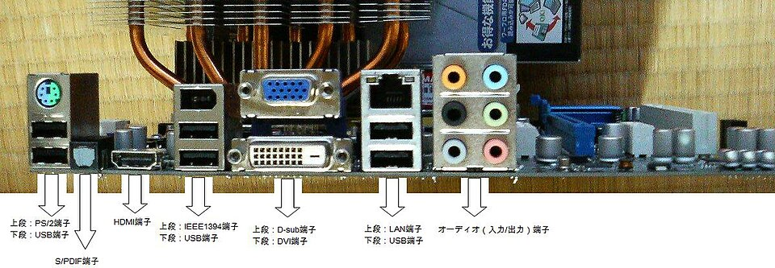
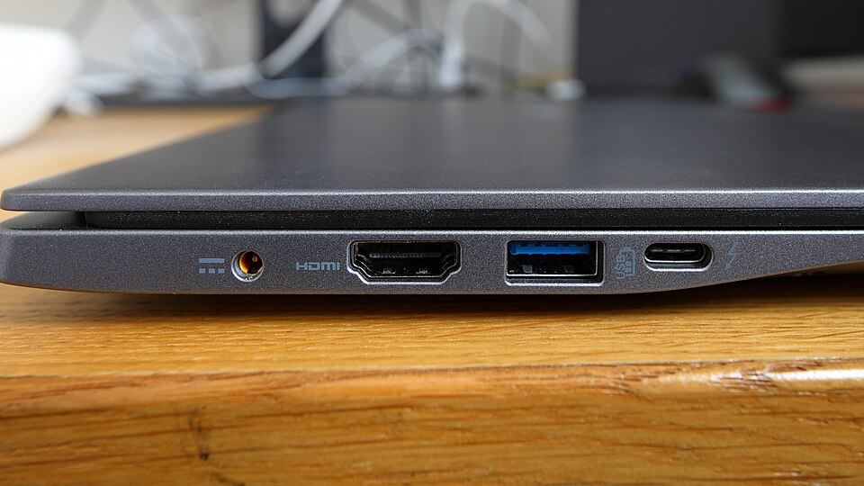

# Ports & cables

*Every hole in your computer, what plugs into it, and how to identify any port by shape — no labels needed.*

> Somewhere in your home is a drawer full of cables nobody can identify but everybody
> is afraid to throw away. Today we fix that. By the end of this page you'll read ports
> by SHAPE alone — a skill so underrated that people will assume you work in IT. (Warning:
> they will then treat you like you work in IT.)

> **In real life**
>
> Ports are **electrical sockets with opinions**. Your wall socket takes one plug shape and
> that's that. A computer is a wall of different sockets, each with its own shape, job and
> attitude — power in one, picture out another, internet in a third. Travel adapters taught
> you the hard way that shape matters. Same lesson, smaller holes.

## Reading the back panel like a pro

Here's a real desktop back panel. Fun detail: the labels on this photo are in
**Japanese**. Perfect — because pros don't read labels, they read **shapes**. If you can
identify these by shape, you can identify them anywhere on Earth:


*Photo: Wikimedia Commons, public domain. [Source](https://commons.wikimedia.org/wiki/File:ASUS_P5Q-EM_back_panel@ja.jpg)*
- **PS/2 — the grandpa port** — Round, green (mouse) or purple (keyboard), older than most people reading this. Still on some office PCs. If you see one in the wild, be respectful — it was doing this job before USB was born.
- **USB ports** — The rectangles. Keyboard, mouse, drives, phones — the universal everything-hole. Every back panel has a stack of them, because there are never enough.
- **HDMI** — The wide slot with angled corners — carries picture AND sound in one cable. TVs, monitors, projectors. The reason presentations start 10 minutes late is usually the person, not this port.
- **VGA — the blue veteran** — Blue, trapezoid, 15 pins, screws on the sides. The ancient video connector — picture only, analog, blurry by modern standards. Projectors in older meeting rooms keep it alive out of pure stubbornness.
- **DVI — the white middle child** — White, wide, many pins. Digital video that lived between VGA and HDMI. History remembers it politely.
- **Ethernet (LAN)** — Like a phone plug that hit the gym — with a clip that CLICKS. Wired internet: faster and steadier than Wi-Fi. The little lights on it blink when data flows — that blinking saves debugging hours, remember it.
- **Audio jacks — the traffic lights** — Color-coded 3.5mm holes: green = speakers/headphones out, pink = microphone in, blue = line in. Plugging the mic into green and wondering why nobody hears you is a rite of passage.

## The modern laptop edge — fewer holes, more drama

Laptops shrank the wall of sockets down to one skinny edge. Here's a real one:


*Photo: Wikimedia Commons, CC BY-SA 4.0. [Source](https://commons.wikimedia.org/wiki/File:Acer_Swift_3_rear-left_edge.jpg)*
- **Charger (barrel) port** — Round hole for the power brick's pin. Older style — many new laptops charge through USB-C instead and dropped this entirely.
- **HDMI** — Same shape as on the desktop — angled-corner slot for monitors, TVs and projectors. Shape identification works across machines. Told you.
- **USB-A — the classic** — THE rectangle. Famously requires three insertion attempts: wrong, wrong again, magically correct. A blue tongue inside means USB 3 — faster data than the old white/black ones.
- **USB-C — the chosen one** — Small, oval, REVERSIBLE — no wrong way up, someone finally listened. One port shape for charging, data, video, everything. The EU liked it so much they made it law for phones.
- **The ⚡ symbol** — Thunderbolt — a supercharged USB-C: same hole, way more speed, can drive big monitors. Same shape, different superpowers. (Ports have DLC now too, apparently.)

## The USB family reunion

"It's **USB**: Universal Serial Bus — the family of universal plugs for keyboards, drives, phones and nearly everything else." is like saying "it's a vehicle" — technically true, uselessly vague. Meet
the family, oldest habits and all:


*Photo: Viljo Viitanen — Wikimedia Commons, public domain. [Source](https://commons.wikimedia.org/wiki/File:Usb_connectors.JPG)*
- **Micro-USB** — Tiny, trapezoid, one right way up (never the way you're holding it). Charged every Android phone until USB-C staged its coup. Still lives on in budget gadgets, TV remotes, and that power bank in your drawer.
- **Mini-USB (camera flavor)** — A chunkier ancestor from the mid-2000s — old cameras and MP3 players. If you find this cable in the family drawer, congratulations: it belongs to a device nobody owns anymore.
- **Mini-USB (standard)** — The other mini. Old GPS units and early gadgets. The drawer keeps these purely to build suspense.
- **USB-A socket (female)** — The receiving end — this is the hole in your computer, here on an extension cable. Note the tongue inside: that's what makes the wrong-way-up game possible.
- **USB-A plug (male)** — The classic rectangle itself. Officially symmetrical-LOOKING, secretly directional. Three attempts. Always three.
- **USB-B — the printer square** — The chunky square-ish one that lives on printers and old external drives. If a cable ends in this, it's a printer cable. It knows what it did.

> **Tip**
>
> Why testers care about ports: **hardware setup is part of the test environment.**
> "Video call has no sound" might be a bug — or a mic plugged into the speaker jack.
> "File transfer is slow" might be a bug — or a USB 3 drive in a USB 2 port. A tester
> who can rule out the physical layer in 30 seconds files better bugs and looks
> psychic doing it.

### Your first time: Your mission: port census

- [ ] Walk around your machine and count every port — Laptop: both edges + maybe the back. Desktop: front AND back panel. Yes, all of them.
- [ ] Identify each one by shape — Rectangle = USB-A. Small oval = USB-C. Wide angled slot = HDMI. Clicky phone-plug = ethernet. Round 3.5mm = audio.
- [ ] Find your fastest USB port — Look inside the USB-A ports — a blue tongue means USB 3 (fast). White or black = USB 2 (patient).
- [ ] Check: do you have USB-C? Does it charge the machine? — If your charger ends in USB-C, that port pulls double duty. Worth knowing before you travel with the wrong cable.
- [ ] Locate the audio jack(s) — One jack = headset combo (mic+audio in one). Separate green/pink = plug carefully, the traffic-light rules apply.

You now know your machine's every hole by name and speed. The cable drawer fears you.

- **I plugged my laptop into the TV/projector with HDMI and… nothing.**
  Three suspects, in order: (1) the TV/projector is on the wrong INPUT — grab its remote and select the right HDMI number; (2) the cable isn't seated — push both ends in firmly; (3) the laptop hasn't been told to send — Windows key+P (Windows) or Displays settings (Mac) and pick duplicate/extend. It's the input selection more than half the time.
- **'USB device not recognized' — but it's plugged in!**
  Different port first (ports die individually and quietly). Then a different cable — charging-only cables LOOK identical to data cables and cause exactly this. If another machine reads it fine, your port or driver is the suspect, not the device.
- **The plug physically won't go in.**
  STOP PUSHING. Either it's upside down (USB-A's favorite prank), or it's the wrong port entirely (mini-DisplayPort and USB-C look similar; so do ethernet and old phone jacks). Force is how ports die. Look into the hole, match the shape, try again gently.
- **Charging is suspiciously slow since I switched cables.**
  Not all cables are equal — some USB cables carry less power, and cheap ones lie about it. Use the original charger+cable when possible. If a phone says 'charging slowly', it's telling you the truth: the cable or adapter is the bottleneck, not the phone.
- **Wired internet not working, but the cable is plugged in.**
  Look at the port lights — no blinking = no conversation happening. Reseat until it CLICKS (the clip matters), try another cable, try another port on the router. Blinking but still no internet? Now it's a software/network problem — different chapter, same energy.

### Where to check

The machine keeps a guest list of everything plugged in:

- **Windows:** Settings → Bluetooth & devices (or Device Manager for the full tree — every port and what's in it).
- **macOS:**  → About This Mac → System Report → USB — the whole USB family tree.
- **The port itself:** USB-A with a blue tongue = USB 3. A ⚡ next to USB-C = Thunderbolt. The hardware labels itself, quietly.

When a device "doesn't work", this list answers question one: does the computer even
know it exists? Detected-but-broken and not-detected-at-all are two different bugs —
and knowing which one you have is half the diagnosis.

> **Common mistake**
>
> Buying a cable by looks. The classic tragedy: a "USB-C cable" from the bargain bin that
> charges but doesn't do data, or does data but won't drive a monitor. The plug shape
> tells you it FITS — not what it can DO. When a setup mysteriously half-works, swap in a
> known-good cable before blaming anything else. Cables are the flakiest hardware you own.

**What happens inside a USB connection — press Play**

1. **🔌 Seated** — Plug meets port (attempt #3, naturally). Metal contacts align — power pins and data pins, separate lanes inside one plug.
2. **⚡ Power lane live** — The device gets electricity first — this is why charge-only cables 'work': this lane is ALL they have.
3. **🤝 Speed negotiation** — Device and port agree on the fastest speed BOTH support — a USB 3 drive in a USB 2 port politely agrees to be slow. No error, just a quiet downgrade.
4. **📦 Data flows** — Files, keystrokes, video — whatever this device does, it now travels the data lanes at the negotiated speed. The ceiling was set at the handshake.

*Try it — why the port matters: transfer-time math*

```python
# Same 10 GB file, three different ports. Change file_gb and watch the stakes grow.
file_gb = 10

speeds = {"USB 2.0": 35, "USB 3.0": 300, "Thunderbolt": 1500}  # real-world MB/s, roughly
for port, mbps in speeds.items():
    seconds = file_gb * 1024 / mbps
    print(f"{port:12} → {seconds/60:5.1f} minutes")
print("Same cable-shaped hole. Very different afternoons.")
```

### Worked example: the 'slow USB drive' acquitted in 60 seconds

A friend complains their new backup drive is "uselessly slow." The walk:

1. **Check the claim:** copying 10 GB is taking ~40 minutes. That IS slow for a modern drive.
2. **Check the physical layer first:** the drive is USB 3 (blue plug) — but it's plugged into a black USB 2 port on the front panel.
3. **Move it:** same drive, into a blue port at the back. The same copy now takes ~4 minutes.
4. **Verdict:** no bug, no defect — a speed mismatch at the border. The drive was innocent; the port set the ceiling. One glance at plug and port colors settled what could have been a refund argument.

🎬 [Techquickie — USB-C and Thunderbolt, fast and painless](https://www.youtube.com/watch?v=36ykl2tJwZM) (5 min)

**Quiz.** A user reports their external drive 'transfers files really slowly'. The drive is USB 3. What's the sharpest first question?

- [ ] How old is the drive?
- [x] Is it plugged into a blue (USB 3) port or an old USB 2 port?
- [ ] Have you tried restarting?
- [ ] Is the drive full?

*A USB 3 drive in a USB 2 port runs at USB 2 speed — up to 10× slower, zero error messages. The physical layer sets the ceiling. Ruling out the port/cable before touching software is exactly the environment-first thinking that makes bug reports credible.*

- **USB-A** — The classic rectangle. Secretly directional — three insertion attempts, always. Blue tongue inside = USB 3 speed.
- **USB-C** — Small reversible oval. Charging, data, video through one port. The shape that finally ended the wrong-way-up era.
- **HDMI** — Wide slot, angled corners. Picture AND sound in one cable. Check the TV's input selection before panicking.
- **Ethernet (LAN)** — The clicky phone-plug-on-steroids. Wired internet. Its blinking lights = data flowing; no blink = no talk.
- **Thunderbolt ⚡** — USB-C's shape with superpowers — much faster, drives big monitors. Same hole, different abilities. Check for the ⚡.

### Challenge

Do the full census and WRITE IT DOWN like a pro: list every port on your machine with
its type and speed (e.g. "2× USB-A (1 blue/USB 3), 1× USB-C with ⚡, HDMI, combo audio
jack"). That list is a genuine piece of a **test environment specification** — the
document real QA teams keep for every test machine. You just wrote your first one.

### Ask the community

> I'm trying to connect [device] to [machine] using [port/cable]. Expected [what], but [what actually happens]. The port looks like [shape/color]. What am I missing?

Port problems are perfect first questions — describe the SHAPE and color of what
you're looking at and someone will name it instantly. No photo needed if your
description is precise. (Precise descriptions… bug reports… you see the pattern
by now.)

- [GCFGlobal — Buttons and ports on a computer](https://edu.gcfglobal.org/en/computerbasics/buttons-and-ports-on-a-computer/1/)
- [How-To Geek — every USB type explained](https://www.howtogeek.com/786649/usb-explained-all-the-different-types-and-what-theyre-used-for/)
- [Techquickie — USB-C and Thunderbolt, fast and painless](https://www.youtube.com/watch?v=36ykl2tJwZM)

- Identify ports by SHAPE, not labels: rectangle = USB-A, oval = USB-C, angled slot = HDMI, clicky = ethernet, colored 3.5mm = audio.
- The plug fitting tells you nothing about what the cable can DO — cables are the flakiest hardware you own.
- Blue tongue = USB 3; ⚡ = Thunderbolt. Same-looking holes, different speeds — and speed mismatches masquerade as bugs.
- 'Doesn't work' splits into not-detected vs detected-but-broken — the system's device list tells you which.
- Rule out the physical layer (port, cable, input selection) in 30 seconds before blaming software. That's environment-first testing.


---
_Source: `packages/curriculum/content/notes/how-a-computer-works/the-parts-of-a-computer/ports-and-cables.mdx`_
