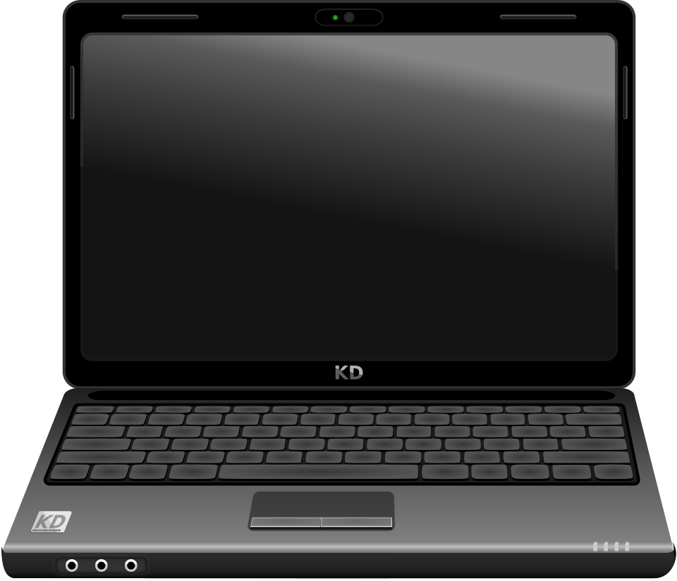

# Tower & laptop anatomy

*What every visible part of a desktop tower and a laptop is called, what each one does, and how to identify the machine you're sitting in front of.*

> Be honest — at some point in your life you've pointed at a **monitor** and called it
> "the computer". Everyone has. Today that era ends. By the bottom of this page you'll
> name every part of your machine like you built it yourself — and you'll never again
> restart a screen and wonder why nothing happened.

> **In real life**
>
> A computer is a **restaurant kitchen**. The tower (or laptop body) is the kitchen;
> inside there's a head chef doing all the work (the CPU), counter space where dishes
> are prepped (RAM), and a pantry where everything is stored (the disk). The monitor,
> keyboard and mouse? That's just the serving window. And here's the thing — nobody
> walks up to the serving window and calls it "the restaurant". Yet here we are with
> monitors.

## The two shapes a computer comes in

Every computer at work is one of two characters: the **desktop** — a box (the **tower**: The upright case that holds the actual computer: motherboard, CPU, RAM, disks and power supply.) with monitor, keyboard and mouse plugged in, like a home-theatre setup — or the **laptop**, which is the exact same machine after someone said *"what if it could fit in a bag?"*

That's the secret: **same organs, different body.** A laptop is just a desktop doing
yoga. Don't take my word for it — go tap around both:

### 🖱️ Walk around a real desktop


*Photo: Jeremy Banks — Wikimedia Commons, CC BY 2.0. [Source](https://commons.wikimedia.org/wiki/File:Desktop_personal_computer.jpg)*
- **Monitor — NOT the computer** — It's a display. That's it. It shows whatever the tower sends it, like a TV shows whatever the remote picks. It has its own power button and cable — which is exactly why turning IT off and on restarts nothing.
- **The tower — the ACTUAL computer** — This box is the whole machine: motherboard, CPU, RAM, disks, all inside. This one lies flat under the monitor being humble; most stand upright like a tower, hence the name.
- **Power button** — The ⏻ symbol. One press = on. And a pro secret: holding it 5+ seconds force-kills a frozen machine. You WILL need this someday, probably at the worst possible moment.
- **Keyboard** — Your main weapon. Plugs into USB. Testers basically live on this thing — the ones who know shortcuts finish testing while the mouse-only people are still opening menus.
- **Mouse** — Points, clicks, drags, scrolls. Named after the animal, chased by cats ever since. Laptops replace it with a trackpad.
- **Cables & the back panel** — Power, video, network — everything permanent plugs in at the back. Rule of IT support: when something 'suddenly stopped working', a cable back here has quietly given up. Check it before blaming the computer.

### 💻 Now walk around a laptop


*Illustration: Wikimedia Commons, CC0 (public domain). [Source](https://commons.wikimedia.org/wiki/File:Black_laptop_computer_open_frontal.svg)*
- **Webcam** — The tiny eye above the screen. The dot beside it lights up when it's recording — that's the 'you're on camera' warning. Years from now you'll be testing whether that light works in some video app. Full circle.
- **Screen (built-in monitor)** — Same job as a desktop monitor, permanently welded on. Closing the lid puts the laptop to SLEEP — it does not shut down. That's why it's warm in your bag. It was never off. It was waiting.
- **Keyboard** — Built in, slightly squished, and hiding a bonus: the Fn key gives the top row second jobs — brightness, volume, and mysterious symbols nobody reads.
- **Trackpad** — The built-in mouse. One finger points, tap clicks, two fingers scroll, two-finger tap right-clicks. Your grandma calls it 'the square'. She's not wrong.
- **Status lights** — Tiny LEDs that never lie: power on, battery charging, disk busy. When a laptop 'won't turn on', these lights are the first witnesses to interrogate.
- **Ports (on the edges)** — A laptop's plugs live on its sides: charger, USB, headphones, maybe HDMI. Two topics from now we tour every port — including the USB plug that somehow takes three tries to insert.

## Meet the whole family at once

You've met the outside. Here's the legendary family portrait — **everything** a full
setup can include, numbered 1 to 16, including the parts hiding inside the case
(2–8) that we'll meet properly in the next chapters. Gotta collect 'em all:

### 🔦 X-ray view: inside a real tower

One more — a **real** tower with the side panel off. Everything you just collected,
in the flesh. Warning: real computers are 90% cables and 10% dignity. Next chapter
we go in properly.


*Photo: Kallerna — Wikimedia Commons, public domain. [Source](https://commons.wikimedia.org/wiki/File:Computer_from_inside_018.jpg)*
- **CPU under its cooler** — That fan + metal sandwich keeps the processor from cooking itself. The chip hides underneath, doing billions of calculations while looking like an air conditioner.
- **RAM sticks** — The green and orange sticks standing at attention — this machine's working memory, in the flesh.
- **Motherboard** — The big red board hosting the entire party. Every part you see is plugged into it somewhere.
- **Graphics / expansion cards** — Slotted boards adding extra abilities. The chunky one is usually graphics — the part gamers remortgage houses for.
- **Power supply (PSU)** — Bottom-corner box feeding every part through that noodle-bundle of cables. Yes, that's normal. No, nobody's cables look neat.
- **Drive bays** — Metal cages where hard disks live — the machine's permanent storage, bolted in like a safe.

### Your first time: Your mission: identify the machine in front of you

- [ ] Decide: is your machine a laptop or a desktop? — One folded unit = laptop. Separate box + screen = desktop. If it's a tablet taped to a keyboard, we don't judge.
- [ ] Find the power button — Look for the ⏻ symbol. Just locate it — don't press it, we're identifying, not rebooting.
- [ ] Count the USB ports you can see — Laptop: check both side edges. Desktop: front AND back of the tower. The back always hides extras.
- [ ] Find the air vents — Laptop: bottom or back edge. Tower: back and sides. These are lungs. Blocked lungs = drama.
- [ ] Find where power comes in — Laptop: the charger socket. Tower: the thick cable at the top back. No power path = expensive paperweight.

Done? You can now point at every external part of your machine and name it. That's
more than half the people in your future office can do. Not kidding.

- **I pressed the power button and nothing happens. No lights. No sound. Nothing.**
  Breathe — it's almost always power, not a dead computer. Laptop: plug in the charger, check the charging light, give it 5 minutes (a fully drained battery sulks before responding), try again. Desktop: check the wall plug, then the 0/1 switch on the PSU at the back. Yes, that switch exists. Yes, someone bumped it.
- **The tower is clearly on — lights, fan noise — but the screen says 'No signal'.**
  The computer is running fine; the picture just isn't arriving. It's the messenger, not the message. Check the video cable at BOTH ends, and confirm the monitor itself is on — it has its own power button, its own cable, and its own opinions.
- **My laptop is hot enough to cook momos and the fan sounds like takeoff.**
  Where is it sitting? Blanket? Sofa? Your lap? You're suffocating it — the vents are blocked. Hard flat surface, always. Still roaring on an empty desk while doing 'nothing'? Some program is secretly partying in the background — we expose those in 'Why computers slow down'.
- **I plugged in a keyboard/mouse and it's doing absolutely nothing.**
  Try a different USB port first — ports die quietly and tell no one. Reseat the plug firmly (three-try USB rule applies). Wireless? The tiny USB receiver must be plugged in AND the batteries must be alive. It's batteries more often than anyone admits.

### Where to check

Want to know exactly what hardware you have — without a screwdriver? Just ask the
machine. It keeps receipts:

- **Windows:** Settings → System → About — machine name, CPU, RAM, all listed.
- **macOS:**  menu → About This Mac. Same story, more minimalism.
- **Any laptop:** the exact model number is on the sticker underneath. That string is
  your magic word for finding drivers and manuals.

This habit — **check the environment, never guess it** — is your first real QA
skill. Every bug report has an "environment" line, and now you know why.

> **Common mistake**
>
> The classic: calling the **monitor** "the computer". A teammate says "restart the
> computer", someone flips the monitor off and on, stares meaningfully, and announces
> "it didn't help". Of course it didn't — the actual computer never noticed. The
> screen is a display; the tower (or laptop body) is the machine. You're now
> permanently cured of this. Your relatives, sadly, are not — you're their IT support now.

**Follow the power — press Play**

1. **🔌 Wall** — Electricity leaves the socket — through the thick cable (desktop) or the charger brick (laptop). No power path, no anything.
2. **⚙️ PSU / battery** — The power supply converts wall power to gentle component voltages; on a laptop, the battery stands ready to take over the instant the charger drops.
3. **🧠 The core wakes** — Motherboard, CPU, RAM, disk — the organs inside the case get their share and come alive.
4. **🖥 Peripherals join** — Monitor, keyboard, mouse light up through their ports. The entourage reports for duty — and the machine is yours.

*Try it — generate your own spec line*

```python
# Fill in YOUR machine's facts (from the checklist above) and press Run —
# this prints the exact environment line used in real bug reports.
kind = "laptop"          # or "desktop"
ram_gb = 8
storage_gb = 512
usb_ports = 3

print(f"Environment: {kind}, {ram_gb} GB RAM, {storage_gb} GB storage, {usb_ports} USB ports")
print("Congratulations — you just automated your first piece of QA paperwork.")
```

### Worked example: the office 'dead computer' that wasn't

Monday, 9 AM: a colleague reports "my computer died over the weekend." Walk it like a pro:

1. **Observe:** monitor shows nothing. But the tower's power LED is ON and the fans hum — so the computer has power and is running.
2. **Split the suspects:** picture works = tower + cable + monitor. Machine runs, so suspicion falls on the cable or the monitor itself.
3. **Check the cheapest thing:** the video cable — the monitor end is loose. It was cleaned around on Friday. Push it in firmly.
4. **Verdict:** picture returns. Total cost: 30 seconds, zero parts, one confident tester. The 'dead computer' was a loose cable — as it so often is.

**Quiz.** A colleague's desktop shows 'No signal' on the monitor, but the tower has lights on and the fans are spinning. What's the most likely problem area?

- [ ] The CPU has failed and must be replaced
- [x] The video cable between tower and monitor, or the monitor's own power
- [ ] The keyboard is unplugged
- [ ] The computer has a virus

*Lights and fans = the tower has power and is running; the picture just isn't reaching the screen. Check the video cable at both ends and the monitor's own power before performing a funeral for the CPU. Simplest cause first — the habit IT support and good testers share.*

- **Tower** — The case of a desktop that holds the REAL computer: motherboard, CPU, RAM, disks, power supply. Not the screen. Never the screen.
- **Trackpad** — A laptop's built-in pointing device — the touch rectangle below the keyboard that replaces the mouse.
- **USB port** — The universal socket for keyboards, mice, drives and phones. Towers: front and back. Laptops: the sides. Insertion attempts required: three.
- **Power brick / charger** — The adapter that converts wall power for a laptop. Forget it at home and your 'portable computer' becomes a countdown timer.
- **Air vents** — The machine's lungs. Blocked vents = overheating: loud fans, slowdowns, sudden shutdowns. Blankets are the natural predator of laptops.

> **Tip**
>
> Testers meet hardware inside bug reports. "Works on my machine" usually decodes to a
> hardware difference: less RAM, smaller screen, no graphics card. Knowing part names
> lets you write an environment line like <em>"Reproduced on a 14-inch laptop, 8 GB RAM,
> external monitor attached"</em> — and instantly sound like you've done this for years.

### Challenge

Write down for the machine you're using right now: **(1)** desktop or laptop, **(2)** where
its power button is, **(3)** how many USB ports it has, **(4)** where the air vents are,
**(5)** its exact model (About This Mac / Settings → About / the sticker underneath).
Congratulations — you just documented a **test environment**, the habit behind every
bug report you'll ever write. It felt like nothing. It was everything.

### Ask the community

> I have a [laptop/desktop], model [X]. When I [exact thing you did], I expected [what you expected] but instead [what actually happened]. I already tried [what you tried]. What should I check next?

Hardware confusing you? Ask early — every single expert once didn't know what a tower
was, including whoever's answering you. A good question names the machine, the exact
thing you did, what you expected, and what happened instead. (Psst — that's already
the shape of a bug report. You're learning the job without noticing.)

🎬 [Crash Course — computer hardware in 12 minutes](https://www.youtube.com/watch?v=HB4I2CgkcCo) (12 min)

- [GCFGlobal — Basic parts of a computer (with pictures)](https://edu.gcfglobal.org/en/computerbasics/basic-parts-of-a-computer/1/)
- [GCFGlobal — Buttons and ports on a computer](https://edu.gcfglobal.org/en/computerbasics/buttons-and-ports-on-a-computer/1/)
- [Crash Course — Computer hardware in 12 minutes](https://www.youtube.com/watch?v=HB4I2CgkcCo)

- Desktops and laptops are the same machine in different shapes — a laptop is a folded-up desktop.
- The tower is the computer; the monitor only displays what it's sent. It has no thoughts.
- Know your externals: power button, USB ports, video cable, charger, air vents.
- 'Dead' computers are usually power problems; 'No signal' screens are usually cable problems. Simplest cause first.
- Naming your hardware precisely = describing a test environment — the skill behind every bug report you'll ever write.


---
_Source: `packages/curriculum/content/notes/how-a-computer-works/the-parts-of-a-computer/tower-and-laptop-anatomy.mdx`_
