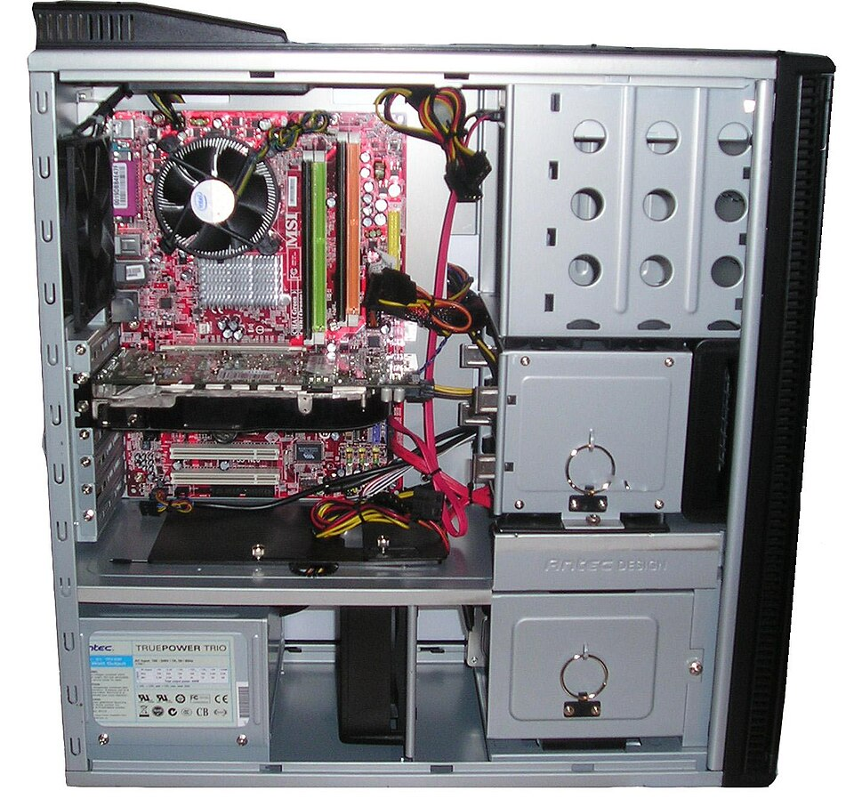

# Desktops & laptops

*The real trade-offs between the box and the fold-up — power, price, repairs, posture — and how to match the machine to the human.*

> Same organs, different bodies — you learned that on day one. So why do desktops
> still EXIST, when laptops do everything and fit in a bag? Because everything in
> computing is a **trade-off**, and the desktop-vs-laptop choice is the friendliest
> place to learn trade-off thinking — the exact muscle you'll later flex on "which
> browsers do we test first?" and "is this bug worth blocking the release?". Big
> skills hide in small choices.

> **In real life**
>
> A desktop is a **fully equipped home kitchen**; a laptop is a **premium food truck**.
> The home kitchen: more counter space, bigger appliances, everything replaceable,
> renovations welcome — but it feeds you ONLY at home. The food truck: goes anywhere,
> runs on its own tank (battery), impressively capable — but cramped, harder to
> service, and when the built-in stove dies, you're not swapping it in an afternoon.
> Neither is "better". Better FOR WHAT is the only real question.

## The trade-off table, honestly

**Desktops win at:**

- **Power per rupee/dollar** — no miniaturization tax; the same money buys more chef, counter and pantry.
- **Cooling** — big case, big fans (you've SEEN the inside). Less throttling under long heavy work.
- **Upgrades & repairs** — the Chapter 1 tower opens with two screws; RAM, storage, graphics all swap. A desktop ages in PARTS.
- **Ergonomics** — screen at eye height, real keyboard distance. Necks notice after year one.

Here's the upgrade argument, photographed — a desktop's insides with every
swappable part visible. Tap the tour:


*Photo: Kallerna — Wikimedia Commons, public domain. [Source](https://commons.wikimedia.org/wiki/File:Computer_from_inside_018.jpg)*
- **RAM — a 2-minute upgrade** — Those sticks pull out and click back in. More counter space for the price of a dinner, installable by anyone who can open a case. The single most common desktop upgrade — and on many modern laptops, soldered shut forever.
- **Drive bays — pantry expansion, unlimited-ish** — Empty cages waiting for more storage. Desktops ADD drives; laptops REPLACE their one drive, if you're lucky and own tiny screwdrivers.
- **Expansion slots — whole new abilities** — New graphics card, faster network, more ports — slide a card in. This slot system is WHY desktops age in parts: the 2020 case can host a 2026 graphics card. No laptop equivalent exists.
- **PSU — even the power is replaceable** — Bigger upgrades need more power? Swap the supply. In a laptop, the 'power supply' is a battery glued into a chassis engineered to millimeters. Different philosophy, visible from here.
- **CPU cooler — serviceable cooling** — The big fan unscrews for cleaning or upgrading (remember the dust sweater — THIS is where you'd prevent it). Laptop cooling is a sealed whisper of a fan you'll likely never touch. Cooling access = the throttling trade-off, explained physically.

🎬 [Techquickie — laptop vs desktop, the honest trade-offs](https://www.youtube.com/watch?v=1zERj4EYYDA) (5 min)

**Laptops win at:**

- **Being there** — the only computer that attends class, cafés, client offices and sofas. The best machine is the one you have with you.
- **Built-in everything** — screen, keyboard, camera, mic, speakers, battery, Wi-Fi: the whole Chapter 1 curriculum in one hinge.
- **One power cable** (or none, for hours) — a desk-free existence.

**The catch:** laptop parts are integrated — **soldered**: Chips permanently melted onto the board instead of socketed — no upgrades, no easy replacement. RAM is common now (the
upgrade door welded shut), batteries age chemically (2–5 years to noticeable
decline), and repairs cost more because everything is folded into everything.
A laptop ages as a WHOLE.

> **Tip**
>
> Tester lens on: this trade-off IS your future test matrix. Desktop users run big
> screens, wired networks, keyboards-and-mice. Laptop users bring trackpads, battery
> states, lid-close sleep cycles, Wi-Fi handoffs, and 1366×768 budget screens. The
> same web app lives differently on each — remember the responsive check you ran with
> F12 in Chapter 1? That was this paragraph, in tool form. "Which body is the user
> wearing?" is a real testing question.

### Your first time: Your mission: run a real needs-analysis

- [ ] Profile a real human (you, or someone near) — Where do they compute — one desk, or everywhere? What's the heaviest thing they do — browsing, video editing, gaming, spreadsheets?
- [ ] Score mobility honestly — Actually moves weekly = laptop territory. 'Might someday' = the most expensive maybe in tech; people pay the portability tax for years of sitting at one desk.
- [ ] Score the workload — Heavy sustained work (editing, compiling, gaming) loves desktop cooling and upgrade paths. Light-and-varied work runs happily on either.
- [ ] Check the repair reality — Look up: is the RAM soldered in the laptop you (or they) own? Search '[model] RAM upgrade'. The answer teaches the integration trade-off on YOUR hardware.
- [ ] Write the verdict in trade-off language — 'X because they value A over B, accepting cost C.' One sentence. That structure — chosen value, accepted cost — is decision-making you'll reuse on test priorities forever.

One needs-analysis, one verdict, zero marketing influence. The trade-off muscle is
officially activated.

- **My laptop battery dies by lunch. It used to last all day.**
  Chemical aging — batteries are consumables, like tires. Check battery health (Windows: powercfg battery report; Mac: System Settings → Battery). Below ~80% capacity after years of cycles = normal wear, replaceable part. Meanwhile: lower screen brightness (the #1 drain), and audit background apps (Chapter 2 skills, now saving battery instead of speed).
- **My laptop roars and slows during long video exports; my friend's cheaper DESKTOP doesn't.**
  The cooling trade-off, live: the food truck throttles where the home kitchen cruises (Chapter 2's thermal story meets this topic's body types). Mitigations: hard flat surface, a cooling pad, exports overnight. Real fix if this is DAILY work: the workload wants a desktop body. The machine isn't broken — it's the wrong body for the job.
- **The desktop works but it's a cable jungle and something's always unplugged.**
  The home kitchen's tax: five components = five+ cables (power, video, USB×n, network, audio). One habit fixes 90%: when anything acts up, reseat ITS cable first (Chapter 1's law). Label the back-panel cables once with tape — ten minutes now, years of instant diagnosis later.
- **The laptop hinge is getting loose / the built-in screen flickers when I move the lid.**
  Integration's dark side: the hinge carries the display cable, and wear pinches it. Flickering-on-movement = the cable, not the screen panel — a known laptop disease. Don't ignore it (it worsens); a repair shop replacing a hinge-cable is far cheaper than a new screen. Desktop equivalent? Doesn't exist — the monitor just... sits there. Trade-offs, everywhere.

### Where to check

Body-specific vitals, all self-reported:

- **Battery health:** `powercfg /batteryreport` (Windows, in a terminal — a taste of Track B!) or System Settings → Battery → Battery Health (Mac). Design capacity vs current capacity = the aging receipt.
- **Thermals under load:** Task Manager → Performance during heavy work — watch the CPU speed drop when heat rises (throttling, measurable).
- **Upgrade paths:** the maker's spec page for your model — RAM soldered or slotted, storage replaceable? Ten minutes of reading = the machine's whole future.

Knowing your machine's BODY constraints turns "it's acting weird" into "it's doing
exactly what this body does under these conditions" — which is sometimes the entire
diagnosis.

> **Common mistake**
>
> Buying by single spotlight number (the GHz-GB-TB lesson's final boss): a "gaming
> laptop" with a monster CPU that throttles in 10 minutes because the body can't
> cool it; a cheap desktop "deal" without noticing it needs a monitor, keyboard,
> mouse and Wi-Fi adapter sold separately. The body changes what the specs MEAN.
> Specs are ingredients; the body is the kitchen they cook in. Judge them together
> or get judged by your purchase.

**The trade-off decision walk — press Play**

1. **📍 Mobility?** — Does this human actually compute in more than one place, weekly? Honest answers only — 'maybe someday' is the most expensive maybe in tech.
2. **🏋️ Workload?** — Sustained heavy work (editing, gaming, compiling) loves desktop cooling and upgrade paths. Light-and-varied runs happily anywhere.
3. **💰 Budget reality** — Same money = more desktop power (no miniaturization tax) but zero portability. The laptop tax buys BEING THERE.
4. **⚖️ The verdict sentence** — 'X — because they value A over B, accepting cost C.' If you can't fill that sentence, you're not ready to spend. When you can, you're done.

*Try it — the uncle-protection recommender*

```python
# Encode the trade-off walk. Change the profile, protect a relative.
moves_weekly = False
heavy_sustained_work = True
budget_tight = True

if moves_weekly:
    print("Verdict: LAPTOP — being-there beats everything else it gives up.")
elif heavy_sustained_work:
    print("Verdict: DESKTOP — cooling + upgrades + power-per-rupee for the win.")
elif budget_tight:
    print("Verdict: DESKTOP (or used laptop) — skip the portability tax you won't use.")
else:
    print("Verdict: either works — buy the better screen and keyboard.")
```

### Worked example: upgrade or replace? The 6-year-old desktop verdict

A friend asks: "my old desktop is slow — new one, right?" The trade-off math, shown:

1. **Diagnose first:** disk check reveals a spinning HDD (the whirring gives it away), 8 GB RAM mostly free, CPU rarely above 40%. The bottleneck is the pantry's SPEED, not the kitchen.
2. **Price the surgical fix:** an SSD costs a fraction of a new machine — and desktops swap drives in minutes (the upgrade tour above, cashing in).
3. **Execute:** clone the disk, swap in the SSD. Boot time: 3 minutes → 25 seconds. Apps open like the machine is new.
4. **Verdict:** the desktop body earned its keep — it aged in PARTS, so one part fixed it. The same slowness in a soldered laptop would have meant a whole new machine. Trade-offs aren't theory; they're this exact bill.

**Quiz.** A student needs a machine for classes (notes, browsing, video calls) across campus, dorm and library. Budget is tight. A shop offers a powerful desktop for the same price as a modest laptop. Trade-off verdict?

- [ ] Desktop — more power for the money, always take it
- [x] Laptop — their #1 requirement is BEING THERE; unused desktop power feeds nobody at the library
- [ ] Neither, save for both
- [ ] Whichever has more GB

*Requirements first, specs second: the student's workload is light (either body handles it), but their mobility need is absolute — only one body attends class. The desktop's extra power would be excellence at the wrong requirement. Matching solution to actual need over impressive-but-irrelevant capability: that's engineering judgment, and it transfers straight into test planning.*

- **Desktop trade-off** — Wins: power-per-money, cooling, upgrades (ages in parts), ergonomics. Costs: lives at one desk, cable jungle, buy-your-own peripherals.
- **Laptop trade-off** — Wins: being there, all-in-one, battery freedom. Costs: miniaturization tax, throttling, soldered parts, ages as a whole, hinge wear.
- **Battery health** — Chemical consumable — check design vs current capacity (powercfg report / Battery Health). ~80% after years = normal tires-wearing-out.
- **'Better FOR WHAT'** — The only honest spec question. Requirements first, then the body, then the numbers. Single-number shopping = the classic trap.
- **Bodies as test matrix** — Desktop users vs laptop users bring different screens, inputs, networks and power states — the same app must survive both wardrobes.

### Challenge

Write trade-off verdicts (one sentence each, the 'values A over B accepting C'
format) for THREE humans: a video editor, a traveling salesperson, and a family
sharing one machine for homework. No specs allowed — just needs, bodies and
accepted costs. If you can argue all three cleanly, you've internalized trade-off
thinking better than most buyers, most salespeople, and honestly some product
managers.

### Ask the community

> Choosing between [desktop/laptop options] for [actual use + mobility reality + budget]. My trade-off analysis says [verdict] because [values A over B]. Sanity-check me?

Purchase questions with a trade-off analysis attached get expert-level replies —
you've shown your reasoning, so people debug THE REASONING instead of guessing your
needs. (Debugging reasoning instead of guessing — there's a job that does that to
software all day. You're in its training program.)

- [Techquickie — laptop vs desktop, the honest version](https://www.youtube.com/watch?v=1zERj4EYYDA)
- [GCFGlobal — laptops and mobile devices](https://edu.gcfglobal.org/en/computerbasics/laptop-computers/1/)
- [How-To Geek — reading your battery's health report](https://www.howtogeek.com/365172/how-to-check-your-laptop-batterys-health-in-windows/)

- Same organs, different bodies: desktops age in parts and cool like champions; laptops trade all of it for BEING THERE.
- Batteries are tires — chemical consumables with a health report you can actually read.
- The body changes what specs mean: a hot cramped chassis throttles the same CPU a big case cruises.
- 'Better for what' beats 'better' — requirements first, body second, numbers last.
- Trade-off sentences ('values A over B, accepting C') are reusable engineering judgment — next stop: test priorities.


---
_Source: `packages/curriculum/content/notes/how-a-computer-works/types-of-computers/desktops-and-laptops.mdx`_
