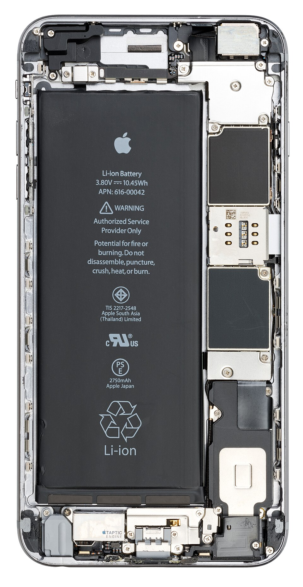

# Phones & tablets

*Proof that your phone is a full computer — same organs, pocket body — plus the constraints (battery, thermals, touch, networks) that make mobile its own testing universe.*

> The most-used computer on Earth isn't on a desk — it's in your pocket, and most of
> its owners have never once called it a computer. Time to correct that with surgery:
> we're opening a real phone, finding every organ from this module inside it, and then
> learning why this tiny body bends all the rules — which is exactly why "mobile
> tester" is its own job title with its own salary.

> **In real life**
>
> A phone is the food truck's final form: the **entire restaurant compressed into a
> lunchbox**. Chef (CPU), counter (RAM), pantry (storage), serving window
> (touchscreen — input AND output, you knew that), its own generator (battery), and a
> radio tower subscription (mobile data). Nothing was removed. Everything was
> shrunk, fused and sealed — and the sealing changes everything about how it ages
> and how it's tested.

## The surgery: find the organs

A real iPhone, opened. Every part of Module 1, tap by tap:


*Photo: Evan-Amos — Wikimedia Commons, public domain. [Source](https://commons.wikimedia.org/wiki/File:Apple-iPhone-6S-Plus-Inside.jpg)*
- **The battery — half the body** — Look how much of the phone is BATTERY. The single biggest design constraint in mobile: every feature fights for milliamp-hours. This is why the OS-landlord evicts background apps so aggressively — battery is the rent everyone pays.
- **The logic board — chef + counter + pantry** — That narrow strip is the whole kitchen: CPU, RAM and storage, stacked and soldered. No slots, no upgrades, no user-serviceable anything. A desktop ages in parts; a phone is BORN complete and ages as one.
- **SIM tray contacts** — The phone's passport office — where the SIM identifies you to the radio towers. Mobile data is a whole extra organ desktop computers never had: a computer with a subscription.
- **Taptic engine — output for your skin** — A precision vibration motor: the tap you FEEL on silent mode. Output devices chapter, represented. Haptic feedback is real UX surface — and yes, apps get it wrong, and yes, that's a fileable bug.
- **Speaker assembly** — The voice. Sealed against water with tiny meshes — one of a dozen quiet miracles in here. Waterproofing is also why nothing opens without heat guns and prayer.
- **Front camera & sensors** — Input cluster: camera, ambient light sensor (auto-brightness = input you never notice), proximity sensor (screen-off-during-calls). Sensors are the inputs users forget — testers don't.

Same organs. Pocket body. Case closed — literally, with glue.

## What the tiny body changes (the mobile difference)

- **Battery rules everything** — the OS kills background apps mid-task, throttles chips when low, and every app must survive being frozen and resurrected at any moment. (Desktop apps never rehearsed THAT.)
- **Thermals with no fan** — phones cool by giving up: heavy games literally dim and slow on hot days. Thermal throttling, Chapter 2, now fanless.
- **Touch is the only door** — no hover, no right-click, fat fingers, gestures that conflict. A button comfortable for a mouse is a misery at thumb-size.
- **Networks change under your feet** — Wi-Fi → mobile data → elevator dead zone → back, all mid-request. Desktop apps assume the network EXISTS; mobile apps that assume that get one-star reviews.
- **Interruptions are constant** — calls, notifications, rotations, app-switching. Every mobile app lives mid-interruption, forever.

> **Tip**
>
> Read that list again as a job description, because it is one: **mobile testing** =
> verifying apps survive battery kills, thermal slowdowns, fat-finger taps, network
> handoffs and rotation mid-form. Every constraint above is a test category with
> real techniques (Track F has a whole module). Your pocket contains the most
> hostile testing environment ever mass-produced — and you've been USING it without
> seeing it. Now you see it.

### Your first time: Your mission: expose your phone's computer-ness

- [ ] Find your phone's spec line — Settings → About phone: chip, RAM, storage, OS version. The same four facts you collected for your computer — because it IS one. Add it to your environment collection.
- [ ] Catch the battery politics — Settings → Battery: the per-app consumption chart = the landlord's rent ledger. Who's expensive? Were you surprised?
- [ ] Witness one background eviction — Open a game or heavy app, switch away for an hour, come back: did it reload from scratch? That reload = the OS evicted it to save battery, and the app (hopefully) restored your state. State restoration is a REAL test case — you just ran it.
- [ ] Trigger a sensor input you never notice — Cover the top of the screen during a call (proximity sensor blanks it), or walk from bright sun to shade (auto-brightness). Invisible inputs, working constantly.
- [ ] Do one rotation test — Open any form, type something, rotate the phone. Text still there? Layout survive? Congratulations: you just executed the single most classic mobile test in existence.

Spec line collected, evictions witnessed, rotation test executed. Your phone is
now officially a computer — and unofficially your first mobile test device.

- **My phone gets hot and slow while charging + gaming in the sun.**
  You've stacked three heat sources on a body with no fan: charging warmth + working chip + solar assault. The phone is throttling to protect its battery (heat is a battery's mortal enemy). Shade, remove the case, pause the game while fast-charging. Not a defect — physics in a sealed lunchbox.
- **An app 'loses my progress' every time I switch away for a while.**
  The background eviction from your mission — but this app fails the resurrection: it doesn't SAVE state before the OS kills it. That's a genuine app bug (state restoration), one of mobile's most-filed categories. Workaround: finish tasks before switching. Better: report it — you can now describe exactly what's happening, eviction and all.
- **Storage full — AGAIN — and I barely install apps.**
  Chapter 2's answer, pocket edition: the camera is the pantry-eater (4K video devours GBs per minute), plus chat apps hoarding every photo ever received. Settings → Storage shows the breakdown; offload media to cloud/computer. The 'few apps' were never the suspects.
- **Works on Wi-Fi, breaks on mobile data (or the reverse).**
  A network-dependent difference — classic mobile bug habitat. Quick checks: does the app have mobile-data permission (some OSes restrict per-app)? Is a VPN/private-DNS active on one network only? This exact works-here-not-there pattern is one you'll professionally document later; for now, note that NETWORK is part of mobile's environment line.

### Where to check

The pocket computer self-reports like every computer:

- **Spec + OS:** Settings → About. **Battery ledger:** Settings → Battery. **Pantry:** Settings → Storage. **Key cabinet:** Settings → Privacy/Permissions — all four screens you already know from the big machines, redecorated.
- **Per-app details:** long-press an app icon → App info (Android) — its storage, battery, permissions and force-stop button (End Task's mobile cousin).
- **The environment line, mobile edition:** device model + OS version + app version + NETWORK (Wi-Fi/data) + battery state. Two more fields than desktop — because the mobile body has two more ways to change behavior.

> **Common mistake**
>
> Treating the phone as "just a small screen" when thinking about apps — the mistake
> entire dev teams have shipped: desktop layouts crushed onto touchscreens, hover-only
> menus no finger can open, forms that die on rotation. If software must live in the
> lunchbox, it must respect the lunchbox: battery, touch, interruptions, networks.
> Testers who internalize this catch what desktop-minded teams miss — which is
> precisely why mobile QA is hired separately.

**The background eviction cycle — press Play**

1. **📱 App active** — Front and center, full resources, everything smooth. The good life.
2. **🔀 Interrupted** — A call, a notification tap, a switch away. The app is backgrounded mid-task — mid-CHECKOUT, even.
3. **⚡ OS evicts** — Battery politics: the landlord reclaims memory from background tenants. The app is killed. It had ONE duty first: save its state.
4. **🔄 Resurrection** — The user returns. Good app: restores everything, invisible seams. Bad app: 'where's my cart?!' — the most-filed mobile bug, and now you know its whole anatomy.

*Try it — state restoration, the bug and the fix*

```python
# Two apps face the same eviction. One saved its state. Guess which gets 1 star.
cart = ["headphones", "charger"]
saved_state = {"cart": list(cart)}   # the good app's habit

# ...the OS evicts the app; memory is wiped...
cart = []

# resurrection:
restored = saved_state.get("cart", [])
print("Good app after eviction :", restored)
print("Bad app after eviction  :", [] )
print("Same OS, same eviction — the difference is one saved dict.")
```

### Worked example: the shopping cart that vanished during a phone call

The interruption bug from the quiz — now walked as a tester would:

1. **Reproduce deliberately:** add items to the cart, trigger a call (have a friend ring), answer for 2 minutes, return to the app. Cart empty. Again, same steps: empty again. Reproducible = reportable.
2. **Name the mechanism:** the call backgrounded the app; the OS **evicted**: The mobile OS killing a background app to reclaim battery and memory — apps must save their state to survive it. it under memory pressure; the app restarted without restoring state.
3. **Isolate the failure:** other apps survive the same interruption fine — so it's this app's state-saving, not the OS being unreasonable.
4. **Verdict:** filed with steps, device, OS version and the eviction mechanism named. The developer's reply: "wow, that's exactly it." That's what understanding the pocket computer buys — bugs that get FIXED.

🎬 [Branch Education — inside a smartphone (gorgeous)](https://www.youtube.com/watch?v=eDPUYNMBBs8) (15 min)

**Quiz.** A user reports: 'The shopping app forgets my cart whenever I answer a call mid-checkout.' As a mobile-aware tester, what's actually happening?

- [ ] The phone's RAM is broken
- [x] The call interrupted the app; the OS may have evicted it for resources, and the app fails to save/restore its state — an interruption + state-restoration bug
- [ ] The user should not answer calls while shopping
- [ ] The shopping site is down

*Interruption arrives (call) → app backgrounds → OS may evict it (battery/memory politics) → app returns without saved state = lost cart. The bug isn't the eviction (that's the OS's right); it's the app not surviving it. 'Interrupt mid-flow and return' is a STANDARD mobile test script — and you just reverse-engineered why it exists.*

- **A phone is…** — A full computer: CPU+RAM+storage (one soldered board), touchscreen I/O, battery generator, radio subscription. Nothing missing — everything sealed.
- **Battery politics** — Mobile's #1 constraint: the OS evicts background apps, throttles chips, and audits every app's consumption. Apps must survive being killed anytime.
- **State restoration** — An app's duty to save itself before eviction and resurrect seamlessly. Its failure = 'the app forgot my progress' — mobile's most classic bug.
- **Fanless thermals** — Phones cool by slowing down. Hot day + charging + gaming = intentional throttling, not a defect.
- **Mobile environment line** — Device + OS version + app version + network (Wi-Fi/data) + battery state. Two fields more than desktop, because the body has two more moods.

### Challenge

Run a three-test mobile session on any app you use: (1) rotation mid-form, (2)
switch-away-and-return after 30+ minutes, (3) airplane mode mid-action, then
restore. Write one line per test: expected vs actual (output devices chapter,
still paying rent). If all three pass — you tested a resilient app. If any fails —
you're now holding a real, describable, reportable mobile bug. Either way: that
was a genuine mobile test session, your first.

### Ask the community

> Mobile issue: [app + version] on [device + OS]. Network: [Wi-Fi/data]. Battery state: [normal/low/saving mode]. Behavior: [exact], especially after [interruption/rotation/background]. Is this the app or the OS politics?

Mobile questions need the extra fields — network and battery state change app
behavior in ways desktop askers never imagine. Bring all five environment facts
and watch how fast someone recognizes the pattern. (It's usually state
restoration. It's SO usually state restoration.)

- [Branch Education — what's inside a smartphone (gorgeous visuals)](https://www.youtube.com/watch?v=eDPUYNMBBs8)
- [GCFGlobal — mobile devices as computers](https://edu.gcfglobal.org/en/computerbasics/mobile-devices/1/)
- [Ministry of Testing — a beginner's guide to mobile testing](https://www.ministryoftesting.com/articles/a-beginners-guide-to-mobile-testing)

- Your phone is a complete computer — every Module 1 organ, soldered into one sealed board, half of it battery.
- Battery politics rule mobile: apps live under threat of eviction and must resurrect with state intact.
- No fan = cooling by slowing. Heat + charging + load = deliberate throttling, not damage.
- Touch, interruptions and shifting networks make mobile its own testing universe — with its own job title.
- Mobile environment lines carry two extra fields (network, battery state) because the body has two extra moods.


---
_Source: `packages/curriculum/content/notes/how-a-computer-works/types-of-computers/phones-and-tablets.mdx`_
