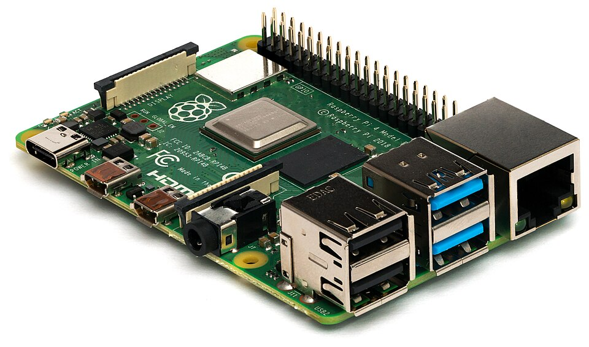

# Smart devices

*The computers hiding in watches, TVs, speakers and doorbells — proven with a biscuit-sized board you can hold — and why 'smart' always means 'testable'.*

> Count the computers in your home. Laptop, phone... done? Wrong by a factor of ten.
> The TV is a computer. The watch is a computer. The speaker that mishears you, the
> router blinking in the corner, maybe the doorbell, possibly the washing machine.
> "Smart" is a marketing word; the engineering word is "**has a computer in it**" —
> and every single one runs software, which means every single one has bugs. You can
> see where this is going for your career.

> **In real life**
>
> Smart devices are **food trucks that shrunk into vending machines**: a full kitchen
> (chef, counter, pantry — the whole Module 1 anatomy) compressed until it fits inside
> a doorbell, cooking exactly ONE dish forever. Your laptop is a general-purpose
> kitchen; a smart thermostat is a kitchen that only makes temperature soup. Smaller
> menu, same organs, same ways to break.

## The proof you can hold: a computer the size of a biscuit

This is a Raspberry Pi — a complete, real computer sold for the price of a dinner.
It's what "the computer inside a smart TV" looks like when you're allowed to see it.
Every organ from this module, findable by eye:


*Photo: Laserlicht — Wikimedia Commons, CC BY-SA 4.0. [Source](https://commons.wikimedia.org/wiki/File:Raspberry_Pi_4_Model_B_-_Side.jpg)*
- **The CPU — under the metal lid** — Same chef, biscuit edition. This little square runs a full OS, browsers, even games. The metal lid spreads heat exactly like the big CPUs — Chapter 2, miniaturized. No fan though: like a phone, it cools by enduring.
- **RAM — the black chip beside it** — The counter, soldered flat. Gigabytes of working memory in something smaller than a stamp. Everything you learned about RAM applies at every size.
- **GPIO pins — the 40 metal legs** — The wild feature laptops don't have: general-purpose pins that connect to ANYTHING — sensors, motors, lights, buttons. This is how computers grow into thermostats, robots and doorbells. Input/output devices chapter, à la carte.
- **USB-C — power in** — The whole computer runs off a phone charger. Ports chapter knowledge transferring across bodies, again: shape = function, everywhere.
- **USB-A ports — the classics** — Four full-size USB ports: keyboard, mouse, drives — the same handshake ceremony from 'Connecting a device' runs here identically. It's not LIKE a computer. It IS one.
- **Ethernet — the clicky port** — Wired network, blinking lights and all. Smart devices are computers ON A NETWORK — which is what makes them useful, and (foreshadowing the security track) what makes them interesting to attackers.

🎬 [Raspberry Pi explained — the biscuit computer in 100 seconds](https://www.youtube.com/watch?v=eZ74x6dVYes) (3 min)

## The IoT idea (and the joke you should know)

Connect those tiny computers to the internet and you get the
**IoT**: Internet of Things — everyday objects with embedded computers and network connections: TVs, watches, bulbs, doorbells, fridges.:
objects that sense, report and obey remotely. Lights you dim from bed, doorbells
that text you, watches that tattle on your heart rate.

Now the joke, which is also a warning, which is also a future job description:
**"The S in IoT stands for Security."** (...There is no S in IoT.) Millions of
biscuit-computers shipped with default passwords, no updates, and a network
connection — an attacker's buffet. Track E's security modules will teach you to
audit exactly this; today, just remember: every "smart" thing is a networked
computer with ALL the responsibilities that implies, whether its maker accepted
them or not.

> **Tip**
>
> Tester's takeaway: smart devices mean **software now lives EVERYWHERE, and so do
> its bugs** — TVs freeze, watches drop syncs, speakers mishear, robot vacuums map
> your home into a wall. Every one is testable: it has inputs (sensors, voice, apps),
> outputs (screens, lights, motion), states, updates and networks. The test-thinking
> you built on big computers stretches to every object in the house. The job market
> noticed years ago: embedded QA, IoT QA, smart-device QA — real titles, real
> salaries, same fundamentals you're learning right now.

### Your first time: Your mission: the home computer census

- [ ] Count the ACTUAL computers in your home — TV? Router? Watch? Speaker? Game console? Printer (it has a computer AND a grudge)? Car infotainment? Write the number. Ten is normal. Twenty isn't rare.
- [ ] Find the census proof: updates — Check your TV or router's settings for 'Software update' or 'Firmware update'. Updates = software = computer. The menu item is the confession.
- [ ] Catch one smart device having a computer moment — TV slow to respond? Speaker misheard you? Watch needed a restart? That's not 'being weird' — that's a computer doing computer things: load, bugs, state. Diagnose it with Module 1 eyes.
- [ ] Find one device's environment line — Somewhere in its settings/app: model + firmware version. The same two facts every bug report wants — smart devices have them too, because of course they do.
- [ ] Restart something that isn't a computer (allegedly) — Router acting up? TV app frozen? Power-cycle it and watch the fix rate. 'Have you tried turning it off and on' works on the WHOLE house now. You live in a building full of kitchens.

Census complete: you live with more computers than people. Every one of them,
you now know how to interrogate.

- **The smart TV is SO slow now — it was fine when we bought it.**
  It's a computer with a weak chef and a small counter (cost-cut CPU/RAM), running apps that grew heavier every year — Chapter 2's 'reason six', TV edition. Fixes: restart it (clears the counter — many TVs never truly power off), close/reinstall bloated apps, check for firmware updates. Long-term: a streaming stick outsources the computing to a newer, better biscuit.
- **The smart speaker suddenly won't respond at all.**
  It's a networked computer: run the stack — power (is it on?), network (did the Wi-Fi change? router restart?), service (is the assistant's SERVER down? — the scope question from the servers topic works on speakers too: check the status page). Device → network → cloud: three layers, same walk as every diagnosis this module taught.
- **Smartwatch stopped syncing with the phone.**
  A Bluetooth marriage having a moment — the pairing topic's greatest hits: is the watch still paired-but-not-connected? Bluetooth toggled off? Phone OS updated recently (landlord renovation breaking a tenant's assumptions)? The nuclear ritual works here too: forget device, re-pair. 90% cure rate, unchanged.
- **The robot vacuum / smart bulb / doorbell does something DIFFERENT after an update.**
  Behavior changed by update = software changed = intended feature OR regression (a bug introduced by new code — vocabulary you'll use professionally). Check the update notes; if unlisted, it's regression-suspicious and worth reporting. Fun fact: smart-device makers employ testers to catch exactly this before shipping. Their misses are your evidence that the job matters.

### Where to check

Smart devices confess in two places:

- **The device's own settings** — model, firmware version, update screen, restart option. The environment line, always somewhere in the menus.
- **Its companion app** — most smart devices are administered by phone (headless, like servers! The pattern connects). The app shows connection state, logs, and often a 'device health' screen.
- **The stack walk:** device → home network → maker's cloud service. Any layer can be the dead one; the scope question ('just this device? all devices? the service's status page?') sorts it in minutes.

The whole module's diagnostic toolkit — restart, scope, layers, versions —
transfers to every object in the census. That was the point all along.

> **Common mistake**
>
> Treating smart devices as appliances instead of computers: never updating them,
> never restarting them, using default passwords forever, then being shocked when
> they're slow, buggy or hacked. A fridge is an appliance; a SMART fridge is a
> computer wearing an appliance costume — it needs updates, occasional restarts, and
> a real password on its account. The costume fools everyone. It no longer fools you.

**The stack walk — press Play**

1. **📟 Device layer** — Is it powered? Does it respond locally (button, light, chime)? Alive here = move up the stack.
2. **📶 Network layer** — Is it on the Wi-Fi? Do OTHER smart devices work? The companion app's connection screen answers both.
3. **☁️ Cloud layer** — The maker's servers relay everything — check their status page. 'Degraded service' up there explains silence down here.
4. **🎯 Verdict** — The dead layer names the fix: charge it / fix the Wi-Fi / wait for the maker. Three minutes, no factory resets, no innocent devices punished.

*Try it — the stack walk as code*

```python
# Three booleans, one diagnosis. Flip them to match your broken gadget.
device_responds_locally = True
on_network = True
maker_cloud_healthy = False

if not device_responds_locally:
    print("Layer 1: DEVICE — power/hardware. Charge it, restart it, then worry.")
elif not on_network:
    print("Layer 2: NETWORK — Wi-Fi changed? Router sulking? Fix the house, not the gadget.")
elif not maker_cloud_healthy:
    print("Layer 3: CLOUD — the maker's servers. Your move: tea. It's their outage.")
else:
    print("All layers green — now it's an interesting bug. Time for the community.")
```

### Worked example: the doorbell that went silent — a three-layer walk

IoT triage on a real symptom, layer by layer:

1. **Layer 1 — device:** the doorbell's light is on and the button makes it chime locally. Hardware alive.
2. **Layer 2 — network:** the companion app shows it connected to Wi-Fi; other smart devices in the house work. Network cleared.
3. **Layer 3 — cloud:** the maker's status page reports "notification delivery degraded" since morning. There it is.
4. **Verdict:** nothing at home was ever broken — the maker's servers were dropping alerts. Action: none required, incident resolved upstream by evening. The stack walk cost three minutes and prevented a factory reset, a router reboot, and a one-star review of an innocent doorbell.

**Quiz.** A smart doorbell stops sending phone alerts. Its light is on, the home Wi-Fi works, other devices are fine. Using the stack walk, what's the sharpest next check?

- [ ] Buy a new doorbell
- [x] The maker's cloud service status — device and network layers look alive, so the third layer (their servers) is the prime suspect
- [ ] Repaint the door
- [ ] The phone is too old

*Device powered (layer 1 ✓), network healthy (layer 2 ✓) — the walk points at layer 3: the maker's cloud, which relays every alert (remember: the doorbell is a CLIENT of their SERVERS). Check their status page before touching anything at home. Total cost of this diagnosis: zero rupees, one module of knowledge.*

- **Smart device** — An object with an embedded computer + network connection. Same organs (CPU/RAM/storage), one-dish menu, all the usual software diseases.
- **IoT** — Internet of Things — everyday objects as networked computers. The S stands for Security. (There is no S. That's the point.)
- **Firmware update (on a gadget)** — The confession that it's a computer. Behavior changes after updates = feature or regression — both testable, one reportable.
- **The stack walk** — Device → home network → maker's cloud. Three layers, any can die; scope questions sort them in minutes.
- **Regression** — A bug INTRODUCED by an update — worked before, broken now. A word you'll use professionally, starting today, on your own gadgets.

### Challenge

Complete the census with a spec sheet: pick your three most-used smart devices and
write each one's environment line (model + firmware/app version + network it's on).
Then predict: which of the three is most likely to misbehave next, and at which
stack layer? Check back in a month. If your prediction hits — congratulations,
you've done risk assessment, the grown-up version of guessing. (Track F formalizes
it. You've already started.)

### Ask the community

> Smart device: [model + firmware]. Stack walk: power [✓/✗], network [✓/✗, other devices fine?], maker's service status [checked?]. Behavior: [exact, since when, after update?]. Which layer am I missing?

Smart-device questions with a stack walk attached skip every 'is it plugged in'
reply and go straight to the interesting layer. One module ago you couldn't have
written that prompt. Now it's just... how you ask things. That's what a mental
model does.

- [Raspberry Pi Foundation — the biscuit computer's origin story](https://www.raspberrypi.org/about/)
- [IoT explained — what 'smart' actually means](https://www.youtube.com/watch?v=LlhmzVL5bm8)
- [GCFGlobal — the Internet of Things, gently](https://edu.gcfglobal.org/en/internetbasics/what-is-the-internet-of-things/1/)

- 'Smart' = has a computer inside. Your home runs ten-plus of them, mostly wearing appliance costumes.
- A Raspberry Pi proves the point in your palm: full computer, biscuit size, every Module 1 organ visible.
- IoT = tiny computers on networks — powerful, convenient, and famously under-secured (the S joke is a syllabus).
- The stack walk (device → network → cloud) + scope questions diagnose any smart device — the module's toolkit, house-wide.
- Updates change behavior; unlisted changes = regression suspects. You now have the vocabulary — and soon, the job.


---
_Source: `packages/curriculum/content/notes/how-a-computer-works/types-of-computers/smart-devices.mdx`_
