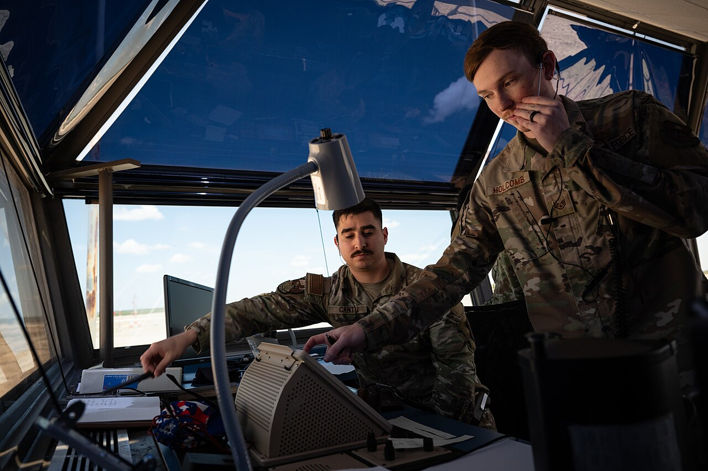

# Conflict & priority scenarios

*An air traffic controller doesn't refuse to land planes because two arrived at once - they sequence, communicate, and make a defensible call under pressure. A conflict-and-priority interview question checks for exactly that instinct, not for a work life where competing demands never happened.*

> "I've never really had a conflict at work" is the single answer that reads worst in this category - not
> because it's dishonest, but because it signals either very little real work experience or an inability
> to recognize conflict when it's actually happening. The question isn't fishing for drama; it's checking
> whether competing demands get navigated with judgment, or just avoided until someone else resolves them.

> **In real life**
>
> An air traffic controller regularly has two aircraft that both, in isolation, need to land now - and
> the job isn't to pretend that conflict away or panic, it's to sequence the two requests, communicate
> clearly with both pilots, and make a fast, defensible call based on real constraints like fuel and
> runway spacing. Nobody expects a controller's shift to have zero competing demands; they're evaluated
> entirely on how competing demands get resolved under real pressure. A conflict-and-priority interview
> question is checking for that same demonstrated judgment, not a work history free of competing demands.

**A conflict-and-priority scenario question**: A conflict-and-priority scenario question asks a candidate to describe a real situation involving competing demands - between people, deadlines, or limited resources - specifically to evaluate how they diagnosed what actually mattered most and communicated that judgment to others, not whether conflict occurred at all.

## Importance vs. urgency is the actual skill being checked

A weak answer treats every competing demand as equally urgent and either freezes or tackles whichever
arrived most recently. A strong answer explicitly separates importance from urgency - a request that
feels urgent (an angry stakeholder pinging repeatedly) isn't automatically the one that matters most (a
silent but severe production bug). Naming that distinction out loud, and explaining the actual reasoning
behind a prioritization call, is what separates a memorable answer from a generic one - interviewers
are listening specifically for the diagnostic reasoning, not just the final choice made.

## Communication is half the answer, not an afterthought

A candidate who correctly reprioritized work but never told the deprioritized stakeholder what happened
or why usually gets a weaker evaluation than one whose prioritization judgment was slightly less sharp
but who communicated the tradeoff clearly and proactively. Silently reprioritizing and letting someone
discover their request was dropped erodes trust regardless of whether the underlying call was correct -
a strong answer always includes the specific communication step: who was told, what was said, and how
the tradeoff was framed.

> **Tip**
>
> When describing a prioritization call, state the specific criteria used to decide, not just the
> decision itself - "I prioritized the security bug over the UI polish request because it affected data
> integrity for all users, versus a cosmetic issue for a small subset" is far stronger than "I decided
> the bug was more important."

> **Common mistake**
>
> Framing a conflict story around blaming a colleague or manager for poor prioritization or unclear
> direction. Even when genuinely true, this reads as a candidate who externalizes problems rather than
> navigates them - the strongest answers focus on the candidate's own reasoning and actions, regardless
> of how reasonable or unreasonable the surrounding situation actually was.


*Air traffic controllers, Laughlin Air Force Base — U.S. Air Force photo by Senior Airman Keira Rossman, Public domain, via Wikimedia Commons. [Source](https://commons.wikimedia.org/wiki/File:TSgt._Oscar_Cantu_and_SSgt._Stephen_Holcomb,_47th_OSS_air_traffic_controllers,_test_equipment_during_an_alternate_tower_control_simulation_at_the_North_Lariat_Runway_Supervisory_Unit_at_Laughlin_Air_Force_Base,_Texas.jpg)*
- **The controller on the headset, actively communicating** — Sequencing and explaining a decision out loud in real time - the communication half of handling competing demands, not just the internal judgment call.
- **Two controllers working the same console together** — Competing demands rarely get resolved in isolation - a strong answer names who else was involved in reaching or communicating the prioritization call.
- **Reference notes and checklists on the desk** — A defensible decision under pressure, grounded in something concrete rather than a gut call alone - the equivalent of naming specific criteria when explaining a prioritization decision in an interview.
- **The wide tower windows, watching multiple things at once** — The literal vantage point for tracking several competing demands simultaneously - visibility into everything at stake before making the call, not tunnel vision on whichever demand arrived most recently.

**Answering a conflict-and-priority question with real diagnostic reasoning**

1. **Name the competing demands specifically** — What exactly was in tension - not a vague 'things got busy,' but the two or more real, concrete requests.
2. **Separate urgency from actual importance** — State explicitly which felt more urgent versus which mattered more, and why those aren't automatically the same thing.
3. **State the specific criteria behind the call** — What concrete factor - risk, scope, reversibility - actually drove the decision, not just the decision itself.
4. **Describe the communication step explicitly** — Who was told about the tradeoff, what was said, and how - silently reprioritizing without this step weakens even a well-reasoned answer.

*Modeling an urgency-vs-importance prioritization call (Python)*

```python
requests = [
    {"name": "stakeholder repeatedly pinging about UI copy", "urgency": 9, "impact": 2},
    {"name": "silent but severe checkout total bug", "urgency": 3, "impact": 9},
    {"name": "minor test flakiness in CI", "urgency": 4, "impact": 4},
]

# Weighted toward actual impact, not just how loudly something is being asked for
for r in requests:
    score = r["impact"] * 2 + r["urgency"]
    r["priority_score"] = score

ranked = sorted(requests, key=lambda r: r["priority_score"], reverse=True)
print("Priority order (impact weighted over raw urgency):")
for r in ranked:
    print("  " + r["name"] + " -> score " + str(r["priority_score"]))
```

*Modeling an urgency-vs-importance prioritization call (Java)*

```java
import java.util.*;

public class Main {
    static class Request {
        String name; int urgency, impact, score;
        Request(String name, int urgency, int impact) {
            this.name = name; this.urgency = urgency; this.impact = impact;
            this.score = impact * 2 + urgency; // weighted toward actual impact
        }
    }

    public static void main(String[] args) {
        List<Request> requests = new ArrayList<>();
        requests.add(new Request("stakeholder repeatedly pinging about UI copy", 9, 2));
        requests.add(new Request("silent but severe checkout total bug", 3, 9));
        requests.add(new Request("minor test flakiness in CI", 4, 4));

        requests.sort((a, b) -> b.score - a.score);

        System.out.println("Priority order (impact weighted over raw urgency):");
        for (Request r : requests) {
            System.out.println("  " + r.name + " -> score " + r.score);
        }
    }
}
```

### Your first time: Draft one real conflict-and-priority answer

- [ ] Recall a real situation with two or more genuinely competing demands — Not a hypothetical - an actual moment where something had to give.
- [ ] Write down what made each demand feel urgent, separately from how important each one actually was — Confirm these two things are stated as genuinely distinct in your notes.
- [ ] Write the specific criteria that drove your actual decision — Risk, scope, reversibility, number of users affected - name the real factor, not just 'it felt right.'
- [ ] Write the communication step explicitly: who did you tell, and how — If this step is missing from the real memory, that's worth naming honestly as a lesson learned too.

- **A candidate's conflict story gets a lukewarm reaction despite a genuinely good prioritization decision.**
  The communication step is likely missing or vague - explicitly state who was told about the tradeoff, what was said, and when, not just the reasoning behind the decision itself.
- **An interviewer asks a pointed follow-up like 'but how did you decide which one actually mattered more?'**
  A sign the original answer conflated urgency and importance without separating them - restate the answer with the distinction made explicit, and name the specific criteria used.
- **A candidate says 'I've never really had a conflict at work' and the interview visibly cools.**
  Reframe the search - a conflict doesn't require open disagreement, just genuinely competing demands on time or attention, which almost every real job eventually produces.

### Where to check

- Any prepared conflict story, specifically for an explicit urgency-vs-importance distinction rather than treating all demands as equally pressing.
- The communication step in particular - confirm it's stated explicitly, not implied or omitted.
- [[interviews/behavioral-and-scenarios/star-stories]] for the structural format this kind of answer should be built in.
- [[interviews/behavioral-and-scenarios/questions-to-ask-them]] for how this same evaluative lens works in reverse, from the candidate's side.
- [[agile-and-devops-for-testers/scrum-and-kanban/backlog-and-stories]] for the underlying prioritization concepts a strong answer in this category often draws on.

### Worked example: a prioritization call that only became a strong answer once the communication step was added

1. A candidate's first draft of a conflict story: "A stakeholder wanted a UI text change urgently while
   I was mid-investigation on a checkout bug, so I finished the bug fix first because it was more
   important."
2. Practiced out loud, the answer feels thin - it states a decision but not the reasoning or what
   happened with the stakeholder who was waiting.
3. Rebuilt: "The UI text change felt urgent because of repeated pings, but the checkout bug affected
   order totals for all users - I judged it as clearly higher impact despite feeling less urgent in the
   moment."
4. Added explicitly: "I messaged the stakeholder directly, explained the checkout issue's scope, and
   gave them a specific time I'd get to their request - rather than silently deprioritizing it."
5. The rebuilt version demonstrates both diagnostic reasoning (urgency vs. impact, named explicitly) and
   the communication step that the first draft was missing entirely - exactly the two things this
   category of question is checking for.

**Quiz.** According to this note, what's the most common gap that weakens an otherwise well-reasoned conflict-and-priority answer?

- [ ] Not choosing the objectively 'correct' priority between the two competing demands
- [x] Omitting the explicit communication step - who was told about the tradeoff, what was said, and how - even when the underlying prioritization judgment itself was sound
- [ ] Making the story too short
- [ ] Focusing too much on the candidate's own reasoning instead of the team's

*A candidate who correctly reprioritized work but never explicitly described telling the deprioritized stakeholder what happened and why usually reads weaker than one whose prioritization judgment was slightly less sharp but who communicated the tradeoff clearly. Silently reprioritizing erodes trust regardless of whether the underlying call was correct - the communication step is half of what this question category is actually evaluating.*

- **A conflict-and-priority scenario question** — Asks a candidate to describe a real situation with competing demands, evaluating how they diagnosed what mattered most and communicated that judgment - not whether conflict occurred at all.
- **Urgency vs. importance** — A request that feels urgent (repeated pings) isn't automatically the one that matters most (a silent but severe bug) - naming this distinction explicitly is central to a strong answer.
- **Why the communication step matters as much as the decision** — Silently reprioritizing and letting someone discover their request was dropped erodes trust regardless of whether the underlying call was correct - state who was told, what was said, and how.
- **Why 'I've never had a conflict at work' is a weak answer** — It signals either limited real work experience or an inability to recognize competing demands when they occur - almost any real job eventually produces genuinely competing demands worth naming.

### Challenge

Recall one real moment where two work demands genuinely competed for your time. Write the answer explicitly separating urgency from importance, naming the specific deciding criteria, and stating exactly how you communicated the tradeoff to whoever was affected.

- [Indeed — 5 Common Interview Questions About Conflict (With Answers)](https://www.indeed.com/career-advice/interviewing/interview-questions-about-conflict)
- [Big Interview — Conflict-Resolution Interview Questions and Answers](https://resources.biginterview.com/behavioral-interviews/behavioral-interview-questions-conflict/)
- ["Tell me about a time you had to manage conflicting priorities" - How to answer](https://www.youtube.com/watch?v=fB5kbs8G9V8)

🎬 ['Tell me about a time you had to manage conflicting priorities' - How to answer interview question](https://www.youtube.com/watch?v=fB5kbs8G9V8) (5 min)

- This question checks how competing demands get navigated with judgment, not whether they ever occurred at all - 'I've never had a conflict' reads as a weak answer, not a clean one.
- Separate urgency from actual importance explicitly - the loudest request isn't automatically the one that matters most.
- State the specific criteria behind a prioritization call, not just the decision itself - risk, scope, and number of people affected are concrete, evaluable reasoning.
- The communication step is half the answer - silently reprioritizing without telling the deprioritized party erodes trust regardless of whether the call was correct.
- Avoid framing the story around blaming a colleague or manager - focus on your own reasoning and actions regardless of how the surrounding situation played out.


## Related notes

- [[Notes/interviews/behavioral-and-scenarios/star-stories|STAR stories]]
- [[Notes/interviews/behavioral-and-scenarios/questions-to-ask-them|Questions to ask them]]
- [[Notes/agile-and-devops-for-testers/scrum-and-kanban/backlog-and-stories|Backlog & stories]]


---
_Source: `packages/curriculum/content/notes/interviews/behavioral-and-scenarios/conflict-and-priority-scenarios.mdx`_
