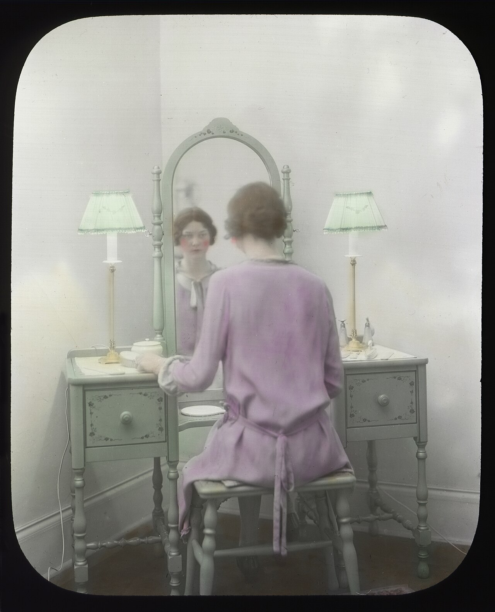

# Questions to ask them

*A mirror doesn't just show the other person what you look like - it's the moment you're expected to actually look back and notice something. "Do you have any questions for us?" is that same moment: not a courtesy formality, but the point where the evaluation runs both directions.*

> "No, I think you've covered everything" is a technically polite answer to "do you have any questions
> for us?" that quietly tells the interviewer a candidate hasn't actually been evaluating the role - only
> being evaluated by it. The question is a real invitation, not a formality to decline gracefully.

> **In real life**
>
> A mirror at a vanity table doesn't only show the other person what they look like from behind - the
> whole point of sitting in front of one is to look back into it yourself, deliberately, and actually
> notice something. Skip that moment and the mirror was pointless to sit in front of at all. The end of
> an interview works the same way: the previous forty-five minutes were about being observed, but the
> final few minutes exist specifically for the candidate to look back - to ask, notice, and evaluate in
> return, not just receive the moment politely and let it pass.

**Questions to ask them**: This portion of an interview is the candidate's structured opportunity to evaluate the role, team, and company directly - not a courtesy formality to decline, but a real, time-limited exchange where the questions asked signal genuine engagement and give the candidate real information for their own decision.

## The interview is genuinely two-way, and the questions asked prove it

An interview evaluates a candidate, but a candidate is also gathering real information to decide
whether to accept an eventual offer - both things are true at once, and the final questions segment is
where that second half becomes visible to the interviewer. A candidate who asks nothing signals either
no real engagement with the specifics of the role, or a passive stance toward a decision that should be
active on both sides. With realistically only two or three questions fitting in the time available,
each one is worth choosing deliberately rather than reaching for a generic list at the last second.

## The strongest questions are specific, not generic, and never about pay this early

"What's the culture like here?" is answerable from the careers page and asking it live wastes a scarce
slot. A stronger question references something specific from the actual conversation - a technology
mentioned, a challenge the interviewer described, the team's current priorities - proving the candidate
was actually listening, not just executing a memorized script. Compensation and benefits questions
belong later in the process, generally once an offer is in motion, not in this early exploratory
window - raising them here can read as prioritizing pay over genuinely understanding the role.

> **Tip**
>
> Prepare four or five candidate questions in advance, expecting two or three to get naturally answered
> during the conversation itself - arrive with more than enough so genuine ones remain even after some
> get pre-answered along the way.

> **Common mistake**
>
> Asking a question purely to look good rather than because the answer is actually wanted. Interviewers
> can often tell the difference between a performative question and a genuinely curious one - a slightly
> simpler question asked with real interest usually lands better than an elaborate one asked for effect.


*Woman at mirror, circa 1930s — Seattle Municipal Archives, CC BY 2.0, via Wikimedia Commons. [Source](https://commons.wikimedia.org/wiki/File:Woman_at_mirror,_circa_1930s.jpg)*
- **Her direct gaze into the mirror** — A deliberate act of looking back, not just being seen - exactly the posture the final interview segment calls for: actively evaluating in return, not passively receiving the moment.
- **The oval mirror frame itself** — A defined, time-limited window for this kind of reflection - just as the questions segment is a specific, bounded slot, not an open-ended part of the conversation.
- **The lamp on the left side** — One half of a symmetric pair - representing one direction of the interview's evaluation.
- **The matching lamp on the right side** — The other half of that same symmetric pair - the candidate's own evaluation of the role, mirroring the company's evaluation of the candidate, given equal weight in the room.

**Choosing and asking strong end-of-interview questions**

1. **Prepare 4-5 questions in advance, expecting some to get answered naturally** — Arrive over-prepared so genuinely unanswered questions remain even after the conversation covers some of them.
2. **Reference something specific from this actual conversation** — A technology, a challenge, a priority the interviewer mentioned - proving active listening, not a memorized script.
3. **Skip anything answerable from the careers page or a five-second search** — A generic question wastes one of only two or three real slots available.
4. **Save compensation and benefits for later in the process** — Once an offer is genuinely in motion - not this early exploratory window, where it can read as prioritizing pay over the role itself.

*Filtering candidate questions for specificity before an interview (Python)*

```python
GENERIC_PHRASES = ["culture like", "typical day", "tell me about the company", "work-life balance"]

candidate_questions = [
    "What's the culture like here?",
    "You mentioned the team is moving off a legacy test framework - what's driving that shift?",
    "What does success look like for this role at the 90-day mark?",
    "What's a typical day like?",
]

for q in candidate_questions:
    lower = q.lower()
    is_generic = any(phrase in lower for phrase in GENERIC_PHRASES)
    verdict = "GENERIC - answerable from the careers page, low value live" if is_generic \\
        else "SPECIFIC - references this conversation or role directly"
    print(q + " -> " + verdict)
```

*Filtering candidate questions for specificity before an interview (Java)*

```java
import java.util.*;

public class Main {
    public static void main(String[] args) {
        List<String> genericPhrases = Arrays.asList(
                "culture like", "typical day", "tell me about the company", "work-life balance");

        List<String> candidateQuestions = Arrays.asList(
                "What's the culture like here?",
                "You mentioned the team is moving off a legacy test framework - what's driving that shift?",
                "What does success look like for this role at the 90-day mark?",
                "What's a typical day like?"
        );

        for (String q : candidateQuestions) {
            String lower = q.toLowerCase();
            boolean isGeneric = genericPhrases.stream().anyMatch(lower::contains);
            String verdict = isGeneric
                    ? "GENERIC - answerable from the careers page, low value live"
                    : "SPECIFIC - references this conversation or role directly";
            System.out.println(q + " -> " + verdict);
        }
    }
}
```

### Your first time: Prepare a real set of end-of-interview questions

- [ ] Research the specific team or product before the interview — Something concrete enough to reference directly, not just the company in general.
- [ ] Draft 4-5 questions, checked against a generic-phrase filter — Cut anything answerable from the careers page in five seconds.
- [ ] Mark which ones are about role expectations vs. team dynamics vs. growth — Confirm the set isn't accidentally all one category.
- [ ] Practice asking two of them out loud, referencing something specific said earlier in a mock conversation — Confirm the question sounds like it grew from listening, not from a memorized list.

- **A candidate says 'no, I think you covered everything' when asked for questions.**
  Prepare questions in advance specifically so this never has to be a real answer - even one thoughtful, specific question left after the conversation is far stronger than none.
- **A prepared question gets a flat, one-word answer and the conversation stalls.**
  The question was likely too generic or already implicitly answered - reference something specific from the actual conversation instead of a rehearsed list item next time.
- **Asking about salary or benefits in an early screening call gets a noticeably cool response.**
  Save compensation questions for later in the process, once an offer is genuinely in motion - raising them in an early exploratory conversation can read as misprioritized.

### Where to check

- The prepared question list itself, checked against a generic-phrase filter before the interview.
- Any question actually asked live, confirmed to reference something specific from that conversation rather than a memorized script item.
- [[interviews/behavioral-and-scenarios/star-stories]] for the structured-answer half of the interview this question-asking moment complements.
- [[interviews/behavioral-and-scenarios/salary-conversations]] for why compensation questions specifically belong later in the process, not in this window.
- [[your-first-90-days/landing-well/onboarding-as-a-qa]] for the kind of role-expectation question that pays off well once actually in the seat.

### Worked example: a generic question rewritten into one that changed the conversation

1. A candidate's prepared list includes "What's the team culture like?" as a safe, standard closer.
2. Reviewing the job posting and the earlier conversation, they notice the interviewer mentioned the
   team was "still figuring out how automated tests fit into the release process."
3. They swap the generic question for: "You mentioned the team is still working out how automated tests
   fit into releases - what's the biggest blocker to that right now?"
4. The interviewer, visibly more engaged, gives a genuinely detailed answer about a legacy CI pipeline
   and internal disagreement about ownership - information the generic culture question would never have
   surfaced.
5. The candidate later cites this exact answer in their thank-you note, referencing the specific
   blocker - reinforcing that the question wasn't asked performatively but out of real interest in the
   actual problem.

**Quiz.** According to this note, why does asking no questions at the end of an interview read poorly, even if everything genuinely felt already covered?

- [ ] It's considered rude regardless of context
- [x] The interview is genuinely two-way - a candidate is also gathering information to decide on an eventual offer, and asking nothing signals either low engagement or a passive stance toward that decision
- [ ] Interviewers always have a hidden question prepared regardless of what was already discussed
- [ ] It suggests the candidate didn't research the company at all

*An interview evaluates the candidate, but the candidate is also actively gathering real information to decide whether to accept an eventual offer - that second half only becomes visible through the questions asked at the end. Asking nothing signals either that this evaluative half wasn't happening, or that the candidate is taking a passive stance toward a decision that should be active on both sides.*

- **Questions to ask them** — The candidate's structured opportunity to evaluate the role and company directly - a real, time-limited exchange, not a courtesy formality to decline.
- **Why generic questions waste a scarce slot** — With realistically only two or three questions fitting in the available time, a question answerable from the careers page adds no real information and signals low preparation.
- **Why compensation questions belong later in the process** — Raising pay in an early exploratory conversation can read as prioritizing salary over genuinely understanding the role - save it for once an offer is in motion.
- **What makes a question land as genuine rather than performative** — Referencing something specific from the actual conversation - proving active listening - rather than reaching for an elaborate question asked purely for effect.

### Challenge

Research a specific team or product detail for a real or hypothetical role. Draft 4-5 candidate questions, then cut any that are answerable from the careers page in five seconds.

- [Indeed — Good Questions To Ask at the End of an Interview](https://www.indeed.com/career-advice/interviewing/good-questions-to-ask-at-the-end-of-an-interview)
- [Leland — 20+ Best Questions to Ask at the End of an Interview](https://www.joinleland.com/library/a/best-questions-to-ask-at-the-end-of-an-interview)
- [38 Smart Questions to Ask in a Job Interview: The Harvard Business Review Guide](https://www.youtube.com/watch?v=jzqOLoorgOs)

🎬 [38 Smart Questions to Ask in a Job Interview: The Harvard Business Review Guide](https://www.youtube.com/watch?v=jzqOLoorgOs) (9 min)

- An interview evaluates both directions - the final questions segment is where the candidate's own evaluation of the role becomes visible.
- Prepare 4-5 questions expecting some to be naturally answered, so genuinely unanswered ones remain by the end.
- Specific questions referencing the actual conversation land far better than generic ones answerable from a careers page.
- Save compensation and benefits questions for later in the process, once an offer is genuinely in motion.
- Ask because the answer is genuinely wanted, not to look good - interviewers can often tell the difference.


## Related notes

- [[Notes/interviews/behavioral-and-scenarios/star-stories|STAR stories]]
- [[Notes/interviews/behavioral-and-scenarios/salary-conversations|Salary conversations]]
- [[Notes/your-first-90-days/landing-well/onboarding-as-a-qa|Onboarding as a QA]]


---
_Source: `packages/curriculum/content/notes/interviews/behavioral-and-scenarios/questions-to-ask-them.mdx`_
