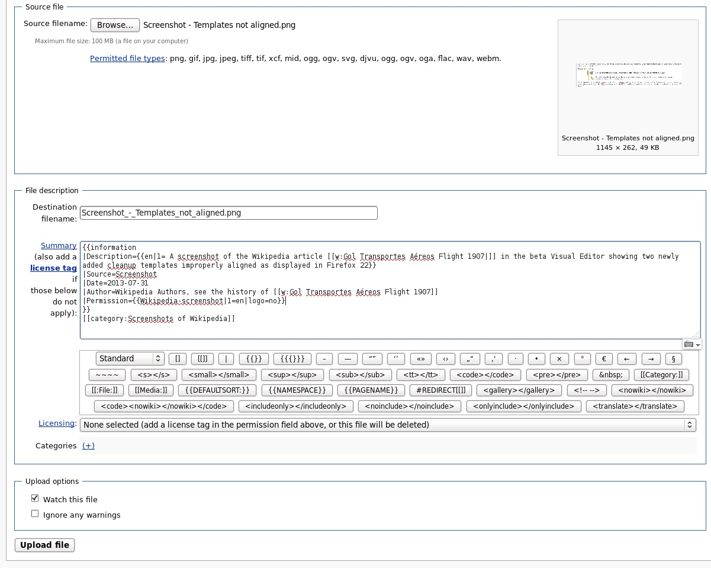

# Test-design exercises

*Handed a form field on the spot and asked to derive equivalence classes and boundary values live - the thinking process to narrate out loud, not a memorized answer to recite.*

> An interviewer slides a login form, or just names one field - "our signup form has an age field, valid
> from 18 to 65" - and says "walk me through how you'd test this." There is no answer key to recall,
> because the exercise was never about a memorized answer. It's about whether you can apply equivalence
> partitioning and boundary value analysis live, out loud, to a field you have never seen before, while
> someone watches you think.

> **In real life**
>
> A paramedic arriving at a scene never waits to read a patient's full history before doing anything - they
> run the same handful of rapid checks on every single patient, on the spot, regardless of how unfamiliar
> the situation looks: airway, breathing, circulation, then work outward from there. Nobody hands them a
> chart first. The value they bring is not memorized trivia about one specific condition - it is a
> practiced, repeatable process applied instantly to whatever shows up. A test-design exercise asks for
> exactly that kind of readiness: not a memorized answer about one specific field you happened to study,
> but the same repeatable process - name the classes, find the edges - applied instantly to a field you
> have never seen before.

**test-design exercise**: A test-design exercise is a live, on-the-spot interview task where a candidate is handed a field, form, or short spec and asked to derive equivalence classes and boundary values aloud, narrating the reasoning rather than presenting a rehearsed answer. It evaluates process over product: an interviewer values a candidate who says a wrong boundary out loud and self-corrects far more than one who stays silent until confident.

## The five-step process to narrate, every time

1. **State the field's declared rule first.** "Age, valid range 18 to 65" - say it back so the
   interviewer knows you have the right constraint before you touch it.
2. **Name the equivalence classes out loud.** One valid class (18 through 65), and at least two invalid
   classes (below 18, above 65). If the field also accepts letters or blanks, that's a third invalid
   class - non-numeric input - worth naming even if the interviewer only mentioned numbers.
3. **Derive the boundary values from the classes, not from guessing.** The interesting values sit at
   the edges: one below the minimum, the minimum itself, one above the minimum, one below the maximum,
   the maximum itself, one above the maximum. Say each one and which class it falls into as you go.
4. **Ask about the class you were not told.** Real fields have edge cases nobody states up front -
   what happens with a negative number, a decimal like 18.5, or an empty field? Asking this unprompted
   is one of the strongest signals in the whole exercise.
5. **Narrate priority, not just completeness.** Given limited time, which two or three of these values
   would you actually run first, and why? This shows you can operate under the exact time pressure the
   interview itself is simulating.

> **Tip**
>
> Talk while you think, even before you have the final answer. "So the valid class is 18 through 65,
> which means my boundaries are 17, 18, 19, then 64, 65, 66 - let me also check whether zero or a
> negative age is even reachable in this UI" is a stronger answer, mid-sentence, than a long silence
> followed by a perfect list. Interviewers are grading the process, and a silent candidate gives them
> nothing to grade until the very end.

> **Common mistake**
>
> Jumping straight to boundary numbers without stating the equivalence classes first. Boundaries only
> mean something in relation to a class - "test 17, 18, 19" sounds like a guess without "the valid class
> is 18 to 65, so its edges are 17, 18, 19." Skipping the class step also makes it much harder to catch a
> class the interviewer didn't mention, like non-numeric input, because there was never an explicit list
> of classes to check for gaps in.


*Commons basic upload form with example screenshot - Wikimedia Commons, CC BY-SA 4.0. [Source](https://commons.wikimedia.org/wiki/File:Commons_basic_upload_form_July_2013_with_example_of_Wikipedia_screenshot.png)*
- **Destination filename - a required text field** — Equivalence classes: empty (invalid), a normal filename (valid), an extremely long filename, and a filename with characters the destination system forbids. The boundary questions write themselves once the classes are named.
- **The description textarea - a free-text field with no visible limit** — When a field looks unbounded, the interview move is to ask about the bound rather than assume none exists: is there a maximum character count, and what happens exactly at it?
- **The licensing dropdown - a mandatory single choice** — A dropdown's equivalence classes are discrete, not continuous: each option is its own class, plus one more class for the unselected default state, which is often the real invalid case a form like this needs to reject on submit.
- **The source file control - present or absent** — A file-upload control has a boundary condition with no numbers in it at all: no file chosen. Boundary thinking is not only about numeric edges - it is about the edge of any input's valid presence.

**One field, from the interviewer's prompt to a prioritized test list**

1. **The prompt lands** — "Here's an age field, valid 18 to 65. Walk me through testing it." No further detail is given on purpose.
2. **State the rule back, then the classes** — One valid class (18-65) and at least two invalid classes (below 18, above 65) - said out loud before any numbers appear.
3. **Derive the boundaries from the classes** — 17, 18, 19 at the low edge; 64, 65, 66 at the high edge - each one named with the class it belongs to.
4. **Ask about the unstated edge cases** — What about a negative number, a decimal, or an empty field? Asking this unprompted is the strongest single signal in the exercise.
5. **Prioritize under the interview's own time pressure** — Given three minutes, name the two or three values that matter most first - showing judgment, not just a complete list.

Here is the exact reasoning turned into a small, runnable generator for one sample field - the same
shape you would narrate out loud, just executable:

*Run it - generate equivalence classes and boundary values for a field (Python)*

```python
def equivalence_classes(min_valid, max_valid):
    return [
        ("invalid_low", f"< {min_valid}"),
        ("valid", f"{min_valid}..{max_valid}"),
        ("invalid_high", f"> {max_valid}"),
    ]

def boundary_values(min_valid, max_valid):
    return [min_valid - 1, min_valid, min_valid + 1, max_valid - 1, max_valid, max_valid + 1]

field_name = "age"
min_valid, max_valid = 18, 65

print(f"Field: {field_name}, valid range {min_valid}..{max_valid}")
print("Equivalence classes:")
for name, rule in equivalence_classes(min_valid, max_valid):
    print(f"  {name}: {rule}")

print("Boundary values to test:")
for v in boundary_values(min_valid, max_valid):
    verdict = "valid" if min_valid <= v <= max_valid else "invalid"
    print(f"  {v} -> {verdict}")
```

Same generator in Java - swap in any field's own min and max, at your desk or live in an interview, and
it produces the same narratable list:

*Run it - generate equivalence classes and boundary values for a field (Java)*

```java
import java.util.*;

public class Main {
    public static void main(String[] args) {
        String fieldName = "age";
        int minValid = 18, maxValid = 65;

        System.out.println("Field: " + fieldName + ", valid range " + minValid + ".." + maxValid);
        System.out.println("Equivalence classes:");
        System.out.println("  invalid_low: < " + minValid);
        System.out.println("  valid: " + minValid + ".." + maxValid);
        System.out.println("  invalid_high: > " + maxValid);

        System.out.println("Boundary values to test:");
        int[] values = {minValid - 1, minValid, minValid + 1, maxValid - 1, maxValid, maxValid + 1};
        for (int v : values) {
            String verdict = (v >= minValid && v <= maxValid) ? "valid" : "invalid";
            System.out.println("  " + v + " -> " + verdict);
        }
    }
}
```

### Your first time: Your mission: run the live exercise on three fields you did not choose

- [ ] Ask someone to name three real fields from apps you both know — A signup age field, a discount-code text box, a quantity-in-cart number stepper - anything with a stated or discoverable rule.
- [ ] For each, narrate the five-step process out loud before writing anything down — State the rule, name the classes, derive the boundaries, ask the unstated edge case, then prioritize.
- [ ] Time yourself at three minutes per field — Real interviews rarely give more - the goal is fluency under the same time pressure, not a leisurely written analysis.
- [ ] Run the Python playground with each field's own numbers — Swap in the real min and max and confirm the generated boundary list matches exactly what you said out loud.
- [ ] Ask your practice partner what you forgot — A second person almost always spots one class or one edge case you skipped - that gap is exactly what a real interviewer's follow-up would target.

You now have the process rehearsed on fields you did not design yourself, which is the only realistic
rehearsal for an interview exercise built to hand you exactly that.

- **You freeze because the interviewer's field has no stated rule at all - just a blank text box.**
  Ask what the field is for before testing it - a name field, a search box, and a password field all imply very different equivalence classes even with identical UI. Asking a clarifying question before designing tests is itself part of the exercise, not a stall.
- **You name boundary values but cannot explain why those specific numbers matter.**
  Re-anchor to the classes: every boundary value exists because it sits exactly one unit inside or outside a named class. If you cannot say which class a number came from, it was a guess, not boundary analysis - go back one step.
- **The interviewer asks 'what if the spec is wrong about the range' and you have no answer.**
  This is testing whether you conflate 'matches spec' with 'is correct' - the same verification-vs-validation distinction from the classic questions. Say so directly: confirming the field enforces 18-65 is verification; confirming 18-65 is actually the right business rule is a separate validation question worth raising.

### Where to check

- [[test-design-techniques/equivalence-partitioning/picking-representatives]] and [[test-design-techniques/boundary-value-analysis/why-edges-fail]] for the underlying techniques this exercise draws on directly.
- A handful of real forms on sites you use daily - age fields, quantity steppers, discount codes - as free, ungraded practice material.
- [[interviews/manual-qa-questions/test-this-pen-scenarios]] for the sibling exercise that applies the same on-the-spot thinking to a physical object instead of a form field.
- Recordings of your own practice runs, timed at three minutes per field, to check whether the five-step process is becoming fluent or still feels rehearsed.

### Worked example: handed a discount-code field with no stated rule at all

1. The interviewer says only: "Here's a discount-code text field at checkout. Test it." No format, no
   length, no rule is given.
2. The candidate asks first: "Is there a known format - fixed length, letters and numbers, case
   sensitive?" The interviewer says: "Assume it's 6 to 10 alphanumeric characters, case-insensitive."
3. Classes are named aloud: valid (6-10 alphanumeric characters), invalid-too-short (under 6), invalid-too-long
   (over 10), invalid-characters (symbols or spaces), and one more the candidate adds unprompted -
   a valid-length code that simply does not exist in the system.
4. Boundaries follow directly: 5 and 6 characters at the low edge, 10 and 11 at the high edge, plus one
   exactly-6 and one exactly-10 real-looking code to confirm both ends actually work, not just reject.
5. Priority, under time pressure: "If I only had time for three, I'd run a valid real code, a
   too-short one, and a nonexistent-but-correctly-formatted one - that covers the happy path, an
   obvious reject, and the case most likely to reveal a backend gap instead of a UI validation gap."
6. The interviewer follows up: "What if the code is valid but expired?" The candidate adds a sixth
   class on the spot - valid format, exists, but expired - and reasons about it out loud rather than
   pretending the first five classes were already complete.
7. Nothing here required a memorized answer. Every step was the same five-step process, applied live,
   narrated the whole way through - which is exactly what the exercise was built to measure.

**Quiz.** An interviewer hands you a field with a stated valid range and asks you to test it. What should you say or do first, before naming any specific numbers?

- [ ] Immediately list several numbers you'd try, to show speed
- [x] State the field's rule back and name its equivalence classes - the valid class and at least the invalid classes on both sides - before deriving any specific boundary values
- [ ] Ask the interviewer to just tell you the expected test cases
- [ ] Write a full test plan silently and present it only once finished

*Boundary values only carry meaning in relation to a named class - jumping straight to numbers looks like guessing even when the numbers happen to be correct. Stating the rule back confirms you understood the constraint, and naming classes first (valid, invalid-low, invalid-high, and any non-numeric or empty class) gives you and the interviewer a shared structure that boundary values then attach to. Option one skips the reasoning step the exercise is designed to observe. Option three defeats the entire purpose of a live exercise. Option four removes the narration that is the actual point - a silent, complete answer at the end gives the interviewer nothing to evaluate along the way.*

- **The five-step test-design exercise process** — State the rule back, name the equivalence classes, derive boundary values from those classes, ask about the unstated edge case, then prioritize under time pressure.
- **Why narrate instead of going silent** — The exercise evaluates process, not just a final answer - a candidate who thinks out loud and self-corrects shows more than one who stays silent until certain.
- **Where boundary values actually come from** — One unit inside and one unit outside each class edge - never guessed independently of a named class.
- **The strongest unprompted move in the exercise** — Asking about a class the interviewer never mentioned - negative numbers, decimals, empty input, or an expired-but-valid-format case.
- **Verification vs validation inside a test-design exercise** — Confirming a field enforces its stated rule is verification. Asking whether that stated rule is actually the right business rule is validation - raising this distinction unprompted is a strong signal.
- **How to handle a field with no stated rule at all** — Ask what the field is for and what format is expected before deriving classes - a clarifying question up front is part of the exercise, not a delay.

### Challenge

Pick a real field from an app you use (a phone number field, a password field, or a date picker all
work well) and run the full five-step process on it out loud, timed at three minutes, without looking
anything up first. Then open the Python playground, set `min_valid` and `max_valid` to match your
field's real numeric rule if it has one, and confirm the generated boundary list matches what you said.
If your field is not numeric, write out its equivalence classes by hand instead and check each one
against the five-step list for a class you might have skipped.

### Ask the community

> I was handed this field in a test-design exercise: `[describe the field and its stated rule, or say none was given]`. Here's the class and boundary list I came up with: `[your list]`. What class or edge case do you think I missed, and what follow-up question would you have asked me?

Posting your actual class list, not just the field description, gets you a real second opinion on
exactly the kind of gap an interviewer's follow-up question would have targeted.

- [Guru99 - equivalence partitioning and boundary value analysis with worked examples](https://www.guru99.com/equivalence-partitioning-boundary-value-analysis.html)
- [Ministry of Testing - equivalence partitioning lesson](https://www.ministryoftesting.com/dojo/lessons/equivalence-partitioning)
- [Boundary Value Analysis and Equivalence Partitioning: Software Testing Tutorial](https://www.youtube.com/watch?v=P1Hv2sUPKeM)

🎬 [Boundary Value Analysis and Equivalence Partitioning: Software Testing Tutorial](https://www.youtube.com/watch?v=P1Hv2sUPKeM) (3 min)

- A test-design exercise evaluates the live process - stating the rule, naming classes, deriving boundaries, asking unstated edge cases, prioritizing - not a memorized final answer.
- Boundary values only mean something attached to a named equivalence class; deriving numbers without classes first looks like guessing.
- The strongest unprompted move is asking about a class the interviewer never mentioned - negative numbers, decimals, empty input, or an expired-but-valid case.
- Practicing on fields you did not choose, under real time pressure, is the only rehearsal that transfers to the actual interview.


## Related notes

- [[Notes/interviews/manual-qa-questions/classic-questions-and-answers|Classic questions & answers]]
- [[Notes/interviews/manual-qa-questions/test-this-pen-scenarios|Test this pen scenarios]]
- [[Notes/interviews/manual-qa-questions/talking-through-bugs|Talking through bugs]]


---
_Source: `packages/curriculum/content/notes/interviews/manual-qa-questions/test-design-exercises.mdx`_
