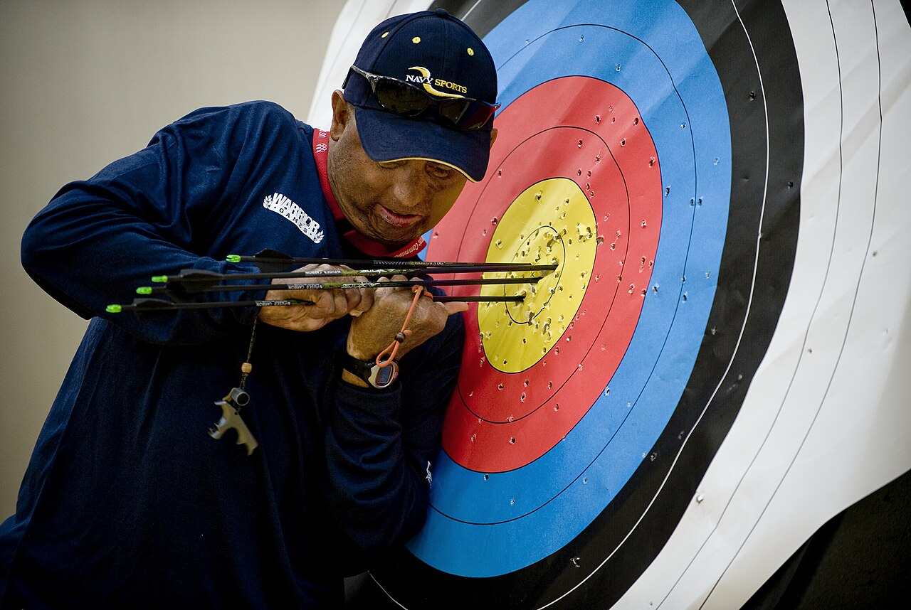

# Handling rejection

*At the Warrior Games, an archer pulling arrows from a target doesn't stop competing because some landed outside the ring - the miss is information, retrieved and used for the next shot. Job rejection asks for exactly that same instinct: retrieve what's useful, then draw again.*

> Ten to twenty rejections before an offer is a genuinely normal range for most job searches, not a sign
> that something is fundamentally wrong with a candidate. Treating each individual rejection as proof of
> personal failure, rather than an expected part of a process with real odds, turns a normal search into
> an unnecessarily exhausting one.

> **In real life**
>
> An archer at a competition pulls their arrows from the target after every round, whether they landed
> dead center or well outside the scoring rings - the miss isn't treated as a reason to stop shooting,
> it's information retrieved and folded into the next attempt. Nobody expects every arrow to land in the
> yellow, and a competitor who quit after one shot outside the rings would never get anywhere near their
> actual skill level. A job rejection works the same way: not proof the whole effort was wrong, just one
> outcome to retrieve information from - if any is available - before drawing the next arrow.

**Handling rejection**: Handling rejection, in a job search, means processing a real emotional reaction to a specific setback without letting it either compound into avoidance of future attempts or get treated as definitive proof of personal inadequacy - then extracting whatever real, specific information is available before moving to the next application or interview.

## The feeling is real and deserves a bounded amount of room

Pretending a rejection doesn't sting, especially after real investment of time and hope in a specific
role, usually just delays the reaction rather than avoiding it. Giving the disappointment genuine but
bounded space - long enough to actually feel it, short enough not to stall the broader search - tends
to work better than either suppressing it entirely or letting it stretch indefinitely. A rough
guideline some career advisors suggest is capping deliberate processing time at around 48 hours before
deliberately shifting attention back toward the next step, not because the feeling has to be fully
resolved by then, but because momentum matters for a search that usually needs more than one attempt.

## Rejection reflects a specific, narrow decision, not a global verdict

A rejection almost always reflects one specific comparison against other candidates for one specific
role at one specific moment - a strong candidate can lose to someone with a slightly closer skill match,
a different budget got approved for a different level, an internal candidate existed the whole time.
None of that is visible from outside, and treating a single rejection as a broad verdict on overall
worth or ability reads far more into a narrow decision than it can actually support. Where possible,
asking directly for specific feedback - which not every employer will give, but some will - turns a
vague rejection into an actual, usable signal rather than a closed door with no information behind it.

> **Tip**
>
> Keep a simple running log of applications, interview stages reached, and any feedback received (see
> [[resume-and-applications/applying-smart/tracking-applications]]). A pattern across several rejections
> - always stalling at the same interview stage, for instance - is far more useful signal than any single
> rejection considered on its own.

> **Common mistake**
>
> Letting one rejection quietly reduce effort on the next application - a slightly weaker resume tailor,
> a skipped round of interview prep, on the unstated assumption that trying less protects against
> disappointment. This usually just increases the odds of another rejection, compounding the very feeling
> it was meant to avoid.


*Warrior Games archery practice — U.S. Navy photo by Mass Communication Specialist 1st Class R. Jason Brunson, Public domain, via Wikimedia Commons. [Source](https://commons.wikimedia.org/wiki/File:US_Navy_100511-N-6932B-157_Chief_Electricians_Mate_Peter_Allen_Johns_retrieves_his_arrows_while_practicing_for_the_archery_competition_at_the_inaugural_Warrior_Games_in_Colorado_Springs,_Colo.jpg)*
- **The tight cluster of arrows near the center** — Real hits, real evidence of skill - proof the whole effort isn't misplaced, sitting right alongside the misses on the same target.
- **Arrows scattered in the outer rings** — Real misses too - not hidden or discarded, just part of the same round. A rejection sits exactly here: one real outcome among others, not the only data point that counts.
- **The athlete's focused expression, already retrieving** — Already moving to the next step, not lingering on any single arrow. Handling rejection well means giving it real but bounded attention before returning focus to the next attempt.
- **The 'WARRIOR GAMES' text on his sleeve** — A competition specifically for wounded, ill, or injured service members - competing again after real setbacks is the entire premise, not an unusual exception to it.

**Processing one real rejection without stalling the search**

1. **Let the disappointment be real, for a bounded amount of time** — Not suppressed, not indefinite - genuine but time-boxed space to actually feel it.
2. **Ask for specific feedback where it's realistically available** — Not guaranteed, but worth a direct, low-pressure ask - turns a vague no into usable signal when it works.
3. **Log the outcome and any pattern across other recent rejections** — A single rejection is noise; a repeated pattern across several is real signal worth acting on.
4. **Return full effort to the next attempt, not a reduced version of it** — Resist the quiet instinct to try less as protection against another disappointment.

*Spotting a real pattern across multiple rejections, not just noise (Python)*

```python
rejections = [
    {"role": "QA Engineer A", "stage_reached": "technical_round"},
    {"role": "QA Engineer B", "stage_reached": "technical_round"},
    {"role": "SDET C", "stage_reached": "recruiter_screen"},
    {"role": "QA Engineer D", "stage_reached": "technical_round"},
]

from collections import Counter
stage_counts = Counter(r["stage_reached"] for r in rejections)

print("Rejection stage breakdown:")
for stage, count in stage_counts.items():
    print("  " + stage + ": " + str(count))

most_common_stage, most_common_count = stage_counts.most_common(1)[0]
if most_common_count >= len(rejections) / 2:
    print("PATTERN: consistently stalling at '" + most_common_stage +
          "' - worth targeted prep specifically for that stage")
else:
    print("No strong single-stage pattern yet - keep logging")
```

*Spotting a real pattern across multiple rejections, not just noise (Java)*

```java
import java.util.*;

public class Main {
    static class Rejection {
        String role, stageReached;
        Rejection(String role, String stageReached) {
            this.role = role; this.stageReached = stageReached;
        }
    }

    public static void main(String[] args) {
        List<Rejection> rejections = new ArrayList<>();
        rejections.add(new Rejection("QA Engineer A", "technical_round"));
        rejections.add(new Rejection("QA Engineer B", "technical_round"));
        rejections.add(new Rejection("SDET C", "recruiter_screen"));
        rejections.add(new Rejection("QA Engineer D", "technical_round"));

        Map<String, Integer> stageCounts = new LinkedHashMap<>();
        for (Rejection r : rejections) {
            stageCounts.merge(r.stageReached, 1, Integer::sum);
        }

        System.out.println("Rejection stage breakdown:");
        for (Map.Entry<String, Integer> e : stageCounts.entrySet()) {
            System.out.println("  " + e.getKey() + ": " + e.getValue());
        }

        String topStage = null; int topCount = 0;
        for (Map.Entry<String, Integer> e : stageCounts.entrySet()) {
            if (e.getValue() > topCount) { topCount = e.getValue(); topStage = e.getKey(); }
        }

        if (topCount >= rejections.size() / 2.0) {
            System.out.println("PATTERN: consistently stalling at '" + topStage +
                    "' - worth targeted prep specifically for that stage");
        } else {
            System.out.println("No strong single-stage pattern yet - keep logging");
        }
    }
}
```

### Your first time: Build a simple rejection log

- [ ] List every application from the last month with its current status — Applied, screening, technical round, rejected, offer - whatever stage each one actually reached.
- [ ] For each rejection, note the furthest stage reached — Even a rough note is enough to start spotting a pattern.
- [ ] Note any specific feedback received, verbatim if possible — Even one sentence of real feedback is more useful than none.
- [ ] Review the log after every third or fourth rejection for a repeating pattern — A single stalling point across several attempts is worth targeted preparation; one-off rejections usually aren't.

- **Motivation to apply to new roles drops sharply after a rejection for a role that felt like a strong fit.**
  Give the disappointment real but bounded space - a day or two - rather than either suppressing it or letting it stall the search indefinitely; then deliberately return to the next application.
- **A pattern of always reaching the same interview stage and no further goes unnoticed across several rejections.**
  Start a simple log noting the furthest stage reached each time - a single rejection is noise, but a repeated stalling point across several is real, actionable signal.
- **Effort quietly decreases on later applications after a string of rejections - less tailoring, less prep.**
  Name this pattern directly if it's happening - reduced effort as unconscious self-protection usually just increases the odds of continued rejection, compounding the original feeling.

### Where to check

- Recent rejections, logged with the furthest stage reached, checked for a repeating pattern rather than judged individually.
- Effort level on the most recent application compared honestly against earlier ones, watching for a quiet, unconscious decline.
- [[interviews/mock-practice/feedback-loops]] for treating rejection feedback as one more input into an active, improving cycle rather than a dead end.
- [[resume-and-applications/applying-smart/tracking-applications]] for the tracking system a rejection pattern actually depends on being visible in.
- [[your-first-90-days/working-solo-the-mentor-gap/using-the-community]] for a real outside source of perspective and feedback when working through a string of rejections solo.

### Worked example: a string of rejections that became useful once actually logged

1. A candidate receives four rejections in three weeks for roles that each felt like a reasonably strong
   fit on paper, and starts to genuinely doubt whether the whole job search approach is working.
2. Reviewing each rejection individually offers no clear signal - different companies, different teams,
   no obvious single reason.
3. Logging all four with the specific stage reached reveals something not visible from any single
   rejection alone: all four stalled at the technical round, never earlier and never later.
4. This reframes the situation entirely - not a broad problem with the resume or the overall search, but
   a specific, addressable gap in technical round performance.
5. The next two weeks focus specifically on technical round mock interviews (see
   [[interviews/mock-practice/mock-interview-drills]]) rather than continuing to revise the resume, which
   the pattern had shown wasn't actually the bottleneck.

**Quiz.** According to this note, why is treating a single rejection as a broad verdict on personal worth or ability considered a mistake?

- [ ] Because rejections never carry any real information worth learning from
- [x] Because a rejection almost always reflects one specific, narrow comparison at one moment - factors invisible from outside, like a closer skill match or an internal candidate - which a single outcome can't support generalizing from
- [ ] Because most rejections are simply administrative errors rather than real decisions
- [ ] Because rejection only matters for candidates early in their career, not experienced ones

*A rejection reflects a narrow, specific comparison against other candidates for one specific role at one specific moment - factors like a slightly closer skill match, a different approved budget level, or an internal candidate that were never visible from outside. Reading a single rejection as a global verdict on overall worth or ability extends far more meaning from that narrow decision than it can actually support.*

- **Handling rejection (job search)** — Processing a real emotional reaction to a specific setback without letting it compound into avoidance or feel like proof of inadequacy, then extracting whatever real information is available before the next attempt.
- **Why bounded emotional processing works better than suppression or indefinite dwelling** — Genuine but time-boxed space to feel disappointment tends to work better than either pretending it doesn't sting or letting it stall the broader search indefinitely.
- **Why a single rejection is weak signal but a pattern across several is strong signal** — One rejection reflects one narrow comparison with invisible factors; a repeated stalling point across multiple rejections - like always stopping at the same interview stage - is real, actionable evidence.
- **Why quietly reducing effort after a rejection backfires** — Trying less as unconscious self-protection against future disappointment usually just increases the odds of another rejection, compounding the exact feeling it was meant to avoid.

### Challenge

Log your last three to five job application outcomes with the furthest stage each one reached. Look honestly for a repeating pattern rather than judging any single rejection in isolation.

- [Harvard Business Review — How to Bounce Back from Rejection](https://hbr.org/2020/03/how-to-bounce-back-from-rejection)
- [ECLARO — When the Answer Is No: 6 Tips for Bouncing Back from Job Rejection](https://www.eclaro.com/blog/when-the-answer-is-no-6-tips-for-bouncing-back-from-job-rejection)
- [How To Deal With A Job Rejection (5 Steps)](https://www.youtube.com/watch?v=nQFc3Rir3Ls)

🎬 [How To Deal With A Job Rejection (5 Steps)](https://www.youtube.com/watch?v=nQFc3Rir3Ls) (7 min)

- Ten to twenty rejections before an offer is a genuinely normal range - one rejection is not proof the whole approach is wrong.
- Give real disappointment bounded space to be felt, rather than suppressing it or letting it stall the broader search indefinitely.
- A rejection reflects one narrow, specific comparison with factors invisible from outside - not a broad verdict on overall worth or ability.
- Log outcomes and the furthest stage reached - a pattern across several rejections is real signal; any single one mostly isn't.
- Resist quietly reducing effort on the next application as self-protection - it usually just increases the odds of another rejection.


## Related notes

- [[Notes/interviews/mock-practice/feedback-loops|Feedback loops]]
- [[Notes/resume-and-applications/applying-smart/tracking-applications|Tracking applications]]
- [[Notes/your-first-90-days/working-solo-the-mentor-gap/using-the-community|Using the community]]


---
_Source: `packages/curriculum/content/notes/interviews/mock-practice/handling-rejection.mdx`_
