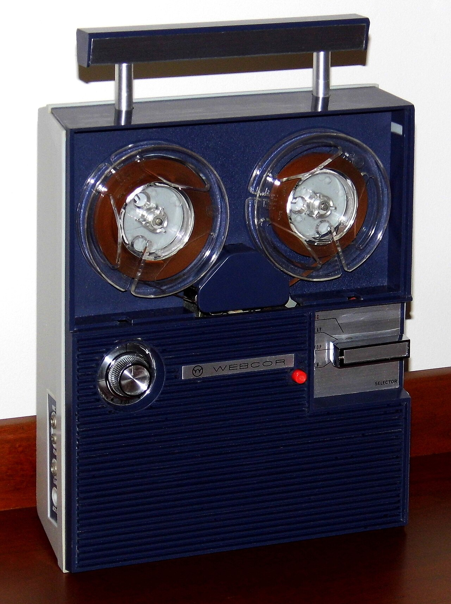

# Recording yourself

*A reel-to-reel recorder captures a voice exactly as it sounded, filler words and all, with no memory to soften it afterward. Recording a practice answer does the same thing to a spoken interview answer - and the discomfort of hearing it back is exactly where the useful information lives.*

> An answer that felt smooth and confident while speaking it often sounds noticeably different played
> back - more "um"s than remembered, a pace that rushes right when the point mattered most, a story that
> trails off before reaching the actual result. Memory of how an answer felt while giving it is
> unreliable in exactly the ways a recording isn't.

> **In real life**
>
> A reel-to-reel tape recorder captures a voice exactly as it sounded in the room - every hesitation,
> every filler word, the actual pace and tone - with nothing added or softened afterward by memory. A
> person recalling their own speech from memory tends to remember the polished intention behind it, not
> the messier reality that actually came out. Playing the tape back is the only way to hear what was
> genuinely said, not what was meant to be said. Recording a practice interview answer works exactly the
> same way - it's the only reliable way to hear the answer as an interviewer would have actually heard it.

**Recording yourself**: Recording yourself, in interview preparation, means capturing a practice answer on video or audio specifically to review it afterward with real distance - since a candidate's in-the-moment sense of how an answer sounded is consistently less reliable than what the recording actually reveals.

## What to actually listen and watch for on review

A useful review isn't a vague "did that feel okay" pass - it targets specific, nameable things: filler
word frequency ("um," "like," "so" used as a crutch between thoughts), whether the pace rushes exactly
at the part that mattered most (often the Result of a STAR story), eye contact with the camera rather
than the screen, and whether the answer's structure is actually followable by someone hearing it for
the first time with no prior context. Writing down specific counts or timestamps - "said 'um' eleven
times in a two-minute answer," "rushed the last fifteen seconds" - turns a vague impression into
something concrete enough to actually work on before the next attempt.

## The discomfort is expected, and it fades with repetition

Watching or listening to a recording of oneself is close to universally uncomfortable the first several
times - an unfamiliar, slightly alien experience of hearing a voice or seeing mannerisms from the
outside rather than the inside. That discomfort is not a sign something is being done wrong; it fades
measurably with repeated exposure, and the specific, concrete feedback available only through a
recording is worth pushing through it for. Skipping this step because it feels awkward trades away the
single most reliable source of real information about how an answer actually lands.

> **Tip**
>
> Rate each recorded answer on a simple 1-5 scale across two or three specific categories - pacing,
> filler words, answer structure - rather than a single vague overall impression. A numeric trend across
> several recordings makes real improvement, or a persistent stuck point, immediately visible.

> **Common mistake**
>
> Recording a session and never actually watching or listening back to it. The recording itself does
> nothing on its own - the entire value comes from the review that follows it, ideally with specific
> notes taken, not just a passive watch-through with a general sense of "that seemed fine."


*Vintage Webcor reel-to-reel tape recorder — Joe Haupt, CC BY-SA 2.0, via Wikimedia Commons. [Source](https://commons.wikimedia.org/wiki/File:Vintage_Webcor_Portable_Reel-To-Reel_Tape_Recorder,_Model_No._620,_5_Transistors,_Made_In_Japan,_Circa_1968_(26724661419).jpg)*
- **The left reel, holding what's already been recorded** — A voice captured exactly as it sounded, with nothing added or softened by memory afterward - the same unfiltered record a video or audio recording of a practice answer preserves.
- **The right reel, taking up the tape as it plays** — Playback in motion - the review step itself. A recording with no playback captures nothing useful; the value lives entirely in actually listening back.
- **The red REC button** — A single deliberate action that starts the capture - the same deliberate choice to record a practice answer rather than trust memory of how it felt while speaking.
- **The SELECTOR switch beside it** — A choice between distinct modes - record, play, stop - the same deliberate structure a good review process needs: record first, then a separate, focused playback pass.

**Turning a recorded practice answer into real improvement**

1. **Record the full answer without stopping to restart** — A clean take, even an imperfect one - stopping to redo it removes the honest signal a first attempt provides.
2. **Watch or listen back with specific categories in mind** — Filler words, pacing, structure, eye contact - named categories, not a single vague impression.
3. **Write down concrete notes, ideally with counts or timestamps** — "Rushed the result at 1:40," "'um' x9" - specific enough to actually act on.
4. **Re-record the same answer, targeting exactly what was noted** — One focused improvement at a time, then compare directly against the previous take.

*Tracking filler-word count across recorded practice takes (Python)*

```python
FILLER_WORDS = ["um", "uh", "like", "you know", "so,"]

takes = [
    "So, um, I was working on, like, the checkout flow, and, um, we found a bug.",
    "I was testing the checkout flow when I found a critical bug in the discount logic.",
]

for i, take in enumerate(takes, start=1):
    lower = take.lower()
    count = sum(lower.count(w) for w in FILLER_WORDS)
    print("Take " + str(i) + ": " + str(count) + " filler word(s)")

if takes:
    first_count = sum(takes[0].lower().count(w) for w in FILLER_WORDS)
    last_count = sum(takes[-1].lower().count(w) for w in FILLER_WORDS)
    if last_count < first_count:
        print("Improvement: filler words dropped from " + str(first_count) + " to " + str(last_count))
```

*Tracking filler-word count across recorded practice takes (Java)*

```java
import java.util.*;

public class Main {
    public static void main(String[] args) {
        List<String> fillerWords = Arrays.asList("um", "uh", "like", "you know", "so,");

        List<String> takes = Arrays.asList(
                "So, um, I was working on, like, the checkout flow, and, um, we found a bug.",
                "I was testing the checkout flow when I found a critical bug in the discount logic."
        );

        List<Integer> counts = new ArrayList<>();
        for (int i = 0; i < takes.size(); i++) {
            String lower = takes.get(i).toLowerCase();
            int count = 0;
            for (String w : fillerWords) {
                int idx = 0;
                while ((idx = lower.indexOf(w, idx)) != -1) {
                    count++;
                    idx += w.length();
                }
            }
            counts.add(count);
            System.out.println("Take " + (i + 1) + ": " + count + " filler word(s)");
        }

        if (!counts.isEmpty() && counts.get(counts.size() - 1) < counts.get(0)) {
            System.out.println("Improvement: filler words dropped from " + counts.get(0) +
                    " to " + counts.get(counts.size() - 1));
        }
    }
}
```

### Your first time: Record and review one real practice answer

- [ ] Pick one prepared STAR story or common question answer — Something already practiced at least once out loud before.
- [ ] Record it in full, in one take, without stopping to restart — Video if possible - it captures body language and eye contact, not just pacing and filler words.
- [ ] Watch it back with three specific categories in mind — Filler words, pacing (especially near the end), and whether the structure is followable with no prior context.
- [ ] Re-record the same answer targeting exactly one noted issue — Compare the two takes directly rather than just moving to a different question.

- **A candidate feels their answers are strong but interviewers consistently ask 'can you clarify' or seem to lose the thread.**
  Record a practice version of the same answer and watch it back specifically for structure - it's common for an answer that feels clear while speaking to actually ramble or skip a step when heard back.
- **Reviewing a recording produces only a vague 'that was fine' reaction with no specific notes.**
  Switch to a targeted review with named categories (filler words, pacing, structure) rather than a general watch-through - vague review produces no actionable next step.
- **The discomfort of watching recordings never seems to fade, even after several sessions.**
  Normal early on, but if it's not easing at all, try audio-only review first to build tolerance before adding video, then reintroduce video once audio review feels more routine.

### Where to check

- Any recorded practice answer, reviewed specifically against named categories rather than a vague overall impression.
- Filler word frequency and pacing near the end of an answer in particular - two of the most common gaps between how an answer feels and how it actually sounds.
- [[interviews/mock-practice/mock-interview-drills]] for the realistic practice conditions worth recording in the first place.
- [[interviews/mock-practice/feedback-loops]] for turning a series of recorded takes into an actual improving cycle, not just a pile of separate recordings.
- [[interviews/behavioral-and-scenarios/star-stories]] for the specific answer structure recorded review most often reveals gaps in.

### Worked example: a recording that revealed a gap invisible from the inside

1. A candidate practices a STAR story about a critical bug they found, feeling it lands clearly and
   confidently while speaking it out loud alone.
2. Recording the same answer and watching it back, they notice the Result section - the actual outcome
   and impact - gets rushed into the final eight seconds, mumbled slightly faster than the rest of the
   answer.
3. From memory alone, the answer felt complete and well-paced; the recording reveals a real, specific
   gap that wasn't apparent while speaking it.
4. The candidate re-records the same story, deliberately slowing down and giving the Result section
   equal weight and a clear, confident close.
5. Comparing the two recordings side by side makes the difference immediately obvious - concrete
   evidence of a real fix, not just a feeling that the second attempt "seemed better."

**Quiz.** According to this note, why is a candidate's in-the-moment sense of how an answer sounded considered unreliable?

- [ ] Because most candidates are naturally poor judges of their own voice and speech patterns
- [x] Because memory tends to preserve the polished intention behind an answer rather than the messier reality that actually came out - a recording captures what was genuinely said, unfiltered by memory afterward
- [ ] Because interview answers are inherently unpredictable regardless of preparation
- [ ] Because self-assessment is only unreliable for behavioral questions, not technical ones

*A person tends to remember what they meant to say and the general sense of how it went, not the specific hesitations, pacing, or structural gaps that actually happened. A recording has nothing added or softened by memory - it's the only reliable way to hear an answer as an interviewer actually heard it, which is exactly why the discomfort of watching it back is worth pushing through.*

- **Recording yourself (interview prep)** — Capturing a practice answer on video or audio specifically to review it with real distance - since in-the-moment memory of how an answer sounded is consistently less reliable than the recording itself.
- **What a useful review targets specifically** — Named categories - filler word frequency, pacing (especially near the end), eye contact, and followable structure - not a single vague overall impression.
- **Why the discomfort of watching yourself is worth pushing through** — It's a near-universal, fading reaction, not a sign of doing something wrong - and the specific, concrete feedback a recording reveals is otherwise unavailable.
- **The single most common mistake with recording practice answers** — Recording a session and never actually reviewing it - the recording itself does nothing; all the value comes from the focused review that follows.

### Challenge

Record yourself answering one common interview question in a single take. Watch it back specifically for filler word frequency and whether the pace rushes near the end, then re-record targeting just that one issue.

- [My Interview Practice — 7 Reasons to Record Yourself During Job Interviews](https://myinterviewpractice.com/blog/7-reasons-to-record-yourself-during-job-interviews/)
- [CaseInterview.com — Practice Tip: Record Yourself and Listen to Your Performance](https://caseinterview.com/case-interview-practice-tip)
- [The Perfect Way To Answer Video Interview Questions](https://www.youtube.com/watch?v=6E_JEM_Ldxg)

🎬 [The Perfect Way To Answer Video Interview Questions](https://www.youtube.com/watch?v=6E_JEM_Ldxg) (16 min)

- A recording captures an answer exactly as it sounded, unfiltered by the memory that tends to preserve the polished intention instead of the messier reality.
- Review with specific, named categories - filler words, pacing, structure, eye contact - not a single vague impression.
- The discomfort of watching yourself is near-universal and fades with repetition - it's not a sign of doing something wrong.
- A recording with no follow-up review does nothing on its own - the value lives entirely in the focused watch-back afterward.
- Pacing near the end of an answer, where the Result or conclusion lands, is one of the most common gaps between how it felt and how it actually sounded.


## Related notes

- [[Notes/interviews/mock-practice/mock-interview-drills|Mock interview drills]]
- [[Notes/interviews/mock-practice/feedback-loops|Feedback loops]]
- [[Notes/interviews/behavioral-and-scenarios/star-stories|STAR stories]]


---
_Source: `packages/curriculum/content/notes/interviews/mock-practice/recording-yourself.mdx`_
