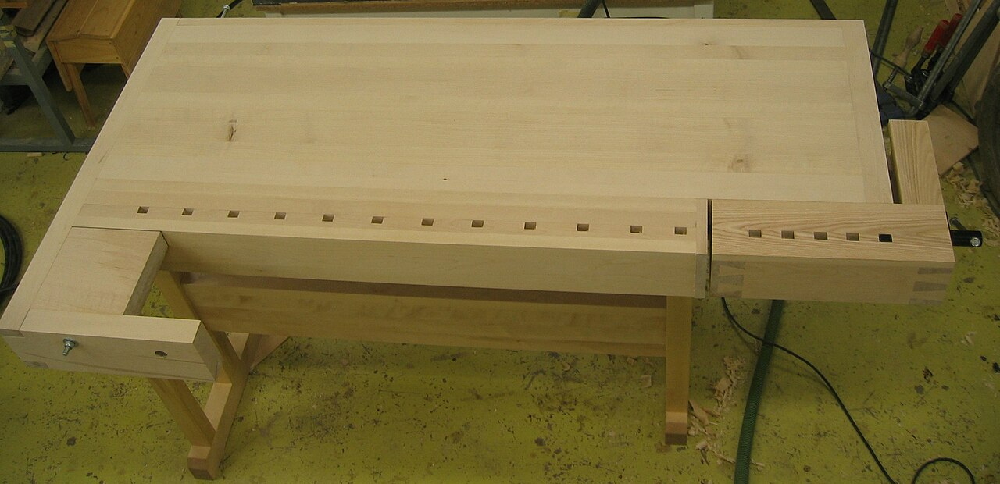

# Automation & coding questions

*A hand-built workbench with dovetail joints proves woodworking skill in a way no verbal description of joinery ever could. A technical round works the same way - it exists because talking about automation and actually writing it are different skills, and only one of them ships code.*

> A candidate can describe the Page Object Model fluently for ten minutes and still freeze the moment
> they're asked to actually write a locator that survives a re-render. A technical round exists
> precisely because of that gap - talking about automation and writing automation under mild pressure,
> live, are different skills, and only a live coding question actually tests the second one.

> **In real life**
>
> Anyone can describe a dovetail joint - two interlocking wedge-shaped pieces, cut to fit without nails
> or glue. Only actually cutting one, by hand, at a bench, reveals whether the description matches real
> skill: whether the cuts are precise, whether the joint holds under stress, whether the woodworker
> adjusts when the first attempt doesn't quite fit. A technical automation round is the coding
> equivalent of handing someone a saw at the bench instead of asking them to describe joinery from a
> chair across the room.

**A technical automation round**: A technical automation round is an interview segment where a candidate writes or explains real code live - a locator strategy, a wait condition, a small framework decision - specifically to verify hands-on ability that a purely verbal or conceptual discussion cannot confirm.

## What's actually being tested isn't syntax recall

A live coding question rarely cares whether an exact method name is remembered under pressure - most
interviewers expect a Google-able syntax slip and won't penalize it. What's actually being evaluated
is the reasoning path: does the candidate ask clarifying questions before writing a locator blind,
do they reach for a brittle absolute XPath or a resilient one, do they add a wait instead of a raw
sleep, do they narrate their thinking instead of typing in silence. A candidate who talks through
"I'd avoid an index-based selector here since the list order isn't guaranteed" while writing merely
adequate code often reads stronger than one who writes flawless code silently and explains nothing.

## Common formats and what each one is actually checking

Fix-the-flaky-test exercises check whether a candidate can diagnose root cause - a race condition, a
stale element reference, a hardcoded wait - rather than just patching the symptom with a longer sleep.
Whiteboard-a-framework-decision questions ("how would you structure page objects for this app") check
architectural judgment, not memorized boilerplate. Write-a-locator-strategy exercises check whether a
candidate defaults to resilient, semantic selectors (`data-testid`, accessible roles) over brittle
absolute paths that break on the next unrelated UI change.

> **Tip**
>
> Narrate out loud constantly, even when the code itself is simple. An interviewer watching silent
> typing has no way to distinguish confident, deliberate work from someone typing the first thing that
> comes to mind - the narration is what actually demonstrates the reasoning being tested.

> **Common mistake**
>
> Going silent to "just focus on getting the code right." The code is only half of what's being
> evaluated - an interviewer who can't hear the reasoning behind a locator choice or a wait strategy has
> no signal about judgment, only about final syntax, which is the easier half to look up later on the
> job anyway.


*Carpenter's workbench — Emhoo~commonswiki, CC BY-SA 3.0, via Wikimedia Commons. [Source](https://commons.wikimedia.org/wiki/File:Carpenter%27s_workbench.jpg)*
- **The visible dovetail joints** — Proof of skill that only shows up in the actual cutting, never in a description of joinery technique. A technical round exists for exactly this reason - to see the real work, not a description of it.
- **The vise, ready to hold real work** — Built for doing, not discussing. A live coding question puts a candidate at the equivalent bench - writing an actual locator or fix, not describing one in the abstract.
- **Dog holes along the front edge** — Small, deliberate, functional details that only exist because the bench is meant for real use under real pressure - the same reason interviewers ask for real code instead of a verbal summary.
- **Bare, unfinished wood - a bench mid-build** — A workbench earns trust through use over time, the same way a candidate earns trust through visible, narrated reasoning during the exercise - not through a polished final answer alone.

**Working through a live automation coding question**

1. **Ask clarifying questions before writing anything** — What's the actual failure mode? What tooling is assumed? Writing blind before understanding the problem is the single most common unforced error.
2. **Narrate the approach before and while typing** — State the plan, then talk through each decision as it's made - the reasoning is most of what's being evaluated, not just the final code.
3. **Default to resilient patterns over brittle shortcuts** — Semantic selectors over absolute XPath, explicit waits over raw sleeps - and say why, out loud, when choosing one.
4. **Test or trace through the logic before declaring it done** — Walk through an edge case verbally, even without running it - showing the habit of verifying matters as much as the code itself.

*Diagnosing a flaky locator strategy (Python)*

```python
elements = [
    {"selector": "//div[3]/ul/li[2]/a", "kind": "absolute_xpath"},
    {"selector": "[data-testid='submit-button']", "kind": "test_id"},
    {"selector": "button:nth-child(4)", "kind": "positional_css"},
    {"selector": "[aria-label='Close dialog']", "kind": "accessible_role"},
]

RESILIENT_KINDS = {"test_id", "accessible_role"}

for el in elements:
    resilient = el["kind"] in RESILIENT_KINDS
    verdict = "RESILIENT - survives unrelated layout changes" if resilient \\
        else "BRITTLE - breaks if position or DOM structure shifts"
    print(el["selector"] + " -> " + verdict)
```

*Diagnosing a flaky locator strategy (Java)*

```java
import java.util.*;

public class Main {
    static class Locator {
        String selector, kind;
        Locator(String selector, String kind) { this.selector = selector; this.kind = kind; }
    }

    public static void main(String[] args) {
        List<Locator> elements = new ArrayList<>();
        elements.add(new Locator("//div[3]/ul/li[2]/a", "absolute_xpath"));
        elements.add(new Locator("[data-testid='submit-button']", "test_id"));
        elements.add(new Locator("button:nth-child(4)", "positional_css"));
        elements.add(new Locator("[aria-label='Close dialog']", "accessible_role"));

        Set<String> resilientKinds = new HashSet<>(Arrays.asList("test_id", "accessible_role"));

        for (Locator el : elements) {
            boolean resilient = resilientKinds.contains(el.kind);
            String verdict = resilient
                    ? "RESILIENT - survives unrelated layout changes"
                    : "BRITTLE - breaks if position or DOM structure shifts";
            System.out.println(el.selector + " -> " + verdict);
        }
    }
}
```

### Your first time: Practice narrating a live locator exercise

- [ ] Pick any real page and write a locator strategy for three different elements — A button, a list item, a form field - out loud, as if an interviewer were listening.
- [ ] State the reasoning for each choice before writing the selector — Why this attribute, why not position-based, what would break it.
- [ ] Deliberately write one brittle version and one resilient version of the same locator — Say out loud what specifically makes each one fragile or durable.
- [ ] Time yourself narrating one full exercise start to finish — Confirm the reasoning is audible throughout, not just present at the end as a summary.

- **A candidate writes correct code but the interviewer still rates the round poorly.**
  Almost always a narration gap - correct code with no audible reasoning gives an interviewer no way to distinguish deliberate judgment from a lucky guess. Practice thinking out loud specifically, not just coding correctly.
- **A candidate freezes when asked to write a locator with no prior context.**
  Ask clarifying questions first, always - what's the actual DOM structure, is a test ID available, what's failing. Writing blind before understanding the problem is the most common cause of a stalled start.
- **A fix-the-flaky-test exercise gets patched with a longer wait instead of a real fix.**
  A longer sleep treats the symptom, not the cause - name the actual root cause first (race condition, stale reference, timing) before proposing any fix, even if the fix ends up being a wait.

### Where to check

- Any live coding exercise, specifically for audible reasoning alongside the code itself, not just a correct final answer.
- Locator choices in particular, checked against whether they'd survive an unrelated layout change.
- [[interviews/technical-rounds/sql-questions]] for the same live-reasoning discipline applied to a query instead of a locator.
- [[interviews/technical-rounds/api-questions]] for how this same technical-round format extends to API-layer questions.
- [[automation-foundations/the-tool-landscape/choosing-a-tool]] for the underlying tool tradeoffs a technical round question often assumes familiarity with.

### Worked example: a flaky-test diagnosis that went from patch to real fix, live

1. An interviewer shows a failing test that intermittently fails on a dropdown selection and asks the
   candidate to fix it live.
2. The candidate's first instinct is to add `Thread.sleep(3000)` before the selection - technically
   makes the test pass more often, but doesn't explain why it was flaky in the first place.
3. Prompted to explain the root cause, the candidate traces it back: the dropdown options render
   asynchronously after an API call, so the click sometimes lands before the option exists in the DOM.
4. The candidate rewrites the fix as an explicit wait for the specific option's visibility, replacing
   the arbitrary sleep, and explains out loud why this handles both fast and slow API responses instead
   of guessing a fixed delay.
5. The interviewer notes the diagnosis and correction path as the strongest part of the answer -
   stronger than if the explicit wait had simply been written correctly from the first attempt with no
   visible reasoning behind it.

**Quiz.** According to this note, what does a technical automation round primarily evaluate - exact syntax recall, or something else?

- [ ] Whether every method name is remembered perfectly with no lookup needed
- [x] The reasoning path behind the code - clarifying questions asked, resilient vs brittle choices made, and root-cause diagnosis - which a purely verbal discussion can't confirm
- [ ] How fast the candidate can type
- [ ] Whether the candidate has memorized a specific automation framework's entire API

*Most interviewers expect and forgive a syntax slip - that's Google-able on the job. What a live round actually verifies is the reasoning a purely conceptual conversation can't confirm: whether a candidate asks clarifying questions before writing blind, defaults to resilient patterns over brittle shortcuts, and diagnoses root cause rather than patching symptoms - all of which only becomes visible through narrated, real-time work.*

- **A technical automation round** — An interview segment where a candidate writes or explains real code live, specifically to verify hands-on ability that a purely verbal discussion cannot confirm.
- **Why narration matters as much as correct code** — An interviewer watching silent typing can't distinguish deliberate, judged work from a lucky guess - the reasoning spoken aloud is what actually demonstrates the skill being tested.
- **Resilient vs. brittle locator** — Semantic selectors like data-testid or accessible roles survive unrelated layout changes; absolute XPath or position-based selectors break the moment the DOM structure shifts.
- **Why a longer sleep isn't a real fix for a flaky test** — It treats the symptom, not the cause - naming the actual root cause (race condition, stale reference, async timing) first is what a strong answer demonstrates, even if a wait is still part of the fix.

### Challenge

Pick any real webpage. Practice writing and narrating a locator strategy for three different elements out loud, as if an interviewer were listening - explain why each choice would or wouldn't survive an unrelated layout change.

- [Interview Kickstart — QA Automation Testing Interview Questions](https://interviewkickstart.com/blogs/interview-questions/qa-automation-interview-questions)
- [StarAgile — Top Automation Testing Coding Interview Questions](https://staragile.com/blog/automation-testing-coding-interview-questions)
- [Basic Automation Testing Interview Questions, Every QA Must Know](https://www.youtube.com/watch?v=5rCpIeiOULE)

🎬 [Basic Automation Testing Interview Questions, Every QA Must Know](https://www.youtube.com/watch?v=5rCpIeiOULE) (13 min)

- A technical round exists because talking about automation and writing it live are different skills - only live code tests the second one.
- Narrate constantly, even when the code is simple - an interviewer needs audible reasoning to distinguish judgment from a lucky guess.
- Default to resilient, semantic locators over brittle positional ones, and say out loud why.
- Diagnose root cause before patching a flaky test's symptom - a longer sleep isn't a fix, it's a delay of the same underlying problem.
- Ask clarifying questions before writing any code blind - the most common unforced error is starting before understanding the actual problem.


## Related notes

- [[Notes/interviews/technical-rounds/sql-questions|SQL questions]]
- [[Notes/interviews/technical-rounds/api-questions|API questions]]
- [[Notes/automation-foundations/the-tool-landscape/choosing-a-tool|Choosing a tool]]


---
_Source: `packages/curriculum/content/notes/interviews/technical-rounds/automation-and-coding-questions.mdx`_
