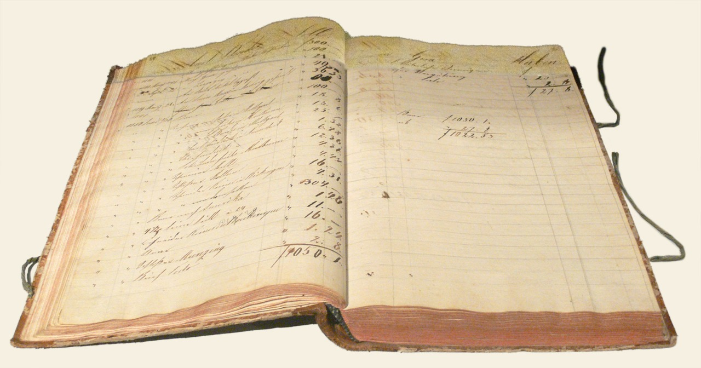

# SQL questions

*A 19th-century ledger recorded every transaction in exact columns, dated and totaled, because the business depended on being able to trace any figure back to its source. A SQL interview question asks the same thing of a candidate: can you trace a claim back to the actual rows that prove it.*

> "Verify the discount was applied correctly" sounds like a UI-only claim until an interviewer asks the
> follow-up: "how would you confirm that at the database level?" A tester who can only answer "I'd check
> the screen" has no way to catch a bug where the UI displays the right number but the database stored
> the wrong one - which is exactly the class of bug a SQL question in a technical round is checking for.

> **In real life**
>
> A 19th-century business ledger recorded every transaction as an exact row - date, party, amount, running
> total - because the entire business depended on being able to trace any disputed figure back to its
> source entry, not just trust a verbal summary of what probably happened. A SQL interview question asks
> a tester to do the same thing: don't describe what the data probably looks like, write the query that
> actually proves it, row by row, the same way a ledger entry proves a transaction actually occurred.

**A SQL interview question**: A SQL interview question for testers checks the ability to write a working query - typically a SELECT with a JOIN, a WHERE filter, or an aggregate - that verifies a specific claim about application data directly against the database, rather than only through the UI.

## The questions test verification instinct, not DBA-level mastery

Most SQL rounds for a QA or SDET role stay within SELECT, JOIN, WHERE, GROUP BY, and basic aggregates
(COUNT, SUM, AVG) - rarely stored procedures, query optimization, or index tuning, which are DBA
territory. What's actually being tested is the instinct to verify at the data layer at all: given "a
user's order total looks wrong," does the candidate reach for a query joining orders to line items to
check the stored total against a computed one, or do they stop at describing what they'd click through
in the UI. The SQL skill itself is usually more approachable than candidates expect - the verification
instinct is the harder, rarer part.

## JOINs and NULLs are where most real questions cluster

A huge share of practical SQL interview questions boil down to one core skill: correctly joining two or
more tables to answer a question that no single table can answer alone - "which users placed an order
but never received a confirmation email" requires joining users, orders, and a notifications table, and
reasoning about which join type (INNER vs LEFT) actually answers the question asked. NULL handling is
the other frequent trap: a LEFT JOIN with no matching row produces NULL columns, and a candidate who
forgets that a `WHERE column = NULL` never matches anything (it requires `IS NULL`) will confidently
write a query that silently returns nothing.

> **Tip**
>
> Before writing a single line of SQL, restate the actual question in plain English and identify exactly
> which tables and columns it touches. Most mistakes come from starting to type before the question is
> fully translated from English into "which tables, joined how, filtered on what."

> **Common mistake**
>
> Writing a query that runs without error and assuming that means it's correct. A syntactically valid
> query can still silently return the wrong rows - a JOIN condition that's too loose can duplicate rows,
> one that's too strict can drop legitimate matches. Always sanity-check the row count and a few actual
> values against what's expected, not just whether the query executes.


*German ledger, 1828 — RaphaelQS, CC0, via Wikimedia Commons. [Source](https://commons.wikimedia.org/wiki/File:Ledger.png)*
- **Rows of dated, itemized entries** — Each row a discrete, traceable fact - exactly what a table row is in a database. A SQL question asks a candidate to pull the exact rows that prove a claim, not summarize what they probably say.
- **The running total column** — A computed, aggregated value derived from the rows above it - the ledger equivalent of a SUM() or a stored total a candidate might be asked to verify against the underlying line items.
- **Two facing pages, cross-referenced** — Debits on one side, credits on the other, meant to be read together to answer one question - the same relationship a JOIN expresses between two separate tables.
- **Worn, heavily-used binding** — A record trusted because it's been checked against reality repeatedly. A SQL query earns the same trust only after its row count and values are sanity-checked, not just confirmed to run without error.

**Answering a SQL verification question live**

1. **Restate the question in plain English first** — Which tables, which columns, joined how - translated fully before any SQL is typed.
2. **Pick the JOIN type the question actually needs** — INNER for 'only matching rows,' LEFT for 'all of A, matched where possible' - the wrong choice silently drops or duplicates rows.
3. **Watch for NULLs explicitly** — A LEFT JOIN with no match produces NULL columns; WHERE column = NULL never matches - IS NULL is required instead.
4. **Sanity-check the result before declaring it correct** — Row count and a few actual values checked against expectation - a query that runs without error can still silently return the wrong rows.

*Modeling a JOIN + NULL check a SQL interview question might ask for (Python)*

```python
orders = [
    {"order_id": 1, "user_id": "u1", "total": 42.50},
    {"order_id": 2, "user_id": "u2", "total": 15.00},
    {"order_id": 3, "user_id": "u3", "total": 9.99},
]
notifications = [
    {"order_id": 1, "sent": True},
    {"order_id": 3, "sent": True},
]

notif_by_order = {n["order_id"]: n for n in notifications}

# LEFT JOIN semantics: keep every order, attach a notification if one exists
results = []
for o in orders:
    n = notif_by_order.get(o["order_id"])
    results.append({
        "order_id": o["order_id"],
        "user_id": o["user_id"],
        "notification_sent": n["sent"] if n else None,  # NULL if no match
    })

missing_notifications = [r for r in results if r["notification_sent"] is None]
print("Orders missing a confirmation notification:")
for r in missing_notifications:
    print("  order " + str(r["order_id"]) + " (user " + r["user_id"] + ")")
```

*Modeling a JOIN + NULL check a SQL interview question might ask for (Java)*

```java
import java.util.*;

public class Main {
    static class Order {
        int orderId; String userId; double total;
        Order(int orderId, String userId, double total) {
            this.orderId = orderId; this.userId = userId; this.total = total;
        }
    }

    public static void main(String[] args) {
        List<Order> orders = new ArrayList<>();
        orders.add(new Order(1, "u1", 42.50));
        orders.add(new Order(2, "u2", 15.00));
        orders.add(new Order(3, "u3", 9.99));

        Set<Integer> notifiedOrderIds = new HashSet<>(Arrays.asList(1, 3));

        // LEFT JOIN semantics: keep every order, notification_sent is null if no match
        List<Integer> missingNotifications = new ArrayList<>();
        for (Order o : orders) {
            Boolean notificationSent = notifiedOrderIds.contains(o.orderId) ? Boolean.TRUE : null;
            if (notificationSent == null) {
                missingNotifications.add(o.orderId);
            }
        }

        System.out.println("Orders missing a confirmation notification:");
        for (int orderId : missingNotifications) {
            System.out.println("  order " + orderId);
        }
    }
}
```

### Your first time: Practice one real JOIN + NULL question end to end

- [ ] Write down a plausible schema for two related tables — Orders and notifications, or users and sessions - anything with a real one-to-many relationship.
- [ ] Pose a question that requires a LEFT JOIN to answer — 'Which rows in table A have no matching row in table B' - the classic shape of this kind of interview question.
- [ ] Write the query, then explicitly explain the NULL handling out loud — Where NULLs appear, and why WHERE column = NULL would silently fail there.
- [ ] Sanity-check by hand against a small example dataset — Confirm the row count and specific values match what you'd expect before trusting the query.

- **A query runs without error but returns zero rows when rows were clearly expected.**
  Check for a WHERE column = NULL instead of IS NULL - the single most common silent-failure pattern in SQL interview answers, and a strong signal to an interviewer if caught and self-corrected out loud.
- **A JOIN returns more rows than there are actual entities.**
  The join condition is likely too loose, matching multiple rows on one side to a single row on the other - tighten the join condition and verify the expected row count before and after.
- **A candidate can describe the right query verbally but can't actually write the syntax.**
  Practice writing real SQL against a real (even tiny, local) dataset regularly - verbal fluency without hands-on practice is exactly the gap a live SQL question is designed to expose.

### Where to check

- Any live SQL question, specifically for whether the English question was fully restated before typing began.
- JOIN type chosen against what the question actually asks - all of one side, or only matches.
- [[interviews/technical-rounds/automation-and-coding-questions]] for this same live-reasoning discipline applied to code instead of a query.
- [[sql-and-databases-for-testers/reading-data/joins-gently]] for the underlying JOIN mechanics a technical round question assumes are already solid.
- [[test-management-and-reporting/metrics-and-reporting/test-summary-reports]] for how a verified data-layer fact eventually becomes a reported metric.

### Worked example: a JOIN mistake caught and corrected live, turning a weak answer into a strong one

1. Asked to find "users who placed an order but never received a confirmation email," a candidate
   starts with an INNER JOIN between orders and notifications.
2. Running it mentally against a small example, they notice: an INNER JOIN only keeps rows where a
   match exists on both sides - meaning it would return zero of the users actually missing a
   notification, the exact opposite of what's needed.
3. The candidate catches this out loud: "wait, INNER JOIN would drop exactly the rows I'm looking for
   - I need a LEFT JOIN and then filter where the notification side is NULL."
4. They rewrite it as a LEFT JOIN from orders to notifications, filtering on `notifications.id IS
   NULL`, and walk through why this correctly captures orders with no matching notification row.
5. The interviewer notes that catching and correcting the join-type mistake live, with clear reasoning,
   demonstrated stronger SQL judgment than writing the correct join silently on the first try would
   have on its own.

**Quiz.** According to this note, why does 'WHERE column = NULL' silently fail to find NULL rows in SQL?

- [ ] It's a syntax error that most databases reject outright
- [x] NULL represents an unknown value, and no value - including NULL itself - is ever considered equal to NULL under standard SQL comparison rules, so IS NULL must be used instead
- [ ] It only works in certain database engines but not others
- [ ] It works correctly but is simply considered bad style

*NULL means 'unknown,' not a specific comparable value - so under standard SQL three-valued logic, even NULL = NULL evaluates to unknown rather than true, meaning a WHERE column = NULL clause never matches any row. IS NULL exists specifically as the correct way to test for this, and forgetting it is one of the most common silent-failure patterns in a live SQL interview answer.*

- **A SQL interview question (for testers)** — Checks the ability to write a working query - typically involving a JOIN, WHERE filter, or aggregate - that verifies a specific claim about application data directly against the database.
- **What a SQL round actually tests** — Verification instinct as much as syntax - whether a candidate reaches for the database to confirm a claim, not just describes what they'd check in the UI.
- **INNER JOIN vs. LEFT JOIN, for 'find missing matches' questions** — INNER JOIN keeps only matching rows on both sides - useless for finding what's missing. LEFT JOIN keeps every row from the first table, with NULLs where no match exists, which is what a 'find the gaps' question needs.
- **Why WHERE column = NULL fails silently** — NULL means unknown, and no value is ever considered equal to NULL under SQL's comparison rules - IS NULL is the correct test, and using = NULL instead returns zero rows with no error.

### Challenge

Write a schema for two related tables from a real or imagined app. Pose a "find the rows in A with no match in B" question against it, write the LEFT JOIN + IS NULL query that answers it, and verify by hand against a small example dataset.

- [Indeed — 14 SQL Interview Questions for Testers With Example Answers](https://www.indeed.com/career-advice/interviewing/sql-interview-questions-for-testers)
- [Software Testing Help — Top SQL Interview Questions and Answers](https://www.softwaretestinghelp.com/50-popular-sql-interview-questions-for-testers/)
- [Top 5 SQL Interview Questions & Answers for Your SQL Test | Multiple Examples](https://www.youtube.com/watch?v=FTamRSw-sFM)

🎬 [Top 5 SQL Interview Questions & Answers for Your SQL Test | Multiple Examples](https://www.youtube.com/watch?v=FTamRSw-sFM) (17 min)

- A SQL interview question checks verification instinct as much as syntax - reaching for the database to prove a claim, not just describing a UI check.
- Most rounds stay within SELECT, JOIN, WHERE, GROUP BY, and basic aggregates - rarely DBA-level tuning or stored procedures.
- Restate the question in plain English before writing any SQL - most mistakes come from typing before the question is fully translated.
- Choose JOIN type deliberately: INNER for matches only, LEFT for 'everything from A, matched where possible' - the wrong choice silently drops or duplicates rows.
- A query that runs without error isn't automatically correct - always sanity-check row count and actual values before trusting it.


## Related notes

- [[Notes/interviews/technical-rounds/automation-and-coding-questions|Automation & coding questions]]
- [[Notes/sql-and-databases-for-testers/reading-data/joins-gently|JOINs, gently]]
- [[Notes/test-management-and-reporting/metrics-and-reporting/test-summary-reports|Test summary reports]]


---
_Source: `packages/curriculum/content/notes/interviews/technical-rounds/sql-questions.mdx`_
