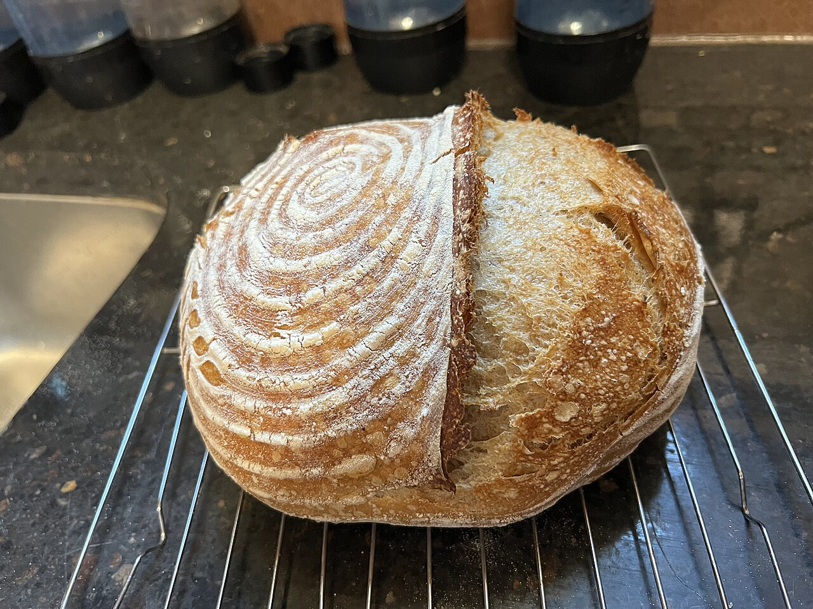

# Take-home assignments

*Nobody watches a loaf of sourdough proof overnight - the baker works alone, unobserved, for hours. But the finished loaf, cut open, reveals exactly how it was made: the crumb, the crust, the scoring all trace back to real technique or its absence.*

> A take-home assignment has no interviewer watching over a shoulder, no live clock, no one to ask a
> clarifying question of in real time - and that absence is exactly what makes it revealing. Nothing
> forces good decisions except the decisions themselves; sloppy shortcuts and genuine care both show up
> identically clearly in the artifact that eventually gets submitted, with nobody there to explain either
> one away.

> **In real life**
>
> Nobody watches a loaf of sourdough proof overnight - the baker mixes, shapes, and scores it alone, then
> walks away for hours while fermentation does the invisible part of the work. But the finished loaf, cut
> open the next day, reveals everything: a tight, dense crumb means under-proofed dough; an open, uneven
> crumb with good oven spring means the timing and technique were actually right. Nobody needs to have
> watched the process - the result alone proves what happened. A take-home assignment works exactly the
> same way: unobserved while it's built, but the finished submission reveals the process anyway.

**A take-home assignment**: A take-home assignment is a coding or testing exercise completed independently, on the candidate's own schedule and without live supervision - evaluated entirely through the finished artifact and its documentation, which means the artifact has to demonstrate judgment and process on its own, with no live narration available to fill gaps.

## Functionality first, then documentation, then polish - in that order

An assignment that doesn't run, or is missing a core requirement, rarely advances regardless of how
clean the rest of the code is - reviewers generally can't evaluate what doesn't work. Once the core
requirement is solid, a clear README carries almost as much weight as the code itself: what was built,
how to run it, what decisions were made and why, what would be done differently with more time. Visual
polish and refactoring come last, and only after both of the above are genuinely solid - an assignment
that's beautifully styled but silently missing a stated requirement reads as misplaced priorities to a
reviewer, not craftsmanship.

## Ambiguity is often intentional - state assumptions rather than over-asking

Most take-home instructions leave some interpretation open on purpose, specifically to see how a
candidate handles it. The instinct to fire off five clarifying-question emails before writing any code
usually reads worse than making a reasonable assumption, stating it explicitly in the README or a code
comment, and moving forward - real work rarely comes with perfectly specified requirements, and this is
frequently part of what's being evaluated. One clarifying question about something genuinely blocking
and ambiguous is fine; several about details a reasonable default would resolve is a signal in the
wrong direction.

> **Tip**
>
> Use commit history to narrate the process, not just a single final commit. A handful of small, honest
> commits - "basic structure," "core logic working," "add edge case handling," "clean up + tests" - shows
> a reviewer the actual working process in a way one large commit at the deadline never can.

> **Common mistake**
>
> Spending far longer than the stated time expectation, assuming more effort obviously reads as more
> impressive. Most companies explicitly don't expect more than a few focused hours, and a submission that
> clearly took two full days can read as poor time judgment or an inability to scope work realistically -
> both real concerns for the job itself, not just the exercise.


*Home-baked sourdough loaf — Agelaia, CC BY 4.0, via Wikimedia Commons. [Source](https://commons.wikimedia.org/wiki/File:Sourdough_Bread_Loaf.jpg)*
- **The scored spiral pattern** — A deliberate technique choice made hours before baking, invisible until the loaf is finished - the same way a take-home's design decisions only become visible once the finished submission is reviewed.
- **The open, uneven crumb on the cut side** — Direct, unfakeable evidence of correct technique and timing during the unobserved proofing stage. A reviewer reading a take-home's code and README is looking for this same kind of unfakeable evidence of real process.
- **The blistered, well-risen crust** — The visible result of hours of unsupervised fermentation - proof the process worked, with nobody there to watch it happen. Functionality in a take-home plays the exact same role: proof the core logic actually works, checked, not just claimed.
- **The wire cooling rack underneath** — An unglamorous, purely functional support structure - not the impressive part, but necessary for the loaf to finish properly. Good documentation plays this same supporting role for a take-home: rarely the flashy part, but what lets the actual work be properly judged.

**Working through a take-home assignment in the right order**

1. **Read the full instructions twice before writing any code** — Note every stated requirement and every point left ambiguous - most mistakes come from starting before the actual scope is clear.
2. **Build core functionality first, completely** — Nothing else matters if the central requirement doesn't work - polish and extras come only after this is solid.
3. **State assumptions explicitly instead of over-asking** — A reasonable, clearly-stated assumption about genuinely ambiguous scope usually reads better than several clarifying emails.
4. **Write the README last, as seriously as the code** — What was built, how to run it, what tradeoffs were made and why - carries nearly as much weight as the code itself.

*Scoring a take-home submission against the stated priority order (Python)*

```python
submission = {
    "core_requirement_works": True,
    "has_readme_with_decisions": True,
    "has_tests": False,
    "time_spent_hours": 3.5,
    "stated_time_expectation_hours": 3,
}

def evaluate(s):
    if not s["core_requirement_works"]:
        return "REJECT - core functionality missing or broken, nothing else can compensate"
    notes = []
    if not s["has_readme_with_decisions"]:
        notes.append("weak: no documented reasoning behind decisions")
    if not s["has_tests"]:
        notes.append("minor gap: no tests included")
    if s["time_spent_hours"] > s["stated_time_expectation_hours"] * 1.5:
        notes.append("flag: significantly over the stated time expectation")
    verdict = "STRONG" if not notes else "PASSABLE, with notes"
    return verdict + (": " + "; ".join(notes) if notes else "")

print(evaluate(submission))
```

*Scoring a take-home submission against the stated priority order (Java)*

```java
import java.util.*;

public class Main {
    public static void main(String[] args) {
        boolean coreRequirementWorks = true;
        boolean hasReadmeWithDecisions = true;
        boolean hasTests = false;
        double timeSpentHours = 3.5;
        double statedTimeExpectationHours = 3.0;

        String verdict;
        if (!coreRequirementWorks) {
            verdict = "REJECT - core functionality missing or broken, nothing else can compensate";
        } else {
            List<String> notes = new ArrayList<>();
            if (!hasReadmeWithDecisions) {
                notes.add("weak: no documented reasoning behind decisions");
            }
            if (!hasTests) {
                notes.add("minor gap: no tests included");
            }
            if (timeSpentHours > statedTimeExpectationHours * 1.5) {
                notes.add("flag: significantly over the stated time expectation");
            }
            verdict = notes.isEmpty() ? "STRONG" : "PASSABLE, with notes: " + String.join("; ", notes);
        }

        System.out.println(verdict);
    }
}
```

### Your first time: Plan a take-home assignment's time budget before starting one

- [ ] Read the instructions fully twice and list every stated requirement — Separate what's explicitly required from what's left open to interpretation.
- [ ] Write down the stated or implied time expectation — If none is given, assume a few focused hours, not a full weekend.
- [ ] Block time in this order: core functionality, then README, then polish — Set a rough time budget for each phase before starting, so polish doesn't quietly eat the time meant for documentation.
- [ ] Draft the README's decisions section before final submission — Confirm every notable assumption or tradeoff made along the way actually got written down.

- **A submission looks impressive but gets rejected anyway.**
  Check whether the core stated requirement actually works end to end - polish and extra features rarely compensate for a broken or missing central feature, and reviewers usually check that first.
- **A candidate spends far longer than the stated time expectation and still feels behind.**
  A likely sign of unscoped, open-ended polishing rather than a real gap in the core work - set a hard time budget per phase (core, docs, polish) in advance next time.
- **A reviewer's feedback says the reasoning behind key decisions was unclear.**
  The README likely described what was built without explaining why - add a short 'decisions and tradeoffs' section stating the reasoning behind anything non-obvious.

### Where to check

- The submission itself, specifically for whether the core stated requirement works before anything else is judged.
- Commit history, checked for whether it shows an honest working process or one single last-minute commit.
- [[interviews/technical-rounds/automation-and-coding-questions]] for the live, narrated counterpart to this unsupervised, documentation-driven format.
- [[a-portfolio-that-gets-interviews/the-3-repo-portfolio/readmes-that-sell]] for the README-writing discipline a take-home submission depends on just as much as a portfolio project does.
- [[framework-design/config-and-data/environments]] for the kind of "how to run this" setup clarity a take-home's README needs to get right.

### Worked example: a take-home that lost points on priorities, not skill

1. A candidate receives a take-home asking for a small test automation script for a sample login flow,
   with a stated expectation of two to three hours.
2. They spend most of the available time building a polished custom HTML report with charts and colors,
   and only implement the happy-path login test - the stated requirement to also handle an invalid-login
   case goes unaddressed.
3. The submission looks visually impressive in isolation, but the reviewer's checklist marks the missing
   invalid-login case as a failed core requirement, regardless of the report's polish.
4. Feedback notes the code quality was genuinely strong, but the time was misallocated - polish was
   prioritized over completeness, the exact inversion of what the assignment was checking for.
5. Fix, communicated for next time: build every explicitly stated requirement first, completely, before
   spending any time on presentation - a plain but complete submission consistently outperforms a
   polished but incomplete one.

**Quiz.** According to this note, what should a candidate prioritize first when working through a take-home assignment?

- [ ] Visual polish and a well-styled report, since that's what reviewers see first
- [x] Every explicitly stated core requirement working completely, before any time goes toward documentation or polish - since incomplete core functionality rarely gets compensated for by anything else
- [ ] Sending as many clarifying questions as possible before starting any code
- [ ] Matching or exceeding the time spent by other candidates, regardless of the stated time expectation

*A take-home assignment is evaluated on the finished artifact with no live narration to fill gaps, and reviewers generally check core functionality first - an assignment that's beautifully polished but missing a stated requirement reads as misplaced priorities, not skill. The right order is core functionality completely working, then a clear README explaining decisions, then polish only once both of those are genuinely solid.*

- **A take-home assignment** — A coding or testing exercise completed independently and unsupervised - evaluated entirely through the finished artifact and its documentation, with no live narration to fill gaps.
- **The right priority order** — Core functionality completely working, then a clear README explaining decisions and tradeoffs, then visual polish or refactoring - in that order, not reversed.
- **Why stating an assumption often beats asking a clarifying question** — Most take-home ambiguity is intentional, meant to see how a candidate handles it - a reasonable, clearly-stated assumption usually reads better than several clarifying-question emails before any code is written.
- **Why spending far longer than the stated time expectation is a risk, not just extra effort** — It can read as poor time judgment or an inability to scope work realistically - both real concerns for the actual job, not just a sign of extra dedication to the exercise.

### Challenge

Find a real take-home assignment prompt (a public one online, or an old one you've received). Time-box a plan for it: how many hours for core functionality, how many for the README, how many left for polish - before writing any code.

- [freeCodeCamp — The Essential Guide to Take-Home Coding Challenges](https://www.freecodecamp.org/news/the-essential-guide-to-take-home-coding-challenges-a0e746220dd7/)
- [This Dot Labs — How to Avoid Common Pitfalls and Ace Your Take-Home Assignment](https://www.thisdot.co/blog/how-to-avoid-common-pitfalls-and-ace-your-take-home-assignment)
- [How to approach Take Home Assignments during Interviews? | Refactor Ep #06](https://www.youtube.com/watch?v=sgmMqP9AYpY)

🎬 [How to approach Take Home Assignments during Interviews? | Refactor Ep #06](https://www.youtube.com/watch?v=sgmMqP9AYpY) (15 min)

- A take-home is unsupervised, but the finished artifact reveals the process anyway - there's no live narration to fill gaps, so the work has to speak for itself.
- Priority order matters: core functionality completely working, then a clear README, then polish - reversed priorities read as misplaced judgment even when the code itself is skilled.
- Ambiguity in the instructions is often intentional - state a reasonable assumption explicitly rather than over-asking clarifying questions.
- Small, honest commits narrate the real working process better than one large commit at the deadline.
- Respect the stated time expectation - significantly exceeding it can read as poor scoping judgment, not extra dedication.


## Related notes

- [[Notes/interviews/technical-rounds/automation-and-coding-questions|Automation & coding questions]]
- [[Notes/a-portfolio-that-gets-interviews/the-3-repo-portfolio/readmes-that-sell|READMEs that sell]]
- [[Notes/framework-design/config-and-data/environments|Environments]]


---
_Source: `packages/curriculum/content/notes/interviews/technical-rounds/take-home-assignments.mdx`_
