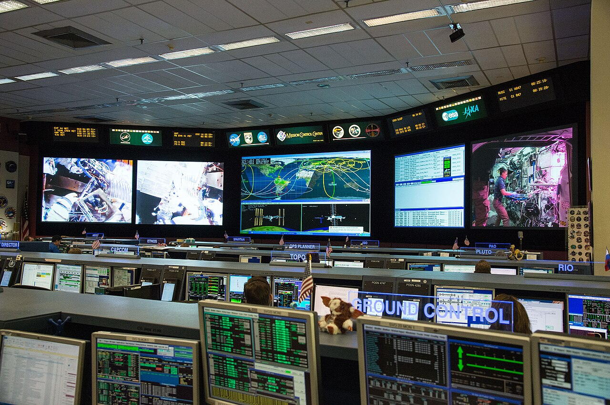

# What QA verifies after a deploy

*A green pipeline only proves the deploy mechanism worked, not that the release is actually healthy. Post-deploy verification is a fast, bounded checklist — version, smoke tests, pod health, and a bake window — that decides GO or ROLLBACK from evidence.*

> The deploy pipeline shows a green checkmark. The image pushed, the pods rolled, every automated
> step passed. Ten minutes later, support tickets start piling up — checkout is throwing errors for
> a slice of users. The pipeline wasn't lying. It just never claimed to know whether the RUNNING
> software actually works — that's a different question, and it's the one QA owns after every deploy.

> **In real life**
>
> Mission control, watching a live event unfold across a wall of screens. Nobody there believes the
> mission is "done" just because the rocket cleared the tower — every console keeps watching its own
> slice of telemetry for a defined window afterward, because problems that don't show up in the first
> second sometimes show up in the fifth minute. A deploy pipeline reporting success is the rocket
> clearing the tower. Post-deploy verification is everyone staying at their console afterward, still
> watching, until there's real evidence the mission is actually going well.

**Post-deploy verification**: Post-deploy verification (often called release verification or post-deploy smoke testing) is the fast, bounded set of checks run immediately after a deploy reaches an environment, to confirm THIS specific release, in THIS specific environment, is actually healthy and reachable — not to re-run the full regression suite, which already ran before the code merged. It typically checks that the running version matches what was intended to ship, that pods are healthy and ready, that a handful of critical user paths still work, and that error rates and latency stay within normal bounds through a defined 'bake' window after the deploy — because some regressions only appear under sustained real traffic, not in the first few seconds.

## A green pipeline is not a verified release

- **Confirm the running version matches what was intended to ship.** A deploy pipeline can report
  success while pods are still on a stale image (a rollout stuck, a cache serving an old tag) —
  check a version endpoint or `kubectl` directly, don't just trust the pipeline's own report.
- **Run a small, fast smoke test of the paths that actually matter.** Login, checkout, whatever is
  load-bearing for the product — not the full regression suite, just enough to catch a
  release-breaking problem within minutes.
- **Check pod and rollout health directly.** All replicas ready, none crash-looping, readiness
  probes passing — this is ground truth that a pipeline's own success report doesn't always capture.
- **Watch error-rate and latency dashboards through a defined bake window**, not just the first
  30 seconds. Some regressions (a slow memory leak, a query that degrades only under real
  concurrency, a background job queue backing up) only show up after sustained real load.
- **Confirm rollback is actually available**, not just assumed — knowing you COULD roll back is
  only true if the rollback path is tested and ready, not a hope.

> **Tip**
>
> Define the bake window explicitly, in minutes, before the deploy — not as a vague "keep an eye on
> it." A specific number (say, 10 minutes of clean dashboards after smoke tests pass) turns "seems
> fine" into a decision you can actually point to, and stops verification from quietly ending the
> moment everyone gets distracted by the next task.

> **Common mistake**
>
> Treating "the deploy pipeline reported success" as equivalent to "the release is verified." A green
> pipeline checkmark only confirms the deploy MECHANISM worked — the image built, pushed, and the
> rollout completed. It says nothing about whether the running software is actually behaving correctly
> for real traffic. Those are two different questions, and only one of them is answered by CI.


*ISS Mission Control during a number of dynamic events for Expedition 44 — Bill Stafford, NASA/Wikimedia Commons, Public domain. [Source](https://commons.wikimedia.org/wiki/File:ISS_Mission_Control_during_a_number_of_dynamic_events_for_Expedition_44.jpg)*
- **The large live camera feed screen** — Real, current system state — exactly what post-deploy verification watches: the actual running release, not a simulated or historical view of it.
- **Dense green-on-black terminal readouts at each console** — The equivalent of dashboards and logs each specialist is responsible for watching after a launch — mapped to error rates, latency, and pod health each tester or engineer owns watching after a deploy.
- **The orbital tracking map with ground-track lines** — A system-wide health view, not a single narrow check — catches a regional or service-wide problem that one endpoint check alone would miss.
- **The 'GROUND CONTROL' console signage** — A clearly designated, NAMED owner watching a defined signal. Post-deploy verification needs an explicit owner and checklist too — not an assumption that someone is probably watching.

**The minutes right after a deploy — press Play**

1. **The pipeline reports success** — This confirms the deploy MECHANISM worked — image built, pushed, rollout completed. It does not yet confirm the release is healthy.
2. **Confirm the running version matches what shipped** — Check a version endpoint or `kubectl` directly — don't take the pipeline's own report as proof of what's actually running.
3. **Run the smoke-test suite against the live environment** — A small, fast set of checks on the paths that matter most — minutes, not the full regression suite.
4. **Watch dashboards through the defined bake window** — Error rate and latency, for the number of minutes decided BEFORE the deploy — not until someone gets bored watching.
5. **Verdict: GO or ROLLBACK, decided from evidence** — Not from the pipeline's green checkmark alone — from the smoke tests and the bake window's actual data.

The post-deploy smoke-check runner below aggregates a handful of checks into a single GO/ROLLBACK
verdict — the same shape a real post-deploy gate uses, just small enough to read in one screen.

*Run it — aggregate post-deploy checks into a GO/ROLLBACK verdict (Python)*

```python
def check_version_matches(expected, actual):
    return expected == actual

def check_error_rate(rate, threshold=0.02):
    return rate <= threshold

def check_pods_ready(ready, desired):
    return ready == desired

checks = [
    ("version matches expected build", check_version_matches("2.3.1", "2.3.1")),
    ("error rate within threshold", check_error_rate(0.041)),
    ("all pods ready", check_pods_ready(ready=5, desired=6)),
    ("checkout smoke test", True),
    ("login smoke test", True),
]

for name, passed in checks:
    print(f"{'PASS' if passed else 'FAIL'} - {name}")

failed = [name for name, passed in checks if not passed]
verdict = "ROLLBACK" if failed else "GO"
print(f"\\nverdict: {verdict}")
if failed:
    print("failed checks:", ", ".join(failed))

# PASS - version matches expected build
# FAIL - error rate within threshold
# FAIL - all pods ready
# PASS - checkout smoke test
# PASS - login smoke test
#
# verdict: ROLLBACK
# failed checks: error rate within threshold, all pods ready
```

Same checks, same verdict, in Java:

*Run it — aggregate post-deploy checks into a GO/ROLLBACK verdict (Java)*

```java
import java.util.*;

public class Main {
    record Check(String name, boolean passed) {}

    static boolean versionMatches(String expected, String actual) {
        return expected.equals(actual);
    }

    static boolean errorRateOk(double rate, double threshold) {
        return rate <= threshold;
    }

    static boolean podsReady(int ready, int desired) {
        return ready == desired;
    }

    public static void main(String[] args) {
        List<Check> checks = List.of(
            new Check("version matches expected build", versionMatches("2.3.1", "2.3.1")),
            new Check("error rate within threshold", errorRateOk(0.041, 0.02)),
            new Check("all pods ready", podsReady(5, 6)),
            new Check("checkout smoke test", true),
            new Check("login smoke test", true)
        );

        List<String> failed = new ArrayList<>();
        for (Check c : checks) {
            System.out.println((c.passed() ? "PASS" : "FAIL") + " - " + c.name());
            if (!c.passed()) failed.add(c.name());
        }

        String verdict = failed.isEmpty() ? "GO" : "ROLLBACK";
        System.out.println();
        System.out.println("verdict: " + verdict);
        if (!failed.isEmpty()) {
            System.out.println("failed checks: " + String.join(", ", failed));
        }
    }
}

// PASS - version matches expected build
// FAIL - error rate within threshold
// FAIL - all pods ready
// PASS - checkout smoke test
// PASS - login smoke test
//
// verdict: ROLLBACK
// failed checks: error rate within threshold, all pods ready
```

### Your first time: Your mission: run your own post-deploy verification

- [ ] Pick a real or practice deploy (BuggyShop/BuggyAPI, or a personal project) — Confirm the version/build endpoint reflects the release you expect, right after it goes out.
- [ ] Hit 2-3 critical paths manually or with a short script — Whatever is load-bearing for that app — login, checkout, or its equivalent.
- [ ] Watch logs or an error dashboard for several minutes afterward — Don't stop checking the instant the smoke tests pass — that's the bake window, and it's where slower regressions show up.
- [ ] Write down your GO or ROLLBACK verdict and the specific evidence behind it — 'Seemed fine' isn't evidence. 'Version matched, 3/3 smoke tests passed, error rate stayed flat for 10 minutes' is.

You've now run a real post-deploy verification with a documented verdict, instead of just assuming a
deploy is done because the pipeline said so — the exact discipline that catches problems a green
checkmark alone would miss.

- **The deploy pipeline is green, but users are reporting errors.**
  Pipeline success only confirms the deploy mechanism worked. Run the actual smoke checks and look at logs/dashboards directly — don't treat pipeline status as release verification, they answer different questions.
- **Everything passes immediately after the deploy, but errors climb several minutes later.**
  This is exactly what a bake window is for. Extend it — some regressions (memory leaks, a cache that only degrades once it's cold, a background job queue backing up under real load) don't appear in the first 30 seconds.
- **Smoke tests pass in production, but a specific slice of users still reports the bug.**
  Check whether the smoke test actually covers the affected path, region, or user segment at all — a general smoke check can easily miss a narrowly-scoped regression, like one only hitting a specific canary weight or geography.

### Where to check

- **A version or build-identifier endpoint, checked immediately after deploy** — direct confirmation of what's actually running, independent of what the pipeline claims.
- **`kubectl rollout status` / `kubectl get pods`** — ground truth on replica health, separate from pipeline-reported success.
- **Error-rate and latency dashboards, watched through the full bake window** — not just the first moment after smoke tests pass.
- **[[kubernetes-and-test-infrastructure/test-workloads-on-k8s/reading-pod-logs]]** — how to actually read what a pod is reporting when a dashboard signal needs deeper investigation.

### Worked example: a rollback decided by the bake window, not the initial smoke test

1. A deploy pipeline reports success. A tester immediately confirms the version endpoint matches the
   intended release and runs smoke tests on login and checkout — both pass within two minutes.
2. Following the team's defined 10-minute bake window, the tester keeps the error-rate dashboard
   open instead of closing the ticket right away.
3. At minute eight, a background job queue's error rate begins climbing — unrelated to login or
   checkout, and something neither smoke test would ever have touched.
4. The tester escalates with concrete evidence: "Version confirmed, smoke tests passed at T+2min,
   but the job-queue error rate exceeded threshold at T+8min — recommend rollback pending
   investigation," rather than declaring the deploy verified the moment smoke tests passed.
5. Outcome: the team rolls back, investigates, and finds a genuine regression in a scheduled job
   introduced by the release — caught specifically because verification didn't stop at the first
   green result.

**Quiz.** A deploy pipeline reports success, and login/checkout smoke tests both pass within two minutes of the deploy. Is the release now verified?

- [ ] Yes — pipeline success plus passing smoke tests is the complete definition of a verified release
- [ ] No — only pipeline success matters; smoke tests are optional extra confirmation
- [x] Not yet — the release still needs to be watched through a defined bake window, since some regressions (leaks, background job issues, slow degradation under real load) only appear several minutes in, after smoke tests already passed
- [ ] No — the deploy should be rolled back immediately regardless of the results, as a precaution

*Pipeline success and a fast smoke test both catch different, real classes of problems — but neither one runs long enough to catch a regression that only shows up under sustained real traffic (a leak, a queue backing up, a cache degrading once cold). That's exactly what a defined bake window exists to catch. Calling the release 'fully verified' after two minutes closes the loop too early. But rolling back immediately 'as a precaution' throws away a release with no actual evidence against it — the point is to gather evidence through the bake window, not to skip straight to the most defensive-sounding action.*

- **Post-deploy verification, in one line** — The fast, bounded set of checks confirming THIS specific release, in THIS specific environment, is actually healthy — not a re-run of the full regression suite.
- **Why a green pipeline isn't enough on its own** — Pipeline success confirms the deploy MECHANISM worked (image pushed, rollout completed) — it says nothing about whether the running software behaves correctly for real traffic.
- **Bake window** — A defined period of watching dashboards after smoke tests pass, because some regressions only appear under sustained real load, not in the first seconds after deploy.
- **The four core post-deploy checks** — Version matches what shipped, pods are healthy, critical-path smoke tests pass, and error rate/latency stay normal through the bake window.
- **The mission control analogy** — Clearing the tower isn't 'mission accomplished' — every console keeps watching its own telemetry for a defined window afterward, the same discipline a bake window applies to a deploy.

### Challenge

Using the smoke-check runner's approach, write your own list of 4-5 post-deploy checks for an app
you know (real or practice). Include at least one version/build check, one smoke test of a critical
path, and one health/readiness check. Run it against a scenario where exactly one check fails, and
write the resulting verdict and the reasoning a teammate would need to trust it.

### Ask the community

> Post-deploy for `[service]`: version confirmed as `[value]`, smoke tests `[pass/fail, which ones]`, bake window so far shows `[dashboard evidence]`. Is this enough evidence to call it GO, or does anything here warrant extending the bake window or rolling back?

Useful replies usually ask specifically what the bake window has shown so far, since a clean initial
smoke test with an unfinished bake window isn't the same thing as a fully verified release.

- [Kubernetes docs — rollout status and health checks](https://kubernetes.io/docs/tasks/run-application/rolling-update-configmap/)
- [QA Wolf — What is Smoke Testing?](https://www.qawolf.com/blog/what-is-smoke-testing)
- [Post-Deployment Checks | Smoke Testing, API Verification & Rollback Readiness](https://www.youtube.com/watch?v=PIw68PPCvGE)

🎬 [Post-Deployment Checks | Smoke Testing, API Verification & Rollback Readiness](https://www.youtube.com/watch?v=PIw68PPCvGE) (3 min)

- A green deploy pipeline only confirms the deploy MECHANISM worked, not that the running release is actually healthy — those are separate questions.
- Post-deploy verification checks version match, pod health, critical-path smoke tests, and error rate/latency through a defined bake window.
- A bake window matters because some regressions (leaks, backed-up job queues, degrading caches) only appear under sustained real load, not immediately.
- Decide GO or ROLLBACK from concrete evidence gathered during verification, not from the pipeline's checkmark or a quick glance alone.
- A general smoke test can miss a narrowly-scoped regression — check whether it actually covers the affected path, region, or user segment.


## Related notes

- [[Notes/kubernetes-and-test-infrastructure/releases-and-environments/how-teams-deploy|How teams deploy]]
- [[Notes/kubernetes-and-test-infrastructure/test-workloads-on-k8s/reading-pod-logs|Reading pod logs]]
- [[Notes/kubernetes-and-test-infrastructure/releases-and-environments/config-and-secrets|Config & secrets]]


---
_Source: `packages/curriculum/content/notes/kubernetes-and-test-infrastructure/releases-and-environments/what-qa-verifies-after-a-deploy.mdx`_
