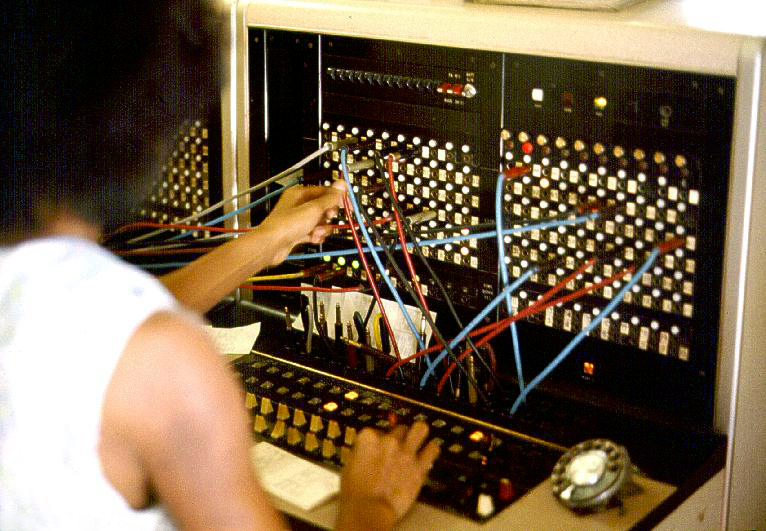

# Port-forward to debug

*kubectl port-forward opens a temporary, manual tunnel from a port on your machine straight to one specific pod's port - bypassing load-balancing entirely so you can poke at exactly the misbehaving instance, not whichever one happens to answer next.*

> One test-runner pod out of six is returning strange results, but the Service in front of it
> load-balances across all six - curl the Service's address and there's no way to guarantee the
> request even lands on the ONE pod acting up. Redeploying with a NodePort or LoadBalancer just to
> debug one suspicious pod is way too much ceremony for a question that should take thirty seconds
> to answer. What's needed is a direct, temporary, one-pod-only connection - and that's exactly
> what `kubectl port-forward` is built to open.

> **In real life**
>
> A manual telephone switchboard operator patching one specific call through by hand, not the
> automatic exchange that routes any call to any available line. An operator plugging a cord from
> one jack straight into another creates a single, temporary, deliberately-chosen connection
> between exactly two points - pull the cord and the connection is gone, plug it into a different
> jack and you've connected somewhere else entirely. That's a direct, manual, one-to-one patch, not
> the automatic system's job of routing every call to whichever operator or line is next available.
> `kubectl port-forward` is the same deliberate, temporary, one-to-one patch cord - straight to one
> named pod, gone the moment you disconnect it.

**kubectl port-forward**: kubectl port-forward is a kubectl subcommand that opens a temporary tunnel from a port on your local machine to a port inside one specific pod, proxied through the Kubernetes API server - traffic sent to `localhost:<local-port>` on your machine is forwarded straight to `<remote-port>` inside that pod, and responses come straight back, without ever touching a Service, Ingress, or any other pod. The tunnel exists only for as long as the kubectl process stays running; closing it (Ctrl+C) or the pod itself dying ends the connection immediately, and reaching a DIFFERENT pod - even a replacement for the same crashed one - requires starting a new port-forward naming that pod specifically.

## A direct line to one pod, not a route to whichever pod answers

- **It bypasses load-balancing on purpose.** `kubectl port-forward pod/test-runner-7f8d 8080:5000`
  reaches THAT pod, specifically, every single time - exactly the property you want when
  debugging one suspected-bad instance among several identical-looking ones.
- **It also works against a Service or Deployment name**, but resolves to one backing pod for
  that connection's lifetime - convenient for not having to look up a pod's random suffix first,
  while still ultimately pinning you to one instance once the tunnel opens.
- **No cluster-level exposure required.** Unlike a NodePort or LoadBalancer Service, nothing about
  the cluster's actual networking configuration changes - the tunnel exists only inside the
  `kubectl port-forward` process running on your machine, authenticated with your own kubeconfig.
- **It dies with the pod, or with your terminal.** A crashed-and-replaced pod gets a new pod
  identity; the old tunnel doesn't follow it. Closing the terminal (or losing your network
  connection) closes the tunnel too - there's nothing persistent about it by design.

> **Tip**
>
> Forward by Service name (`kubectl port-forward svc/my-app 8080:80`) when you don't care exactly
> which pod answers, and by pod name (`kubectl port-forward pod/my-app-7f8d 8080:80`) when you do.
> Reaching for the pod-specific form out of habit, even when any healthy pod would do, is a fine
> default - it costs nothing and removes one variable if something later looks inconsistent.

> **Common mistake**
>
> Treating "connection refused" after a working port-forward session as evidence the FIX you just
> applied didn't work, without first checking whether the pod restarted. A crash-and-restart (or a
> rollout replacing the pod) silently kills the existing tunnel - the very first thing to check
> after any port-forward session suddenly stops working is `kubectl get pod <name>`, to see whether
> that pod even still exists under that name, before assuming anything about your actual change.


*Jersey Telecom switchboard and operator, 1975 — Joseph A. Carr, Wikimedia Commons, Attribution. [Source](https://commons.wikimedia.org/wiki/File:Jersey_Telecom_switchboard_and_operator.jpg)*
- **A hand plugging one cord into one jack — the tunnel being opened** — This single, deliberate action is `kubectl port-forward` itself: one specific connection, made by hand, to one specific destination - not an automatic routing decision made by the system on your behalf.
- **The tangle of colored patch cords already in place — every OTHER active connection** — Each cord represents someone else's separate, independent tunnel - one operator managing many simultaneous one-to-one connections at once, the same way you could run several port-forward sessions to different pods in different terminals simultaneously, each entirely independent of the others.
- **The rows of numbered jacks across the panel — every possible destination port** — Each socket is a specific, addressable destination - just as each pod has specific container ports a tunnel can be aimed at. Plugging into the WRONG jack reaches the wrong destination entirely, same as forwarding to the wrong port number inside a pod.
- **The rotary telephone in the foreground — the client making the request** — The caller doesn't know or care how the connection was routed - they just dial and expect an answer. That's `curl localhost:8080` from your own machine: simple on your end, while the operator's hands (kubectl) are doing the actual, deliberate patching behind the scenes.

**One port-forward session, open to closed - press Play**

1. **kubectl port-forward pod/test-runner-7f8d-x2k9p 8080:5000** — kubectl opens a tunnel through the API server straight to port 5000 inside that one named pod, and blocks, holding the connection open.
2. **You run curl localhost:8080/debug/last-run in another terminal** — The request travels through the tunnel to port 5000 inside test-runner-7f8d-x2k9p specifically - no Service, no load-balancing, no other pod involved.
3. **The response comes straight back through the same tunnel** — You're now debugging exactly the pod you suspected, with certainty about which instance answered - not a guess.
4. **The pod crashes and Kubernetes replaces it with a new pod identity** — The tunnel was pointed at a pod name that no longer exists - it drops immediately, and further requests get connection refused.
5. **A new port-forward, naming the NEW pod, is required to keep debugging** — There is no 'reconnect' - the tunnel was always tied to one specific pod's specific lifetime, by design.

Every rule in this note comes back to the same fact: a port-forward tunnel is a connection to one
POD, not to a SERVICE, a DEPLOYMENT, or an abstract "the app" - and it only lives as long as that
one pod and your local kubectl process both do.

*Run it - a port-forward tunnel simulation: pin to one pod, drop on restart (Python)*

```python
class PortForwardTunnel:
    """A minimal simulation of \`kubectl port-forward pod/<name> <local>:<remote>\`:
    a temporary tunnel mapping a port on YOUR machine to a port inside one specific
    pod - it exists only as long as the kubectl process runs, and only reaches that
    one pod, not the whole Service."""
    def __init__(self, pod_name, local_port, remote_port):
        self.pod_name = pod_name
        self.local_port = local_port
        self.remote_port = remote_port
        self.open = False

    def start(self):
        self.open = True
        return (f"Forwarding from 127.0.0.1:{self.local_port} -> {self.pod_name}:{self.remote_port} "
                f"(this terminal now blocks; Ctrl+C closes the tunnel)")

    def send_request(self, path):
        if not self.open:
            return f"  GET localhost:{self.local_port}{path} -> connection refused (tunnel is closed)"
        return f"  GET localhost:{self.local_port}{path} -> forwarded to {self.pod_name}:{self.remote_port}{path} -> 200 OK"

    def pod_restarts(self):
        # A restarted pod gets a NEW pod identity - kubectl's port-forward doesn't
        # follow it, unlike a Service, which would just route to the new pod.
        self.open = False
        return f"  {self.pod_name} restarted (new pod identity) - existing tunnel drops"

print("--- Debugging a suspicious test-runner pod directly, bypassing its Service ---")
tunnel = PortForwardTunnel(pod_name="test-runner-7f8d-x2k9p", local_port=8080, remote_port=5000)
print(tunnel.start())
print(tunnel.send_request("/health"))
print(tunnel.send_request("/debug/last-run"))

print()
print("--- The pod crashes and Kubernetes replaces it with a new pod ---")
print(tunnel.pod_restarts())
print(tunnel.send_request("/health"))
print("  -> a NEW \`kubectl port-forward\` against the new pod name is required; this one is dead")

print()
print("--- Why this differs from just curling the Service ---")
print("  A Service load-balances across every ready pod behind it - useful for real traffic,")
print("  USELESS for debugging ONE specific misbehaving pod, since the next request might")
print("  land on a different, perfectly healthy pod. port-forward pins you to exactly one pod.")
```

Same tunnel simulation in Java:

*Run it - a port-forward tunnel simulation: pin to one pod, drop on restart (Java)*

```java
public class Main {
    static class PortForwardTunnel {
        String podName;
        int localPort;
        int remotePort;
        boolean open = false;

        PortForwardTunnel(String podName, int localPort, int remotePort) {
            this.podName = podName;
            this.localPort = localPort;
            this.remotePort = remotePort;
        }

        String start() {
            open = true;
            return "Forwarding from 127.0.0.1:" + localPort + " -> " + podName + ":" + remotePort
                    + " (this terminal now blocks; Ctrl+C closes the tunnel)";
        }

        String sendRequest(String path) {
            if (!open) {
                return "  GET localhost:" + localPort + path + " -> connection refused (tunnel is closed)";
            }
            return "  GET localhost:" + localPort + path + " -> forwarded to " + podName + ":" + remotePort
                    + path + " -> 200 OK";
        }

        String podRestarts() {
            open = false;
            return "  " + podName + " restarted (new pod identity) - existing tunnel drops";
        }
    }

    public static void main(String[] args) {
        System.out.println("--- Debugging a suspicious test-runner pod directly, bypassing its Service ---");
        PortForwardTunnel tunnel = new PortForwardTunnel("test-runner-7f8d-x2k9p", 8080, 5000);
        System.out.println(tunnel.start());
        System.out.println(tunnel.sendRequest("/health"));
        System.out.println(tunnel.sendRequest("/debug/last-run"));

        System.out.println();
        System.out.println("--- The pod crashes and Kubernetes replaces it with a new pod ---");
        System.out.println(tunnel.podRestarts());
        System.out.println(tunnel.sendRequest("/health"));
        System.out.println("  -> a NEW \`kubectl port-forward\` against the new pod name is required; this one is dead");

        System.out.println();
        System.out.println("--- Why this differs from just curling the Service ---");
        System.out.println("  A Service load-balances across every ready pod behind it - useful for real traffic,");
        System.out.println("  USELESS for debugging ONE specific misbehaving pod, since the next request might");
        System.out.println("  land on a different, perfectly healthy pod. port-forward pins you to exactly one pod.");
    }
}
```

### Your first time: Your mission: tunnel to one pod and watch it drop on restart

- [ ] Pick any running pod you have access to and run `kubectl port-forward pod/<name> 8080:<container-port>` — Confirm it prints 'Forwarding from 127.0.0.1:8080' and appears to hang - that hanging IS the tunnel staying open.
- [ ] In a second terminal, curl or open `localhost:8080` in a browser — Confirm the response is really coming from that one pod (check a pod-specific detail in the response if one exists, like a hostname or pod name environment variable).
- [ ] Deliberately kill that pod (`kubectl delete pod <name>`) — Watch the port-forward terminal - it should report the connection closing or error out almost immediately.
- [ ] Find the NEW pod's name (if something recreated it) and start a fresh port-forward against it — Confirm the old terminal's tunnel does NOT recover on its own - a brand new command is required.

You've now watched a tunnel die with its pod firsthand, instead of taking this note's word for it
- the difference between "the tunnel reconnects automatically" (it doesn't) and "you need a new
one" is no longer a guess.

- **`kubectl port-forward` immediately errors with something like 'unable to forward port because pod is not running'.**
  Check `kubectl get pod <name>` first - a pod that's Pending, CrashLoopBackOff, or already deleted has no running container to forward a port INTO. Fix the pod's actual state before troubleshooting the tunnel.
- **A previously-working port-forward session starts returning connection refused with no changes on your end.**
  Check whether the pod restarted or was replaced (`kubectl get pod <name>` and its AGE/RESTARTS columns) - the tunnel doesn't survive that, and needs to be re-run against whatever pod currently exists.
- **`kubectl port-forward` fails immediately with an error about the local port already being in use.**
  Something else on your machine (maybe an earlier, still-running port-forward you forgot about) already holds that local port - pick a different local port number, or find and stop the earlier session.

### Where to check

- **`kubectl port-forward pod/<name> <local>:<remote>`** — the direct, temporary, one-pod-only tunnel this note is about.
- **`kubectl get pod <name> -o wide`** — confirms the pod still exists under that name before assuming anything about the tunnel itself is broken.
- **The pod's actual container port** (`kubectl describe pod <name>`, `containerPort`) — forwarding to the wrong remote port looks identical to the pod being broken; it isn't.
- **[[kubernetes-and-test-infrastructure/test-workloads-on-k8s/reading-pod-logs]]** — once you're inside the pod's own responses via a tunnel, its logs are the next place to look for why they look wrong.

### Worked example: a 'fix' that looked broken because the tunnel, not the fix, had died

1. A tester port-forwards to a suspicious test-runner pod, confirms a bug via its
   `/debug/last-run` endpoint, and asks a developer to deploy a fix.
2. After the fix deploys, the tester re-curls `localhost:8080/debug/last-run` through what they
   believe is the SAME still-open tunnel from earlier, and gets connection refused.
3. Their first assumption is that the fix broke something. But `kubectl get pod` shows the
   ORIGINAL pod name from step 1 no longer exists - the deploy replaced it with a new pod, a
   completely expected result of deploying a fix.
4. The tunnel was never going to survive a deploy - it was pinned to the old pod's identity by
   design, and closing "connection refused" is exactly what an intentionally-replaced pod's old
   tunnel looks like, not evidence of a new bug.
5. Finding: "Re-ran `kubectl port-forward` against the new pod name, confirmed the fix actually
   works. The 'broken fix' was a stale tunnel, not a regression." Confirmed by checking pod
   identity before concluding anything about the fix itself.

**Quiz.** After a developer deploys a fix, a tester's previously-working `kubectl port-forward` session to a pod starts returning connection refused. What should the tester check FIRST, before concluding the fix is broken?

- [ ] Whether the local port number was typed correctly in the original port-forward command
- [x] Whether the specific pod the tunnel was opened against still exists under that same name, since a deploy commonly replaces pods entirely
- [ ] Whether their internet connection to the cluster's cloud provider has gone down
- [ ] Whether kubectl itself needs to be reinstalled, since port-forward sessions sometimes corrupt after a period of use

*This note is explicit that a port-forward tunnel is pinned to one specific pod's identity and does not survive that pod being replaced - a deploy is one of the most common, expected reasons for exactly that to happen, and checking `kubectl get pod` for whether the original pod still exists is the fast, direct way to confirm it. Option one would have caused failures from the very first request, not a sudden change after a deploy. Option three and four are generic troubleshooting reaches that ignore the specific, well-known cause this note already covers - a stale tunnel pointed at a pod that no longer exists.*

- **kubectl port-forward, in one line** — A temporary tunnel from a local port straight to one specific pod's port, bypassing Services and load-balancing entirely.
- **Why it's useful for debugging specifically** — It pins you to exactly ONE pod, unlike a Service, where the next request might land on a different, healthy pod and hide the one that's actually misbehaving.
- **What kills an open tunnel** — Closing kubectl (Ctrl+C or the terminal), or the target pod being restarted/replaced - the tunnel does not survive either and does not reconnect automatically.
- **Forwarding to a Service vs a pod by name** — Both work, but forwarding to a Service still resolves to one backing pod for that connection's lifetime - naming the pod directly is the more deliberate, unambiguous choice.
- **The switchboard operator analogy** — A manual, one-to-one patch cord plugged straight into a specific jack - deliberate and temporary, not the automatic exchange's job of routing any call to any available line.

### Challenge

Open a `kubectl port-forward` session to any pod you have access to, and successfully make one
request through it (curl, or a browser). Then, without stopping the port-forward process
yourself, delete that pod directly (`kubectl delete pod <name>`) and try the SAME request again
through the SAME tunnel. Write down exactly what error you get, and then start a fresh
port-forward against whatever pod exists now (if anything replaced it) to confirm a new tunnel is
genuinely required, not just a retry of the old command.

### Ask the community

> My `kubectl port-forward` session to a pod keeps silently dropping every few minutes even though the pod itself stays Running the whole time (confirmed via `kubectl get pod -w` in another terminal). What usually causes a tunnel to drop without the pod actually restarting?

Useful replies usually ask about API server timeouts, an idle local network connection dropping,
or a laptop sleeping/losing wifi mid-session - a tunnel can die from something on YOUR end or the
API server's connection handling, not only from the pod's own lifecycle.

- [Kubernetes docs — Use Port Forwarding to Access Applications in a Cluster](https://kubernetes.io/docs/tasks/access-application-cluster/port-forward-access-application-cluster/)
- [kubectl reference — port-forward](https://kubernetes.io/docs/reference/generated/kubectl/kubectl-commands#port-forward)
- [Lukonde Mwila — Port Forwarding in Kubernetes with kubectl](https://www.youtube.com/watch?v=Ab3PjErW37M)

🎬 [Lukonde Mwila — Port Forwarding in Kubernetes with kubectl](https://www.youtube.com/watch?v=Ab3PjErW37M) (7 min)

- kubectl port-forward opens a temporary tunnel from a local port straight to one specific pod, bypassing Services and load-balancing entirely.
- That directness is exactly why it's the right tool for debugging one suspected-bad pod among several identical-looking ones.
- The tunnel is pinned to one pod's identity and dies when that pod restarts or is replaced, or when kubectl itself stops - it never reconnects on its own.
- Forwarding to a Service or Deployment name still resolves to one backing pod for the connection's lifetime; naming the pod directly is more deliberate.
- Before assuming a fix is broken when a tunnel suddenly refuses connections, check whether the pod it was pointed at still exists under that name.


## Related notes

- [[Notes/kubernetes-and-test-infrastructure/kubernetes-in-plain-words/kubectl-survival-kit|kubectl survival kit]]
- [[Notes/docker-and-containers-for-testers/docker-hands-on/debugging-a-container|Debugging a container]]
- [[Notes/kubernetes-and-test-infrastructure/test-workloads-on-k8s/reading-pod-logs|Reading pod logs]]


---
_Source: `packages/curriculum/content/notes/kubernetes-and-test-infrastructure/test-workloads-on-k8s/port-forward-to-debug.mdx`_
