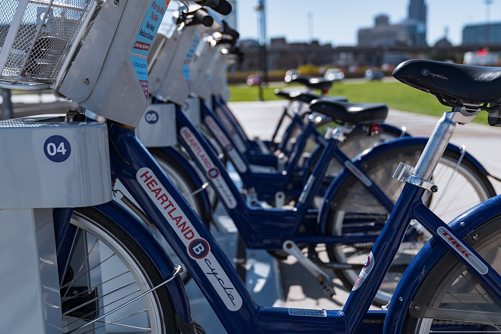

# Selenium Grid on K8s (dynamic grid)

*A static Selenium Grid runs a fixed pool of browser nodes whether anyone is testing or not. A dynamic grid on Kubernetes creates a fresh node pod per test session and tears it down right after - capacity that actually tracks demand.*

> A cross-browser suite needs twelve parallel sessions for twenty minutes, twice a day, and zero
> sessions the other twenty-three hours and twenty minutes. A static Selenium Grid sized for
> twelve nodes runs all twelve, all day, whether anyone is testing or not - twelve idle browser
> containers holding memory and CPU hostage for nothing. A dynamic grid on Kubernetes asks a
> different question entirely: not "how many nodes should always exist," but "how many nodes exist
> RIGHT NOW, for the sessions that are RIGHT NOW actually running."

> **In real life**
>
> A bike-share docking station, not a fleet of company cars sitting in a lot all day. Each numbered
> dock holds a bike only until someone actually needs it; take one out, and the dock is free for
> the system to route the next bike into. The station's real capacity is never "all the bikes it
> could ever hold" - it's whatever is currently docked, which rises and falls with actual demand
> throughout the day. A dynamic Selenium Grid manages browser node pods the same way: a node exists
> for exactly the lifetime of the session that needed it, not a moment longer.

**Dynamic Selenium Grid**: A dynamic Selenium Grid on Kubernetes is a Selenium Grid 4 deployment where the HUB (or router) does not talk to a fixed, pre-started pool of browser NODES - instead, when a new session is requested, the hub asks Kubernetes to create a fresh node pod (via the Kubernetes API, often through a Helm chart like docker-selenium's), waits for it to become ready, routes the session to it, and lets Kubernetes tear that pod down once the session ends. Node count at any moment equals concurrent sessions in progress, bounded by a configured maximum - unlike a STATIC grid (docker-compose or a fixed Deployment replica count), where the node pool's size is set once and stays constant regardless of whether it is being used.

## Capacity that tracks demand, not a guess made once

- **A static grid's size is a guess, made once, that's wrong most of the time.** Size it for
  peak parallel load and it's mostly idle; size it for average load and peak runs queue up
  behind a bottleneck. There is no size that's correct both at 3 AM and during a release-day
  test sprint.
- **A dynamic grid's node count is a fact, not a guess.** At any instant, the number of running
  browser-node pods is exactly the number of sessions currently executing, up to a configured
  ceiling - it inherently right-sizes itself without anyone predicting load in advance.
- **The tradeoff: cold-start latency.** A static grid's nodes are already warm and waiting; a
  dynamic grid pays a pod-scheduling and image-pull cost (often several seconds) on the FIRST
  session after a quiet period, before that session's browser is actually ready to receive
  commands.
- **The hub itself is still a single logical point of coordination.** Making nodes dynamic
  doesn't make the hub disposable - if the hub pod is under-resourced or single-replica, it can
  become the actual bottleneck even while nodes scale fine underneath it.

> **Tip**
>
> Watch `kubectl get pods -l app=selenium-node -w` while a parallel suite runs. Watching node pods
> appear as sessions start and disappear as they finish makes the entire "capacity equals current
> demand" model concrete in a way reading the YAML never quite does.

> **Common mistake**
>
> Assuming a dynamic grid has effectively unlimited capacity because nodes are created on demand.
> The cluster itself still has a fixed amount of CPU and memory - request twenty parallel sessions
> against a cluster that can only schedule eight node pods at once, and the other twelve simply
> queue at the hub waiting for a node slot to free up, exactly like a static grid at capacity. The
> elasticity is real, but it is elastic UP TO the cluster's actual resources, not infinite.


*Heartland B-cycle - Bike Sharing / Rental Station Dock in Omaha, Nebraska — Tony Webster, Wikimedia Commons, CC BY 2.0. [Source](https://commons.wikimedia.org/wiki/File:Heartland_B-cycle_-_Bike_Sharing_Rental_Station_Dock_in_Omaha,_Nebraska_(44929568391).jpg)*
- **Dock 04, currently holding a bike — a node pod, currently idle-ready** — This specific numbered slot is occupied right now, but it isn't permanent - it's occupied only until someone actually checks the bike out. A node pod sitting ready between sessions is the same kind of temporary occupancy, not a fixed fleet member.
- **The row of docked bikes fading into the background — current capacity, not maximum capacity** — This is how many bikes happen to be docked RIGHT NOW - not the station's theoretical maximum, and not a number anyone chose in advance for today specifically. It's simply whatever the current state of supply and demand has produced, exactly like a dynamic grid's live node count.
- **The blurred city skyline — demand happening elsewhere, out of frame** — Bikes are being checked out and returned at OTHER stations across the city right now, invisible from this one dock. A cluster running a dynamic grid alongside other workloads has the same property: node pods compete for the same underlying cluster resources as everything else scheduled on it.
- **The sticker instructing riders how to dock a bike — the teardown step** — Returning a bike properly frees the dock for the next rider; a bike left improperly docked stays 'checked out' and blocks that slot. A node pod that isn't cleanly torn down after its session (a crashed hub connection, a hung browser process) can leave a cluster slot occupied long after the test that used it finished.

**One test session's node pod, birth to teardown - press Play**

1. **A test asks the hub for a new session (POST /session, desiredCapabilities: chrome)** — The hub checks current node count against the configured maximum before doing anything else.
2. **Capacity is available: the hub asks Kubernetes to create one browser-node pod** — Kubernetes schedules and starts the pod - this is the cold-start cost if the cluster hasn't run a Chrome node recently and needs to pull the image.
3. **The node pod becomes Ready and registers with the hub** — The hub routes this session's commands to this one specific pod for the session's entire lifetime.
4. **The test finishes and calls DELETE /session** — The hub tells Kubernetes this node pod is no longer needed.
5. **The node pod is torn down; cluster capacity is freed** — Total node count drops back toward zero if nothing else is running - the pod existed for exactly this one session's lifetime, nothing more.

The whole design collapses to one sentence: don't keep browsers running because a test MIGHT
start soon - start a browser because a test just DID.

*Run it - a dynamic grid capacity allocator: dispatch, queue, and reuse (Python)*

```python
class DynamicGrid:
    """A minimal simulation of a dynamic Selenium Grid: the hub creates a fresh
    browser-node pod per session request, up to max_nodes, and queues the rest."""
    def __init__(self, max_nodes):
        self.max_nodes = max_nodes
        self.active_nodes = 0
        self.queue = []
        self.sessions_run = 0

    def request_session(self, test_name, browser):
        if self.active_nodes < self.max_nodes:
            self.active_nodes += 1
            self.sessions_run += 1
            return (f"  {test_name} ({browser}): node started - "
                    f"{self.active_nodes}/{self.max_nodes} nodes active")
        self.queue.append((test_name, browser))
        return f"  {test_name} ({browser}): QUEUED - all {self.max_nodes} nodes busy ({len(self.queue)} waiting)"

    def finish_session(self, test_name):
        self.active_nodes -= 1
        result = [f"  {test_name}: session done, node torn down - {self.active_nodes}/{self.max_nodes} nodes active"]
        if self.queue:
            next_name, next_browser = self.queue.pop(0)
            self.active_nodes += 1
            self.sessions_run += 1
            result.append(f"  {next_name} ({next_browser}): dequeued, node started - "
                           f"{self.active_nodes}/{self.max_nodes} nodes active")
        return "\\n".join(result)

grid = DynamicGrid(max_nodes=2)
print(f"--- Dynamic grid, max_nodes={grid.max_nodes} - 4 parallel test sessions requested ---")
print(grid.request_session("login-test", "chrome"))
print(grid.request_session("checkout-test", "firefox"))
print(grid.request_session("search-test", "chrome"))   # over capacity -> queued
print(grid.request_session("signup-test", "webkit"))    # over capacity -> queued

print()
print("--- login-test finishes first; its node is torn down and reused ---")
print(grid.finish_session("login-test"))

print()
print("--- checkout-test finishes; the last queued session finally gets a node ---")
print(grid.finish_session("checkout-test"))

print()
print(f"Total sessions run so far: {grid.sessions_run}, nodes still active: {grid.active_nodes}, "
      f"still queued: {len(grid.queue)}")
print()
print("--- Why this differs from a static Grid ---")
print("  A static Selenium Grid (docker-compose or a fixed node pool) has the SAME")
print("  max_nodes whether traffic is 0 or overloaded - idle nodes still cost money.")
print("  A dynamic K8s grid scales active_nodes toward 0 when nothing is running, and")
print("  only pays for a node pod for the exact lifetime of one test session.")
```

Same allocator in Java:

*Run it - a dynamic grid capacity allocator: dispatch, queue, and reuse (Java)*

```java
import java.util.*;

public class Main {
    static class DynamicGrid {
        int maxNodes;
        int activeNodes = 0;
        int sessionsRun = 0;
        List<String[]> queue = new ArrayList<>();

        DynamicGrid(int maxNodes) {
            this.maxNodes = maxNodes;
        }

        String requestSession(String testName, String browser) {
            if (activeNodes < maxNodes) {
                activeNodes++;
                sessionsRun++;
                return "  " + testName + " (" + browser + "): node started - "
                        + activeNodes + "/" + maxNodes + " nodes active";
            }
            queue.add(new String[]{testName, browser});
            return "  " + testName + " (" + browser + "): QUEUED - all " + maxNodes
                    + " nodes busy (" + queue.size() + " waiting)";
        }

        String finishSession(String testName) {
            activeNodes--;
            StringBuilder sb = new StringBuilder();
            sb.append("  ").append(testName).append(": session done, node torn down - ")
                    .append(activeNodes).append("/").append(maxNodes).append(" nodes active");
            if (!queue.isEmpty()) {
                String[] next = queue.remove(0);
                activeNodes++;
                sessionsRun++;
                sb.append("\\n  ").append(next[0]).append(" (").append(next[1])
                        .append("): dequeued, node started - ").append(activeNodes)
                        .append("/").append(maxNodes).append(" nodes active");
            }
            return sb.toString();
        }
    }

    public static void main(String[] args) {
        DynamicGrid grid = new DynamicGrid(2);
        System.out.println("--- Dynamic grid, max_nodes=" + grid.maxNodes + " - 4 parallel test sessions requested ---");
        System.out.println(grid.requestSession("login-test", "chrome"));
        System.out.println(grid.requestSession("checkout-test", "firefox"));
        System.out.println(grid.requestSession("search-test", "chrome"));
        System.out.println(grid.requestSession("signup-test", "webkit"));

        System.out.println();
        System.out.println("--- login-test finishes first; its node is torn down and reused ---");
        System.out.println(grid.finishSession("login-test"));

        System.out.println();
        System.out.println("--- checkout-test finishes; the last queued session finally gets a node ---");
        System.out.println(grid.finishSession("checkout-test"));

        System.out.println();
        System.out.println("Total sessions run so far: " + grid.sessionsRun + ", nodes still active: "
                + grid.activeNodes + ", still queued: " + grid.queue.size());
        System.out.println();
        System.out.println("--- Why this differs from a static Grid ---");
        System.out.println("  A static Selenium Grid (docker-compose or a fixed node pool) has the SAME");
        System.out.println("  max_nodes whether traffic is 0 or overloaded - idle nodes still cost money.");
        System.out.println("  A dynamic K8s grid scales active_nodes toward 0 when nothing is running, and");
        System.out.println("  only pays for a node pod for the exact lifetime of one test session.");
    }
}
```

### Your first time: Your mission: watch node pods appear and disappear with real demand

- [ ] Deploy a dynamic Selenium Grid to any cluster you can reach (the docker-selenium Helm chart, or a local minikube/kind cluster) — Confirm the hub is running with `kubectl get pods -l app=selenium-hub` before touching anything else.
- [ ] In one terminal, run `kubectl get pods -l app=selenium-node -w` — Leave this running - it's your live view of node count.
- [ ] In another terminal, fire off 2-3 parallel WebDriver sessions against the hub — Watch node pods appear in the first terminal as each session starts.
- [ ] Let all sessions finish, then keep watching for a minute — Confirm node pods are torn down after their session ends, not left running - this is the entire point of 'dynamic' versus 'static'.

You've now watched capacity track real demand in real time, instead of trusting a diagram - the
cold-start delay on the first session, and the teardown after the last one, are both things you
now have first-hand evidence for.

- **Sessions queue for a long time even though `kubectl get pods` shows plenty of node pods running.**
  Check the hub's configured maximum node/session count first - a dynamic grid still enforces its own ceiling independent of what the cluster could theoretically schedule. Raising that limit (if cluster resources allow) is a config change, not a cluster problem.
- **The very first session after a quiet period takes noticeably longer than the rest to actually start executing commands.**
  This is the cold-start cost: pod scheduling plus, often, pulling the node's container image if it isn't already cached on that cluster node. It's expected behavior for a dynamic grid, not a bug - if it's unacceptably slow, look at keeping the node images pre-pulled on cluster nodes rather than at the grid's logic.
- **Everything queues at the hub even though individual node pods start quickly once scheduled.**
  The hub itself may be under-resourced or single-replica and unable to keep up with registration/routing traffic - check the HUB pod's own CPU/memory and logs, not just the nodes. Dynamic node scaling doesn't remove the hub as a potential bottleneck.

### Where to check

- **`kubectl get pods -l app=selenium-node -w`** — the live, ground-truth view of current node count versus current demand.
- **The hub's `/status` or `/graphql` endpoint** — reports current session count and queue length directly from the grid's own perspective, not inferred from pod counts alone.
- **The hub pod's own resource usage and logs** — the place to look when nodes scale fine but sessions still queue.
- **[[kubernetes-and-test-infrastructure/kubernetes-in-plain-words/pods-deployments-services]]** — the underlying Kubernetes objects a dynamic grid is built out of, worth understanding before debugging one.

### Worked example: a release-day suite that queued despite 'dynamic, unlimited' node scaling

1. A release-day cross-browser suite requests twenty parallel sessions against a dynamic grid the
   team believed had "basically unlimited" capacity, since nodes are created on demand.
2. `kubectl get pods -l app=selenium-node` shows only eight node pods running, and the hub reports
   twelve sessions still queued - clearly not unlimited in practice today.
3. `kubectl describe nodes` shows the CLUSTER itself is at its CPU allocation limit with eight
   browser-node pods already scheduled - there is no room to schedule a ninth, regardless of what
   the grid's own hub-side maximum is configured to allow.
4. This isn't a grid misconfiguration; it's the cluster's actual compute capacity, which is a
   separate ceiling from the grid's own settings.
5. Finding: "Dynamic scaling is elastic UP TO the cluster's real resources, not infinite. Either
   run this suite with a lower parallelism target, or provision more cluster capacity for
   release-day windows specifically." Confirmed by checking node-level resource usage, not just
   the grid's own reported state.

**Quiz.** A team deploys a dynamic Selenium Grid and assumes it now has effectively unlimited parallel test capacity, since node pods are created on demand instead of pre-provisioned. What is the flaw in that assumption?

- [ ] There is no flaw - dynamic grids genuinely have unlimited capacity by design
- [x] The cluster's actual CPU and memory are still a hard ceiling; node pods can only be created up to what the cluster can actually schedule, so demand beyond that still queues
- [ ] Dynamic grids can only ever run one session at a time, making them slower than static grids in every case
- [ ] The hub becomes unnecessary once nodes are dynamic, so there's nothing left to bottleneck

*This note is explicit that dynamic scaling is elastic UP TO the cluster's real resources, not infinite - a cluster that can only schedule eight node pods will queue a ninth session no matter how the grid is configured. Option one directly contradicts the worked example, where a supposedly 'unlimited' dynamic grid still queued sessions once the cluster hit its CPU allocation limit. Option three is false - parallelism is exactly what dynamic grids are built to support, up to the same real ceiling. Option four ignores that the hub remains a real, separate potential bottleneck even when node scaling itself works fine.*

- **Dynamic Selenium Grid, in one line** — The hub creates a fresh browser-node pod per session on demand and tears it down after, instead of running a fixed pool of nodes all the time.
- **Static grid's core weakness** — Its node count is a guess made once - idle most of the time, or a bottleneck during peak parallel load, with no size that's correct for both.
- **Dynamic grid's real tradeoff** — Right-sized capacity in exchange for cold-start latency on the first session after a quiet period, while the pod is scheduled and its image pulled.
- **The actual ceiling on a 'dynamic, unlimited' grid** — The cluster's real CPU/memory capacity - dynamic scaling is elastic up to what the cluster can schedule, not infinite.
- **The bike-share analogy** — A numbered dock holds a bike only until someone checks it out - current capacity is whatever's docked right now, not a fixed fleet sitting idle all day.

### Challenge

If you have access to any Kubernetes cluster (including a local minikube/kind cluster), deploy a
dynamic Selenium Grid (the docker-selenium Helm chart is the fastest path) and fire off 3-4
parallel WebDriver sessions against it while watching `kubectl get pods -l app=selenium-node -w`
in another terminal. Write down the exact sequence you observe: when each node pod appears,
which session it serves, and when it disappears. If you don't have cluster access, instead sketch
the same sequence from this note's FlowAnimation and note which two steps you'd expect to take the
longest in a real cluster, and why.

### Ask the community

> My dynamic Selenium Grid on Kubernetes queues sessions even though `kubectl get pods` shows fewer node pods than my configured max node count. What's usually the actual bottleneck when this happens - the hub, the cluster's scheduler, or something else?

Useful replies usually ask for the hub's own reported session/queue count (via its status
endpoint) alongside `kubectl describe nodes` output - comparing "what the grid thinks is
happening" against "what the cluster can actually schedule" is what narrows it down fastest.

- [Selenium docs — Selenium Grid](https://www.selenium.dev/documentation/grid/)
- [docker-selenium — the Helm chart most dynamic K8s grids are built on](https://github.com/SeleniumHQ/docker-selenium)
- [QAFox — Setting up Selenium Grid on Kubernetes and Running Selenium Scripts](https://www.youtube.com/watch?v=PPg7duXd8SA)

🎬 [QAFox — Setting up Selenium Grid on Kubernetes and Running Selenium Scripts](https://www.youtube.com/watch?v=PPg7duXd8SA) (38 min)

- A static Selenium Grid's node count is a guess made once; a dynamic grid on Kubernetes creates a node pod per session and tears it down after, tracking real demand instead.
- The tradeoff for right-sized capacity is cold-start latency: the first session after a quiet period pays a pod-scheduling and image-pull cost.
- Dynamic scaling is elastic up to the cluster's actual CPU/memory, not infinite - sessions still queue once the cluster itself is out of room to schedule new node pods.
- The hub remains a single logical coordination point even when nodes are dynamic - an under-resourced hub can bottleneck sessions even while node scaling works perfectly.
- Watch `kubectl get pods -l app=selenium-node -w` during a real parallel run to see capacity tracking demand directly, rather than trusting the architecture diagram alone.


## Related notes

- [[Notes/docker-and-containers-for-testers/containers-in-automation/selenium-grid-in-docker|Selenium Grid in Docker]]
- [[Notes/kubernetes-and-test-infrastructure/kubernetes-in-plain-words/pods-deployments-services|Pods, deployments, services]]
- [[Notes/kubernetes-and-test-infrastructure/test-workloads-on-k8s/running-tests-as-jobs|Running tests as Jobs]]


---
_Source: `packages/curriculum/content/notes/kubernetes-and-test-infrastructure/test-workloads-on-k8s/selenium-grid-on-k8s.mdx`_
