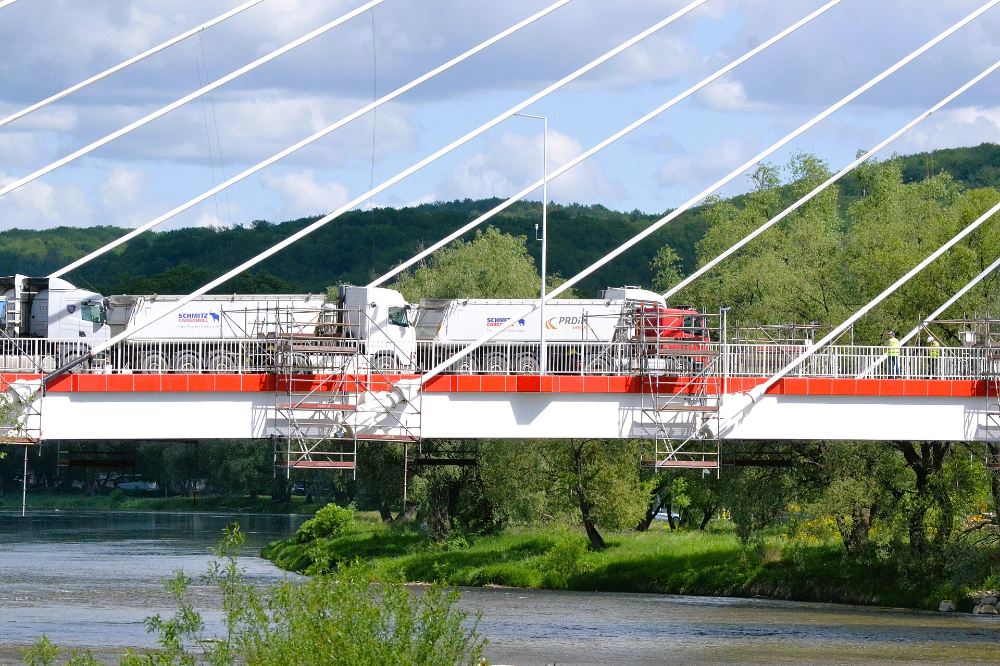

# Static vs dynamic testing

*Dynamic testing runs the software; static testing examines it without running anything - reviews, walkthroughs, requirement reading. Static finds bugs earlier and cheaper, provably.*

> Ask most people to picture "testing" and they picture a human clicking buttons, or a script hitting
> an API, watching for something to break. That picture is real — it's called dynamic testing, and
> it's most of what this platform trains. But there's a whole other category of testing that finds
> real bugs without executing a single line of code, before the code even exists in some cases, and
> the industry's own cost data says it's the cheapest bugs you'll ever catch. It's called static
> testing, and if your mental model of "testing" only includes running software, you've been skipping
> the most cost-effective half of the job.

> **In real life**
>
> A bridge gets checked twice before traffic ever crosses it. First, an engineer sits with the
> blueprints — no steel has been poured yet — and checks the load calculations by hand: does this
> support beam, on paper, actually hold the stated weight? Find an error here and the fix is an
> eraser and a recalculation, done before a single truck of concrete is ordered. Second, once the
> bridge is physically built, inspectors drive loaded trucks across it and watch strain gauges: does
> the REAL structure behave the way the math predicted? Find a problem here and the fix might mean
> reinforcing steel that's already been poured, welded, and buried under a road surface. Both checks
> matter — the blueprint review can't catch a manufacturing defect in the actual steel, and the
> truck test can't catch a math error before the concrete is already set. But notice which one is
> cheaper to be wrong in. That's the entire relationship between static and dynamic testing, and
> software has both kinds of bridges.

**static testing**: Testing performed WITHOUT executing the software: reviews, walkthroughs, inspections, and static analysis of code, requirements, or design documents. Per the ISTQB Foundation syllabus (a definition this platform already uses in qa-vs-qc-vs-testing), testing includes both static AND dynamic activities, and static testing can happen before any executable code exists at all - on a requirements document, a design diagram, or a user story. Contrast with dynamic testing: testing that DOES execute the software, observing its actual runtime behavior against inputs.

## Two ways to find the same bug, at two very different prices

**Dynamic testing** is the testing most people mean by default: you run the software, feed it
inputs, and observe what actually happens — a click, an API call, a script, a manual walkthrough of
a live app. It's the only way to confirm the software genuinely WORKS, because reading about
behavior is never the same as watching it happen. Every technique this platform has covered so
far — equivalence partitioning, boundary value analysis, black-box and white-box testing — describes
DIFFERENT ways of choosing what to run, but all of them assume something is running.

**Static testing** requires nothing to run at all. A requirements review where someone reads a user
story and asks "what happens if the field is empty — this doesn't say" is testing: it evaluates an
artifact and can find a real defect (an ambiguous or missing requirement), without a line of code
existing yet to execute. A code review, a walkthrough of a design diagram, and automated static
analysis tools (linters, type checkers, security scanners that read source without running it) are
all the same category: examining an artifact — requirements, design, or code — for defects, purely
by inspection. The QA-vs-QC note on this platform already put both halves in one sentence, straight
from the ISTQB syllabus: testing includes "both dynamic (running the software) and static (reviewing
code and documents without running them)."

## The bug class each one is structurally better at

Here's the part that isn't obvious until you've seen it happen twice: static and dynamic testing
don't just differ in WHEN they happen — they're structurally better at finding different bug
classes. A wrong assumption baked into a requirement (`"single-use"` meaning per-order when the
business actually meant per-customer, the exact example this platform's cost-of-defects note walks
through in full) is invisible to dynamic testing until code exists to run — and even once it does,
dynamic tests written against that same wrong requirement will happily pass forever, because they're
checking the code against the SAME misunderstanding that created the bug. Only a human reading the
requirement itself, asking "wait, per order or per customer?", catches it — and that's a static
check, full stop. Meanwhile, a race condition where two requests update the same row and one
silently overwrites the other is nearly invisible to a human reading code calmly at a desk — it
only shows up when the software actually RUNS under real concurrent load. That's dynamic testing's
home turf, and no amount of careful reading replaces watching it happen.


*Photo: Trucks during load testing of the new bridge in Sanok - Wikimedia Commons, CC BY-SA 4.0. [Source](https://commons.wikimedia.org/wiki/File:02026_0115_Trucks_during_load_testing_of_the_new_bridge_in_Sanok.jpg)*
- **The three loaded trucks parked on the deck - dynamic testing, literally** — The bridge is DONE - built, poured, cabled - and now it's being made to actually carry real weight, right now, to observe what genuinely happens. That's dynamic testing: running the system and watching its real behavior under real conditions, the only way to confirm what a blueprint review could only predict.
- **The engineers in hi-vis vests standing on the loaded deck** — They're not reading a drawing anymore - they're standing on the thing itself while it's under load, watching for deflection, listening for anything wrong. This is what dynamic testing looks like in the field: direct observation of the system doing its job, not a desk review of whether it SHOULD.
- **The cable-stay wires fanning down from the tower** — Every one of these cables was sized on a blueprint LONG before this test - a static review, checking the math before any steel existed. A defect caught there costs a recalculation; the same defect, undetected until right now with three loaded trucks on the deck, costs vastly more.
- **The bridge deck itself, already paved and railed** — Sealed, finished, structurally complete - like code that's already been built and shipped rather than a design still on paper. Testing at THIS stage is dynamic by necessity: you can no longer review a plan, you can only observe how the finished thing behaves.
- **The empty span of cables above, engineered and reviewed before construction began** — This geometry existed as calculations and drawings first - the static phase, cheap to correct, invisible in this photo because it already happened. The photo captures only the dynamic half of the story; the static half is what made this load test something the engineers were confident enough to run at all.

**One ambiguous requirement, caught (or not) at four different stages - press Play**

1. **A requirement is written: 'promo code applies once'** — No code exists yet. The sentence is ambiguous: once per order, or once per customer, forever? At this instant only STATIC testing is even possible, because there is nothing to run.
2. **Static check: a requirements review catches it** — A reviewer reads the sentence and asks the one clarifying question out loud. This is static testing in its purest, cheapest form - an artifact examined, a defect found, and it cost a five-minute conversation. This is exactly the cheapest point on the cost-of-defects curve.
3. **Missed there - static check on the code catches it instead** — Say the review gets skipped. A developer writes the logic exactly as (ambiguously) specified. A code reviewer, reading the diff without running it, notices the check only looks at order_id and asks the same question one stage later. Still static - still no code executed - but now a function has to be rewritten, not just a sentence.
4. **Missed there too - dynamic testing in QA catches it** — The ambiguous logic ships to a test build. Now, and only now, dynamic testing becomes possible: a tester actually RUNS the checkout flow, reapplies the same code on a second order, and watches it succeed when it should not. This is a real bug found by execution - but it now costs a full bug-report-fix-retest cycle.
5. **Missed everywhere - only production, running for real, reveals it** — The code ships. Real customers, running the real system, are the ones who finally 'execute the test' - at full dynamic-testing cost, plus a production incident, because nobody's review or run caught it earlier. Same one-sentence mistake; wildly different final price.

The [cost of defects](/notes/qa-foundations/why-testing-matters/cost-of-defects) note walked through
this exact escalation with real multipliers — requirements-stage catches cost roughly 1x, production
catches cost roughly 60x in that illustrative model. Static testing is precisely what makes the
cheapest stages on that curve reachable at all: it's the only kind of testing that can happen before
a single line of executable code exists. Here's that relationship made concrete — a simple static
checker that reads a requirement's TEXT for ambiguous words, run before any code exists, next to a
dynamic test that can only run once the (possibly still-wrong) code has been written:

*Run it - a static requirements check vs a dynamic code test (Python)*

```python
# STATIC TESTING: examine an ARTIFACT (plain text), execute nothing.
# This can run before a single line of application code exists.
def static_requirements_check(requirement_text):
    ambiguous_words = ["once", "fast", "some", "appropriate", "handles"]
    found = [w for w in ambiguous_words if w in requirement_text.lower()]
    return found

requirement = "The promo code applies once per checkout and gives a discount."
flags = static_requirements_check(requirement)
print("STATIC CHECK (no code running, nothing executed yet):")
print("  requirement text:", requirement)
print("  ambiguous words found:", flags)
print("  -> 'once' is flagged: once per ORDER, or once per CUSTOMER ever?")
print("  Cost to fix right now: one clarifying question. Zero code written.")

print()

# Time passes. A developer builds the (still ambiguous) requirement AS WRITTEN.
def apply_promo(order_id, customer_id, used_orders):
    # Bug: only checks per ORDER, matching the ambiguous requirement literally.
    if order_id in used_orders:
        return False
    used_orders.add(order_id)
    return True

# DYNAMIC TESTING: the code now exists, so we can actually RUN it.
used = set()
print("DYNAMIC TEST (executing the real function, order 1 then order 2):")
print("  same customer, order 1:", apply_promo("order-1", "cust-42", used))
print("  same customer, order 2:", apply_promo("order-2", "cust-42", used))
print("  Both return True: the promo applied twice for one customer.")
print("  This bug was only OBSERVABLE by running the code - and it now")
print("  costs a bug report, a fix, and a re-test, instead of one question.")
```

The same two-stage story in Java — a static scan of requirement text before any logic exists,
followed by the dynamic run that finally proves the bug is real:

*Run it - static requirements scan, then dynamic execution (Java)*

```java
import java.util.*;

public class Main {
    // STATIC TESTING: reads TEXT, executes nothing application-related.
    static List<String> staticRequirementsCheck(String text) {
        String[] ambiguousWords = {"once", "fast", "some", "appropriate", "handles"};
        List<String> found = new ArrayList<>();
        for (String w : ambiguousWords) {
            if (text.toLowerCase().contains(w)) found.add(w);
        }
        return found;
    }

    // The (still ambiguous) requirement, built exactly as written.
    static boolean applyPromo(String orderId, Set<String> usedOrders) {
        if (usedOrders.contains(orderId)) return false;
        usedOrders.add(orderId);
        return true;
    }

    public static void main(String[] args) {
        String requirement = "The promo code applies once per checkout and gives a discount.";
        List<String> flags = staticRequirementsCheck(requirement);
        System.out.println("STATIC CHECK (no code running, nothing executed yet):");
        System.out.println("  requirement text: " + requirement);
        System.out.println("  ambiguous words found: " + flags);
        System.out.println("  -> 'once' is flagged: once per ORDER, or once per CUSTOMER ever?");
        System.out.println("  Cost to fix right now: one clarifying question. Zero code written.");

        System.out.println();

        // DYNAMIC TESTING: the code now exists, so it can actually be run.
        Set<String> used = new HashSet<>();
        System.out.println("DYNAMIC TEST (executing the real method, order 1 then order 2):");
        System.out.println("  same customer, order 1: " + applyPromo("order-1", used));
        System.out.println("  same customer, order 2: " + applyPromo("order-2", used));
        System.out.println("  Both return true: the promo applied twice for one customer.");
        System.out.println("  Only observable by RUNNING the code - now a bug-fix cycle,");
        System.out.println("  not a one-sentence question.");
    }
}
```

> **Tip**
>
> When someone says "we don't have time to test until there's something to click," that sentence
> itself contains the fix: static testing needs nothing to click. A thirty-minute requirements review
> where someone reads the ticket out loud and asks "what happens when X is empty/negative/missing" is
> a real, complete testing activity — one this platform's cost-of-defects note shows sits at the
> cheapest point on the entire curve. You don't need a QA title or write access to a codebase to run
> one. You need the document and fifteen honest minutes before anyone starts coding against it.

### Your first time: Your mission: catch a bug before it can even be run

- [ ] Run the static check and read what it flags — The Python playground's static_requirements_check finds 'once' in the sample requirement, purely by reading text - no application code exists yet at this point in the story. Notice this check ran in milliseconds, on a sentence, with nothing to execute.
- [ ] Answer the ambiguity yourself, on paper, before reading further — Once per order, or once per customer, ever? Write your answer down. This is exactly the five-minute static-testing step a real requirements review performs - you just did it.
- [ ] Run the dynamic test and watch the SAME ambiguity become a real bug — apply_promo lets the same customer reuse the code across two different orders - the bug only becomes observable once code exists and actually runs. Compare how much LATER this catch happened versus your static answer in step 2.
- [ ] Fix the static flag, not just the dynamic symptom — In the code, change the check from tracking order_id to tracking customer_id, then re-run the dynamic test - it now correctly blocks the second use. But also rewrite the ORIGINAL requirement sentence to say 'once per customer, ever' - fixing only the code and leaving the ambiguous requirement in place guarantees the next feature built from it repeats the mistake.
- [ ] Find one ambiguous word in a real requirement or ticket you have access to — Look for words like 'appropriate', 'handles', 'fast', 'some', 'once' in any real user story or ticket. Ask the clarifying question out loud (or write it as a comment) before any code targeting it is written - that is a static test, performed by you, right now.

You've now caught the identical bug at two different stages and felt the price difference directly - the static catch cost a sentence, the dynamic catch cost a function rewrite and a retest.

- **A team treats 'testing' as something that only starts once a build exists to click on - requirements and designs get zero review before coding begins.**
  This is a team skipping the cheapest stage on the entire cost-of-defects curve by definition. Propose a lightweight static-testing habit that costs almost nothing: a fifteen-minute read-through of any ticket before it enters a sprint, with one job - flag ambiguous words and missing edge cases. No tooling, no process overhead, just reading before running.
- **Code reviews happen, but reviewers only check style and formatting, never whether the logic actually matches the ticket's requirement.**
  A code review that checks only style is a static activity that's stopped doing static testing's actual job: comparing an artifact against what it's supposed to do. Add one required reviewer question to the checklist - 'does this match the ticket, not just compile cleanly' - which turns a cosmetic pass into a genuine static defect-finding activity.
- **A team runs extensive dynamic (automated) test suites and assumes that coverage alone proves quality, while requirements reviews and code reviews are treated as optional friction.**
  Dynamic tests can only ever be as correct as the requirement they were written against - exactly like the promo-code example, where the dynamic test would have PASSED if it had been written to match the same ambiguous per-order assumption. High dynamic coverage of a wrong requirement is confidently wrong, not safe. Static review is what actually questions whether the requirement itself is right.
- **A static analysis tool (linter, type checker, security scanner) flags real issues, but the team ignores its output because 'it's just noise' or 'nothing's actually running yet so it doesn't count.'**
  Automated static analysis is still static testing - it examines code without executing it, and it is often the cheapest, fastest-running check available in the whole pipeline. Triage the noise once (tune the ruleset, silence genuine false positives) rather than discarding the entire category; a security scanner catching an injection risk before the code ever runs is the cost-of-defects curve working exactly as designed.

### Where to check

Static and dynamic testing both leave visible tracks on a real project - look here:

- **Requirements review meetings (or their absence)** - the purest static-testing checkpoint on any
  project, and per the [cost of defects](/notes/qa-foundations/why-testing-matters/cost-of-defects)
  note, the cheapest one. If nobody reads tickets before coding starts, this stage is missing
  entirely.
- **Pull request reviews** - a static activity by definition (reading a diff without running it).
  Check whether reviewers comment on LOGIC and requirement-matching, or only on style - that
  distinction is the difference between static testing and a formatting pass.
- **CI pipeline stages** - linters, type checkers, and security scanners running before tests even
  start are automated static testing; the test suite that actually executes the build is dynamic.
  Both should be present, and both should be treated as blocking, not decorative.
- **Bug tracker labels or root-cause fields** - when a postmortem asks "could this have been caught
  earlier," check whether the honest answer is "yes, in review" (a static miss) or "no, only by
  running it under real load" (a genuinely dynamic-only bug class).
- **Design docs and architecture diagrams** - a walkthrough of a sequence diagram before any service
  is built is static testing at the design level, one stage even earlier than a requirements review
  of a single ticket.

### Worked example: the static analysis warning nobody read for six months

1. **The setup:** a security static analysis tool has been running in CI for six months, on every
   pull request, flagging a specific pattern: string-concatenated SQL queries. It has flagged the
   same function, `search_orders_by_customer`, on every single run since it was written.
2. **What actually happened:** the warning was marked "known issue, low priority" in the first week
   and nobody revisited it. It never blocked a merge. It sat there, static and silent, doing exactly
   what static testing does - correctly identifying a defect without anything needing to run.
3. **Six months later, dynamic reality catches up:** a penetration test (a dynamic activity - it
   actually RUNS attack payloads against the live search endpoint) submits a crafted customer name
   containing SQL syntax, and the concatenated query executes it. The exact function the static
   scanner named six months earlier is the one that breaks.
4. **The postmortem's first finding, verbatim:** "this was flagged by our own static analysis on the
   very first PR that introduced it." The dynamic test that finally proved the vulnerability was
   real cost a full penetration-testing engagement; the static warning that named the exact same line
   cost nothing beyond reading it.
5. **The actual fix isn't just the SQL query** - it's a process change: static analysis findings
   above a severity threshold now block merges instead of being dismissible with a comment. The team
   converts a static finding that was easy to ignore into one that's structurally impossible to
   ignore.
6. **The lesson:** static testing had already found this bug, correctly, cheaply, six months before
   dynamic testing (in the much more expensive form of a real penetration test) confirmed it was
   exploitable. The tool didn't fail. The process for ACTING on static findings did.

> **Common mistake**
>
> Treating static testing as a lesser, "not real testing" activity because nothing visibly runs.
> Reading a requirement and catching an ambiguity, or reading a diff and catching a logic mismatch, is
> exactly as much "testing" as clicking through a UI — it evaluates an artifact against what it's
> supposed to be, and it finds real defects. The mirror mistake is just as common: assuming static
> checks alone are sufficient and skipping dynamic testing because "the code review looked fine." A
> static review can confirm code MATCHES its own internal logic and even matches a written
> requirement — it cannot confirm the software actually behaves correctly when real inputs, real
> concurrency, and real infrastructure get involved. You need both, and skipping either one reliably
> reintroduces the exact bug class the skipped half was built to catch.

**Quiz.** A team's automated test suite (all dynamic tests) has 95% code coverage and is fully green. A production incident still occurs because a requirement was ambiguous from the start, and every dynamic test was written to match the SAME wrong interpretation of it. What does this scenario best illustrate?

- [ ] Dynamic testing is fundamentally unreliable and static testing should replace it entirely
- [ ] 95% coverage is too low - the fix is simply writing more dynamic tests
- [x] Dynamic tests can only confirm code matches its OWN implementation of a requirement - they cannot catch a defect in the requirement itself; that specific bug class needs static testing (a requirements or design review) to catch it earlier and cheaper
- [ ] This kind of bug is unpreventable by any testing approach and should be accepted as normal risk

*High dynamic coverage proves the code behaves consistently with whatever it was written to do - it says nothing about whether that behavior is actually CORRECT, because the dynamic tests themselves were written against the same flawed understanding as the code. This is exactly the bug class static testing exists for: a requirements review, reading the artifact before code exists, can catch the ambiguity directly, at the cheapest point on the cost-of-defects curve. Option one overcorrects - dynamic testing remains essential for confirming real runtime behavior, concurrency, and integration issues static review cannot see. Option two misses the point entirely: no amount of MORE dynamic tests against the same wrong requirement would have caught this, because more tests just confirm the same wrong behavior more thoroughly. Option four gives up on a well-documented, well-understood, and genuinely preventable bug class.*

- **Dynamic testing - definition** — Testing that EXECUTES the software - running it, feeding it inputs, observing actual runtime behavior. Per ISTQB, one of the two halves of testing (the other being static). Requires something runnable to exist first.
- **Static testing - definition** — Testing performed WITHOUT executing the software - reviews, walkthroughs, inspections, and automated static analysis of requirements, design, or code. Can happen before any executable code exists, on a requirement or a diagram.
- **Why static testing is the cheapest point on the cost-of-defects curve** — It is the only kind of testing that can happen before code exists at all - see cost of defects. A requirements review catching an ambiguity costs a conversation; the same mistake caught by dynamic testing later costs a bug-fix-retest cycle at minimum.
- **The bug class only static testing reliably catches** — A wrong assumption baked into a requirement itself. Dynamic tests written against that same wrong requirement will pass forever, because they confirm the code matches its own (flawed) specification - only reading the requirement directly, before or alongside coding, surfaces the ambiguity.
- **The bug class only dynamic testing reliably catches** — Behavior that only emerges when the software actually runs - race conditions, real concurrency, real infrastructure interactions, performance under real load. No amount of careful reading replaces watching the system actually execute.
- **Automated static analysis** — Linters, type checkers, and security scanners that read source code without running it - still static testing by definition, often the fastest and cheapest checks in a CI pipeline. Ignoring their findings as 'noise' discards genuine, cheaply-caught defects.

### Challenge

Take one real ticket, user story, or requirement you have access to (or write a short one, three to
four sentences, describing a feature). (1) Do a static pass: read it cold and list every ambiguous
word or missing edge case you can find, using the ambiguous_words idea from the playground as a
starting list. (2) For one ambiguity, write both possible interpretations explicitly. (3) Now imagine
(or actually write) a dynamic test for ONE interpretation, and explain in one sentence why that test
would pass cleanly even if the OTHER interpretation was the one the business actually needed. (4)
Finish with the one clarifying question that would have resolved it, for free, before any code
existed.

### Ask the community

> Static vs dynamic testing on my team: our requirements review process is currently `[thorough / rubber-stamped / nonexistent]`, and our dynamic test coverage is `[strong / patchy / nonexistent]`. The bug that got through recently: `[describe it]`. My read on which kind of testing would have caught it earlier: `[your answer]`. What lightweight static-testing habit have other teams actually gotten to stick, without turning it into a heavyweight process?

Say specifically what stage the bug was actually caught at (review, dynamic test, or production) and
what artifact existed before that point (a ticket, a diagram, nothing) - the community can usually
tell within a sentence whether the gap is a missing static check, a missing dynamic check, or both.

- [ISTQB Glossary - static testing, the official definition](https://glossary.istqb.org/en/search/static%20testing)
- [ISTQB Glossary - dynamic testing, the official definition](https://glossary.istqb.org/en/search/dynamic%20testing)
- [This platform - the cost of defects, the escalating-cost curve static testing exploits](/notes/qa-foundations/why-testing-matters/cost-of-defects)
- [Static Testing vs Dynamic Testing (HIT EDUCATION)](https://www.youtube.com/watch?v=ZykYhGJy0L4)

🎬 [Static Testing vs Dynamic Testing (HIT EDUCATION)](https://www.youtube.com/watch?v=ZykYhGJy0L4) (8 min)

- Dynamic testing runs the software and observes real behavior. Static testing examines an artifact - a requirement, a design, or code - WITHOUT executing anything, and can happen before code even exists.
- Static testing is the cheapest point on the cost-of-defects curve by definition: it is the only kind of testing possible before any executable code exists, catching mistakes at the conversation-cost stage instead of the incident-cost stage.
- Static and dynamic testing catch structurally different bug classes: static catches wrong assumptions baked into requirements (which dynamic tests written against the same requirement will happily pass forever); dynamic catches behavior that only emerges when the software actually runs, like race conditions.
- Automated static analysis (linters, type checkers, security scanners) is genuine static testing - fast, cheap, and routinely ignored as 'noise' when its findings are exactly the kind of early, low-cost catch the cost-of-defects curve rewards.
- Neither replaces the other: high dynamic test coverage of a wrong requirement is confidently wrong, and a clean static review cannot confirm real runtime behavior under real conditions. Healthy testing uses both, deliberately, at the stage each one is cheapest and most effective.


---
_Source: `packages/curriculum/content/notes/levels-and-types-of-testing/box-and-approach/static-vs-dynamic.mdx`_
