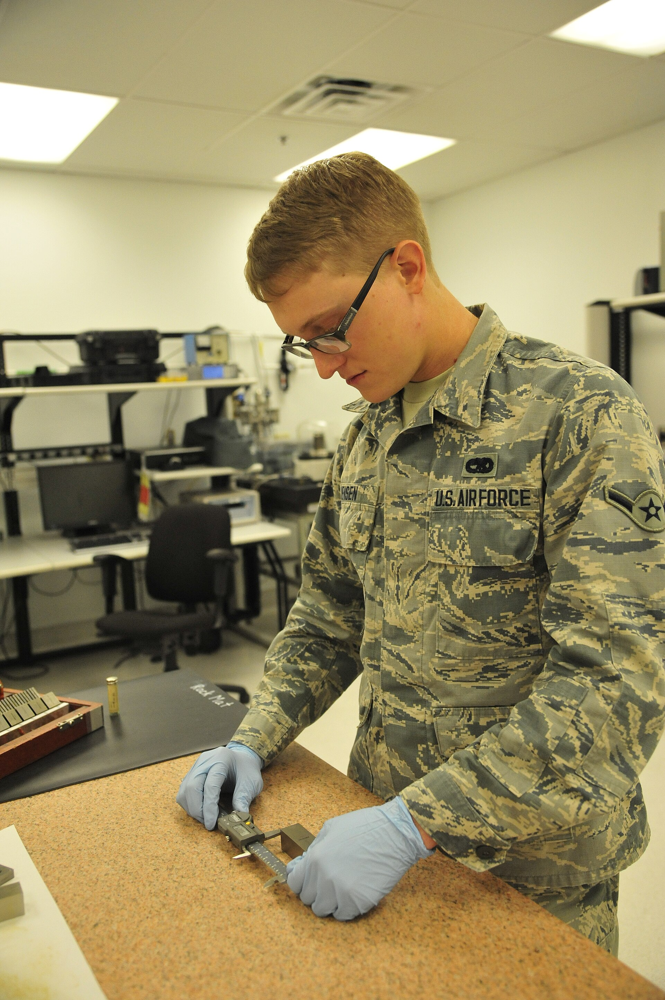

# Unit testing

*Unit testing checks the smallest isolated piece of code - one function, one method, one class - usually written by developers with mocks and stubs standing in for everything else. What a broken unit test in CI actually means, and what a coverage report does and does not prove.*

> Somewhere in your first sprint, a pull request will turn red with a message like
> "3 tests failed" and nobody on the manual QA side will have touched a keyboard yet. That's a
> unit test failing, and if your instinct is to shrug and wait for someone else to explain it,
> this note is for you. You are almost certainly never going to be paid to WRITE unit tests -
> that's a developer's job, done in the same language as the code, usually before you ever see
> a build. But you are absolutely going to live downstream of them: a red unit test blocks the
> merge that would have reached your test environment, a green coverage badge gets waved at you
> in standup as "proof" the feature is solid, and neither of those things means what people think
> they mean. Unit testing is the smallest, fastest, cheapest rung on the test-level ladder - and
> knowing exactly what it can and cannot promise you is the difference between nodding along and
> actually reading the room.

> **In real life**
>
> A car doesn't get assembled and THEN checked for the first time on the highway. Long before
> that, a single bolt gets torque-tested on a bench: tighten it, measure the force it holds,
> confirm it matches spec, in complete isolation from the engine, the chassis, and every other
> part that doesn't exist yet on that bench. Nobody bolts it into a real engine bay to find out
> if a bolt holds torque - that would be slow, expensive, and if it failed you'd have no idea
> whether the bolt, the engine mount, or the wiring harness was to blame. The bench test is a
> unit test: one component, isolated from its neighbours, checked against one narrow spec, in
> seconds, by the person who made the bolt. It tells you nothing about whether the finished car
> steers straight - that's a question for a much later, much more expensive test, on an actual
> road, with an actual driver.

unit testing

## The smallest question you can ask a piece of code

A unit test asks the narrowest possible question: given these exact inputs, does this one
function, method, or class produce the exact output the developer expects, right now, with
nothing else running. Not the database. Not the payment provider. Not the other twelve
services this function's caller eventually talks to. Just the function, alone on the bench,
answering one question a thousand times a second. That narrowness is the entire point - a test
that only has one moving part can only fail for one reason, which means a red unit test tells
a developer almost exactly where to look, in seconds, instead of somewhere-in-this-500-file-diff.

Because real code constantly depends on things it doesn't own - a database connection, a
third-party API, a file on disk, today's date - unit tests lean on two conceptual stand-ins you
should recognize even if you never write one yourself. A **stub** is a fake that hands back a
canned answer no matter what you ask it: "pretend the payment gateway always says approved."
A **mock** goes one step further and also checks HOW it was used: "confirm the code called
charge exactly once, with this exact amount." Neither one is the real dependency - both exist
purely so the test isolates the one unit under test instead of accidentally also testing the
network, the database, or a third-party company's uptime that morning.

## Why manual testers should still care

You will rarely write these, but you will constantly stand near their consequences, and three
facts are worth carrying into every standup. First: a **coverage report** - the percentage of
lines or branches a test suite actually executed - is a measurement of how much code RAN during
testing, not a measurement of how correct that code is. As the git-reading notes covered,
**branch coverage**: A measure of how many of the decision branches in the code (each side of every if, else, and condition) your tests actually executed. 100 lines covered can still mean whole branches never ran.
can sit at a comfortable-looking percentage while every single assertion in the suite is
checking the wrong thing, or checking nothing at all - a test can execute a line and assert
literally nothing about what it returned. A high number is a hint, not a verdict; the testing
myths note already named the belief that "100 percent coverage means bug-free" as exactly that -
a myth with a grain of truth wrapped around a false conclusion.

Second: a broken unit test in CI is not the same signal as a bug you'd log. As the git
collaboration notes covered, CI is a robot regression tester wired into the merge pipeline -
and when it turns red on a unit-test failure, it's telling you a developer's own encoded
assumption about their own code just got violated, usually by someone else's change nearby.
That's a build-time contract violation, caught before the build ever reaches an environment you
could click around in. It is a genuinely good sign when it happens - it means a defect got
caught for the price of a few CPU-seconds instead of the price of your afternoon. Third, and
this is the one worth saying out loud in planning: as the V-model note covered, unit testing
sits almost entirely on the **verification** side of the ladder - it checks that the code does
what the developer who wrote it intended, not that the intention itself satisfies what the
business or the user actually needed. A hundred green unit tests can pass while the feature is
still, provably, the wrong feature. That question waits for levels this chapter covers next.


*Photo: Precision measurement equipment laboratory, Airman Nathaniel Jensen calibrating - U.S. Air Force, Wikimedia Commons, Public domain. [Source](https://commons.wikimedia.org/wiki/File:Precision_measurement_equipment_laboratory_Airman_141117-F-NQ441-075.jpg)*
- **The single instrument on the bench, nothing else** — One device, isolated from the aircraft it will eventually serve on. That is a unit test's whole discipline: exercise exactly one function, method, or class, and nothing beyond it - no aircraft, no other systems, no noise from anything this component doesn't own.
- **The technician's hands making the actual measurement** — This is where pass or fail gets decided, right here, against a known-correct reference standard. That is the assert statement inside a unit test: a specific claim checked against a specific expected value, nothing fuzzier than that.
- **The clean, uncluttered bench - no aircraft parts in frame** — Deliberately isolated: nothing from the finished product this instrument will join is visible here. That absence is the point - the visual equivalent of mocks and stubs standing in for every dependency the unit doesn't own, so a failure here can only mean one thing broke.
- **The calibration reference equipment behind** — A trusted, known-good standard the instrument is checked against - the physical form of an expected value hardcoded into a test. Every unit test needs one clear 'this is correct' to compare against, or the test can't actually assert anything.
- **The lab environment itself - built for repeatable, isolated checks** — This whole room exists to run the same precise check the same way every time, on any instrument that comes through. That is the test harness - pytest, JUnit - setting up and tearing down each unit test identically, so a pass or fail means the same thing on Monday as it does on Friday.

**One function, from write to red or green - press Play**

1. **A developer writes a function** — Say, add_tax(price, tax_rate). The function has an intended job: take a price and a rate, return the price with tax added, correctly rounded. Nothing about databases, nothing about the checkout page - just this one calculation.
2. **The developer writes the unit test alongside it** — A handful of tiny cases: a normal rate, a zero rate, a value that needs rounding. Where the function depends on something external - say, a currency-lookup service - a stub replaces it with a canned answer so the test isolates only add_tax's own logic.
3. **The test runner executes every unit test in isolation** — pytest, JUnit, or similar spins each test up fresh, runs the function against its inputs, tears everything down, and moves to the next test - none of them share state, which is exactly what makes a failure easy to pin down.
4. **Every commit re-runs the whole suite in CI** — Thousands of these tests run in seconds on every push. A developer three files away changes how rounding works; add_tax's test catches the ripple the instant it happens, long before anyone opens the app.
5. **Green merges, red blocks - and the coverage report updates** — A green suite lets the merge through and the change moves toward an environment a manual tester can actually see. A red suite blocks it right there. Either way, the coverage report ticks up or down - a number worth glancing at, never worth trusting blindly.

Here's the whole idea as running code - one small function, a few unit tests written the
simplest way possible (plain asserts), and one test that's deliberately written to fail because
it exposes a real gap in the function:

*Run it - a unit under test, isolated and checked with plain asserts (Python)*

```python
def add_tax(price, tax_rate):
    # The one unit under test: no database, no network, no other function.
    return round(price + (price * tax_rate), 2)

def test_ten_percent():
    assert add_tax(100, 0.10) == 110.0

def test_zero_rate():
    assert add_tax(50, 0.0) == 50.0

def test_rounds_correctly():
    assert add_tax(19.99, 0.08) == 21.59

test_ten_percent()
test_zero_rate()
test_rounds_correctly()
print("Three unit tests passed. Each one checked add_tax completely alone.")

def test_negative_price_should_be_rejected():
    # This one is written to FAIL on purpose -- it encodes an assumption
    # nobody actually built: that a negative price cannot happen.
    assert add_tax(-10, 0.10) == 0.0

try:
    test_negative_price_should_be_rejected()
    print("Negative-price test passed.")
except AssertionError:
    print("Negative-price test FAILED.")
    print("That is the unit test doing its job: add_tax(-10, 0.10) currently")
    print("returns -11.0, because nothing in the function validates price at all.")
```

Same story in Java, using a small hand-rolled check instead of a testing framework, so the
mechanism stays visible instead of hidden behind annotations:

*Run it - the same unit, isolated and checked (Java)*

```java
class Main {
    static double addTax(double price, double taxRate) {
        return Math.round((price + (price * taxRate)) * 100.0) / 100.0;
    }

    static void check(String name, double actual, double expected) {
        if (actual == expected) {
            System.out.println("PASS  " + name);
        } else {
            System.out.println("FAIL  " + name + " -- expected " + expected + " but got " + actual);
        }
    }

    public static void main(String[] args) {
        check("ten percent tax", addTax(100, 0.10), 110.0);
        check("zero tax rate", addTax(50, 0.0), 50.0);
        check("rounds correctly", addTax(19.99, 0.08), 21.59);

        // Written to fail on purpose -- it encodes an assumption nobody built.
        check("negative price should be rejected", addTax(-10, 0.10), 0.0);

        System.out.println();
        System.out.println("Three pass, one fails on purpose: addTax() never validates");
        System.out.println("that price cannot be negative. That failing check is a unit");
        System.out.println("test doing exactly what it exists to do.");
    }
}
```

> **Tip**
>
> When a PR shows a red unit test, resist the urge to treat it as noise blocking your day. Read
> the test's NAME first - a well-written one already tells you what assumption broke, the way
> `test_negative_price_should_be_rejected` just did above. If you're ever asked to sanity-check a
> feature before its unit tests are even green, that's useful information too: it means you're
> looking at a build so early that even the developer's own narrowest checks haven't passed yet,
> and anything you find at that stage is genuinely cheap to fix.

### Your first time: First time? Watch a unit test fail on purpose and trace why

- [ ] Run the Python playground as-is — Read all four test names before running. Predict which one will fail, based purely on the name, before you see the output. Then run it and check your prediction.
- [ ] Read the failure message like a developer would — The negative-price test doesn't just say FAILED - it says what add_tax actually returned versus what was expected. That's the entire diagnostic value of a unit test: a precise, narrow, immediate answer to 'what exactly broke.'
- [ ] Break a passing test on purpose — Change the rounding test's expected value to something wrong, like 21.60 instead of 21.59, and re-run. Notice the failure looks identical in shape to the negative-price one - the test can't tell you WHY the number is wrong, only THAT it is.
- [ ] Add a mock in your head — Imagine add_tax needed to look up the tax_rate from a live tax-rate API instead of receiving it as an argument. Write one sentence describing what a stub for that API call would need to fake so the test still runs in milliseconds with no network.
- [ ] Compare Python and Java output — Confirm both print the same pass/fail pattern. The mechanism - isolate one unit, assert against one expectation, report pass or fail - doesn't change with the language running it.

You've now watched a unit test isolate one function, catch a real gap in it, and report that gap
precisely enough to fix in one line - the entire value proposition of this test level, in miniature.

- **A PR is blocked with '4 unit tests failed' and you're asked to help figure out why, but you've never opened this codebase.**
  You don't need to read the whole file. Read the failing test NAMES first - they're usually written as sentences describing an assumption (test_rejects_empty_cart, test_applies_discount_once). Then look at the actual-vs-expected values in the failure output. You're not debugging code, you're reading a precise diagnostic report; most of the time the name alone tells you which feature area is affected, which is enough to flag it accurately in standup.
- **A feature ships with '95 percent unit test coverage' proudly mentioned, and you still find an obvious bug in five minutes of clicking around.**
  This is not a contradiction - it's the exact limit coverage numbers have. Coverage counts lines or branches EXECUTED, not outcomes correctly ASSERTED, and it says nothing at all about levels above the unit: the individual functions can each be flawless while the way they're wired together (the next level in this chapter) is broken. Report the bug on its own merits; a high coverage number is not evidence against it.
- **A unit test fails intermittently - green on one run, red on the next, with no code changes in between.**
  A true unit test should be deterministic: same input, same output, every time, because it's isolated from everything external. Intermittent failure almost always means the isolation leaked - a stub wasn't reset between tests, the test accidentally depends on real system time, or two tests share mutable state. Flag it as a flaky test to the developer by name; a unit test that isn't reliably repeatable has lost the one property that makes this test level valuable.
- **You're asked in an interview or a retro whether manual testers should be writing unit tests.**
  The honest, textbook-aligned answer: unit tests are usually a developer responsibility because they require reading and writing the actual implementation code, in the same language, often before or during implementation itself. A manual tester's value at this level isn't writing them - it's knowing what a red one means, reading a coverage report skeptically, and understanding that a fully green unit suite has only answered the smallest, narrowest question in the whole testing pyramid.

### Where to check

Unit testing rarely happens where a manual tester is standing - but its evidence shows up in
predictable places worth knowing how to read:

- **The CI checks tab on a pull request** - the fastest, cheapest gate in the whole pipeline;
  a red mark here means a build didn't even clear its developer's own narrowest assumptions.
- **The coverage report or badge** - a percentage on a dashboard or README. Worth a glance, never
  worth quoting as proof of quality on its own; ask what the number does NOT tell you before
  repeating it in a status update.
- **The definition of done** - if "unit tests written and passing" is a line item, that tells you
  this level is treated as a release gate on this team, not an optional nicety.
- **A test file sitting next to the source file** - `add_tax.py` next to `test_add_tax.py`, or a
  `src/main` and `src/test` split in a Java project. Their mere existence (or absence) tells you
  how seriously this level is taken here, before you read a single assertion.
- **The bug's own root cause, once found** - if a defect traces back to logic inside a single
  function that clearly had no corresponding test, that's a specific, useful thing to name in a
  retro: not "we need more testing" but "this exact function had zero unit coverage."

Tester's habit: before you start exploring a new build, glance at whether its unit and CI checks
are green. Not because it changes what you'll test - but because a red build usually means you're
looking at code that hasn't even cleared its cheapest gate yet, and that context is worth having.

### Worked example: the red build that saved a manual tester's entire afternoon

1. **The setup:** a QA tester is assigned to test a new "apply promo code" feature the moment it
   lands in the staging environment. The ticket says it's ready.
2. **What actually happens first:** the tester checks the PR before touching staging, out of
   habit, and sees the CI checks tab still shows a red X next to unit tests - 2 failing, both
   inside a function called `calculate_discount`.
3. **Reading the failure, not the code:** the failing test names read
   `test_percentage_discount_caps_at_order_total` and `test_stacked_codes_do_not_double_apply`.
   The tester doesn't need to open the function to understand the shape of the risk: discounts
   might be able to exceed the order total, and two promo codes might be stacking when they
   shouldn't.
4. **The decision:** rather than spending an afternoon manually walking through promo-code
   combinations on a build that hasn't even passed its own developer's narrowest checks, the
   tester flags the red build in the PR thread and holds off full exploratory testing until it's
   green - explicitly naming which two assumptions are currently broken.
5. **What would have happened otherwise:** without checking CI first, the tester would have spent
   real time manually discovering the exact same two bugs the unit tests already found for free,
   in milliseconds, for the cost of nothing - and then filed them as if they were new findings.
6. **The next morning:** the build goes green, the tester runs a focused session specifically on
   discount stacking and total-capping (informed by exactly what the failing tests had named),
   and finds a THIRD bug - a currency-rounding issue - that no unit test was ever going to catch,
   because it only appears when the discount and the tax calculation from a completely different
   function interact. That's the seam this test level cannot reach, and exactly the kind of bug
   the next level in this chapter exists to find.
7. **The lesson:** reading unit-test status isn't about deferring to developers - it's about not
   re-discovering, by hand, defects a machine already found for free, so your actual testing time
   goes toward the bugs that only a human, or a higher test level, can catch.

> **Common mistake**
>
> Treating "all unit tests pass" as evidence the feature works, full stop. It's evidence the
> individual pieces do what their own developer expected them to do, alone, with every dependency
> faked. As the V-model note covered, that's verification - built right, according to the
> narrowest possible spec - and it says nothing yet about validation: whether those pieces wired
> together satisfy what the system, and eventually the business, actually needed. The mirror
> mistake is just as common: dismissing a red unit test as "just a dev thing, not my problem." A
> red unit test is one of the cheapest, most precise defect signals that will ever exist for this
> feature - ignoring it just means re-finding the same bug later, by hand, at a much higher cost.

**Quiz.** A feature's PR shows all unit tests passing and 92 percent coverage. A manual tester still finds a bug during exploratory testing where two features interact correctly alone but produce a wrong result together. What does this tell you about unit testing?

- [ ] The 92 percent coverage number must be wrong, since real bugs still exist
- [ ] Unit tests are not useful and this team should stop writing them
- [x] This is expected: unit tests verify each piece in isolation against its own developer's assumptions, and a bug that only appears when two correctly-built pieces interact lives at the seam between them - a different question than any single unit test asks
- [ ] The tester should have waited for 100 percent coverage before testing

*Unit testing checks one function, method, or class at a time, with every dependency mocked or stubbed away specifically so nothing else can influence the result - that isolation is the whole design, and it means a green suite can only ever speak to each piece working correctly ALONE. A bug that shows up only when two pieces interact was never something any single unit test could have caught, because seeing that interaction requires letting both pieces run together, which is exactly what isolation prevents. Option one confuses coverage (how much code ran) with correctness (whether the right things were asserted) - the two are unrelated, so a real bug proves nothing about whether 92 percent is accurate. Option two overreacts: unit tests caught countless other issues before this build ever reached the tester, which is real, measurable value, just value with a boundary. Option four chases an unreachable target - 100 percent coverage still would not have caught an interaction bug, since coverage only measures execution at the unit level, never at the seam between units.*

- **Unit testing - definition** — Testing the smallest piece of code in isolation - one function, method, or class - usually written by the developer, with dependencies replaced by mocks/stubs. Fast, cheap, narrow: proves the piece works ALONE, not that pieces work together.
- **Stub vs mock, conceptually** — A stub is a fake dependency that returns a canned answer no matter what ('pretend payment always approves'). A mock does that AND verifies how it was called ('confirm charge was called exactly once, with this amount'). Both exist to isolate the unit under test from things it doesn't own.
- **What a coverage report actually measures** — The percentage of lines or branches EXECUTED during testing - not the percentage of outcomes correctly checked. A test can run a line and assert nothing meaningful about it. High coverage is a hint worth a skeptical glance, never proof of correctness on its own.
- **What a red unit test in CI means for a manual tester** — A developer's own narrow assumption about their own code just broke, usually from a nearby change - caught before the build reached any environment a human could click around in. It's a cheap, precise defect signal, not noise to wait out.
- **Unit testing on the V-model's verification/validation split** — Almost entirely verification: does the code do what its developer intended, checked against the narrowest possible spec. It does not ask whether that intention satisfies the actual business need - that's validation, and it belongs to a level much higher up this chapter.
- **The seam bugs unit testing structurally cannot find** — Anything that only appears when two correctly-built units run together for real, instead of with each other's dependencies faked out. That's not a unit-testing failure - it's a different question, asked at the next level up: integration testing.

### Challenge

Take the `add_tax` function from the Python playground and design three MORE unit tests for it,
in plain English, that the current suite does not cover: one for a tax rate that is itself
negative, one for a price of exactly zero, and one for a very large price where rounding could
behave unexpectedly. For each, write the exact input, the output you'd expect, and one sentence
on whether you think the current function would actually pass or fail your new test. Then write
one sentence explaining, to a non-technical stakeholder, why "all unit tests pass" is not the
same sentence as "the feature is done."

### Ask the community

> Reading CI as a manual tester: at my team, unit tests are owned entirely by `[developers / a separate SDET team / nobody consistently]`, and the coverage number sits around `[your number]` percent. The situation I keep running into: `[describe - e.g. green unit suite but obvious bugs still slip through, red builds getting merged anyway, coverage used as a release gate]`. What I currently do about it: `[your current habit, if any]`. Is that the right instinct, and what do experienced testers actually watch for in CI before starting a test session?

Say specifically what signal you're reading (checks tab, coverage badge, test names) and what
decision you make from it - whether you start testing, wait, or flag something. The most useful
replies tend to name a concrete habit ("I always read failing test names before opening the
build") rather than a general philosophy, since that's the part you can copy immediately.

- [ISTQB Glossary - component/unit testing definition](https://glossary.istqb.org/en/search/unit%20testing)
- [Martin Fowler - UnitTest, including the solitary vs sociable unit test debate](https://martinfowler.com/bliki/UnitTest.html)
- [Martin Fowler - Mocks Aren't Stubs, the original clear explanation of the difference](https://martinfowler.com/articles/mocksArentStubs.html)
- [Unit Testing with examples - Software Engineering (Gate Smashers)](https://www.youtube.com/watch?v=9gu4BsqjQrA)

🎬 [Unit Testing with examples - Software Engineering (Gate Smashers)](https://www.youtube.com/watch?v=9gu4BsqjQrA) (8 min)

- Unit testing checks the smallest piece of code - one function, method, or class - in isolation, usually written by developers, with mocks and stubs standing in for anything the unit doesn't own.
- Fast, cheap, narrow: unit tests run by the thousand on every commit and answer one precise question per test, which is exactly why a failure is easy to pin down.
- A coverage report measures how much code RAN during testing, not how correct that code is - treat a high percentage as a hint worth a skeptical glance, never as proof.
- A red unit test in CI is a cheap, precise, build-time defect signal - it means a developer's own assumption about their own code broke, caught before it ever reached an environment you could click around in.
- Unit testing sits on the verification side of the V-model - it proves pieces work correctly ALONE, never that they work together or satisfy the actual business need. That's exactly the gap the next level, integration testing, exists to close.


---
_Source: `packages/curriculum/content/notes/levels-and-types-of-testing/test-levels/unit.mdx`_
