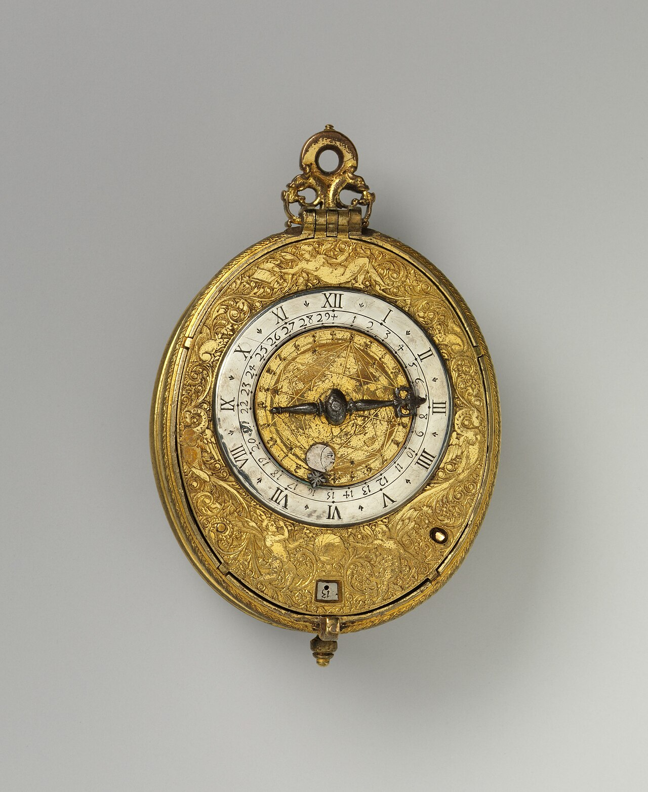

# cron: scheduling your checks to run without you

*cron runs commands on a schedule you write as five time fields. crontab -e edits your schedule, the fields read minute-hour-day-month-weekday, and every serious cron line redirects output to a log - because cron's defining failure mode is failing silently while you sleep.*

> Your health-check script from the last note has one embarrassing dependency left: **you**. It only
> runs when you remember to run it — which means the staging outage at 2 am waits politely until you
> arrive at 9 to be discovered, seven hours stale, by a product manager who found it first. The fix
> has been sitting in every Unix system since 1975: **cron**, the scheduler daemon that runs commands
> at times you specify, forever, without being reminded. Five odd-looking fields — `*/15 * * * *` —
> and your script runs every fifteen minutes for the rest of the server's natural life. It's the
> cheapest employee you'll ever hire. It's also the *quietest*: cron's signature failure mode is
> failing in total silence, and the second half of this note is the paranoia that keeps its silence
> honest. Robots don't call in sick — but they also don't call to say they've stopped working.

> **In real life**
>
> cron is the **office night guard with a patrol clipboard**. You write the rounds on the clipboard —
> "check the east door every 15 minutes, run the boiler test at 6 am, walk the car park Sundays" —
> pin it up, and go home. The guard executes the clipboard exactly, all night, every night, with zero
> initiative: he will not notice the fire unless a fire check is *on the clipboard*, he will not tell
> you the flashlight died, and if one instruction is gibberish he skips it and says nothing. The
> precise mapping: the clipboard is your **crontab** (the per-user table of scheduled jobs, edited
> with `crontab -e`), each line is one job — five time fields plus a command — and the guard's
> mute-ness is real: cron jobs run with a minimal environment, no terminal, and nowhere for output to
> go unless YOU write the log-redirect into the line. A guard you never audit is indistinguishable
> from a guard who quit last month. Audit yours.

The table the guard follows is your
**crontab**: The per-user table of scheduled jobs that cron reads: one line per job, each line = five time fields (minute, hour, day-of-month, month, day-of-week) followed by the command to run. Edit it with crontab -e, list it with crontab -l. The system checks every minute whether any line's time pattern matches now, and runs the matching commands - with a minimal environment and no terminal attached, which is the root of most cron surprises.
— and the whole skill is writing lines the guard can't misread.

## The five fields, decoded once

Every cron line starts with five time fields, in this fixed order: **minute (0–59), hour (0–23),
day of month (1–31), month (1–12), day of week (0–7, where both 0 and 7 mean Sunday)**. Each field
takes a number, a `*` ("every"), a list (`1,15`), a range (`9-17`), or a step (`*/15`, "every 15").
The line fires when **all fields match** the current time. That's the whole grammar. Reading
practice, because reading is 90 percent of your cron work:

- `*/15 * * * *` — every 15 minutes, forever: the smoke-check cadence.
- `0 6 * * *` — at minute 0 of hour 6, daily: the 6 am regression kickoff.
- `0 9 * * 1-5` — 9:00 on weekdays only (1=Monday... 5=Friday).
- `30 2 * * 0` — 2:30 am every Sunday: the weekly cleanup slot.
- `0 */2 * * *` — on the hour, every second hour.

The classic misread: `* * * * *` means every **minute**, not "whenever" — five stars is the most
enthusiastic schedule cron has, and typing it by accident on a heavy script is a rite of passage
you can skip. And a subtlety worth knowing before it bites: day-of-month and day-of-week are
combined with OR when both are restricted — `0 0 13 * 5` fires on the 13th AND on every Friday,
not only Friday-the-13th. When a schedule needs "and" logic across those two fields, put the extra
condition in the script, not the crontab.

## Installing a job — and cron's minimal world

`crontab -e` opens your table in an editor; `crontab -l` prints it; save and the schedule is live —
no restart, no reload. But here's what note two of this chapter's environment lesson predicted:
**cron does not run your job in your shell.** No `~/.bashrc`, no aliases, a PATH cut down to
something like `/usr/bin:/bin`, HOME set, and almost nothing else. The three consequences, which
between them explain nearly every "works in my terminal, dies in cron" ticket: use **absolute
paths** for commands and files (`/usr/local/bin/node`, not `node`; `/home/sajana/checks/health.sh`,
not `./health.sh`), **export what you need** inside the script itself (or set it at the top of the
crontab — `PATH=/usr/local/bin:/usr/bin:/bin` on its own line works), and **never assume a working
directory** — `cd` explicitly in the script if it matters.

## The silence problem — and the logging cure

When your terminal script fails, you see it fail. When a cron job fails, *nothing happens* — no
terminal exists, the output evaporates (or on old-school systems gets emailed to a mailbox nobody
reads), and the schedule marches on. A dead health check looks exactly like a healthy system.
So the professional cron line always ships its own black-box recorder:

`*/15 * * * * /home/sajana/checks/health.sh >> /home/sajana/checks/health.log 2>&1`

`>>` appends stdout to the log; `2>&1` sends stderr to the same place (chapter 2's redirection,
earning its keep). Now the log answers both questions that matter: *is it running?* (fresh
timestamps at the expected cadence — and your script printing a dated line each run, as the last
note taught, makes this trivial) and *what happened?* (the error text is captured instead of
evaporating). The audit habit that completes the loop: `tail health.log` whenever you walk past —
and the day the timestamps stop being fresh, you've caught a dead guard *before* the outage he
missed.


*Clock-watch with alarm and calendar, ca. 1600 — The Met, Wikimedia Commons, CC0. [Source](https://commons.wikimedia.org/wiki/File:Clock-watch_with_alarm_and_calendar_MET_DP168625.jpg)*
- **The winding loop = your crontab, wound once, fires forever** — The ideal photo shows a posted duty sheet or clipboard of timed rounds. That is crontab -e: one line per job, five time fields plus a command. The guard follows it EXACTLY - no initiative, no interpretation. crontab -l reads the current clipboard; changes go live the moment you save.
- **Hour ring + date ring = the five fields** — Each clipboard row says WHEN: minute, hour, day-of-month, month, weekday - in that fixed order. * means every, */15 means every 15, 1-5 means Monday to Friday, and all five must match for the job to fire. Five stars = every single minute, cron's most enthusiastic setting - almost never what you meant.
- **The moon-phase window = your output redirect, the only trace** — A guard station's punch-clock log proves rounds happened. Your cron line's '>> health.log 2>&1' tail is the same instrument: without it, output evaporates and a dead job is invisible. With it, fresh timestamps prove liveness and captured errors explain failures. The log IS the job's heartbeat monitor.
- **No servant attached = cron's minimal environment** — The night guard doesn't carry your keys: cron runs jobs with a stripped environment - minimal PATH, no ~/.bashrc, no aliases, no terminal. Works-in-terminal-dies-in-cron is almost always this. Cure: absolute paths for everything, exports inside the script, explicit cd. The previous note's environment lesson, now load-bearing.
- **Reading the rings = auditing with crontab -l and the log** — A guard nobody audits might have quit weeks ago - a cron job nobody checks might be silently dead (edited away, failing instantly, server rebooted without cron enabled). The habit: tail the job's log on a schedule of your own, and check the timestamps are FRESH. Silence plus stale timestamps = your monitoring is what's broken.

**From manual chore to scheduled check - press Play**

1. **The chore** — Every morning you run /home/sajana/checks/health.sh by hand: it curls staging, greps the log for fresh ERRORs, prints a dated verdict line, exits 0 or 1. It works - when you remember. The 2 am outages don't wait for 9 am. Time to hire the night guard.
2. **Write the clipboard line** — crontab -e opens your table. You add ONE line: */15 * * * * /home/sajana/checks/health.sh >> /home/sajana/checks/health.log 2>&1 - every 15 minutes, absolute path to the script, stdout appended to a log, stderr following it there. Save. Live immediately. No restart, no daemon-poking.
3. **First audit, 45 minutes later** — tail health.log shows three dated verdict lines, 15 minutes apart: [2026-07-13 15:00] OK staging - up, no fresh errors... 15:15 OK... 15:30 OK. The cadence proves cron is firing; the content proves the check works. This is what a healthy guard's logbook looks like.
4. **The trap fires - and the log catches it** — Next morning the newest entries say: /home/sajana/checks/health.sh: line 4: jq: command not found. In YOUR terminal jq works fine - but cron's stripped PATH doesn't include /usr/local/bin. The works-in-terminal-dies-in-cron classic, caught in hours instead of festering for weeks - because the redirect captured what would otherwise have evaporated.
5. **Harden and trust** — Fix: absolute path /usr/local/bin/jq in the script (or a PATH= line atop the crontab). New log entries return to dated OKs. From now on the audit is one glance: fresh timestamps = guard alive; stale = investigate cron; ERROR verdicts = investigate staging. You've automated the check AND the checking of the check.

Read and write the five fields until they're boring:

*Try it - the five-field grammar, decoded and practiced*

```bash
# minute  hour  day-of-month  month  weekday   command
#  0-59   0-23     1-31        1-12    0-7 (0 and 7 = Sunday)

# Reading drill - say each aloud before reading the answer:
# */15 * * * *      -> every 15 minutes, every day
# 0 6 * * *         -> 06:00 daily
# 0 9 * * 1-5       -> 09:00 Monday through Friday
# 30 2 * * 0        -> 02:30 every Sunday
# 0 */2 * * *       -> on the hour, every 2 hours
# 0 0 1 * *         -> midnight on the 1st of each month
# * * * * *         -> EVERY MINUTE. Five stars = maximum enthusiasm.

crontab -l
# lists your current table ('no crontab for sajana' just means: empty)

crontab -e
# opens the table in $EDITOR. Add a harmless heartbeat job:
# * * * * * date >> /tmp/cron-heartbeat.log
# ...save, wait two minutes, then:

tail /tmp/cron-heartbeat.log
# Sun Jul 13 15:41:01 +0545 2026
# Sun Jul 13 15:42:01 +0545 2026   <- one line per minute: cron is ALIVE.
# This two-minute experiment is how you verify cron works on any box.
# (Then remove the line with crontab -e - a per-minute job is not a pet.)
```

*Try it - a production-shaped cron line, built defensively*

```bash
# The naive line (works in your head, fails on the server):
#   */15 * * * * ./health.sh
# THREE bugs: relative path (cron's working dir is not your project),
# no output capture (failures evaporate), and if health.sh calls tools
# by bare name, cron's minimal PATH may not find them.

# The professional line:
#   */15 * * * * /home/sajana/checks/health.sh >> /home/sajana/checks/health.log 2>&1
# absolute script path + stdout appended to a log + stderr joining it.

# Inside health.sh, the matching defenses:
cat > /tmp/demo-health.sh <<'EOF'
#!/bin/bash
PATH=/usr/local/bin:/usr/bin:/bin        # bring your own PATH
cd /home/sajana/checks || exit 1         # never assume a working directory
echo "[$(date '+%Y-%m-%d %H:%M')] starting check"
EOF
chmod +x /tmp/demo-health.sh
/tmp/demo-health.sh
# [2026-07-13 15:45] starting check     <- the dated line every run prints:
# fresh timestamps in the log = liveness proof, free of charge.

# Environment reality check - compare cron's world with yours:
#   * * * * * env > /tmp/cron-env.txt
# after one minute, diff it against your shell (previous note's drill):
#   printenv | sort > shell-env.txt
#   diff <(sort /tmp/cron-env.txt) shell-env.txt
# expect a LONG diff: no aliases, tiny PATH, none of your exports.
# Every works-in-terminal-dies-in-cron bug lives in that diff.
```

> **Tip**
>
> Before trusting any schedule, run the **two-minute heartbeat test** on the target machine:
> `* * * * * date >> /tmp/heartbeat.log`, wait two minutes, `tail` the file, then delete the job.
> It answers the questions that waste the most cron-debugging time — is cron even running on this
> box, does my user have crontab rights, do jobs actually fire — in 120 seconds, *before* you layer
> your real script's complexity on top. Debugging is subtraction: prove the scheduler works, then
> prove the script works in cron's environment, and never wonder about both at once.

### Your first time: Your mission: hire and audit your first night guard

- [ ] Read ten schedules cold — Cover the answers in the first playground and translate each five-field pattern aloud. Then write, from scratch: 'every 30 minutes', '07:15 daily', 'noon on weekdays', 'every Saturday at 22:00'. Check yourself against the field order: minute hour dom month dow. Reading crontabs is 90 percent of real cron work.
- [ ] Run the heartbeat test — crontab -e, add * * * * * date >> /tmp/heartbeat.log, save. Wait two minutes. tail /tmp/heartbeat.log - two dated lines, one minute apart, prove the whole machinery: cron runs, your user may schedule, jobs fire. This is always step one on an unfamiliar server.
- [ ] Schedule a real script with the full armor — Point a cron line at any script you have (the last note's health check is perfect): absolute path, >> to a log, 2>&1. Set it to */5 for the exercise. After ten minutes, confirm two dated entries in the log at the right cadence.
- [ ] Break it the classic way, on purpose — Add a bare 'jq --version' (or any /usr/local/bin tool) to the script and let cron run it. Read the captured 'command not found' in your log - in your terminal it works, in cron it doesn't. Fix with an absolute path or a PATH= line. You have now met and beaten the number-one cron bug in a controlled environment.
- [ ] Clean up and keep one — crontab -e: remove the heartbeat and the */5 exercise line. Decide whether the health check earns a permanent slot (*/15 or hourly). A crontab is a garden, not a junk drawer - every line should be one you could explain to a teammate in a sentence.

You can now read any crontab you meet, schedule defensively, and — the professional part — audit a
silent robot instead of trusting it. The guard works for you; the logbook keeps him honest.

- **The script runs perfectly in my terminal but fails (or does nothing) under cron.**
  Cron's stripped environment, almost every time. Your terminal has ~/.bashrc, your full PATH, your exports, your working directory; cron has none of them. Diagnose by capturing cron's actual world: schedule * * * * * env > /tmp/cron-env.txt for one minute and read what the job really sees. Then fix in order: absolute paths for every command and file in the script, a PATH= line at the top of the script or crontab, explicit cd to the working directory, and any needed variables exported inside the script itself. The previous note's rule applies with full force: same code, different environment, different program.
- **I'm not sure the job is running at all - no output anywhere, no evidence either way.**
  First, evidence infrastructure: if the line has no >> log 2>&1, add it - you cannot debug what evaporates. Second, check the system's own record: grep CRON /var/log/syslog (Debian/Ubuntu) or journalctl -u cron shows every job cron ATTEMPTED, with timestamps - if your job appears there, cron fired it and the problem is in the script; if it doesn't, the problem is the schedule or crontab itself. Third, verify the obvious: crontab -l (is the line actually saved? right user?), does the five-field pattern mean what you intended, and did you leave a stray typo like six fields or a missing command. The heartbeat test isolates scheduler-vs-script in two minutes.
- **My job needs to run as a different user, or it works for me but fails for the service account.**
  Each user has their OWN crontab - your jobs run as you, with your permissions. A check that reads /var/log/app/ may work under your account and die as the service account (or vice versa) purely on file permissions - this chapter's chmod note in action. Options: schedule it in the right user's crontab (sudo crontab -u appuser -e), or use the system crontab /etc/crontab, whose lines have a SIXTH field - the username to run as - right before the command. Beware copying lines between the two formats: a user crontab line pasted into /etc/crontab makes cron read your command's first word as a username, and the job fails with a baffling 'command not found' for a command that exists.
- **The job fires at the wrong time - hours off from what I scheduled.**
  Timezone, server-side. Cron fires on the SERVER's clock, and servers conventionally run UTC while your head runs local time (Kathmandu is UTC+5:45, so 'run at 9 am my time' means 03:15 in the crontab of a UTC server). Check the server's idea of now with date, and timedatectl on systemd boxes shows the configured zone. Fixes: convert your intended time to server time when writing the line (leave a comment above it: # 09:00 NPT = 03:15 UTC), or set CRON_TZ=Asia/Kathmandu atop the crontab where supported. Also remember daylight-saving jumps: a 02:30 job in a DST zone skips or doubles once a year - schedule critical jobs outside the witching hour.

### Where to check

Where scheduled-job truth lives when you're investigating:

- **Your own table** — `crontab -l`; another user's: `sudo crontab -u username -l`. What's actually scheduled, as opposed to what everyone remembers scheduling.
- **The system-wide layer** — `/etc/crontab` and the drop-in directories `/etc/cron.d/`, `/etc/cron.daily/`, `/etc/cron.hourly/`: where packages and admins hide jobs. When "something runs at midnight and nobody knows what", it's usually here.
- **Cron's own diary** — `grep CRON /var/log/syslog` (Debian/Ubuntu) or `journalctl -u cron`: every job cron attempted, timestamped. The arbiter of "did it even fire?"
- **The job's log file** — the `>> whatever.log 2>&1` you insisted on: cadence of timestamps = liveness, captured errors = cause. No redirect, no investigation - add one before anything else.
- **The environment the job really saw** — the one-minute `env > /tmp/cron-env.txt` capture: cron's PATH, HOME and (lack of) exports, without guessing.
- **On CI platforms** — the same concept wears new clothes: GitHub Actions `schedule:` triggers with the identical five-field syntax (in UTC, always), GitLab pipeline schedules likewise. Your cron literacy transfers directly to scheduled test runs in CI.

Tester's habit: **treat a scheduled check as a system under test.** It has its own failure modes —
silent death, wrong environment, wrong clock — and it deserves the same evidence discipline as the
app it watches.

### Worked example: the nightly regression trigger that silently stopped - a two-layer investigation

1. **The setup:** the team's staging box runs a 2 am cron job kicking off the nightly regression suite: `0 2 * * * /opt/qa/run-nightly.sh >> /var/log/qa/nightly.log 2>&1`. Every morning, results in the dashboard. It has Just Worked for months.
2. **The smell:** Tuesday's dashboard shows Monday's results. Wednesday shows Monday's too. Nobody changed anything — the favourite opening line of every environment bug in history.
3. **Liveness first.** `tail /var/log/qa/nightly.log`: last entry Monday 02:00. The log's timestamp cadence — this note's cheapest instrument — says the job stopped firing Monday night. Not "the suite is failing": *the guard stopped walking rounds.* Different investigation entirely.
4. **Did cron attempt it?** `grep CRON /var/log/syslog | grep nightly` — Monday: an entry at 02:00. Tuesday and Wednesday: nothing. Cron didn't even try. So the problem is above the script: the schedule itself, the crontab, or cron.
5. **Read the actual table.** `sudo crontab -u qa -l`... the nightly line is *gone*. `ls -l /var/spool/cron/` shows the qa user's crontab modified Monday 18:40 — right in the window when a teammate "cleaned up some old jobs" on that box. The rounds were erased from the clipboard; the guard is fine.
6. **Restore, then harden.** The line goes back in — but the real fix is process: the crontab was un-versioned tribal knowledge that one `crontab -e` session could vaporise. The team moves the schedule into a file in git deployed via `/etc/cron.d/qa-nightly` (with its sixth username field, per the format), so the schedule is code-reviewed, versioned, and restorable.
7. **And one monitoring upgrade born of the scare:** the nightly script now *also* touches a marker file, and a tiny 8 am cron job alerts if the marker is older than a day — a check that checks the checker. Two layers, because Monday proved one layer of silence is too quiet.
8. **The lesson:** the log's stale timestamp diagnosed *which layer* died (schedule, not script) in one command; syslog confirmed it; the crontab named it. Silent infrastructure earns loud instrumentation.

> **Common mistake**
>
> Scheduling a job and never auditing it — the "set and forget" that's actually "set and abandon".
> A cron job can die a dozen quiet deaths: a teammate's crontab edit, a server rebuild that didn't
> restore schedules, a renamed script path, an expired credential inside the script, a full disk
> killing the log write. None of them announce themselves, and a monitoring check that's been dead
> three weeks is worse than no check — it *radiates false confidence* while staging burns. The
> professional floor: every cron line redirects to a log, every log prints a dated line per run,
> and a human (or a second, deliberately simple job) verifies freshness on a cadence. If a check
> matters enough to schedule, it matters enough to watch. The guard guards the building; the logbook
> guards the guard.

**Quiz.** A tester schedules 0 3 * * * backup-db.sh in crontab. In their terminal the script runs perfectly. The next morning: no backup, no error anywhere, and grep CRON /var/log/syslog SHOWS the job fired at 03:00. What's the most likely cause?

- [x] Cron ran the script in its minimal environment - a bare 'backup-db.sh' with no absolute path (and no output redirect to capture the resulting 'command not found') dies invisibly even though cron fired on time
- [ ] The five-field pattern is invalid, so cron logged the attempt but skipped execution
- [ ] Cron cannot run scripts that take longer than one minute, and backups are slow
- [ ] The job needed six fields including a username, so the schedule was misread

*Syslog proving cron FIRED moves the failure into the job itself - and a bare command name is the classic killer: cron's PATH is a stub (/usr/bin:/bin typically), so 'backup-db.sh' - which your terminal finds via your enriched PATH or current directory - resolves to nothing, the job dies with 'command not found', and with no >> log 2>&1 the error message evaporates. Fix: absolute path (/home/sajana/bin/backup-db.sh), plus the redirect so any FUTURE failure leaves a body. The 'invalid pattern' option contradicts the evidence - 0 3 * * * is perfectly valid, and an invalid line wouldn't produce a syslog firing entry. Cron has no one-minute execution ceiling - jobs may run for hours (the minute granularity is about STARTING, not finishing). And the six-field format belongs to /etc/crontab, not user crontabs - in YOUR crontab, five fields plus command is correct. The reasoning pattern to keep: syslog answers 'did it fire?', the job's own log answers 'what happened next?' - and this job had no second answer because nobody gave it a log.*

- **The five cron fields, in order** — minute (0-59), hour (0-23), day-of-month (1-31), month (1-12), day-of-week (0-7; 0 and 7 both Sunday). Values: number, * (every), list (1,15), range (9-17), step (*/15). Line fires when ALL match. Five stars = every minute. dom+dow both restricted = OR, not AND.
- **Reading drill: */15 * * * * and 0 9 * * 1-5** — */15 in the minute field = every 15 minutes, all day every day. 0 9 * * 1-5 = at 09:00, Monday through Friday. Field order is always minute-hour-dom-month-dow: '0 6 * * *' is 6 am daily, not '6 minutes past'.
- **crontab commands** — crontab -e edits your table (live on save, no restart), crontab -l lists it, sudo crontab -u user -e edits another user's. System layer: /etc/crontab and /etc/cron.d/ use SIX fields - a username before the command. Each user's jobs run with that user's permissions.
- **Cron's environment - the trap** — Jobs run with a stripped world: minimal PATH, no ~/.bashrc, no aliases, no terminal, unpredictable working directory. Defenses: absolute paths everywhere, PATH= set in the script or atop the crontab, explicit cd, needed vars exported in the script. Capture reality with a one-minute 'env > /tmp/cron-env.txt' job.
- **The logging pattern every job needs** — >> /path/job.log 2>&1 - append stdout to a log, send stderr there too. Plus a dated echo line in the script each run. Fresh timestamps = liveness proof; captured errors = cause. No redirect means failures evaporate and a dead check impersonates a healthy system.
- **Debugging: did it even fire?** — Layer 1: grep CRON /var/log/syslog (or journalctl -u cron) - did cron ATTEMPT the job? Yes = the bug is in the script/environment; no = the bug is the schedule/crontab/cron itself. Layer 2: the job's own log. Two-minute heartbeat test (* * * * * date >> /tmp/hb.log) proves the scheduler on any box.

### Challenge

The scheduler gauntlet: (1) Write the five-field patterns for: every 10 minutes; 23:45 daily; 08:00
on the 1st and 15th; every 2 hours on weekends only. (2) Run the heartbeat test on your machine and
paste the two lines that prove it. (3) Take your health-check script from the last note and write
its full production cron line — absolute path, log append, stderr merged — then explain each piece
in one sentence. (4) Capture cron's environment with the one-minute `env` job and name three
differences from your shell. (5) The design question: your team wants a check every 30 seconds —
cron's floor is one minute. What do you do? (Sketch the standard trick: a one-minute job that runs
the check, sleeps 30, runs it again — and then argue in one sentence whether a check that hot
belongs in cron at all.) Finish under fifteen minutes and the night shift is yours.

### Ask the community

> Cron question: I scheduled [the five fields + command]. Expected: [when it should run]. Reality: [never fires / fires but fails / wrong time / worked then stopped]. Evidence: crontab -l shows [paste line], grep CRON syslog shows [entry / nothing], the job's log shows [output / no log yet]. The script alone in my terminal: [works / also fails].

Paste the exact crontab line and the two evidence layers - syslog (did cron fire?) and the job's
own log (what happened next?). Those three facts sort nearly every cron mystery into one of four
bins: schedule wrong, environment missing (paths!), permissions, or timezone. 'Works in my
terminal' plus 'dies in cron' is the environment bin nine times out of ten.

- [man 5 crontab - the five fields, formally](https://man7.org/linux/man-pages/man5/crontab.5.html)
- [crontab.guru - type a pattern, read it in English (the sanity-checker everyone uses)](https://crontab.guru/)
- [GitHub Actions schedule triggers - your cron literacy, applied to CI](https://docs.github.com/en/actions/writing-workflows/choosing-when-your-workflow-runs/events-that-trigger-workflows#schedule)
- [Cron jobs — scheduling commands with crontab — Corey Schafer](https://www.youtube.com/watch?v=QZJ1drMQz1A)

🎬 [Cron jobs — scheduling commands with crontab — Corey Schafer](https://www.youtube.com/watch?v=QZJ1drMQz1A) (10 min)

- Cron runs commands on a five-field schedule (minute hour dom month dow); * is 'every', */15 steps, 1-5 ranges - all fields must match, five stars means every minute, and crontab -e edits your live table.
- Cron jobs run in a stripped environment: minimal PATH, no rc files, no terminal - so use absolute paths, set PATH and variables in the script, and cd explicitly, or meet the works-in-terminal-dies-in-cron classic.
- Silence is cron's failure mode: every serious line ends with '>> job.log 2>&1', every script prints a dated line per run, and fresh log timestamps are your liveness proof.
- Debug in layers: syslog's CRON entries answer 'did it fire?', the job's own log answers 'what happened?' - and the two-minute heartbeat test (* * * * * date >> /tmp/hb.log) proves any box's scheduler before you blame your script.
- A scheduled check is a system under test: audit its freshness, version its schedule (cron.d in git beats tribal crontabs), mind server timezones (UTC vs your +5:45), and remember a dead check is worse than none - it radiates false confidence.


---
_Source: `packages/curriculum/content/notes/linux-for-testers/bash-scripting-for-qa/cron-scheduling.mdx`_
