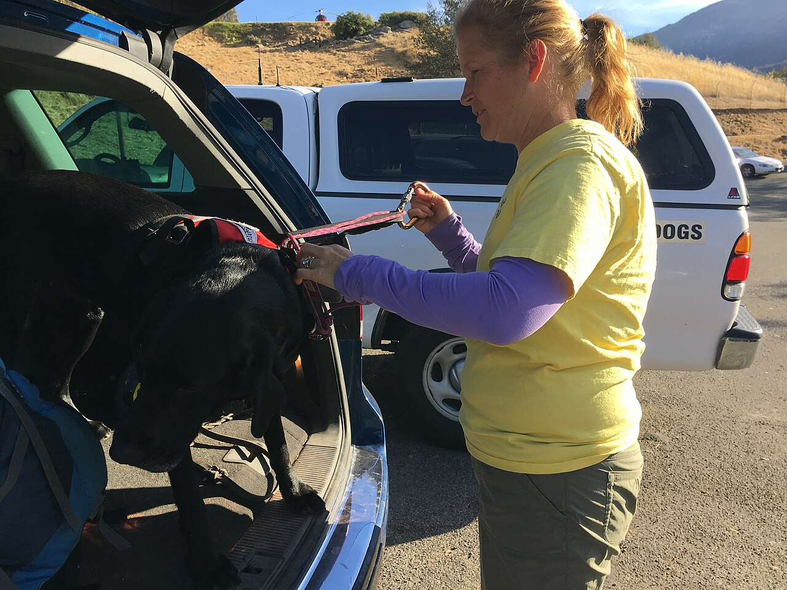

# find and wildcards

*Two ways to locate files: wildcards (* ? []) let the shell match names in the current directory, while find walks whole directory trees filtering by name, type, age, and size. The tester's use case throughout: digging the right log, screenshot, or report out of a CI runner in seconds.*

> Your nightly suite failed at 3 a.m., and somewhere on that CI runner is *the one screenshot* that
> proves what broke. Also on that runner: eleven thousand other files, four hundred of them
> screenshots, and a folder structure designed by someone who has clearly never had to find anything.
> You could `cd` and `ls` your way through it like an archaeologist with a teaspoon — or you could
> learn the two tools that make files come to *you*. **Wildcards** (`*`, `?`, `[]`) let you say "all
> the .png files here" without typing names. **find** goes further: it walks an entire directory tree
> and filters by name, type, age, and size — "every log modified in the last hour", "every file over
> 100 MB", "that report, wherever it's hiding". Between them, "where is that file?" stops being a
> twenty-minute expedition and becomes a five-second question. Testers who can do this look psychic.
> They're not. They just read this note.

> **In real life**
>
> Wildcards are **shouting a description across the room you're standing in**: "everyone whose name
> ends in `.log`, hands up!" Instant, effortless — but only people *in this room* can hear you. Files
> one door over in a subdirectory? Deaf to your shout. `find` is **hiring a sniffer dog and handing it
> a description card**: name matches `*.png`, younger than one hour, bigger than 5 MB. The dog then
> trots through *every room, corridor, and basement* under the starting point, sniffing every single
> file against the card, and returns with the full address of every match. Where the analogy is exact:
> the shout is answered *before* the command even runs (the shell expands the wildcard first, then
> hands the finished list over), while the dog searches *while running* and recurses into every
> subdirectory. Different mechanisms, different reach — and mixing them up is this topic's classic
> face-plant.

## Wildcards: the shout across the room

A wildcard pattern is called a **glob**: A filename pattern the SHELL expands into matching names before the command runs: * matches any run of characters, ? exactly one character, [abc] one character from the set, [0-9] one from the range. Globs match names in the current directory only (no recursion), and the command never sees the pattern - it receives the already-expanded list of filenames.,
and the shell — not the command — does the matching:

```bash
ls
# app.log  db.log  error.log  run1.png  run2.png  run10.png  report.html

ls *.log                 # * = any run of characters
# app.log  db.log  error.log

ls run?.png              # ? = exactly ONE character
# run1.png  run2.png     (run10.png has two -- no match)

ls run[12].png           # [12] = one character from the set
# run1.png  run2.png

ls run[0-9]*.png         # ranges combine with *
# run1.png  run2.png  run10.png
```

Here's the part that upgrades you from "uses wildcards" to "understands wildcards": when you type
`rm *.tmp`, the `rm` command **never sees the star**. The shell expands the glob first — into, say,
`rm a.tmp b.tmp c.tmp` — and hands `rm` a finished list of names. Consequences worth tattooing
somewhere: globs match **only the current directory** (no recursion into subfolders — that's `find`'s
whole job), and the expansion happens **before** the command can veto anything, which is why
`rm *` obeys instantly. One more behavioural quirk: when a glob matches *nothing*, bash passes the
literal pattern through unchanged (so a command might receive the actual string `*.log` and complain
it doesn't exist), while zsh — the macOS default — refuses to run the command at all with
`zsh: no matches found`. Same typo, two different error messages; now you can decode both.

## find: the sniffer dog with a description card

`find` takes a starting directory and a set of tests, walks the entire tree beneath that start, and
prints the full path of everything that passes:

```bash
find . -name "*.log"              # every .log under HERE, any depth
# ./app.log
# ./archive/old/app.log
# ./services/auth/auth.log

find /var/log -name "*.log" -type f     # -type f = files only (-type d = dirs)
find . -iname "*.PNG"                   # -iname = case-insensitive name match
```

Note the quotes around `"*.log"` — they're not decoration. Unquoted, the *shell* would expand the
glob against the current directory first (the shout!), and `find` would receive a list of local
filenames instead of a pattern to carry through the tree. Quoting smuggles the pattern past the
shell so the dog gets the description card intact. Forgetting the quotes is the single most common
`find` bug, and it fails *confusingly* rather than loudly — sometimes it even works by accident,
until the day the current directory happens to contain a matching file.

Now the filters that make `find` a tester's power tool — age and size:

```bash
find . -name "*.png" -mmin -60        # modified in the last 60 MINUTES
find . -name "*.log" -mtime -1        # modified in the last 1 DAY (24h)
find . -mtime +30                     # NOT touched for over 30 days
find . -size +100M                    # bigger than 100 MB
find . -size +1G -type f              # the disk-eaters
find . -type f -name "*.log" -mmin -60 -size +10M    # tests combine with AND
```

The sign convention reads like a comparison: `-mmin -60` means "less than 60 minutes old",
`-mtime +30` means "more than 30 days old", a bare number means "exactly that" (rarely useful).
For a tester the killer combo is name-plus-recency: the failure happened twenty minutes ago, so
`find . -name "*.png" -mmin -30` returns *only the screenshots from the failing run* — not the four
hundred from history. The timestamp does the sorting your folder structure never did.

## Which tool when

**Glob** when you're already standing in the right directory and want to grab a family of files:
`cp *.png ../evidence/`. **find** when you don't know *where* the file is, when the search must
recurse, or when the filter is about age, size, or type rather than just name. And they cooperate
beautifully: `find` prints paths, and paths feed other commands — the start of pipelines you'll
build in the pipes-and-redirection note.


*Photo: Search dog and handler - Wikimedia Commons, Public domain. [Source](https://commons.wikimedia.org/wiki/File:Search_Dog_and_Handler_(bc3a9b37-80f6-464d-9665-e17011a64fae).jpg)*
- **The car boot the dog steps out of = a glob's one room** — Before the lead clips on, the dog can only sniff what is IN the boot - that is a wildcard: '*.log, hands up!' answered instantly, but only by files in THIS directory. Globs do not pass through walls: subdirectories cannot hear the shout. The whole point of deploying the dog is to search beyond the one space you are standing in.
- **The search vest = find's tests** — The dog wears its briefing: the vest marks exactly what this search is scoped to. find's tests work the same - -name '*.png', -type f, -mmin -60, -size +10M - each test one line of the briefing, and a file must pass ALL of them (tests AND together by default). The richer the briefing, the shorter the list of matches the dog brings back.
- **The dog itself = recursion** — Once released, a search dog does not stop at the first doorway - it works every room, any depth, until the area is covered. find walks every subdirectory beneath its starting point exactly like that, checking every file against the tests. This recursion is what globs lack, and it is why 'the file exists but *.log cannot find it' is a glob problem, not a find problem.
- **The lead passed hand-to-dog = quoting the pattern** — The handler's instruction goes straight down the lead to the dog - nobody else gets to reinterpret it. Unquoted, the shell expands *.log against the current directory before find ever runs, and the dog receives a list of local names instead of a pattern. Quoting - find . -name '*.log' - is what delivers the instruction intact.
- **The K9 truck radioing back = full paths, ready for the next command** — A search team reports POSITIONS, not just 'found something': ./services/auth/auth.log. Full paths mean find's output can feed straight into the next command - copy these, count those, grep through them all. On a CI runner this is the move: find prints where the evidence lives, and the rest of your toolkit takes it from there.

**What actually happens when you type ls *.log - press Play**

1. **1. You type ls *.log and press Enter** — It looks like ls is about to receive a pattern. It is not. Before any command runs, the SHELL reads the line and spots the glob character. What happens next is the single fact that explains almost every wildcard surprise you will ever meet.
2. **2. The shell expands the glob first** — The shell scans the CURRENT directory only, collects every name matching *.log - say app.log, db.log, error.log - and rewrites your command line. No subdirectories are consulted. The pattern is now gone, replaced by the list it matched.
3. **3. The command receives finished filenames** — ls actually runs as: ls app.log db.log error.log. It never saw the star and has no idea a pattern was involved. This is why rm * cannot ask 'are you sure about the pattern?' - by the time rm runs, there IS no pattern, just an explicit list of victims.
4. **4. The empty-match edge case** — If nothing matches, shells disagree. bash passes the literal string *.log through, so the command errors with something like 'cannot access *.log: No such file or directory'. zsh (macOS default) refuses upfront: 'no matches found'. Both mean the same thing: your pattern matched zero files HERE - maybe they live in a subdirectory.
5. **5. find is the opposite design** — find . -name '*.log' hands the QUOTED pattern to find itself, unexpanded. find then walks every subdirectory beneath the start, testing each file's name, type, age, or size as it goes, printing full paths of matches. Shell expands globs before running; find matches while walking the tree. Two mechanisms - now you know which one you are invoking.

First playground: pure glob practice. We build a small file zoo with `touch`, then shout
descriptions at it:

*Try it - the three wildcard characters*

```bash
mkdir glob-zoo && cd glob-zoo
touch app.log db.log error.log run1.png run2.png run10.png report.html

ls *.log                  # * = any run of characters (incl. none)
# app.log  db.log  error.log

ls run?.png               # ? = exactly one character
# run1.png  run2.png

ls run[12].png            # [12] = one char from the set
# run1.png  run2.png

ls run[0-9]*.png          # range + star: digit, then anything
# run1.png  run10.png  run2.png

ls *.*                    # everything with a dot in it
# app.log  db.log  error.log  report.html  run1.png  run10.png  run2.png

# globs do NOT recurse -- proof:
mkdir old && touch old/ancient.log
ls *.log                  # ancient.log is invisible from here
# app.log  db.log  error.log

ls old/*.log              # aim the glob INTO the folder and it works
# old/ancient.log
```

Second playground: `find` on a mini CI workspace — by name, type, age, and size, ending with the
real-life "screenshots from the failing run" move:

*Try it - find by name, type, age, and size*

```bash
mkdir -p ci/results/screens ci/results/logs ci/archive
touch ci/results/screens/failure-checkout.png
touch ci/results/logs/run.log ci/archive/old-run.log
echo 'pretend this is 200MB of log' > ci/results/logs/huge.log

find ci -name "*.log"               # every .log, ANY depth (note the quotes)
# ci/results/logs/run.log
# ci/results/logs/huge.log
# ci/archive/old-run.log

find ci -name "*.log" -type f       # -type f = files only, -type d = dirs only

find ci -type d                     # just the directory skeleton
# ci
# ci/results
# ci/results/screens
# ci/results/logs
# ci/archive

find ci -iname "*.PNG"              # -iname ignores case
# ci/results/screens/failure-checkout.png

# age filters: -mmin (minutes) and -mtime (days)
find ci -name "*.png" -mmin -60     # pngs modified in the last hour
# ci/results/screens/failure-checkout.png

find ci -mtime +30                  # untouched for over 30 days
# (nothing -- our zoo is minutes old)

# size filters: k / M / G suffixes
find ci -size +100M                 # the disk-eaters (none in our tiny zoo)

# the tester's classic: recent screenshots, wherever they hide
find ci -type f -name "*.png" -mmin -30
# ci/results/screens/failure-checkout.png
```

> **Tip**
>
> Burn in the quoting rule with one mnemonic: **naked star = shout now, quoted star = card for the
> dog**. If the pattern should be matched *here, by the shell*, leave it naked (`ls *.log`). If the
> pattern must travel *into a command* to be matched later — `find . -name "*.log"`, and later
> `grep "error.*timeout"` — wrap it in quotes so the shell keeps its hands off. And when a `find`
> prints nothing you're sure exists, re-run it with just the start directory and `-name`, then add
> filters back one at a time: it's almost always one over-tight test (`-mmin -5` when the file is
> 9 minutes old), and bisecting the filters finds it in seconds.

### Your first time: Your mission: make the files come to you

- [ ] Predict, then shout — In the glob playground, before running each ls, say out loud what will match. run?.png excluding run10.png is the one that catches most people - ? is exactly one character, never two. Wrong predictions are the fastest teacher here.
- [ ] Prove the wall exists — Run ls *.log and confirm old/ancient.log stays invisible, then ls old/*.log to reach it. Feeling globs stop at the directory wall - and aiming them through it deliberately - is the core mental model.
- [ ] Break the quotes on purpose — In the find playground, run find ci -name *.log WITHOUT quotes from inside a directory that contains .log files, and compare with the quoted version. Watch the results change (or an error appear). Now you have pre-lived the most common find bug ever filed.
- [ ] Filter by time like it is a failing run — Run find ci -type f -mmin -30 and everything shows (you just made it all). Now imagine four hundred old screenshots also existed: the -mmin filter is what separates this run's evidence from history. This is the move you will use on real CI boxes.
- [ ] Hunt something real — On your own machine, try find ~/Downloads -size +100M -type f and meet every forgotten disk-eater you own. Then find ~ -name '*.png' -mmin -120 to see what screenshots the last two hours produced. Real files, real paths - the skill transfers instantly.

You've now matched with all three glob characters, proven globs don't recurse, broken and fixed the quoting rule, and filtered a tree by name, type, age, and size — the complete file-locating toolkit for a CI runner.

- **ls *.log says 'No such file or directory' (or zsh says 'no matches found') - but you KNOW the logs exist.**
  They exist - one directory down. Globs match only the current directory; they never recurse. Either aim the glob through the wall (ls logs/*.log) or switch tools: find . -name '*.log' walks the whole tree. The differing error messages are just shell dialects: bash passed the literal pattern to ls (which then failed to find a file literally named *.log), zsh refused to run the command at all. Same root cause, two costumes.
- **find prints screens of 'Permission denied' noise, drowning the actual results.**
  find is trying to enter directories your user cannot read (very normal when searching from / or /var). The matches are still printed - they are just buried. Send the complaints to the void: find /var -name '*.log' 2>/dev/null (that is 'redirect error output to nowhere' - the pipes-and-redirection note explains the machinery). Alternatively, start the search from a directory you own so the dog never hits a locked door.
- **find . -name *.log behaves erratically - works in one directory, errors or returns weird results in another.**
  Missing quotes. Unquoted, the SHELL expands *.log against the current directory before find runs. If exactly one local .log exists, find searches for that one literal name everywhere (weird results); if several exist, find gets multiple names where it expected one pattern and errors with 'paths must precede expression'; if none exist, behaviour depends on your shell. Quote the pattern - find . -name '*.log' - and it behaves identically everywhere, which is the whole point.
- **find with -mtime -1 misses a file you can see was modified yesterday afternoon.**
  -mtime counts in 24-HOUR blocks from this exact moment, not calendar days: -mtime -1 means 'modified within the last 24 hours'. Yesterday 15:00 is outside that window if it is now 16:00. For recent-file hunts, prefer -mmin with minutes (-mmin -180 = last three hours) - it is precise and reads naturally. And remember the sign convention: minus means 'younger than', plus means 'older than', bare number means 'exactly that block'.

### Where to check

File-finding is a daily tester motion — these are the places it pays out:

- **CI runners after a failure** — the run wrote its evidence *somewhere*. `find . -type f -mmin -30`
  scoped to the workspace shows everything the failing run touched: screenshots, logs, reports,
  crash dumps. Recency is the filter your folder structure never gave you.
- **Test framework output folders** — Playwright, Selenium, and JUnit each bury reports in their own
  ritual locations. `find . -name "*.html" -mmin -60` finds the fresh report without memorising
  every framework's opinion.
- **Disk-full incidents** — a runner dies with "no space left on device" and the suite goes red.
  `find / -size +1G -type f 2>/dev/null` names the disk-eaters in one line; it's usually a log that
  forgot to rotate.
- **Stale test data audits** — `find fixtures/ -mtime +90` lists fixtures nobody has touched in a
  quarter. Great input for a "do these tests still test anything?" conversation.
- **Bulk evidence grabs** — standing in a results folder, `cp *.png ../evidence/` ships every
  screenshot in one line. Globs shine exactly here: right directory, family of files, one shout.

Tester's habit: **filter by time before you filter by name.** You rarely know what a needed file is
called; you almost always know *when* it was created — during the failing run. `-mmin` turns that
knowledge into a search key.

### Worked example: four hundred screenshots and the one that matters

1. **The situation:** the nightly suite fails on the checkout flow at 03:12. The tester gets the bug
   at 09:00 with the note "screenshot attached in CI" — except the CI link is dead because the job's
   artifact upload also failed. The runner itself is still up. SSH it is.
2. **First instinct — browse — fails fast.** The workspace has dozens of directories; a
   quick look reveals screenshots scattered across `e2e/screens/`, `test-results/`, and a
   `retry-artifacts/` folder, four hundred plus PNGs in total, most from previous runs on this
   long-lived runner. Clicking through this in a file manager would take an hour. There is no file
   manager anyway.
3. **The tester reasons from *time*, not name.** The failure happened at 03:12. Whatever the failing
   test wrote, it wrote around then. So: `find . -type f -mmin -420 -name "*.png"` — PNGs modified
   in the last 7 hours (09:00 minus 03:12, rounded up, minus is 'younger than').
4. **Eleven results, not four hundred.** All from the 03:xx window. Three have `checkout` in the
   path. One is literally named `failure-checkout-step3.png`. Total elapsed time: ninety seconds.
5. **While in the neighbourhood, the tester grabs the matching log the same way:**
   `find . -name "*.log" -mmin -420 -size +1M` — recent AND non-trivially sized, because the real
   run log is never 3 KB. One hit: `test-results/run-0312/run.log`.
6. **Evidence secured:** `mkdir -p ~/evidence/bug-988 && cp` the screenshot and log in, `ls` to
   verify (the previous note's ritual, working overtime).
7. **The tester's angle:** name-based searching would have failed here — the tester didn't *know*
   the filename convention, and guessing `-name "*fail*"` would have missed logs named by timestamp.
   Time-based searching needed zero knowledge of conventions: the failing run itself timestamped
   every file it touched.
8. **The lesson:** on any box you didn't organise, **recency is the most reliable index you have**.
   `find <workspace> -type f -mmin -<window>` is the first command of every evidence hunt; names and
   sizes are refinements after the time filter has done the heavy lifting.

> **Common mistake**
>
> Treating globs and `find` patterns as the same thing and quoting (or not quoting) at random until
> something works. The two are *opposite mechanisms*: a naked glob is expanded **by the shell, before
> the command runs, against the current directory only** — while a quoted pattern inside
> `find . -name "..."` travels intact to `find`, which matches it **against every file in the tree
> while walking it**. Random quoting means your command works in the directory you tested it in and
> breaks in the directory that matters (usually the CI one, usually at night). The decision is one
> question: *who should do the matching?* The shell, right here, right now — naked. The command,
> later, across the tree — quoted. Get that distinction into your fingers and an entire genus of
> "works locally, fails in CI" bugs simply stops happening to you.

**Quiz.** You need every .log file anywhere under the ci/ directory tree, including subdirectories three levels deep. Which command actually does that?

- [x] find ci -name '*.log' - find walks the ENTIRE tree beneath its starting point and carries the quoted pattern with it, matching at every depth
- [ ] ls ci/*.log - the wildcard makes ls search recursively through ci and everything below it
- [ ] find ci -name *.log without quotes - quotes are only decoration for readability
- [ ] cd ci && ls *.log - once you are inside the directory, the glob can see the whole tree

*find ci -name '*.log' is the tool built for exactly this: it recurses through every subdirectory beneath ci, testing each file's name against the pattern it carried in - the quotes ensure the pattern reaches find intact. The ls ci/*.log option matches .log files directly inside ci and goes NO deeper - globs are expanded by the shell against one directory level and never recurse, so ci/logs/app.log is invisible to it. The unquoted find option is a landmine, not a shortcut: the shell expands *.log against your CURRENT directory before find runs, so find receives whatever local filenames happened to match (or the literal pattern, or an error like 'paths must precede expression') - it works by luck in some directories and fails in others, which is worse than failing always. And cd ci first changes nothing about glob mechanics: *.log still matches only the directory you are standing in - walls are walls no matter which room you start from. Recursion is find's job; one-directory name-matching is the glob's job.*

- **The three glob characters** — * = any run of characters (including none); ? = exactly ONE character; [abc] = one character from the set, [0-9] = one from the range. Expanded by the SHELL against the current directory only - the command receives the finished list of names, never the pattern.
- **Why must find patterns be quoted? find . -name '*.log'** — Quotes stop the shell expanding the glob locally before find runs. Quoted, the pattern travels intact to find, which matches it against every file while walking the tree. Unquoted behaviour depends on what happens to be in your current directory - the classic works-here-breaks-there bug.
- **find by type and case-insensitive name** — -type f = files only, -type d = directories only. -iname matches names ignoring case ('*.PNG' finds .png too). Tests combine with AND by default: find . -type f -iname '*.png' -mmin -60.
- **find by age: -mmin and -mtime** — -mmin counts minutes, -mtime counts 24-hour blocks. Minus = younger than (-mmin -60: last hour), plus = older than (-mtime +30: untouched for a month). For 'files from the failing run', -mmin with a window around the failure time is the tester's go-to.
- **find by size** — -size with k/M/G suffixes and the same sign convention: -size +100M = bigger than 100 MB, -size +1G finds the disk-eaters behind 'no space left on device' failures. Combine with -type f to skip directories.
- **Glob vs find - which tool when?** — Glob: you are IN the right directory, grabbing a family of files (cp *.png ../evidence/) - fast, one level only. find: unknown location, recursion needed, or filtering by age/size/type - it walks the whole tree and prints full paths ready to feed other commands.

### Challenge

In the find playground: (1) add `touch ci/results/screens/failure-login.png ci/archive/old.png`,
then write one `find` that returns only the two failure screenshots and not `old.png` — two
different solutions exist (pattern-based and location-based); find both. (2) Write the single
command a tester would run first after SSH-ing into a runner where a test failed roughly 45 minutes
ago — start directory, type, and time window. (3) Explain in one sentence why
`find . -name *.png` worked fine in your empty scratch directory yesterday but exploded with
'paths must precede expression' in the results folder today.

### Ask the community

> File-finding issue: I am looking for `[what kind of file]` under `[directory]` on `[laptop / CI runner / container]`. I ran `[exact command, quotes included]` and got `[nothing / an error / too much noise]`. The file definitely exists at `[path if known]`. Shell is `[bash / zsh / unknown]`.

Most find-and-wildcard problems are one of three: a glob expected to recurse (it never does), an
unquoted `find` pattern the shell ate, or an age/size filter one notch too tight. Paste the exact
command with its quoting intact plus one known-good file path, and which of the three it is usually
jumps straight out.

- [GNU findutils manual - the full find reference (tests, operators, examples)](https://www.gnu.org/software/findutils/manual/html_mono/find.html)
- [Greg's Wiki - glob: how shell pattern matching really works](https://mywiki.wooledge.org/glob)
- [Linux Journey - the find command, gently](https://linuxjourney.com/lesson/find-command)
- [Linux Crash Course - The find command (Learn Linux TV)](https://www.youtube.com/watch?v=skTiK_6DdqU)
- [OverTheWire: Bandit - several early levels are literally 'find the file with these properties'](https://overthewire.org/wargames/bandit/)

🎬 [Linux Crash Course - The find command (Learn Linux TV)](https://www.youtube.com/watch?v=skTiK_6DdqU) (11 min)

- Globs (* ? []) are expanded by the SHELL, before the command runs, against the current directory only - the command receives finished filenames and never sees the pattern. No recursion, ever.
- find <start> walks the entire tree beneath its starting point, testing every file against your criteria and printing full paths - recursion is its entire reason for existing.
- Quote find patterns ('*.log') so they reach find intact; naked globs are for the shell, quoted patterns are for commands. Random quoting is why commands work in one directory and break in another.
- find filters combine with AND: -name/-iname, -type f/d, -mmin/-mtime (minus = younger, plus = older), -size +100M - and name-plus-recency is the tester's classic for isolating a failing run's files.
- On a CI runner you did not organise, recency beats naming: find <workspace> -type f -mmin -<window> surfaces everything the failing run wrote, no knowledge of anyone's folder conventions required.


---
_Source: `packages/curriculum/content/notes/linux-for-testers/everyday-commands/find-and-wildcards.mdx`_
