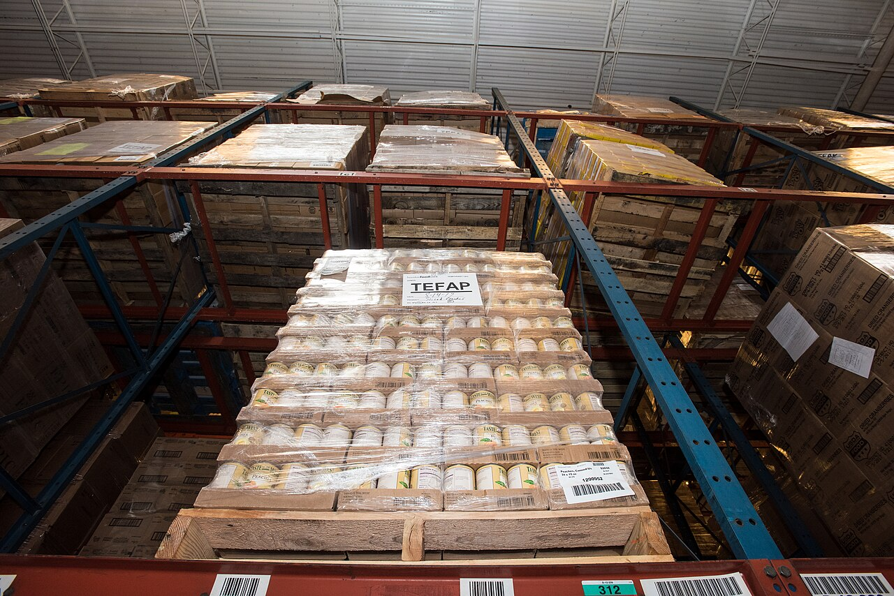

# Navigating and managing files

*The survival kit for any server or CI box: pwd/ls/cd to know where you are, mkdir/cp/mv/rm to move evidence around, absolute vs relative paths so commands stop guessing — and the hard truth that rm has no trash bin, plus the tester-safe habits that make that survivable.*

> One day soon — probably a Tuesday, probably during a release — you'll SSH into a CI runner to grab a
> failure screenshot, and there will be **no Finder, no Explorer, no icons, no mouse**. Just a blinking
> cursor that knows exactly three things about you: where you're standing, what you type, and nothing
> else. Every tester who works with servers lives out of six commands: `pwd` (where am I?), `ls`
> (what's here?), `cd` (walk somewhere else), plus `mkdir`, `cp`, `mv`, and `rm` to create, copy,
> rename, and delete. That's the whole survival kit. The twist that separates the calm testers from the
> ones writing incident apologies: on the command line, **delete means delete** — `rm` has no trash
> bin, no undo, no "are you sure?" by default. This note teaches you to move around like you live
> there, and to delete things like someone who intends to keep their job.

> **In real life**
>
> The filesystem is **a giant windowless warehouse at night, and you have one headlamp**. You can only
> see the shelf you're standing at. `pwd` is reading the aisle sign above your head — 'Aisle 7, Bay C'
> — so you know your exact position. `ls` is sweeping the headlamp across the shelf in front of you:
> these boxes, those folders, that suspiciously named `test-results-final-v2`. `cd` is walking to a
> different aisle — either by following turn-by-turn directions from where you stand (*a relative
> path*: 'two aisles left, then first right') or by reading the full address from the warehouse
> entrance (*an absolute path*: 'Building /, Floor home, Aisle ci, Bay logs'). And `rm`? That's the
> industrial shredder at the loading dock. The warehouse has no lost-and-found. Feed it the wrong box
> and the box is *confetti*. Where the analogy is exact: turn-by-turn directions only work if you're
> standing where you think you are — which is why `pwd` comes before everything.

## Where am I, what's here, walk there

Every terminal session has a **working directory**: The directory your shell is currently 'standing in'. Every relative path you type is resolved starting from here, and every command you run inherits it. pwd prints it; cd changes it. Half of all beginner command-line errors are really just a working directory that is not where the person thinks it is.
— the folder your commands treat as "here". Three commands manage it:

```bash
pwd                      # print working directory -- your aisle sign
# /home/tester

ls                       # list what's here
# projects  reports  screenshot.png

ls -la                   # -l long details, -a include hidden dotfiles
# drwxr-xr-x  4 tester tester 4096 Jul 13 09:12 .
# drwxr-xr-x  9 root   root   4096 Jul 01 08:00 ..
# -rw-r--r--  1 tester tester  220 Jul 01 08:00 .bashrc
# drwxr-xr-x  2 tester tester 4096 Jul 13 09:10 projects

cd projects              # walk into a folder (relative to here)
cd ..                    # up one level
cd ~                     # jump home (/home/tester)
cd /var/log              # jump anywhere by full address
```

Yes, `ls -la` output looks like the printer had a seizure. It's actually five useful columns:
permissions, owner, size, modified date, name — and the modified date is the tester's favourite,
because "which file changed during the failing run?" is a date question. The `.` entry is the current
directory, `..` is its parent, and files starting with a dot are hidden config files (that's the
entire trick — there's no special "hidden" attribute, just a naming convention).

## Absolute vs relative: the address vs the directions

An **absolute path** starts with `/` and works from anywhere: `/home/tester/projects/logs/run.log`
is the same file no matter where you're standing. A **relative path** starts from your working
directory: `logs/run.log` means "from *here*, go into logs, grab run.log" — and it points at a
*different file* (or nothing at all) depending on where "here" is. This is not trivia. It is the
number-one cause of "works on my machine, dies in CI": your laptop shell was standing in the project
root, the CI job was standing somewhere else, and the same relative path pointed into the void.
Rule of thumb: typing interactively, relative paths are fine because you just checked `pwd`. Writing
a script or a CI step, prefer absolute paths (or explicitly `cd` first), because scripts run wherever
the runner feels like standing.

Two speed tricks before we start making things: **Tab completion** — type `cd pro`, hit Tab, the
shell finishes `projects/` for you. It's not just faster; it's *proof the path exists*, because Tab
won't complete a typo. And `cd -` bounces you back to the previous directory, for when you're
ping-ponging between a log folder and your evidence folder.

## Make, copy, move, delete

```bash
mkdir evidence                    # make a directory
mkdir -p bug-451/screens/mobile   # -p makes the whole chain of parents

cp run.log evidence/run.log       # copy a file (original stays)
cp run.log evidence/              # same thing -- keeps the name
cp -r screenshots evidence/       # copying a DIRECTORY needs -r (recursive)

mv draft.txt bug-451-notes.txt    # mv renames...
mv bug-451-notes.txt evidence/    # ...and moves. Same command, same speed.

rm old-run.log                    # delete a file. Gone. Not trash. GONE.
rm -r old-evidence                # delete a directory and everything in it
```

Notice `mv` doing double duty: rename and move are the same operation to Linux — you're changing a
file's full path either way, which is also why `mv` is instant even on huge files (on the same disk,
nothing is copied; only the label moves). And notice `cp` needing `-r` for directories: plain `cp`
on a folder refuses with `cp: -r not specified; omitting directory` — one of the few times Linux
protects you without being asked.

## rm has no trash. Read that again.

Your whole computing life, "delete" has meant "move to a bin I can dig through later". The command
line laughs at your bin. `rm` unlinks the file immediately — no confirmation, no recycle folder, no
Ctrl+Z. And `rm -rf` (recursive, force) deletes an entire directory tree while suppressing the
questions and most of the complaints. It's the chainsaw of the shell: legitimately useful, zero
sympathy. So testers build habits that assume the shredder is always hungry:

1. **`ls` first, `rm` second.** Run `ls old-runs/` and *read the output*. If the list surprises you
   even slightly, stop. The two seconds this costs is the cheapest insurance you will ever buy.
2. **Never `rm -rf` a path you didn't just Tab-complete.** Tab completion can't complete a path that
   doesn't exist, so it catches the typo *before* the shredder does.
3. **Use `rm -i` while learning** — it asks `remove old-run.log?` per file. Training wheels, yes.
   Wear them.
4. **Be paranoid about `*` next to `rm`.** `rm *` deletes everything in the current directory — so
   the value of `pwd` at that moment is the difference between "cleaned the temp folder" and "deleted
   the test suite". A stray space is worse: `rm -r builds /` is not "remove builds/" — it's "remove
   builds, and also attempt to remove the root of the filesystem".


*Photo: Houston Food Bank commodity warehouse, USDA - Wikimedia Commons, Public domain. [Source](https://commons.wikimedia.org/wiki/File:20170922-OSEC-LSC-0276_(23482995758).jpg)*
- **The barcode labels on the rail = pwd** — Every rack bay wears a location barcode on its rail - the one guaranteed fact about WHERE a pallet sits. That is pwd: your current position, stated exactly. Every relative path you type is directions starting FROM this label, so checking it before acting is the whole game. Testers run pwd the way pilots check altitude - constantly, and especially before anything irreversible.
- **The lit centre pallet = ls** — One pallet stands fully lit while the racks behind it fade into shadow. That is ls: it reveals only the current directory, nothing above or below. ls -la widens the beam to show hidden dotfiles and the details column - sizes, owners, and the modified dates that tell you which file changed during the failing run.
- **The aisles receding left = cd, two kinds of directions** — Those gaps between rack rows are the aisles you walk - cd. Turn-by-turn from where you stand (relative path: ../logs) is fast but depends entirely on your starting point. The full address from the entrance (absolute path: /var/log) works from anywhere. Scripts and CI steps should use full addresses, because they never know which aisle the runner starts in.
- **The TEFAP label sheet = cp and mv** — The paper label on the shrink-wrap names the pallet. Re-sticking that label on a different bay is mv: rename and relocate in one motion - on the same disk it just changes the label, which is why moving a 2 GB log is instant. Duplicating the whole pallet to a second bay is cp (add -r for a full shelf of boxes) - that one actually moves cardboard.
- **A pallet pulled off the rack = rm, and there is no bin behind it** — When a pallet like the stacked boxes on the right leaves the racking for the truck, the warehouse keeps no shadow copy - gone is gone. That is rm: no confirmation, no recycling bin, no undo. The safe workflow is always: read the location label (pwd), sweep the light (ls), THEN pull the pallet - never the other way round.

**Landing on a CI runner and rescuing the evidence - press Play**

1. **1. Orient: pwd, then ls** — You SSH in and you are... somewhere. pwd says /home/runner/work - not where the test output lives. ls shows a couple of folders. No guessing, no typing paths from memory: establish where you are and what is visible before moving. Thirty seconds here saves thirty minutes of 'No such file or directory'.
2. **2. Walk to the output: cd with Tab** — cd my-app/test-results - typed as cd mytest, letting Tab completion finish (and verify) each segment. Tab cannot complete a path that does not exist, so every completed segment is a small proof. Arrive, run pwd again: /home/runner/work/my-app/test-results. Confirmed.
3. **3. Survey the wreckage: ls -la** — ls -la lists screenshots and logs with sizes and modified times. The modified times are the tester's clue: the failure happened at 03:12, and exactly two files were written at 03:12 - failure-checkout.png and run.log. Those two are the evidence. Everything else is noise from earlier runs.
4. **4. Build a home for it: mkdir -p** — mkdir -p /home/runner/evidence/bug-451 creates the whole chain in one go - no parent-by-parent ceremony. Note the absolute path: this folder gets referenced later from OTHER working directories, and an absolute path means never having to remember where you were standing when you made it.
5. **5. Copy, verify, and only then clean up** — cp failure-checkout.png run.log /home/runner/evidence/bug-451/ then ls the destination to SEE both files landed. Copy first, verify second, delete (if you must) last - and rm gets run only after an ls of exactly what it is about to eat. That ordering is the entire tester-safe habit in one sentence.

First playground: pure navigation. Every command here is read-only — you cannot break anything, so
wander freely and watch how `pwd` changes as you move:

*Try it - orient, look around, walk*

```bash
pwd
# /home/tester

ls
# projects  reports

ls -la
# total 16
# drwxr-xr-x 4 tester tester 4096 Jul 13 09:12 .
# drwxr-xr-x 9 root   root   4096 Jul 01 08:00 ..
# -rw-r--r-- 1 tester tester  220 Jul 01 08:00 .bashrc
# drwxr-xr-x 2 tester tester 4096 Jul 13 09:10 projects
# drwxr-xr-x 2 tester tester 4096 Jul 12 17:44 reports

cd projects            # relative: from here, into projects
pwd
# /home/tester/projects

cd ..                  # up one level
pwd
# /home/tester

cd /var/log            # absolute: works from ANYWHERE
pwd
# /var/log

cd ~                   # home again
pwd
# /home/tester

cd -                   # bounce back to the previous directory
# /var/log
```

Second playground: the management commands, in the exact copy-verify-delete order you should use in
real life. Watch how every destructive step is preceded by a look:

*Try it - make, copy, move, and delete like a professional*

```bash
mkdir -p bug-451/screens        # -p builds the whole chain
echo 'checkout failed at step 3' > run.log

cp run.log bug-451/run.log       # copy a file in
cp -r bug-451 bug-451-backup     # copying a DIRECTORY needs -r

mv run.log checkout-run.log      # mv renames...
mv checkout-run.log bug-451/     # ...and moves

ls bug-451
# run.log  checkout-run.log  screens

ls bug-451-backup                # the backup froze the earlier state
# run.log  screens

# --- deletion: look FIRST, delete SECOND ---
ls bug-451-backup                # read what you are about to destroy
# run.log  screens
rm -r bug-451-backup             # gone. no trash. no undo.

rm bug-451/run.log               # single file: same rule, ls first
ls bug-451
# checkout-run.log  screens

# rm on a directory without -r refuses -- one of rm's few mercies:
rm bug-451
# rm: cannot remove 'bug-451': Is a directory
```

> **Tip**
>
> Make **Tab completion your typo insurance**. Any path you're about to `rm`, `cp` over, or `mv` onto —
> Tab-complete it instead of typing it. The shell can only complete names that actually exist, so a
> completed path is a verified path, and the typo that would have deleted the wrong folder simply never
> gets typed. Pair it with the two-second ritual — `pwd`, then `ls`, then the destructive command — and
> you've eliminated the two mistakes (`wrong place`, `wrong target`) behind nearly every command-line
> horror story you'll ever hear at a QA meetup.

### Your first time: Your mission: move like you live there

- [ ] Get lost, then get found — In the first playground, cd three or four hops anywhere - into projects, up, over to /var/log. Then run pwd and read it like an address. Do this until 'where am I?' stops feeling like a question and starts feeling like a fact you always have.
- [ ] Prove relative paths are relative — From /home/tester run ls projects - it works. cd /var/log and run ls projects again - 'No such file or directory'. Same command, different working directory, different result. This one demonstration is 90 percent of understanding CI path failures.
- [ ] Build a bug-evidence folder in one line — mkdir -p bug-999/screens/mobile - then ls -R bug-999 to see the whole tree appear. The -p flag is the difference between one command and three, and it never complains if part of the chain already exists.
- [ ] Rename with mv, then move with mv — In the second playground, use mv once to rename a file and once to relocate it. Same command. Understanding that rename = move = 'change the full path' is the little unlock that makes the command stop feeling arbitrary.
- [ ] Do one safe deletion, ritual and all — pwd. ls the target. Read the output - actually read it. THEN rm -r it. Practise the ritual on throwaway folders now so it is muscle memory before you are on a production-adjacent box at 2 a.m. with sweaty hands.

You've now navigated by both kinds of path, built a directory tree in one command, renamed and moved with mv, and performed a deletion with the look-first ritual — the exact habits that keep testers off the incident channel.

- **No such file or directory - but you can SEE the file in your file manager.**
  Your working directory is not where you think it is. The file exists; your relative path starts from the wrong place. Run pwd, then ls, and rebuild the path from what you actually see - or sidestep the whole issue with an absolute path starting at /. In scripts and CI steps, this failure is so common that the standard defence is: cd to a known directory first, or use absolute paths everywhere.
- **cp: -r not specified; omitting directory 'screenshots'**
  You asked cp to copy a directory, and plain cp only does files. Add -r (recursive) to copy the folder and everything inside it: cp -r screenshots evidence/. Same story for deletion - rm refuses directories without -r. These refusals are features, not bugs: they are the shell double-checking that you meant to operate on a whole tree, so read them as a question, not an obstacle.
- **You deleted the wrong file with rm and now need it back.**
  Be honest with yourself first: rm has no trash, so the default answer is 'it is gone'. Then check the exceptions in order. Tracked by git? git checkout -- file (or git restore file) resurrects it instantly. On a CI runner? The workspace is usually rebuilt from the repo on the next run anyway. A copy in your evidence folder, an artifact upload, a backup? Testers survive rm accidents by having made copies BEFORE deleting - which is why the copy-verify-delete order is the habit, not the exception.
- **mv or cp silently overwrote a file that already existed at the destination.**
  Both commands replace an existing destination file without asking - no warning, no backup, and the old content is gone as thoroughly as if rm took it. Before moving or copying INTO a folder, ls the destination to see what is already there; if a name collision would hurt, rename first or use mv -i / cp -i, which prompt before overwriting. On shared CI evidence folders, collisions are common - include a timestamp or run ID in filenames and the problem disappears.

### Where to check

Navigation skills stop being theory the moment your testing leaves your laptop — here's where they
earn rent:

- **CI runners and build agents** — test output, screenshots, and logs land in working directories
  you didn't choose. The console log of the CI job usually prints the workspace path; from there
  it's `cd`, `ls -la`, and reading modified times to find what the failing run wrote.
- **Test artifact folders** — `test-results/`, `playwright-report/`, `target/surefire-reports/`.
  Know the layout of your framework's output directory so you can grab evidence without spelunking.
- **Docker containers** — `docker exec -it app sh` drops you into a minimal shell where these six
  commands are often the ONLY tools present. No editors, no file manager, sometimes not even `less`.
- **Application log directories** — `/var/log` and friends. Read-only wandering here is a core
  tester move; just keep `rm` far, far away from anything under `/var` or `/etc`.
- **Your own automation scripts** — every path in a script is a claim about where the script will
  run. Reviewing a teammate's script? Relative paths without a `cd` first are a bug waiting for a
  different runner.

Tester's habit: **the working directory is part of every bug report about paths.** When a script
works locally and fails in CI, ask "what directory did it run from, in each place?" before anything
else — it's the answer more often than every other cause combined.

### Worked example: the screenshot that existed but never got uploaded

1. **The report:** "Our CI uploads a screenshot on test failure. The upload step succeeds — green
   tick — but the artifact is always empty. The screenshot code definitely works: we can see the
   file being written in the logs."
2. **The tester reads the CI logs closely.** The test step logs `Saved screenshot to
   screenshots/failure.png` — a *relative* path. The upload step is configured to grab
   `screenshots/*.png` — also relative. Both relative, both green, artifact still empty. Curious.
3. **First real move: find out where each step was standing.** The tester adds a debug line to both
   steps: `pwd && ls -la`. Cheap, ugly, devastatingly effective.
4. **The output tells the story.** The test step runs with the working directory
   `/home/runner/work/app/app/e2e` — so `screenshots/failure.png` landed in
   `/home/runner/work/app/app/e2e/screenshots/`. The upload step runs from
   `/home/runner/work/app/app` — so it looked in `/home/runner/work/app/app/screenshots/`, found
   nothing, and cheerfully uploaded an empty set. Uploading zero files matching a pattern isn't an
   error, so: green tick.
5. **Same relative path, two working directories, two different locations.** Nobody wrote a wrong
   path; the *starting points* disagreed. This is the relative-path failure in its natural habitat.
6. **The fix is boring on purpose:** both steps switch to one absolute path
   (`$GITHUB_WORKSPACE/e2e/screenshots`), and the upload step adds a guard that fails loudly when
   zero files match — because "successfully uploaded nothing" should never be a green tick.
7. **The tester's angle:** the bug was invisible in every log line *individually* — each step was
   telling the truth from its own directory. Only comparing `pwd` across steps exposed it.
8. **The lesson:** when files "exist but can't be found", stop reading code and start asking
   *where was each process standing?* One `pwd && ls -la` in the right place beats an hour of
   re-reading YAML.

> **Common mistake**
>
> Running destructive commands **based on where you *believe* you are** instead of where you *are*.
> The classic sequence: you `cd` into a temp folder, get distracted by Slack for four minutes, come
> back, and type `rm -rf *` — except the `cd` failed four minutes ago (typo, no such directory) and
> your shell never moved. The command was perfect; the *location* was wrong; and the shell executed
> it without a flicker of doubt, because obedience is its only personality trait. The fix costs two
> seconds: `pwd` and `ls` immediately before anything destructive, every time, forever — and chain the
> movement to the action (`cd /tmp/scratch && rm -rf ./old-runs`) so the deletion simply cannot run if
> the `cd` failed. Paranoia about `rm` isn't a beginner phase you grow out of. The seniors are *more*
> paranoid. That's how they got to be seniors.

**Quiz.** You are in /home/tester and run: cd logs, then rm *.tmp - but the cd failed with 'No such file or directory' and you did not notice. What does the rm do?

- [x] It deletes every .tmp file in /home/tester - the failed cd never moved you, so the shell stayed put and rm ran in your original directory, immediately and with no trash to recover from
- [ ] Nothing - the shell refuses to run commands after a previous command fails
- [ ] It deletes the .tmp files inside logs anyway, because the shell remembers where you wanted to go
- [ ] It asks for confirmation first, because rm always confirms before deleting multiple files

*A failed cd leaves you exactly where you were - so rm *.tmp runs in /home/tester and eats every .tmp file there, instantly, no bin. That is option one, and it is the anatomy of most real-world rm accidents: right command, wrong location. The 'shell refuses to continue' option describes something shells simply do not do - each command runs independently, and errors do not halt an interactive session (that is why chaining with && matters: cd logs && rm *.tmp makes the rm conditional on the cd succeeding). The 'shell remembers where you wanted to go' option imagines an intent-reading shell; no such mercy exists - the working directory only changes when cd SUCCEEDS. And rm asking for confirmation? Only with -i (or when a distro has aliased it that way) - by default rm deletes many files as silently as one. The two-second defence: pwd and ls before every destructive command, and && between a movement and the action that depends on it.*

- **pwd, ls, cd - what does each do?** — pwd prints your working directory (where you are). ls lists the current directory's contents (ls -la adds hidden files plus permissions/size/date details). cd changes directory: cd sub (relative), cd /path (absolute), cd .. (up), cd ~ (home), cd - (previous).
- **Absolute vs relative path** — Absolute starts with / and means the same file from anywhere: /var/log/app.log. Relative resolves from your working directory: logs/app.log means 'from HERE'. Scripts and CI steps should prefer absolute paths (or cd to a known place first) - the runner's starting directory is not guaranteed.
- **mkdir -p - what does -p buy you?** — Creates the whole chain of parent directories in one command: mkdir -p bug-451/screens/mobile. Without -p, mkdir fails if the parent does not exist. Bonus: -p does not complain if the directory already exists - script-safe.
- **cp vs mv - the two differences** — cp duplicates (original remains); directories need cp -r. mv relocates AND renames - same operation, changing the file's full path - and is instant on the same disk because only the path changes, not the data. Both silently OVERWRITE an existing destination; -i makes them ask.
- **What safety net does rm have?** — None. No trash, no undo, no default confirmation. rm file deletes now; rm -r dir eats a whole tree; -f suppresses complaints. Recovery options are external: git restore for tracked files, backups, copies you made first. Hence the ritual: pwd, ls the target, then rm.
- **The tester-safe deletion ritual** — 1) pwd - confirm where you are. 2) ls the exact target - read the output. 3) Tab-complete the path in the rm command (Tab cannot complete typos). 4) Prefer cd /place && rm target so the deletion cannot run if the movement failed. 5) When learning, rm -i.

### Challenge

In the second playground: (1) build `release-checklist/evidence/screens` in one command, put two
fake files in it with `echo`, then make a dated backup of the whole tree with one `cp` command.
(2) Rename one of the fake files with `mv`, then move it up one level — two commands, one verb.
(3) Delete the backup tree using the full ritual: `pwd`, `ls` the target, then `rm -r` — and note
which single flag would have made `rm` ask before each file. Finish with one sentence: your teammate's
script does `cd output; rm -rf *` — what exactly do you flag in review, and what one-character change
makes it safe?

### Ask the community

> Path/file-management issue: I ran `[the command]` from `[what pwd printed]` on `[laptop / CI runner / container]`. Expected `[what]`, got `[error or wrong result]`. The target path was `[relative / absolute]`, and ls in that directory shows `[paste the listing]`. If a script: does it cd anywhere first? `[yes: where / no]`.

Most navigation and file-management mysteries dissolve under two facts: what `pwd` printed at the
moment the command ran, and what `ls` actually showed in that directory. Paste both, plus the exact
command, and the answer is usually visible in the question — a relative path resolved from the wrong
place, a missing `-r`, or an overwrite nobody noticed.

- [Linux Journey - Command Line unit (pwd, ls, cd, cp, mv, rm, mkdir - one page per command)](https://linuxjourney.com/lesson/the-shell)
- [GNU Coreutils manual - the authoritative reference for ls, cp, mv, rm and friends](https://www.gnu.org/software/coreutils/manual/html_node/index.html)
- [LinuxCommand.org - Navigation: the filesystem tree, absolute vs relative paths](https://linuxcommand.org/lc3_lts0020.php)
- [Linux Command Line Tutorial For Beginners - Introduction (ProgrammingKnowledge)](https://www.youtube.com/watch?v=YHFzr-akOas)
- [OverTheWire: Bandit - free navigation-and-files puzzle game played entirely over SSH](https://overthewire.org/wargames/bandit/)

🎬 [Linux Command Line Tutorial For Beginners - Introduction (ProgrammingKnowledge)](https://www.youtube.com/watch?v=YHFzr-akOas) (12 min)

- Three commands answer the three constant questions: pwd (where am I), ls (what is here - add -la for hidden files and details), cd (go somewhere - relative, absolute, .., ~, or - for 'back').
- Absolute paths start with / and mean the same thing everywhere; relative paths resolve from the working directory - which is why they break the moment a script or CI step starts somewhere unexpected.
- mkdir -p builds whole directory chains; cp copies (directories need -r); mv renames AND moves in one instant operation; both cp and mv silently overwrite existing destinations unless you use -i.
- rm has no trash bin, no undo, and no default confirmation - and rm -rf will eat an entire tree without a single question. Recovery is only ever external: git, backups, copies made beforehand.
- The tester-safe ritual before anything destructive: pwd, then ls the exact target, then Tab-complete the path - and chain movement to action with && so a failed cd can never strand a deletion in the wrong directory.


---
_Source: `packages/curriculum/content/notes/linux-for-testers/everyday-commands/navigating-and-managing-files.mdx`_
