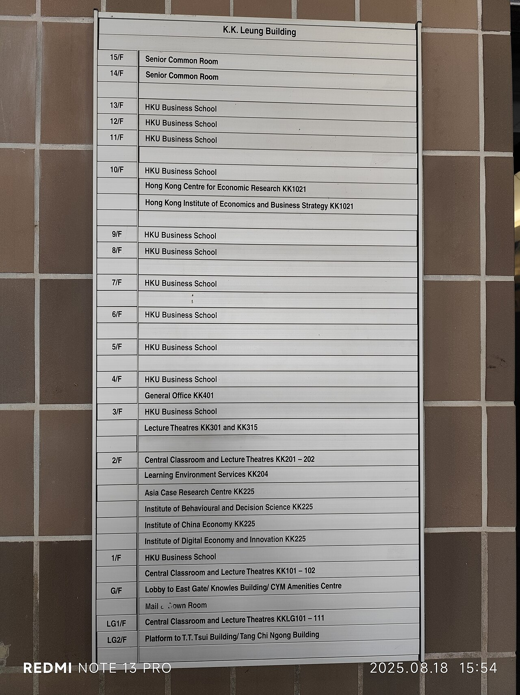

# Distros and the filesystem

*Ubuntu, Debian, RHEL, Alpine — same Linux kernel, different packaging. Then the map that matters: one directory tree from /, with config in /etc, logs in /var/log, users in /home, scratch in /tmp, programs in /usr. Learn five directories and you can find anything on any server.*

> Your first SSH session lands, the prompt blinks, and two disorientations hit at once. First:
> apparently there are *dozens* of Linuxes — Ubuntu, Debian, Fedora, Alpine — and people online
> argue about them the way other people argue about football. Second: there's no C: drive, no
> Desktop, no Downloads, and your instinct to "just look around in Finder" has nowhere to live.
> Both panics dissolve with one insight each. The distros? **Same engine, different trim** — one
> Linux kernel underneath, different packaging on top, and you only need to recognise three
> families. The filesystem? **One tree, growing from `/`**, with a standard floor plan so consistent
> that five directory names — `/etc`, `/var/log`, `/home`, `/tmp`, `/usr` — will let you find the
> config, the logs, and the evidence on practically any server on Earth. This note hands you the
> trim guide and the floor plan. After it, an unfamiliar server is just a building whose map you've
> already memorised.

> **In real life**
>
> A hospital. Every hospital practises the same medicine — that's the **kernel**, identical science
> underneath. But St Mary's and City General differ in paperwork, pharmacy suppliers, and how often
> they renovate — those are **distros**: same core, different packaging, update cadence, and
> in-house tools. And critically, every hospital uses the same floor plan logic, because in an
> emergency nobody has time to explore: **records room** (that's `/var/log` — every event written
> down, timestamped, kept), **administration office** where the binders of rules live (`/etc` — the
> configuration), **staff lockers** (`/home` — each user's own space), a **waiting-room lost and
> found** cleared out regularly (`/tmp` — temporary, deletable, don't store your valuables), and the
> **equipment and supply floors** (`/usr` — the installed tools themselves). A tester walking into
> an unfamiliar server is a locum doctor walking into an unfamiliar hospital: you don't know this
> building, but you know *exactly* where the records room is.

## Distros: same engine, different trim

A **distribution**: A complete operating system built around the Linux kernel: the kernel plus a package manager, preinstalled tools, default configuration, and a release schedule. Ubuntu, Debian, Fedora, and Alpine are distributions - the kernel is the same project in all of them, so your commands and the filesystem layout carry over almost entirely. The practical difference a tester meets first is the package manager: apt on Debian/Ubuntu, dnf on RHEL/Fedora, apk on Alpine.
(distro) is the Linux kernel plus everything needed to make it a usable OS: an installer, a
package manager, preinstalled tools, and opinions. There are hundreds. You need three families.
**Debian family** — Debian and its famous child **Ubuntu** — installs software with `apt`; this is
what CI runners (`ubuntu-latest`) and a huge share of servers and Docker images run, and it's the
family this module assumes. **Red Hat family** — RHEL, Rocky, Alma, Fedora — installs with `dnf`;
you'll meet it at banks, telecoms, and anywhere with a compliance department and a support
contract. **Alpine** — a minimalist built for containers, roughly 5 MB of base image — installs
with `apk`; you'll meet it inside Dockerfiles (`FROM alpine`, `FROM node:22-alpine`), where its
tininess is beloved and its *missing tools* will one day ambush you (more below).

What actually differs: the package manager, the release rhythm, and which tools come preinstalled.
What doesn't: the kernel, the shell you'll learn next note, the core commands, and — the hero of
this note — the filesystem layout. Learn once, drive anywhere. And when you land somewhere
unfamiliar, identification takes one command: `cat /etc/os-release` tells you exactly which
hospital you've walked into.

## One tree, no drive letters

Windows gives every disk a letter — C:, D: — so storage looks like separate silos. Linux does the
opposite: **everything lives in a single tree growing from `/`** (called "root"). Every file on
the machine has one address that starts with `/`, like `/var/log/syslog` or `/home/priya/notes.txt`.
Extra disks don't get letters; they're grafted onto the tree at some directory. Two facts to
tattoo somewhere: paths use **forward slashes**, and names are **case-sensitive** — `/tmp/Report.txt`
and `/tmp/report.txt` are different files, as the previous note's CI war story proved.

The layout below is standardised (the *Filesystem Hierarchy Standard*), which is why the map
transfers between machines. The tester's five, in order of how often you'll visit:

- **`/var/log`** — the records room. System and service logs: `syslog`, `auth.log`, web server
  logs under `/var/log/nginx/`. When anything misbehaves, this is where the evidence is. `/var`
  generally holds *variable* data — things that grow: logs, caches, queues.
- **`/etc`** — the rules binders. System-wide configuration as plain text files: `/etc/nginx/nginx.conf`,
  `/etc/ssh/sshd_config`, `/etc/hosts`. When behaviour differs between staging and production,
  the difference is very often a file in here.
- **`/home`** — staff lockers. One directory per human user: `/home/priya`. Your SSH session
  starts in yours. (The admin account `root` gets a private office at `/root` instead.)
- **`/tmp`** — the lost and found. Any program can scribble here; the OS may clear it on reboot
  or on a timer. Perfect for scratch files, catastrophic for anything you want to keep.
- **`/usr`** — equipment storage. Installed programs and their read-only support files; the
  commands you type live in `/usr/bin`. You'll read from here, rarely write.

Honourable mentions you'll bump into: `/opt` (third-party apps that keep to themselves — your
company's app may live in `/opt/yourapp` or `/srv`), `/proc` (a fake in-memory filesystem where
the kernel publishes live stats — `cat /proc/uptime` reads a "file" that's really the kernel
talking), and `/dev` (devices presented as files — disks, terminals, and the famous `/dev/null`
wastebasket).


*Photo: K.K. Leung Building floors directory, HKU - Wikimedia Commons, CC0. [Source](https://commons.wikimedia.org/wiki/File:HKU_%E9%A6%99%E6%B8%AF%E5%A4%A7%E5%AD%B8_Pok_Fu_Lam_campus_%E6%A2%81%E9%8A%B6%E7%90%9A%E6%A8%93_KK_Leung_Building_floors_directory_sign_August_2025_N13P.jpg)*
- **The board's title = one tree from /** — One board, one building name at the top, every floor findable beneath it - one authoritative map from a single starting point. That is the Linux filesystem: no drive letters, no silos, every file reachable by one path starting at /. Whatever server you land on, this board is in the lobby and the floors are named the same way.
- **The mail room = /var/log** — Down on G/F, the room where the building's incoming paper piles up day after day - the floor a tester visits first. Every service writes its diary in /var/log: system events in syslog, login attempts in auth.log, web traffic under nginx/. When a bug report says 'it broke around 3pm', this is where 3pm is written down. Expect to spend more QA time here than on all other floors combined.
- **The General Office = /etc** — Floor 4/F, room KK401: the office holding the binders of rules. /etc is exactly that - plain-text configuration files controlling how every service behaves: ports, limits, feature toggles, connection strings. 'Works on staging, fails on production' very often means the two buildings' binders differ. Read-mostly for testers: diff them, quote them in bug reports, change them only when you own the environment.
- **The Senior Common Room = /home, the lobby = /tmp** — Top floors: the staff's own room - persistent, personal, where your SSH session starts. That is /home/you. The G/F lobby everyone passes through is /tmp: anyone can leave things there, and the cleaning crew empties it on reboot or a timer. Test evidence saved to /tmp has a way of evaporating before the bug review meeting. Keep keepers in /home.
- **Learning Environment Services = /usr** — The floor that stores and services the building's actual equipment. /usr holds the installed tools themselves - the programs you run live in /usr/bin (which ls, which grep will point there). Read-only territory in practice, but knowing 'commands are just files on the equipment floor' demystifies 'command not found' - the tool simply is not in the building, common on minimal Alpine images.

**One web request, four directories - press Play**

1. **The program starts from /usr** — A request is about to hit your staging server's nginx. The nginx PROGRAM is a file: /usr/sbin/nginx, living on the equipment floor. Every running service on the box started life as an executable file somewhere in the tree - usually /usr, sometimes /opt for third-party apps. Programs are files; nothing on the board is magic.
2. **It reads its rules from /etc** — On startup, nginx read /etc/nginx/nginx.conf - which port to listen on, where the app lives, upload size limits. Read AT STARTUP is the trap phrase: edit a config now and the running service still follows the OLD rules until restarted. 'I changed the config and nothing happened' is this, roughly nine times out of ten.
3. **It writes its diary to /var/log** — The request arrives. nginx appends one line to /var/log/nginx/access.log (who asked for what, response code, timing) - and if anything goes wrong, a detailed complaint to error.log next door. Multiply by every request all day: this is why logs GROW, why /var fills disks, and why the records room answers 'what happened at 3pm?'.
4. **It scribbles scratch work in /tmp** — The request includes a big file upload, so nginx buffers it to a temporary file in /tmp, processes it, deletes it. Every service does this. Two tester consequences: /tmp filling up breaks uploads in weird ways, and anything YOU park in /tmp may be gone after the next reboot - it is a workbench, not a shelf.
5. **A bug hunt is walking this trail backwards** — 'Uploads over 10 MB fail on staging.' The trained walk: /var/log/nginx/error.log for the complaint (there it is: 'client intended to send too large body') -> /etc/nginx/nginx.conf for the rule (client_max_body_size 10m) -> bug report quoting both, with the config line as root cause. Program, rules, diary, scratch - four floors, one story.

First, walk the building. Identify the distro, look at the tree's top floor, and peek into the
two directories testers live in:

*Run it - identify the machine and walk the tree*

```bash
# Which hospital is this? One command answers.
cat /etc/os-release
# PRETTY_NAME="Ubuntu 24.04.2 LTS"
# ID=ubuntu
# ID_LIKE=debian
# (On Alpine you'd see ID=alpine; on RHEL, ID=rhel. Always check before assuming.)

ls /
# bin  boot  dev  etc  home  lib  media  mnt  opt  proc  root  run
# sbin  srv  sys  tmp  usr  var
# The whole machine, one directory listing. No drive letters anywhere.

ls /etc | head -n 5
# adduser.conf
# alternatives
# apparmor.d
# apt
# bash.bashrc
# Plain text config, one file or folder per concern. Hundreds of them.

ls /var/log
# apt  auth.log  btmp  dpkg.log  kern.log  lastlog  syslog  wtmp
# The records room. Next playground: we go in.

echo $HOME     # and where do YOU live?
# /home/deploy
```

Now the skill that pays your salary: the log dig, plus the disk check that explains a shocking
number of "the app just broke" mysteries:

*Run it - the log dig and the full-disk check*

```bash
# The records room, properly.
cd /var/log
ls -lh syslog auth.log
# -rw-r----- 1 syslog adm  2.1M Jul 13 14:02 syslog
# -rw-r----- 1 syslog adm  340K Jul 13 14:01 auth.log
# -lh: long listing, human-readable sizes. Note logs have owners and permissions.

tail -n 3 syslog
# Jul 13 14:01:17 staging-web-01 systemd[1]: Started Daily apt upgrade and clean.
# Jul 13 14:01:52 staging-web-01 app[918]: payment request completed in 240ms
# Jul 13 14:02:03 staging-web-01 app[918]: ERROR upload failed: no space left on device
# tail shows the END of a file -- where the newest (most interesting) lines are.

# 'no space left on device'?! Check the disks:
df -h
# Filesystem      Size  Used Avail Use% Mounted on
# /dev/root        84G   84G     0 100% /
# 100% -- there's the bug. Now: WHAT is eating the disk?

du -sh /var/log/* 2>/dev/null | sort -h | tail -n 3
# 12M   /var/log/auth.log
# 98M   /var/log/syslog
# 61G   /var/log/app.log        <- the culprit, named and measured
# du = disk usage per item; sort -h orders human sizes; tail shows the biggest.
```

> **Tip**
>
> Lost on an unfamiliar box? Three commands re-orient you every time: `pwd` (where am I), `ls`
> (what's here), `cat /etc/os-release` (what machine is this). And when hunting logs, start broad:
> `/var/log/syslog` on Debian/Ubuntu, `/var/log/messages` on Red Hat family, or `journalctl -e` on
> any modern systemd distro (it jumps to the newest entries). Apps that don't write to `/var/log`
> usually log to their own directory under `/opt` or `/srv` — `ls` the app's home and look for
> anything named `log`.

### Your first time: Your mission: learn the building by walking it

- [ ] Identify two different distros — Run cat /etc/os-release in your WSL/Ubuntu shell, then run docker run alpine cat /etc/os-release. Same kernel family, different trim: note how the ID line differs, then try apt --version in Alpine and watch it not exist (Alpine uses apk). That error is a rite of passage - better here than mid-incident.
- [ ] Walk the top floor — ls / and, from memory afterwards, name what lives in /etc, /var/log, /home, /tmp, and /usr. Say them in hospital terms if it helps: rules binders, records room, lockers, lost and found, equipment. This is the whole map - five names.
- [ ] Do a real log dig — cd /var/log, ls -lh, then tail -n 20 syslog (use sudo if refused - log files have owners). Find the newest timestamp and read three real entries. You have now done, on a practice box, the exact task 'check the staging logs' describes.
- [ ] Prove /tmp is a workbench, not a shelf — echo 'evidence' > /tmp/finding.txt, confirm with cat /tmp/finding.txt - then restart the container (or reboot WSL) and look for it. Gone (or on borrowed time). Now save it to $HOME instead and note the moral: evidence goes in /home, scratch goes in /tmp.
- [ ] Find the disk hog — Run df -h, read the Use% column, then du -sh /var/* 2>/dev/null | sort -h | tail -n 5 to rank the biggest directories. You've just rehearsed the diagnosis for one of the most common real-world staging outages: the full disk.

You can now land on any Linux box, identify it, walk to its logs, and rank what's eating its
disk — which is honestly more than some people write "Linux" on their CV for.

- **I typed apt install curl inside a container and got 'apt: not found'.**
  You're not on the Debian family - almost certainly Alpine, where the package manager is apk (apk add curl). On Red Hat family it's dnf install curl. The distro decides the package manager; cat /etc/os-release tells you which one you're on. This bites hardest in Dockerfiles and CI images, where FROM alpine looks identical to FROM ubuntu right up until your install command isn't found.
- **The app suddenly fails with 'No space left on device' - uploads break, logs stop, weird 500s.**
  The disk is full, and on servers the culprit is nearly always something under /var: a runaway log file, or /tmp stuffed with abandoned scratch files. Diagnose in two moves: df -h to confirm which filesystem is at 100%, then du -sh /var/log/* | sort -h | tail to name the offender. Report the file and its size - that's a complete, evidence-backed bug. (The long-term fix, log rotation, is the developers' job; finding it is yours.)
- **I edited a config file in /etc but the service behaves exactly as before.**
  Config files are read at startup - the running service is still obeying the rules it read when it launched. Someone with permissions needs to restart or reload it (sudo systemctl restart nginx). If it STILL behaves the same, confirm you edited the file the service actually reads: check for an /etc/app/conf.d/ directory of override files, or an environment variable pointing somewhere else entirely. 'Which file does it really read?' is a genuinely good question to ask a developer.
- **Permission denied when I try to read a log in /var/log.**
  Log files have owners and groups - ls -lh shows syslog belonging to user syslog, group adm - and your account may not be on the list. Prefix with sudo (sudo tail -n 50 /var/log/syslog) if you have sudo rights; on shared staging boxes, the tidier fix is asking to be added to the adm group so reading logs needs no sudo at all. This is a permissions feature doing its job, not the machine being hostile - auth logs in particular are sensitive.

### Where to check

The floor plan turns vague bug reports into short walks. Where a tester actually uses it:

- **"It broke around `time X`"** — `/var/log`, immediately. Find the service's log, `tail` or
  search around the timestamp, quote the surrounding lines in the bug report. Evidence beats
  adjectives.
- **"Works on staging, fails on production"** — `/etc`, comparing. Same service, two machines,
  diff the config files (ports, limits, feature flags, connection strings). Environment-difference
  bugs live in these binders.
- **Uploads, exports, and anything involving big files** — `/tmp` and `df -h`. Full disks and
  cleared temp directories produce the industry's weirdest symptoms: intermittent upload failures,
  half-written exports, jobs dying at the same size threshold.
- **Dockerfiles in your project** — the `FROM` line names the distro, which names the package
  manager and predicts what's missing (Alpine images lack tools you assumed were universal, like
  `bash` or `curl`, until someone `apk add`s them).
- **"command not found" on a box or in CI** — `/usr/bin` thinking: commands are files; the file
  isn't installed on this machine. Check the distro, then install with its package manager or ask
  whether the CI image needs updating.

Tester's habit: **name paths, not vibes.** "Errors in `/var/log/app.log` at 14:02, disk at 100%
per `df -h`, largest file `/var/log/app.log` at 61G" gets fixed the same afternoon. "The server
seems broken" gets a shrug.

### Worked example: the uploads that died at 2 a.m., and the disk that ate them

1. **The report:** "Staging uploads are broken - customers of the beta group get a 500 when attaching files. Started sometime overnight. Nothing was deployed since Friday, so it can't be a code change. Can QA investigate before we roll back for no reason?"
2. **The tester reproduces first:** upload a 2 MB file - 500 error, every time. Deterministic. And 'nothing deployed' plus 'started overnight' is a strong hint: if the code didn't change, the ENVIRONMENT did. Environments live in the filesystem.
3. **Straight to the records room.** ssh staging, then tail -n 50 /var/log/nginx/error.log: repeated lines of 'open() ... failed (28: No space left on device)'. The app's own log, /var/log/app.log, went silent at 02:14 - logs can't be written to a full disk either, which is its own little poetry.
4. **Confirm and measure:** df -h shows the root filesystem at 100%. du -sh /var/log/* | sort -h | tail names the culprit: app.log at 61G. The app has been logging every request body at debug level since a config change three weeks ago, and nothing was rotating the file. The disk didn't fill overnight - it finished filling overnight.
5. **The 2 a.m. timing explains itself:** a nightly batch job wrote its own temp files at 02:00, tipped the disk to 100%, and every write on the machine - uploads buffering to /tmp, log lines, database temp files - began failing together. 'Uploads broke' was just the symptom users noticed first.
6. **The bug report, with coordinates:** title 'Staging disk full - app.log 61G, no rotation; all writes failing since 02:14'. Evidence: the df -h output, the du ranking, the error.log lines, the debug-logging config line in /etc quoted verbatim. Root cause and trigger both named. Nobody rolls anything back.
7. **The fixes are two,** and the tester's report drives both: ops truncates and rotates the log to revive staging in minutes, and developers turn off body-logging in the config. QA adds a check to the weekly routine: df -h on staging every Monday, thirty seconds, no more 2 a.m. surprises.
8. **The lesson for a tester.** 'No code changed, but it broke' points AT the environment, and the environment is legible: logs in /var/log say what failed, df and du say what filled, /etc says what was configured to cause it. The whole investigation was five commands and a floor plan - no debugger, no developer, no rollback roulette.

> **Common mistake**
>
> Trusting tutorial paths as if they were universal law. `/var/log/syslog` doesn't exist on the Red
> Hat family (it's `/var/log/messages` there); Alpine containers may lack `bash`, `curl`, and most
> of `/var/log` entirely; and your app's logs might not be in `/var/log` at all but in
> `/opt/yourapp/logs` or only in `journalctl`. The floor plan is standard; the *furniture* varies by
> distro and by app. So the professional reflex on any new box is: `cat /etc/os-release` first, then
> *look* (`ls /var/log`, `ls /opt`) before typing paths from memory or a blog post. Thirty seconds
> of orientation beats twenty minutes of "file not found" and a creeping feeling that Linux hates
> you. It doesn't. It just isn't the specific Linux the tutorial was written on.

**Quiz.** A bug report says the staging app started throwing errors 'around 3pm'. You SSH in. Which directory do you head to first, and why?

- [x] /var/log - services write timestamped logs there, so it holds the recorded evidence of what actually happened at 3pm
- [ ] /etc - the configuration files will show what the app was doing at 3pm
- [ ] /home - the app probably saved its error information in someone's home directory
- [ ] /usr - checking the program's files will reveal which of them caused the error

*/var/log is the records room: every service appends timestamped entries as things happen, so 'around 3pm' translates directly into 'find the log lines near 15:00' - tail or search the service's log and the evidence is simply there, with exact times, error text, and context to quote in the bug report. /etc is the wrong FIRST stop because config files describe rules, not events: they say how the app is configured to behave, not what it did at 15:00 - you go there second, when the logs point at a limit or setting as the cause. /home holds users' personal files; well-behaved services don't scatter error output into people's lockers, and nothing there is organised by time. And /usr contains the installed programs themselves - read-only executables that don't change when a bug happens; staring at binaries reveals nothing about this afternoon. The tester's order of operations on any 'it broke at time X' report: logs first for WHAT happened, config second for WHY it's set up to happen, and only then wider theories. Events in /var/log, rules in /etc - keep those two straight and most server investigations start themselves.*

- **What is a Linux distribution?** — The Linux kernel plus packaging: a package manager, preinstalled tools, defaults, and a release schedule. Same kernel across all of them - commands and filesystem layout carry over. Identify any machine's distro with: cat /etc/os-release.
- **The three distro families a tester meets, and their package managers** — Debian family (Debian, Ubuntu) - apt; the default for CI runners and many servers/images. Red Hat family (RHEL, Rocky, Fedora) - dnf; common in enterprises. Alpine - apk; the tiny container distro, famous for NOT including tools you assumed were everywhere.
- **/etc** — System-wide configuration as plain text files: nginx.conf, sshd_config, hosts. The 'rules binders'. Read at service STARTUP - edits need a restart/reload to take effect. First stop for 'works on staging, differs on production' bugs (diff the two).
- **/var/log** — The records room: timestamped logs from the system and services (syslog or messages, auth.log, nginx/). The tester's most-visited directory - 'it broke at 3pm' means reading around 15:00 here. Also the classic disk-filler: check with ls -lh and du when df -h shows 100%.
- **/home vs /tmp** — /home/you: your persistent, private space - SSH sessions start here; keep evidence here. /tmp: world-writable scratch space that may be cleared on reboot or timer - programs buffer uploads and temp files here; never store anything you want to keep.
- **/usr (and friends /opt, /proc)** — /usr holds installed programs and read-only support files - commands live in /usr/bin. /opt: self-contained third-party apps (your company's app may live here). /proc: a virtual filesystem of live kernel stats - files that are really the kernel answering questions.

### Challenge

Run `docker run -it ubuntu bash` (or open WSL) and complete the trail hunt: (1) pick a real
program on the box — `which cron` or `which ssh` will name its file under `/usr` — then find its
configuration under `/etc` (`ls /etc | grep cron`) and say where its logs would land under
`/var/log`. Write the trio down as three paths: program, rules, diary. (2) Repeat the thought
experiment for the app *you* test (or hope to test): ask a developer — or read the Dockerfile —
for the same three paths, and keep them in your notes; that's your first-day-of-incident cheat
sheet. (3) Finish with one sentence: why does "no code was deployed, but it broke overnight" point
a tester at the filesystem rather than at the code?

### Ask the community

> Linux filesystem question: I'm on `[distro - paste the PRETTY_NAME from /etc/os-release]` investigating `[symptom]`. Where I looked: `[paths tried, e.g. /var/log/syslog]` and what I found: `[output or 'file does not exist']`. The app is `[name / how it's deployed - container, /opt install, systemd service]`. What I can't find: `[the app's logs / its config / what's eating the disk]`.

Most "I can't find it" questions resolve from two facts: the exact distro (paths differ - syslog
vs messages, and Alpine has almost nothing) and how the app is deployed (containers log to their
stream, `journalctl` catches systemd services, `/opt` apps keep their own log folders). Paste your
`os-release` line and where you've looked, and someone can usually name the right path in one
reply.

- [Filesystem Hierarchy Standard - the official floor plan, surprisingly readable](https://refspecs.linuxfoundation.org/FHS_3.0/fhs/index.html)
- [Linux Journey - the filesystem hierarchy, gently illustrated](https://linuxjourney.com/lesson/filesystem-hierarchy)
- [DistroWatch - the zoo of distributions, if you enjoy rabbit holes](https://distrowatch.com/)
- [Debian - why distros differ, from the family everything forked from](https://www.debian.org/intro/why_debian)
- [Linux File System/Structure Explained! (DorianDotSlash)](https://www.youtube.com/watch?v=HbgzrKJvDRw)

🎬 [Linux File System/Structure Explained! (DorianDotSlash)](https://www.youtube.com/watch?v=HbgzrKJvDRw) (10 min)

- Distros are the same kernel in different trim: Debian/Ubuntu (apt), Red Hat family (dnf), Alpine (apk). Commands and layout transfer between them; cat /etc/os-release identifies any machine in one line.
- The filesystem is one case-sensitive tree from / - no drive letters. The standard layout (FHS) means the map you learn once works on practically every server.
- The tester's five: /var/log (timestamped evidence - visit first), /etc (config, read at service startup - restart required after edits), /home (yours, persistent), /tmp (scratch, may vanish), /usr (installed programs).
- The two highest-value investigations are walks through this map: 'it broke at time X' means reading /var/log around X; 'no deploy but it broke' means environment - check df -h, du, and /etc before anyone blames the code.
- Orient before you type: os-release first, then ls the directories - tutorial paths (syslog vs messages, missing tools on Alpine) vary by distro, and thirty seconds of looking beats twenty minutes of guessing.


---
_Source: `packages/curriculum/content/notes/linux-for-testers/linux-essentials/distros-and-the-filesystem.mdx`_
