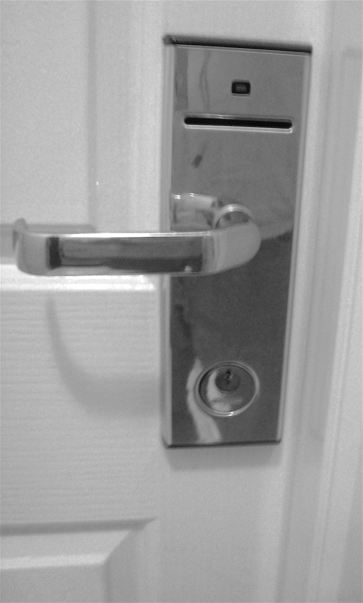

# chmod and chown: who is allowed to touch this file

*Permission-denied is one of the commonest bugs a QA meets on staging and CI. Read ls -l output character by character, decode rwx for owner/group/other, translate 644 and 755, fix a script that won't run, and learn why chown plus sudo is the button you don't mash.*

> Sooner or later a build fails, a script refuses to run, or an upload dies — and the log says three
> words that make beginners panic: **Permission denied**. It is not a crash, not a network glitch, and
> almost never a bug in the code you were testing. It is Linux doing exactly its job: every file and
> folder carries a tiny rulebook saying *who* is allowed to read it, change it, or run it. Learn to
> read that rulebook — the `rwx` letters in `ls -l` — and 'permission denied' stops being a wall and
> becomes a sentence you can diagnose in ten seconds. Two commands do the fixing: `chmod` changes what
> actions are allowed, and `chown` changes who owns the file. This note teaches you to read the rules
> first, change them second, and treat the change-who-owns-it command with the caution it deserves —
> because on a shared staging box, the wrong `chown` run as root is how you turn one broken file into a
> broken afternoon for the whole team.

> **In real life**
>
> A file's permissions are **a hotel keycard system**. Every door (file) knows three kinds of guest:
> the **owner** (the person the room is booked to), the **group** (their travelling party, who share
> some access), and **everyone else** (other guests wandering the corridor). For each kind of guest the
> door grants up to three things: **read** it (look inside), **write** it (rearrange the furniture), or
> **execute** it (actually use the room as a room). A locked minibar the owner can open but the cleaner
> cannot is just different permissions for owner versus group. When a script says 'permission denied',
> the door checked your keycard, found you are not the owner and not in the group, and the 'everyone
> else' setting did not include the action you tried. Nothing is broken — the lock worked. `chmod` is
> reprogramming what each keycard tier may do; `chown` is re-registering whose room it is. And handing
> out master keys (that is `sudo` plus `chown`) is exactly as risky in a hotel as it sounds.

## Reading the rulebook: ls -l, character by character

Run `ls -l` and every file grows a cryptic prefix like `-rw-r--r--`. That string is the whole
permission rulebook, and it is ten characters you can decode on sight. The **first** character is the
file type: `-` for a normal file, `d` for a directory, `l` for a symlink. The **next nine** are three
groups of three — `rwx` repeated for **owner**, then **group**, then **other** (everyone else). Each
slot is either the letter (permission granted) or a dash (denied). So `-rw-r--r--` reads as: normal
file; owner can read and write but not execute; group can only read; everyone else can only read. A
script marked `-rwxr-xr-x` means: owner can read, write, and execute; group and other can read and
execute but not change it. The `x` on a directory means something slightly different — it is
permission to *enter* the folder (cd into it and reach what is inside), which is why a folder with no
`x` gives 'permission denied' even when you can see its name.

## The numbers: 644, 755, and why they exist

Typing `rwx` by hand is tedious, so Linux lets you say the same thing in numbers. Each permission has
a value: **read is 4, write is 2, execute is 1**. Add them per tier and you get one digit for owner,
one for group, one for other. Read plus write is `4 + 2 = 6`; read plus execute is `4 + 1 = 5`;
all three is `4 + 2 + 1 = 7`. So the two numbers you will see everywhere: **644** means owner
read+write (6), group read (4), other read (4) — the normal setting for a document or config file.
**755** means owner all-three (7), group read+execute (5), other read+execute (5) — the normal
setting for a script or program that everyone should be able to run but only the owner should edit.
Once the code equals the letters in your head — 6 is `rw-`, 5 is `r-x`, 7 is `rwx` — you can read a
`chmod 755 deploy.sh` and know instantly it just made a script runnable.


*Hotel keycard door lock — Wikimedia Commons, CC0. [Source](https://commons.wikimedia.org/wiki/File:Batteries_Not_Included_(1774590851).jpg)*
- **The card slot = the whole rulebook, checked on every try** — A pin over the full ls -l prefix, for example -rwxr-xr-x. The ideal photo shows a lock or panel where the entire access state is readable at a glance, mirroring how one ten-character string encodes a file's type plus all nine permission bits. Testers learn to read this the way they read a status code: instantly and without thinking.
- **The status light = granted or denied, no argument** — A pin isolating the leading character. The photo should highlight a single indicator that means 'what kind of thing is this' rather than 'what may you do': dash for a normal file, d for a directory, l for a symlink. Beginners miscount the rwx bits because they forget this first slot is type, not an owner permission.
- **The handle = x, permission to actually act** — A pin over the three groups of three letters. The ideal image visibly separates three access levels, standing in for owner (the person the file belongs to), group (a shared team), and other (everyone else). The single most common permission mistake is fixing the owner tier and forgetting the group or other tier that the failing process actually runs as.
- **The emergency keyhole = root's override** — A pin on the numeric side. The photo should suggest a keypad or code entry, standing in for the octal shorthand: read is 4, write is 2, execute is 1, added per tier to make 644 or 755. This is the translation testers memorise so a chmod command in a build log reads like plain English.
- **The door itself = the file behind the permissions** — A pin on a door handle or threshold. The image should evoke crossing a threshold, because execute on a directory does not mean 'run it' -- it means 'enter it and reach what is inside'. A folder you can list but not enter, or enter but not list, is a classic confusing permission-denied that this pin exists to demystify.

**How Linux answers 'may I run this script?' -- press Play**

1. **You type ./deploy.sh** — You ask the shell to execute a file. Before a single line of the script runs, the kernel does a permission check -- the same check for every open, read, write, and execute on the system. Nothing about the script's contents matters yet; only its rulebook and your identity do.
2. **Linux asks: who are you, relative to this file?** — It compares your user id to the file. Are you the OWNER? If not, are you a member of the file's GROUP? If neither, you fall into OTHER -- everyone else. Exactly one tier applies to you, and it is the first match in that order: owner, then group, then other.
3. **It reads that tier's three bits** — Say you are 'other' and the file is -rwxr-x---. The owner tier is rwx and the group tier is r-x, but neither is yours. Your tier, other, is three dashes: no read, no write, no execute. The decision is made purely from your tier's slots, ignoring the more generous tiers above you.
4. **Execute bit missing -> Permission denied** — Your tier has no x, so the kernel refuses before running anything and the shell prints 'permission denied'. This is a successful security check, not an error in the script. The same logic denies a read on a file with no r for you, or a cd into a folder with no x.
5. **chmod adds the bit -> it runs** — chmod +x deploy.sh (or chmod 755) turns the execute slot from dash to x for the tiers you named. Re-run ./deploy.sh and the check now passes, so the script's actual code finally executes. You did not change the code -- you changed who is allowed to run it.

Here is the whole story in one terminal session: list a file, watch it refuse to run, decode why,
and read the numbers behind the letters. Every output line is what a real Linux shell prints:

*Try it -- read ls -l and hit the wall*

```bash
ls -l
# total 24
# -rw-r--r--  1 sajan  staff   215 Jul 13 09:14 config.yml
# -rw-r--r--  1 sajan  staff  1840 Jul 13 09:12 deploy.sh
# drwxr-xr-x  4 sajan  staff   128 Jul 13 09:10 logs

# Decode deploy.sh: -rw-r--r--
#   -    normal file (not d for directory, not l for symlink)
#   rw-  OWNER  sajan can read + write, but NOT execute
#   r--  GROUP  staff can only read
#   r--  OTHER  everyone else can only read
# Nobody has the execute bit -- so nobody can run it yet.

./deploy.sh
# bash: ./deploy.sh: Permission denied
# The kernel checked, found no x for you, and refused. Not a code bug.

# The numbers behind those letters: r=4, w=2, x=1, added per tier
#   rw- = 4+2+0 = 6   (owner)
#   r-- = 4+0+0 = 4   (group)
#   r-- = 4+0+0 = 4   (other)
# so -rw-r--r-- IS 644 -- the normal setting for a plain document.
```

Now the fix. `chmod` in two dialects — the numeric `755` and the symbolic `+x` — plus a first,
careful look at `chown`. Watch how success is *silent*: a bare prompt means it worked.

*Try it -- fix it with chmod, meet chown carefully*

```bash
# Make it runnable. Two ways to say the same thing:
chmod +x deploy.sh          # symbolic: add execute for all tiers
# (no output -- success is silent in Unix)

chmod 755 deploy.sh         # numeric: owner rwx=7, group r-x=5, other r-x=5
ls -l deploy.sh
# -rwxr-xr-x  1 sajan  staff  1840 Jul 13 09:12 deploy.sh
# The three x bits are now set. Read it left to right to confirm.

./deploy.sh
# Deploying build 44 to staging...
# It runs. You changed the permission, not the code.

# Lock a secrets file down to owner-only (600 = rw for owner, nothing else):
chmod 600 secrets.env
ls -l secrets.env
# -rw-------  1 sajan  staff  92 Jul 13 09:20 secrets.env

# chown changes WHO OWNS the file. Usually needs sudo, and that is the danger.
sudo chown sajan:staff deploy.sh      # set owner to sajan, group to staff
# Handle with care: run this on the wrong path (say /var or a system file)
# as root and you can lock services -- or the whole box -- out of their own
# files. Change ownership deliberately, never with a broad wildcard.
```

file permissions

> **Tip**
>
> The tester's quickest permission triage: run `ls -l` on the exact file in the error, then ask three
> questions in order. **What tier am I?** — owner, group, or other; compare your username (`whoami`) to
> the file's owner. **Does my tier have the bit I need?** — `x` to run it, `r` to read it, `w` to write
> it. **If not, who owns it and should it change, or should the permission?** Nine times out of ten the
> fix is a `chmod` to add the missing bit — and you should prefer that over `chown`, because changing
> *permissions* is local and reversible while changing *ownership* touches who controls the file
> forever. Reach for `sudo` last, not first: 'permission denied' is a question about which tier you are
> in, and `sudo` skips the question instead of answering it.

### Your first time: First time? Make a file, break it, fix it

- [ ] Read a real ls -l line — Run ls -l in any folder. Pick one file and read its first ten characters out loud: file type, then owner rwx, group rwx, other rwx. Say what each tier may do. Do this until it is automatic -- it is the single most useful Linux-permission skill.
- [ ] Create and lock a file — Run: echo 'hello' > note.txt then chmod 000 note.txt then cat note.txt. You just removed all permissions from your own file and got 'permission denied' reading it. Proof that the rules apply even to the owner until the owner grants themselves the bit.
- [ ] Give yourself read back with numbers — Run chmod 644 note.txt then cat note.txt -- it reads again. You translated 'owner read+write, others read' into the number 644 and it worked. Now try chmod 600 note.txt and confirm with ls -l that group and other lost their r.
- [ ] Make a script, hit the wall, open the door — Put echo hi in run.sh, then ./run.sh -- permission denied (no x). Run chmod +x run.sh and try again -- it runs. You have now reproduced and fixed the single commonest permission bug in one minute.
- [ ] Look, do not chown — Run ls -l on a system path like /etc/hosts and just READ its owner (usually root). Do not change it. The habit to build: on ownership you look first and change only with a specific reason, because chown as root on the wrong path is how staging boxes get bricked.

You have now read the rulebook, locked yourself out of your own file, and let yourself back in — the whole loop of this note in five minutes.

- **A shell script fails with 'permission denied' even though the code is fine.**
  The file is missing its execute bit for your tier. Run ls -l on it: if you see -rw-r--r-- there is no x anywhere. Fix with chmod +x script.sh (or chmod 755 script.sh to also let group and other run it). This is the number-one permission bug on CI, where a script checked out or generated by one step is executed by another. Note that files copied from Windows or downloaded from the web often arrive without the execute bit at all.
- **'permission denied' opening a folder you can clearly see in a listing.**
  Seeing a folder's NAME needs read on its parent; ENTERING it needs the execute bit on the folder itself. A directory like drwxr----- lets the owner in but denies group and other the x, so cd fails for them. Fix the directory with chmod 755 dirname (or 750 to keep 'other' out) -- and remember directory x means 'may enter', which is why removing it locks people out of everything inside, however open those inner files look.
- **You fixed the owner's permission but the app STILL cannot read the file.**
  The app is almost certainly not running as the file's owner -- web servers and CI runners run as their own users (www-data, jenkins, a container's node user). You fixed the owner tier; the process falls into group or other, which you left closed. Check with ls -l who owns it and ps to see which user the process runs as, then open the correct tier (for example chmod 644 so 'other' can read) or add the process's user to the file's group.
- **After a chown -R as root, a service or your own tools stop working entirely.**
  A recursive chown swept ownership of files a service needs to own, or you ran it on too broad a path. This is the cautionary tale: chown -R root:root on the wrong directory can lock daemons out of their own data and, on a system path, break login. Recover by chowning the affected tree back to the correct user (if you know it) or restoring from backup. The lesson is prevention: never run recursive chown as root without being certain of the exact path and the exact target user.

### Where to check

Permission bugs cluster in a few predictable places a tester learns to check first:

- **CI and build logs** — the phrase 'permission denied' on a script step almost always means a
  missing execute bit on a checked-out or generated file. Grep the log for it before blaming the code.
- **File uploads and generated artifacts** — the app writes to a directory it must have `w` on, and
  the web server user (not you) owns the process. A locked-down upload folder fails silently or 500s.
- **Anything copied between machines or from a zip** — permissions do not always survive the trip;
  scripts frequently arrive without `x`, and secrets sometimes arrive world-readable, which is its own
  bug.
- **Shared staging boxes** — files created by one deploy user then read by another service is a
  constant source of group/other permission mismatches. Check which user each process runs as.
- **Log and temp directories** — if logging suddenly stops, a `w` permission on the log directory
  (or a full disk, the next note) is a prime suspect.

Tester's habit: **when you see 'permission denied', run `ls -l` on the exact path before anything
else, and compare the file's owner and tier bits to the user the failing process runs as.** The
answer is almost always visible right there in the ten characters.

### Worked example: the upload feature that worked on the laptop and died on staging

1. **The report:** "Profile-photo upload works perfectly on my machine, but on staging every upload
   returns a 500. The image never lands. Started after we moved the upload folder in yesterday's
   deploy."
2. **The tester reproduces it on staging** and pulls the server log, which contains the tell:
   `PermissionError: [Errno 13] Permission denied: '/srv/app/uploads/'`. Errno 13 is the permission
   errno — this is not an image-processing bug, it is a file-system access bug.
3. **They run `ls -l` on the parent** to see the folder's rulebook:
   `drwxr-xr-x  2 sajan  staff  64 Jul 12 18:03 uploads`. Owner `sajan` can write (the `w` in `rwx`);
   group and other get only `r-x` — read and enter, but **no write**.
4. **They check who the app runs as** with `ps aux | grep gunicorn` and find the process owned by
   `www-data`, not `sajan`. So the web server falls into the 'other' tier for this folder — and other
   has no `w`. The app literally cannot create a file there. On the laptop it worked because the dev
   ran the server as themselves, the owner.
5. **Now the symptom explains itself.** The move recreated the folder owned by the deploy user with a
   default `755`, which is fine for a folder people only read — but an upload folder must be
   *writable* by the web-server user. The environment differed in exactly the invisible way that
   permission bugs love: same code, different owner-versus-process identity.
6. **The fix is a permission change, not a code change and not a reckless chown:** make the folder
   writable by the group the web server belongs to and put www-data in that group, or (simplest here)
   `chown` the single upload directory to the web-server user deliberately —
   `sudo chown www-data:www-data /srv/app/uploads` — never a recursive sweep of `/srv`.
7. **The tester's angle.** No amount of retesting the *code* would have found this; the code was
   innocent. Only checking the file-system rulebook against the process identity did. And the regression
   test that belongs here is an actual upload on a staging-like environment, running as the real
   service user — not an upload on a dev laptop where you happen to own everything.
8. **The lesson for a tester.** 'Works on my machine, permission-denied on staging' is a signature
   line. It nearly always means the process runs as a different user in the two places, so a folder or
   file writable by *you* is not writable by *it*. Check owner versus process user before you check
   anything else.

> **Common mistake**
>
> Reaching for `sudo` (or a broad `chown -R`) the instant you see 'permission denied', instead of
> reading the rulebook first. `sudo` makes the error disappear because root ignores permission checks —
> so it *looks* like a fix, but you have not learned which tier was short a bit, and you may have run
> the real process as root or handed a file the wrong owner. The damage compounds with recursion: one
> `sudo chown -R me:me /var/www` to 'just make it work' can strip the web-server user's ownership from
> every file it needs, turning a one-file problem into a dead service. The disciplined move is boring
> and fast: `ls -l` the exact path, find the missing bit for your tier, and add just that bit with
> `chmod`. Change permissions locally and reversibly; change ownership only with a specific reason and a
> specific path; use root last, never first.

**Quiz.** A CI job fails with './build.sh: Permission denied'. ls -l shows '-rw-r--r-- 1 ci ci 900 build.sh'. What is wrong and what is the minimal fix?

- [x] The file has no execute bit for anyone (rw-r--r-- = 644); add it with chmod +x build.sh (or chmod 755) so it can run
- [ ] The file is owned by the wrong user; run sudo chown root build.sh to fix it
- [ ] The script's code has a bug; open it and debug the commands inside
- [ ] CI is out of disk; the denial is a symptom of no free space

*Read the ten characters: -rw-r--r-- is a normal file where owner has rw-, group r--, other r-- -- and crucially there is no x in any tier, so nobody may execute it. Running it triggers a permission check that fails before a single line of the script runs, which is exactly 'permission denied'. The minimal, correct fix is to add the execute bit: chmod +x build.sh (symbolic) or chmod 755 build.sh (numeric -- owner rwx, group and other r-x). Option 2 is the classic overreaction: chown as root changes WHO owns the file, which is not the problem (execute is missing regardless of owner) and can make things worse. Option 3 blames innocent code -- the denial happens before the code runs, so the commands inside are irrelevant. Option 4 confuses two different bug classes; a disk-full error reads 'No space left on device' (Errno 28), not 'permission denied' (Errno 13). The whole skill is reading the tier bits and adding exactly the one that is missing.*

- **How do you read an ls -l permission string like -rwxr-xr-x?** — First char = file type (- file, d directory, l symlink). Next nine = three tiers of rwx: owner, then group, then other. A letter means granted, a dash means denied. So -rwxr-xr-x = file; owner read/write/execute; group and other read/execute only.
- **What do the numbers 644 and 755 mean?** — r=4, w=2, x=1, added per tier. 644 = owner rw- (6), group r-- (4), other r-- (4): the normal setting for a document or config. 755 = owner rwx (7), group r-x (5), other r-x (5): the normal setting for a script everyone runs but only the owner edits.
- **chmod vs chown -- what does each change?** — chmod changes the permission BITS (what actions each tier may do): chmod +x adds execute, chmod 600 makes a file owner-only. chown changes WHO OWNS the file (owner and group): chown user:group file, usually needs sudo. Prefer chmod -- it is local and reversible; chown touches control of the file.
- **Why does 'permission denied' happen and is it a code bug?** — The kernel checks your tier's bits before running or opening a file; if the action's bit is a dash for your tier, it refuses. It is the security system working, not a bug in the code -- the denial happens BEFORE any of the file's code runs.
- **What does the execute bit mean on a directory?** — Not 'run it' -- it means permission to ENTER the folder (cd into it and reach what is inside). A folder you can list but not cd into is missing x; a folder you can enter but not list is missing r. This is why a folder with generous-looking inner files still gives 'permission denied'.
- **Why does a file work on my laptop but hit permission-denied on staging?** — The process runs as a different user in the two places. On your laptop you own the files and run the server yourself; on staging the web server or CI runs as its own user (www-data, jenkins), which falls into the group or other tier -- and that tier may lack the bit you have as owner.

### Challenge

Reproduce the whole note in a scratch folder. (1) Create three files and give them 644, 755, and 600
with chmod, then run `ls -l` and confirm each string matches what the number should produce — read
the rwx out loud. (2) Make a one-line script, run it before and after `chmod +x`, and record the exact
error and the exact success. (3) Make a directory, put a readable file inside, then `chmod 644` the
DIRECTORY (removing its x) and try to `cd` into it — explain in one sentence why 'permission denied'
appears even though the inner file is readable. (4) Finish by writing the two questions you will ask
next time a staging build says 'permission denied' — one about the file's tier bits, one about which
user the process runs as.

### Ask the community

> Permission-denied question: I ran [command] and got 'permission denied' on [exact path]. ls -l on it shows [paste the ten-character string and owner]. My username (whoami) is [name]; the process that fails runs as [user, or 'not sure']. I expected [what]. Am I in the owner, group, or other tier here, and is the fix a chmod (which bit?) or something about ownership?

Most permission questions answer themselves once two facts are on the table: the file's `ls -l` line
(owner, group, and the nine rwx bits) and which USER the failing action runs as. State both, plus the
exact path, and the diagnosis is usually 'you are in the other tier, which lacks the execute/write bit
— add it with chmod'. Include `whoami` and, if a service is involved, the `ps` line showing its user.

- [GNU coreutils -- chmod (symbolic and numeric modes)](https://www.gnu.org/software/coreutils/manual/html_node/chmod-invocation.html)
- [Arch Wiki -- File permissions and attributes (rwx, octal, examples)](https://wiki.archlinux.org/title/File_permissions_and_attributes)
- [Red Hat -- Linux file permissions explained](https://www.redhat.com/sysadmin/linux-file-permissions-explained)
- [Linux in 100 seconds — users, files and permissions — Fireship](https://www.youtube.com/watch?v=rrB13utjYV4)

🎬 [Linux in 100 seconds — users, files and permissions — Fireship](https://www.youtube.com/watch?v=rrB13utjYV4) (2 min)

- An ls -l prefix like -rwxr-xr-x is a ten-character rulebook: first char is the file type, then three tiers of rwx -- owner, group, other. A letter grants the action, a dash denies it. Reading this on sight is the core skill.
- The numbers are the letters added up per tier: r=4, w=2, x=1. 644 = owner rw, everyone else read (documents/config); 755 = owner all, everyone else read+execute (runnable scripts); 600 = owner-only (secrets).
- 'Permission denied' is the security system working, not a code bug -- the check happens before the file's code runs. Diagnose it by comparing the file's owner and tier bits to the user the failing process runs as.
- chmod changes what actions are allowed and is your first tool -- local, reversible, add just the missing bit (chmod +x to run a script). chown changes who owns the file, usually needs sudo, and deserves caution, especially recursively as root.
- For a tester, permission-denied is a top-tier staging/CI bug class: 'works on my machine' usually means the process runs as a different user there, so a file writable by you is not writable by it. Check owner-versus-process-user first.


---
_Source: `packages/curriculum/content/notes/linux-for-testers/permissions-and-processes/chmod-and-chown.mdx`_
