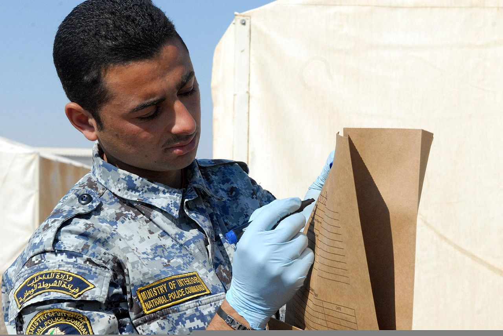

# Collecting evidence remotely

*A bug report is only as good as its evidence. Bundling logs with tar/gzip, timestamped evidence directories, grabbing system info with uname/df/free, pulling artifacts off a server, and the chain-of-evidence habits that make a report undeniable.*

> "Can't reproduce, closing as works-as-expected" is the single most demoralising sentence a tester
> can read on their own bug report — and it's usually earned, not unfair. A report that says "it broke
> on staging, trust me" gives a developer nothing to work with: no logs, no system state, no timestamp
> to correlate against, nothing that survives the server getting redeployed an hour later. Every skill
> in this chapter — SSH in, copy files out, keep long jobs alive in tmux — exists to feed this last
> one: turning a fleeting moment on a remote box into a **durable, undeniable evidence package** sitting
> on your laptop, dated, bundled, and ready to attach. This note is the last mile: `tar`/`gzip` to
> bundle it, a few commands to capture system state, and the habits that turn "I saw it happen" into
> "here's exactly what happened, and when."

> **In real life**
>
> Treat a remote bug the way a crime scene investigator treats a scene: **nothing gets left behind,
> everything gets bagged, tagged, and dated before the scene changes.** A detective who says "I
> remember the room looked messy" is useless in court; one who photographs it, bags the physical
> evidence, and timestamps every item hands the prosecution something nobody can argue with. A server
> is exactly that kind of scene — it gets redeployed, logs rotate out, memory pressure resolves
> itself, and the exact state that caused your bug can be gone within the hour. The
> **evidence bundle**: A single, self-contained, timestamped collection of everything relevant to one incident or bug -- logs, system state, config snapshots, screenshots -- bundled together (typically as one compressed archive) and stored somewhere durable, so the full context survives long after the server itself has moved on. Good evidence bundles are named and dated clearly enough that six months later, someone can tell exactly what happened and when without re-reading the whole investigation.
> is your bag-and-tag: gather it WHILE the scene still exists, not after someone asks for it and
> you're staring at a server that's already moved on.

## What actually belongs in the bundle

Four categories cover almost every bug report worth filing. **Logs** — the application log around
the timestamp in question, plus anything upstream (reverse proxy, database slow-query log) that
might explain WHY, not just what. **System state** — is the disk full, is memory exhausted, what's
the kernel and distro version; a bug that only reproduces at 95% disk usage needs that number in the
report, not a guess. **Config and version snapshots** — which build is actually deployed, which
config values are live right now (not what the deploy pipeline SAYS should be live — what the
server ITSELF reports). **Screenshots and captured output** — anything visual, plus the raw text
output of the commands that produced your findings, because a screenshot of a terminal is worse
evidence than the text it displayed.

The three commands that answer "what state was this machine in" fastest: `uname -a` (kernel,
architecture, hostname — confirms you're even looking at the right kind of box), `df -h` (disk usage
per filesystem, human-readable — the single most common silent root cause behind "randomly" failing
writes, uploads, and log rotation), and `free -h` (memory and swap usage — a service that's
thrashing swap looks "slow" to a user and "fine" to a health check that only asks "is it responding
at all"). None of these take longer than typing the command; all three answer questions a developer
would otherwise have to ask you for, a day later, after the state that mattered is gone.

Bundling it all into one file matters more than it sounds like it should. `tar` (tape archive, a
name older than most of us) combines many files and folders into one, and `gzip` compresses that
combined file — together, `tar czf bundle.tar.gz folder/` turns a scattered pile of logs and text
files into a single attachable artifact, in one command, preserving the folder structure exactly.
Untangling ten separately-attached files in a ticket six weeks later, trying to remember which log
went with which screenshot, is a problem a single named archive simply doesn't have.


*Officer bags and marks evidence during an exercise — U.S. Army, Wikimedia Commons, Public domain*
- **The printed label being filled in = the timestamped folder name** — A directory named something like bug-4021-2026-07-13T1420 -- specific enough that, found alone six months later with no other context, its name alone tells you what it's about and roughly when. This single naming habit prevents more confusion than any tool on this page.
- **What goes in the bag = the system-state files inside it** — A plain text file holding the output of uname -a, df -h, and free -h, captured at the SAME moment as the logs -- not reconstructed from memory afterward. This is what lets a developer answer 'was the disk full' without needing you to still be logged into a server that may no longer exist in that state.
- **One item per bag = the log excerpt, not the whole log** — A grep or sed-extracted window around the relevant timestamp, not a 4 GB raw log file nobody will open. Evidence that's too large to actually read defeats its own purpose -- trim to what's relevant, but always trim WIDE (more context before and after) rather than narrow.
- **Sealing the bag = the tar czf command building the bundle** — One command turning the whole folder into a single .tar.gz -- c (create), z (gzip-compress), f (the filename that follows). This is the step that turns a scattered pile of evidence into one attachable, downloadable, permanently-dated artifact.
- **The bag you can hold = the resulting archive's file size** — A sanity check as much as a fact -- an archive that's suspiciously 0 bytes or suspiciously huge (did a whole log directory get swept in by accident, disk images and all) is worth a second look before it gets attached to a ticket and downloaded by five people.

**From 'it broke just now' to an attached, dated evidence bundle. Press Play.**

1. **The moment it breaks -- act BEFORE the scene changes** — A test fails against staging with a 500 error. The clock starts now: logs rotate, memory pressure resolves, and if this is a container it might get redeployed within the hour. The single most valuable habit in this whole note is treating THIS moment as the deadline, not 'later today.'
2. **Make a timestamped evidence folder** — mkdir -p ~/evidence/bug-4021-$(date +%Y%m%dT%H%M) -- one folder, named with the bug and the exact time, created FIRST so everything gathered next has somewhere specific to land instead of scattering across the home directory.
3. **Capture system state and logs into it** — uname -a, df -h, and free -h redirected into a text file inside the folder; the relevant log window grep'd out into another. Every command's OUTPUT gets saved to a file -- not just read on screen and remembered, which is not evidence, it's a claim.
4. **Bundle it with tar czf** — tar czf bug-4021-evidence.tar.gz ~/evidence/bug-4021-.../ -- the whole folder becomes one compressed file. Structure preserved, nothing left loose, ready to move as a single unit.
5. **scp it off the server and attach it to the report** — scp qa@staging:~/bug-4021-evidence.tar.gz ./ pulls the bundle to your laptop -- the last note's tool, doing its actual job. Attach the archive to the ticket with a one-line pointer to what's inside. Six months from now, this is the version of events nobody can argue with.

Building the evidence folder and the archive, start to finish:

*Try it -- capture system state and logs, then bundle it*

```bash
# Make a timestamped, specifically-named evidence folder FIRST:
mkdir -p ~/evidence/bug-4021-$(date +%Y%m%dT%H%M)
cd ~/evidence/bug-4021-*/

# Capture system state -- redirect OUTPUT to a file, don't just eyeball it:
uname -a > system-info.txt
df -h >> system-info.txt
free -h >> system-info.txt
cat system-info.txt
# Linux staging-01 5.15.0-91-generic x86_64 GNU/Linux
# Filesystem      Size  Used Avail Use% Mounted on
# /dev/sda1        40G   38G  1.2G  97% /
#               total   used   free  shared  buff/cache  available
# Mem:           7.8G   6.9G   210M    12M       700M       650M

# Pull the relevant log WINDOW, not the whole file (grep -B/-A = lines of context):
grep -B 5 -A 20 "request_id=8f2a" /var/log/app/error.log > error-context.log

# Snapshot the deployed version and config actually running right now:
cat /opt/app/VERSION > deployed-version.txt
cat /etc/app/config.yaml > deployed-config.yaml

ls -la
# system-info.txt  error-context.log  deployed-version.txt  deployed-config.yaml
```

Bundling it into one archive and getting it off the server:

*Try it -- tar/gzip the folder, then scp the archive to your laptop*

```bash
# From ~/evidence/, bundle the whole timestamped folder into one archive:
cd ~/evidence
tar czf bug-4021-evidence.tar.gz bug-4021-20260713T1420/
# (c = create, z = gzip-compress, f = filename that follows -- one command)

ls -lh bug-4021-evidence.tar.gz
# -rw-r--r-- 1 qa qa 84K Jul 13 14:23 bug-4021-evidence.tar.gz

# Peek inside WITHOUT extracting it, to sanity-check what actually got bundled:
tar tzf bug-4021-evidence.tar.gz
# bug-4021-20260713T1420/
# bug-4021-20260713T1420/system-info.txt
# bug-4021-20260713T1420/error-context.log
# bug-4021-20260713T1420/deployed-version.txt
# bug-4021-20260713T1420/deployed-config.yaml

# Pull the single bundled file to your laptop (from the earlier note):
scp qa@staging.example.com:~/evidence/bug-4021-evidence.tar.gz ./
# bug-4021-evidence.tar.gz     100%   84KB  4.9MB/s   00:00

# On your laptop, if you ever need to look back inside it:
tar xzf bug-4021-evidence.tar.gz
# (x = extract -- restores the original folder structure exactly)
```

> **Tip**
>
> Two habits that separate an evidence bundle a developer trusts from one they have to double-check.
> First: **capture, don't summarise** — save the raw command output to a file (`command > file.txt`)
> rather than typing your own paraphrase of what you saw; a paraphrase can be wrong or incomplete,
> raw output can't lie about what the server actually returned. Second: **write a one-paragraph
> `README.txt` inside the bundle** — what bug this is for, what timestamp matters, which file answers
> which question. An archive full of correctly-captured evidence that nobody can navigate is barely
> better than no archive at all; thirty seconds of orientation saves the next person twenty minutes of
> guessing.

### Your first time: First time? Build one real evidence bundle end to end

- [ ] Make the timestamped folder — On a practice server, mkdir a folder named with a fake bug id and today's date/time. Get the naming habit right before anything goes into it.
- [ ] Capture, don't eyeball, system state — Redirect uname -a, df -h, and free -h into a text file inside the folder rather than just reading them on screen. Confirm the file actually contains the output by cat-ing it back.
- [ ] Pull a log window with context — Pick any log file and grep for a string in it using -B and -A to capture lines of context before and after, redirected to a file. Notice how much more useful a window of context is than a single matching line alone.
- [ ] Bundle it with tar czf — tar czf into one archive named for the same bug id. Run tar tzf on the result to confirm the contents and structure are what you expect BEFORE trusting it as evidence.
- [ ] scp it home and open it — Pull the archive to your laptop and tar xzf it there to confirm it survives the trip intact. Read your own README.txt (write one if you skipped it) as if you were a developer seeing this bundle cold.

You've now built one complete, timestamped, bundled, transferred evidence package -- the exact artifact that turns a bug report from a claim into a case.

- **tar: Cowardly refusing to create an empty archive, or the resulting .tar.gz is 0 bytes.**
  The path you pointed tar at doesn't exist, or you ran the command from the wrong directory so the folder name didn't resolve. Confirm the target folder exists first (ls the exact path) and always run tar tzf immediately after creating an archive to verify it actually contains something before relying on it.
- **The log file I need is enormous (multiple GB) and grabbing the whole thing isn't practical.**
  Never scp/tar an entire multi-gigabyte log as evidence -- extract a bounded WINDOW instead: grep -B N -A N 'search term' bigfile.log > excerpt.log, or tail -n 5000 bigfile.log for just the recent end. Evidence too large to open defeats its own purpose; a focused excerpt with generous context beats the raw firehose every time.
- **By the time I went to gather evidence, the server had already redeployed / the logs had rotated out.**
  This is the scenario the whole note is built to prevent -- the fix is procedural, not technical: capture evidence THE MOMENT something breaks, not after filing the ticket and getting a reply asking for logs. If it's already gone, note that explicitly in the report ('logs rotated before capture, could not retrieve') rather than guessing -- an honest gap beats fabricated certainty.
- **Nobody can tell what an evidence archive from three months ago is even about.**
  A naming and documentation gap, not a tooling one. Rename future bundles with the bug id AND a date in the filename itself (not just the folder inside it), and always include a short README.txt describing what's inside and why it was collected. For this specific archive, check the ticket it was originally attached to for context clues.

### Where to check

Where evidence-gathering shows up across a QA week:

- **Any bug report referencing a remote environment** — before writing "it broke on staging," gather the log window, system state, and deployed version FIRST; write the report around the evidence, not the other way around.
- **Intermittent or hard-to-reproduce failures** — these are exactly the ones that vanish if you don't capture the state during the ONE window you actually caught it happening.
- **"Works as expected" pushback on a filed bug** — a bundle with timestamped raw output is far harder to wave away than a description; this is often the difference between a bug getting fixed and getting closed.
- **Incident retros and postmortems** — a well-bundled evidence archive from during the incident is frequently the only reliable record of what the system actually looked like at the time, once the dashboards have moved on.
- **Handoffs to developers in a different timezone** — a self-contained, documented bundle lets someone investigate hours later without needing you awake to answer "what did you see."

Tester's habit: **evidence has a shelf life, and the shelf life starts the moment the bug happens,
not the moment you sit down to write the report.** Capture first, write the report second.

### Worked example: the bundle that outlived three redeployments

1. **The bug:** a checkout flow intermittently returns a 500 error on staging, roughly once every
   thirty attempts, no obvious pattern. The tester catches it live during a manual test pass.
2. **The immediate move, before anything else:** `ssh` into the box serving staging, and inside two
   minutes has a timestamped evidence folder with the app log window around the failing request ID,
   `uname -a`/`df -h`/`free -h` output, and the exact deployed config file — captured while the
   failure state was still fresh on the server.
3. **The bundle gets built and pulled home** with `tar czf` and `scp`, attached to the ticket with a
   one-paragraph README pointing at the log excerpt as the key file.
4. **The investigation takes four days** — the developer assigned is in a different timezone, and
   staging gets redeployed twice during that window as unrelated work continues (a new build, then a
   config change for a different feature).
5. **By day three, staging looks nothing like it did at the time of the bug** — different deployed
   version, different config, and the original log lines rotated out days ago. If the tester had
   only filed "500 error on checkout, happens sometimes," there would be nothing left to investigate.
6. **The evidence bundle is the entire case.** The developer opens the archive, reads `df -h` showing
   disk at 97% full at the moment of failure, cross-references the log excerpt showing a failed
   temp-file write during checkout's PDF-receipt generation, and confirms: intermittent disk pressure
   from an unrelated log-rotation misconfiguration was causing occasional write failures.
7. **The fix ships without anyone needing to reproduce the original conditions** — the evidence bundle
   WAS the reproduction, captured once, durable across four days and two redeployments.
8. **Tester's angle.** The value of an evidence bundle scales with how much the environment changes
   before anyone gets to look at it — which is to say, it scales with almost every real
   investigation. Capturing thoroughly and immediately is what makes a bug fixable days later, by
   someone who was never there to see it happen.

> **Common mistake**
>
> Filing the bug report first and treating evidence-gathering as an optional follow-up if someone
> asks for it. By the time a developer replies "can you get me the logs from when this happened," the
> server has often already moved on — redeployed, rotated its logs, resolved the memory pressure that
> caused it. The fix is a sequencing change, not a tooling one: **gather the bundle the moment you see
> the failure, before you even start typing the report** — worst case, you gathered evidence for
> something that turns out to be a non-issue and you delete the folder; best case, you've captured the
> one window of proof that makes the bug undeniable and fixable. Evidence you didn't capture in time
> cannot be captured later, no matter how good the report's prose is.

**Quiz.** You catch an intermittent bug live on staging. A developer won't be able to look at it for two days, and staging gets redeployed at least once a day. What's the correct immediate move?

- [x] Gather logs, system state (uname/df/free), and the deployed config into a timestamped folder RIGHT NOW, bundle it with tar, and pull it to your laptop -- before writing the ticket, not after
- [ ] Write a detailed ticket description of what you observed, and let the developer ask for specific logs if they need them once they start investigating
- [ ] Wait until the developer is available, then reproduce the bug live together over a screen share so they can see it firsthand
- [ ] Take a screenshot of the error message on screen -- that's sufficient evidence for any bug report

*Given that staging redeploys at least daily, the exact state that produced the bug -- logs, deployed version, system resource levels -- will very likely be gone within 24 hours, long before the developer even starts looking. Capturing it immediately, bundled and pulled to somewhere durable (your laptop, not the server that's about to change), is the only approach that survives that timeline. A detailed description without raw evidence asks the developer to trust your memory of a state that no longer exists by the time they'd want to check it. 'Reproduce it together live' assumes the bug is reliably reproducible on demand -- it's intermittent, so that assumption is shaky, and it also assumes staging will still be in a comparable state in two days, which redeploys make unlikely. A screenshot captures ONE moment of visual output but none of the system state, logs, or config that actually explain WHY it happened -- necessary sometimes, rarely sufficient alone.*

- **The four evidence categories** — Logs (relevant window, with context), system state (uname/df/free), config and version snapshots (what's ACTUALLY deployed, not what should be), and screenshots/raw captured output. Cover all four when the bug matters.
- **uname -a / df -h / free -h** — Three fast commands answering 'what state was this machine in': kernel/hostname/architecture, disk usage per filesystem (human-readable), and memory/swap usage. Redirect their output to a file -- don't just read and remember them.
- **tar czf archive.tar.gz folder/** — Bundles a whole folder into one compressed archive: c (create), z (gzip), f (filename follows). tar tzf lists contents without extracting; tar xzf extracts. One command turns scattered evidence into one attachable artifact.
- **Timestamped, specifically-named evidence folders** — mkdir -p a folder like bug-4021-2026-07-13T1420 BEFORE gathering anything -- specific enough that, found alone months later, the name alone explains what it's about and roughly when.
- **Capture, don't summarise** — Redirect command output to files (command > file.txt) rather than paraphrasing what you observed from memory. Raw output can't misremember; a summary can, and often does, drop the one detail that mattered.
- **The evidence shelf-life rule** — Logs rotate, memory pressure resolves, servers redeploy -- the state that caused a bug can vanish within hours. Gather the bundle the MOMENT you see the failure, before writing the ticket, not after someone asks for logs.

### Challenge

On a practice server: (1) make a timestamped evidence folder for a fake bug id, and capture
`uname -a`, `df -h`, and `free -h` into a file inside it. (2) Find any log file on the box (or
create a fake one) and extract a windowed excerpt with `grep -B` and `-A` around a search term,
saved to a file. (3) Bundle the whole folder with `tar czf`, then verify its contents with `tar tzf`
BEFORE trusting it. (4) `scp` the archive to your laptop and extract it there with `tar xzf` to
confirm it survived the trip. (5) Write a three-line `README.txt` for the bundle as if handing it to
a developer who has never seen the bug. (6) In one sentence: why does evidence-gathering have to
happen before the report is written, not after?

### Ask the community

> Evidence-gathering question: trying to capture [logs/system state/config/all] for [bug description] on [server type]. Command run: [paste]. Result: [error, or 'ran but bundle seems incomplete -- describe']. Is the failing state still reproducible right now, or did it already pass/rotate/redeploy? [describe].

Most evidence-gathering problems are timing problems, not command problems -- the state that
mattered is gone by the time someone's debugging the archive-building command instead of the bug
itself. State whether the original failure is still live on the server or already gone, and whether
this is about the CAPTURE step or the BUNDLE step, and the fix is usually fast.

- [GNU tar manual -- full flag and archive-format reference](https://www.gnu.org/software/tar/manual/tar.html)
- [df(1) manual page -- disk usage flags](https://man7.org/linux/man-pages/man1/df.1.html)
- [free(1) manual page -- memory/swap usage flags](https://man7.org/linux/man-pages/man1/free.1.html)
- [SSH crash course — working on remote servers — Traversy Media](https://www.youtube.com/watch?v=hQWRp-FdTpc)

🎬 [SSH crash course — working on remote servers — Traversy Media](https://www.youtube.com/watch?v=hQWRp-FdTpc) (35 min)

- An evidence bundle is a timestamped, self-contained collection of logs, system state, config, and captured output -- gathered WHILE the scene still exists, not after a developer asks for it days later.
- uname -a, df -h, and free -h answer 'what state was this machine in' in seconds -- disk-full and memory-pressure root causes are invisible without them and common in real intermittent bugs.
- tar czf folder/ bundles everything into one archive (tar tzf verifies contents, tar xzf extracts) -- one attachable artifact beats a scatter of loose files nobody can navigate months later.
- Capture raw command output to files, don't paraphrase from memory -- and write a short README inside the bundle so someone who wasn't there can navigate it cold.
- For a tester: evidence has a shelf life that starts the moment the bug happens, not when the report gets written -- gather first, write the report second, and a bundle can outlive several redeployments as the entire case for a fix.


---
_Source: `packages/curriculum/content/notes/linux-for-testers/remote-servers/collecting-evidence-remotely.mdx`_
