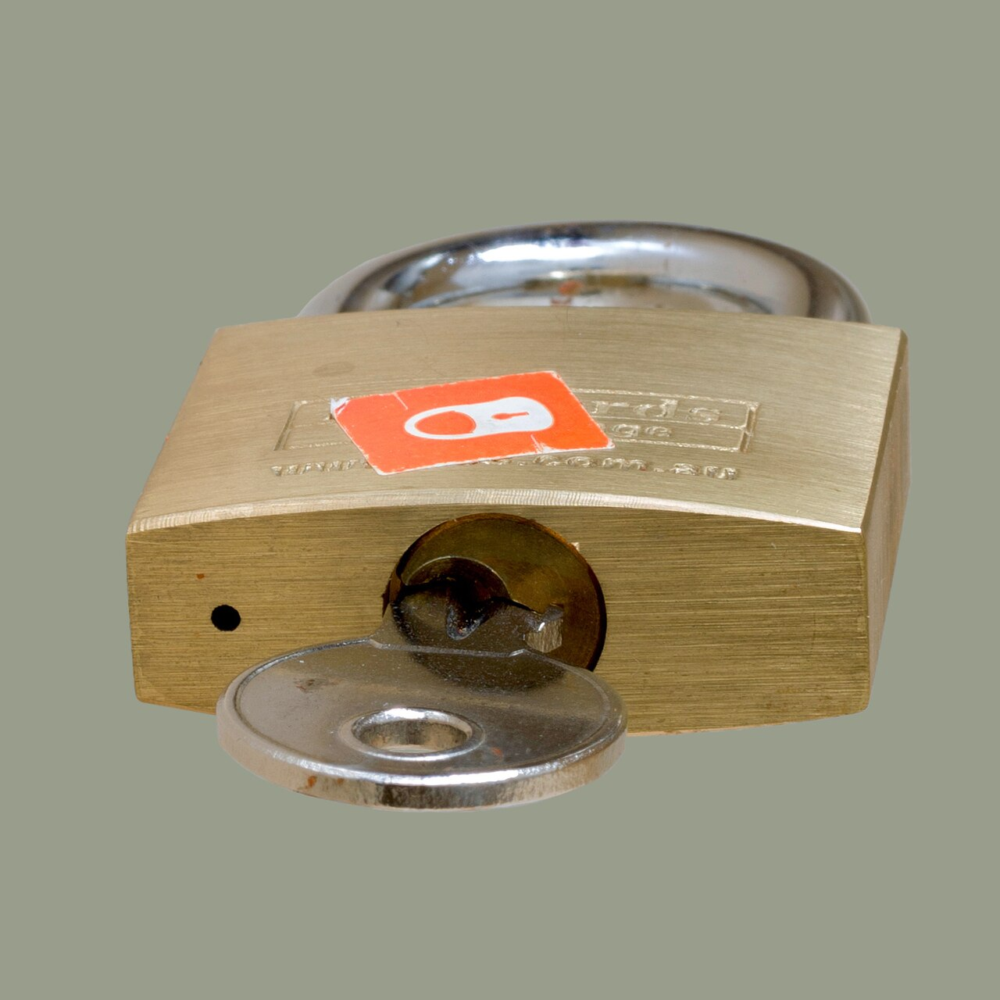

# SSH and keys

*SSH is how you get a shell on the staging server or CI runner that isn't your laptop. Password vs key auth, ssh-keygen, authorized_keys, the known_hosts fingerprint prompt, and config aliases that turn a paragraph of flags into one word.*

> Here's the bit nobody tells you before week one: the "staging server" is not a website, it's a
> computer somewhere you will never physically touch, running Linux, and your job requires getting a
> command line on it. So does the CI runner that just failed a build with no useful error in the web
> UI. So does the box hosting the API your automated tests keep timing out against. **SSH** (Secure
> Shell) is the door into all of them — an encrypted remote-login protocol that gives you a real
> terminal on a machine that might be in a data center three states away, as if you were sitting in
> front of it. Learn `ssh user@host`, learn why keys beat passwords, and "I can't reproduce it, must
> be a staging issue" stops being a shrug and starts being a five-minute investigation.

> **In real life**
>
> Password auth is shouting your name at a bouncer every single time and hoping he remembers you
> tonight — and every other night, forever, to every door. It works, but it's slow, it's guessable,
> and if someone overhears you shouting it, they're in too. **Key auth** is a lanyard with an
> unforgeable badge photo laminated into it: you show it once at enrollment (that's copying your
> public key to the server), and every visit after that the door reads the badge and lets you
> through — no shouting, nothing to overhear, nothing a guesser can brute-force. The badge and the
> photo on file are a matched pair — a **key pair**: Two mathematically linked files created together: a PRIVATE key that never leaves your machine (protect it like a house key) and a PUBLIC key that is safe to hand out and paste anywhere. The server keeps a copy of your PUBLIC key and uses it to pose a challenge only your matching PRIVATE key can answer -- proving it's you without your private key ever crossing the network. Losing the private key means generating a new pair; leaking the public key is a non-event, that's what it's for.
> — and the door only opens for the exact badge on file, not a copy, not a similar one.

## What SSH actually gets you

`ssh user@host` opens an encrypted terminal session on a remote machine: everything you type is
sent over, everything the remote shell prints comes back, and everything in between is encrypted
so nobody sniffing the network in transit can read your commands or your server's log output. This
is the tool behind almost every "go check the server" instruction a QA engineer gets: SSH in, run
`tail -f` on a log file, grep for the request ID from a bug report, check whether a service is even
running. No SSH, no remote shell — you'd be stuck guessing from the outside, which is exactly the
kind of guessing this course is trying to train out of you.

Two ways to prove who you are once connected: **password auth** (type the account's password,
every time, from any machine that knows it) and **key auth** (the server trusts a public key it
already has on file, and only a machine holding the matching private key can complete the
handshake). Password auth is simple and it's also the reason automated brute-force bots hammer
every internet-facing SSH port around the clock — a password only has to be guessed once. Key auth
is the professional default for exactly that reason: a well-generated key is not brute-forceable in
any human timescale, and most serious staging environments and CI providers plain refuse password
auth outright.

The pieces that make key auth work live in predictable places. `ssh-keygen` generates the pair on
your machine. `authorized_keys` — a plain text file on the SERVER, one public key per line — is the
guest list the door checks against; adding your public key there is "enrolling the badge."
`known_hosts` is the flip side: a file on YOUR machine recording which servers you've already
verified, so SSH can warn you the one time that verification might be worth doubting. And a config
file (`~/.ssh/config`) lets you name a host once and never type the full login again.


*Brass padlock with key — Wikimedia Commons, CC BY-SA 4.0*
- **The cut key in the keyway = ssh user at host** — The whole protocol collapses into one line: the account name, an at-sign, and the address of the remote box. Run this and you are asking that machine's SSH server (sshd) to open a shell for that user -- everything else on this page is about how it decides to say yes.
- **The turning key = the changed prompt, you are IN** — The giveaway that a connection succeeded: the shell prompt itself changes, usually showing the remote hostname where your laptop's name used to be. Testers should make a habit of glancing at the prompt before running anything destructive -- 'which machine am I actually on right now' is a real and common mistake.
- **The keyway's pin profile = authorized_keys on the SERVER** — A plain text file, one public key per line, living in that account's .ssh folder on the remote machine. This is the guest list -- if your public key isn't a line in this file (and the file's permissions aren't too loose), key auth fails no matter how correct your private key is.
- **The lock's engraved brand = known_hosts on YOUR machine** — The flip side of the guest list: a record, kept locally, of every server whose identity you've already verified. First connection to a new host, SSH has nothing to compare against and asks you to confirm a fingerprint by hand -- see the FlowAnimation for exactly when and why.
- **The key's unique cuts = the private key, never shown, never shared** — Off-screen by design: the private key half of the pair lives only on your laptop, ideally with a passphrase and file permissions that block every other user. This image can show the PUBLIC key and the login, but a screenshot should never show a private key's contents -- that habit starts now.

**Connecting with a key -- what actually happens over the wire. Press Play.**

1. **You run: ssh qa@staging.example.com** — Your machine opens a network connection to staging.example.com on port 22 (SSH's default) and asks its SSH server (sshd) to start a session for the user 'qa'. Nothing has been proven yet -- this is just the knock on the door.
2. **The server proves ITS identity first (the fingerprint)** — Before you prove anything, the server shows you ITS public key fingerprint, so you know you're not talking to an impostor machine. First time ever connecting, SSH has no record to compare and asks you to confirm by hand -- that's the known_hosts prompt. Every time after, it checks silently and only interrupts you if the fingerprint CHANGED.
3. **The server poses a challenge only your private key can answer** — The server looks up 'qa' in authorized_keys, finds your public key on file, and encrypts a challenge with it. Only the matching PRIVATE key -- which never leaves your laptop -- can decrypt and answer correctly. Your password is never sent, never typed, never exposed to a keylogger or a sniffed connection.
4. **Answer matches -- the encrypted tunnel opens** — SSH confirms the challenge response and opens the session: a real shell on the remote box, with every keystroke and every byte of output encrypted end to end. From here it's just a terminal -- ls, tail, grep, whatever the investigation needs -- as if you were physically at the machine.
5. **No matching key on file? Falls back, or refuses** — If your public key isn't in authorized_keys, key auth simply fails and SSH either falls back to a password prompt (if the server still allows it) or refuses outright (many CI runners and hardened staging boxes disable password auth entirely). No key on the guest list, no door -- that's the whole point of the badge system.

Enrolling a key and using it, start to finish:

*Try it -- generate a key, enroll it, and log in without a password*

```bash
# On your laptop -- generate an SSH key pair (Ed25519, the modern default):
ssh-keygen -t ed25519 -C "dpokhrel@laptop"
# Generating public/private ed25519 key pair.
# Enter file in which to save the key (/home/dpokhrel/.ssh/id_ed25519):
# Enter passphrase (empty for no passphrase):
# Your identification has been saved in /home/dpokhrel/.ssh/id_ed25519
# Your public key has been saved in /home/dpokhrel/.ssh/id_ed25519.pub

# Two files appear -- notice which one is safe to share:
ls ~/.ssh/id_ed25519*
# id_ed25519      -- PRIVATE key. Never leaves this laptop. Ever.
# id_ed25519.pub  -- PUBLIC key. Safe to paste, email, hand to a server.

# Enroll the public key on the staging server's guest list:
ssh-copy-id qa@staging.example.com
# /usr/bin/ssh-copy-id: INFO: attempting to log in with the new key(s)...
# Number of key(s) added: 1

# From now on, no password prompt -- the badge just works:
ssh qa@staging.example.com "uname -a"
# Linux staging-01 5.15.0-91-generic x86_64 GNU/Linux
```

The known_hosts prompt on a brand-new host, and a config alias so you never type the full login
again:

*Try it -- the first-connection fingerprint prompt, then a config shortcut*

```bash
# The VERY FIRST time you connect to a new host, SSH stops and asks:
ssh qa@ci-runner-07.internal
# The authenticity of host 'ci-runner-07.internal (10.4.2.19)' can't be established.
# ED25519 key fingerprint is SHA256:7fN2kQpLxo9rV3wZmY8sJdEeQzTuHc1B9qA.
# Are you sure you want to continue connecting (yes/no/[fingerprint])?
# Type "yes" -- the fingerprint is written to known_hosts and never asked
# again, UNLESS the server's key later changes (see WhenItBreaks).

tail -n 1 ~/.ssh/known_hosts
# ci-runner-07.internal,10.4.2.19 ssh-ed25519 AAAAC3NzaC1lZDI1NTE5AAAAI...

# Typing that full login every time gets old fast -- add an alias:
cat >> ~/.ssh/config << 'EOF'
Host ci07
    HostName ci-runner-07.internal
    User qa
    IdentityFile ~/.ssh/id_ed25519
EOF

# Now the whole login collapses to one word:
ssh ci07
# Linux ci-runner-07 5.15.0-91-generic x86_64 GNU/Linux
```

> **Tip**
>
> Two habits worth building on day one. First: give your private key a **passphrase** during
> `ssh-keygen` — a stolen laptop with a bare private key is a stolen set of server access; a
> passphrase means the thief also needs that phrase (and `ssh-agent` lets you type it once per
> session instead of on every connection). Second: name every server you touch regularly in
> `~/.ssh/config` — beyond saving typing, it's self-documenting. A config file with entries for
> `staging`, `ci01`, `ci02`, and `prod-readonly` is a map of your whole remote footprint that a
> teammate (or future you) can read in ten seconds.

### Your first time: First time? Get a key on a box and prove it works

- [ ] Generate a key pair — Run ssh-keygen -t ed25519 -C 'your-email' and set a passphrase when prompted. Two files land in ~/.ssh -- confirm you can tell which is public (.pub) and which is private (no extension) before moving on.
- [ ] Enroll the public key — Use ssh-copy-id user@host against a practice server (or ask your team which staging box is safe to practice on). Under the hood this appends your .pub file's contents as one line in the server's ~/.ssh/authorized_keys.
- [ ] Connect and read the prompt — ssh user@host and watch for the password prompt to NOT appear -- that's success. If it's your first-ever connection to that host, you'll hit the known_hosts fingerprint prompt first; type yes deliberately, don't reflexively.
- [ ] Add a config alias — Add a Host block to ~/.ssh/config for the box you just connected to, then reconnect using just the alias (ssh myalias). Compare how much less you typed.
- [ ] Find your own authorized_keys — While connected, run cat ~/.ssh/authorized_keys on the remote box and find the line that's YOUR public key. Recognising your own key on a guest list is the fastest way to debug 'why can't I log in' later.

You've now generated a key pair, enrolled it, watched password auth disappear, and built a shortcut you'll use every day this module.

- **Permission denied (publickey).**
  Your public key isn't on the server's guest list, or SSH is offering the wrong key. Confirm the key was actually added: ssh user@host 'grep -c "$(cat ~/.ssh/id_ed25519.pub)" ~/.ssh/authorized_keys' should print 1. If you have multiple keys, force the right one with ssh -i ~/.ssh/id_ed25519 user@host, or set IdentityFile explicitly in your config alias.
- **WARNING: REMOTE HOST IDENTIFICATION HAS CHANGED!**
  The server's host key no longer matches what's saved in your known_hosts -- SSH is refusing to connect on purpose. This can be innocent (the server was rebuilt, or an IP got reassigned to a different machine) or it can mean something is intercepting your connection. Confirm with whoever runs the box BEFORE removing the old entry (ssh-keygen -R hostname) and reconnecting -- never clear the warning reflexively.
- **Permissions 0644 for id_ed25519 are too open. This private key will be ignored.**
  SSH refuses to use a private key that other users on your machine could read. Fix the permissions: chmod 600 ~/.ssh/id_ed25519 (owner read/write only) and chmod 700 ~/.ssh (owner-only directory). This is SSH protecting you from yourself -- a world-readable private key defeats the entire point of key auth.
- **Connection timed out, or Connection refused.**
  Timed out usually means a firewall or VPN is blocking the path to the server -- confirm you're on the required VPN and that the host/IP is actually reachable (ping or a quick network check). Refused means something IS responding but nothing is listening for SSH there -- wrong port (try -p with the correct port), or sshd isn't running on that box at all.

### Where to check

Where SSH shows up in an actual QA week:

- **Staging server log-digging** — a bug report references a request that isn't reproducible locally; SSH in and `tail -f` or `grep` the application log for the request ID, timestamp, or error string.
- **CI runner debugging** — a pipeline fails with a cryptic error the web UI won't expand; if the CI provider allows it, SSH into the runner (or a debug session it exposes) and inspect the actual filesystem, installed versions, and environment variables.
- **Confirming "it's an environment problem"** — before filing that as the root cause, SSH in and actually check: is the service running, is the config file what you expect, does `curl localhost:port/health` respond?
- **Fresh-server checks** — after a deploy, SSH in and confirm the basics (`uname -a`, the running process, a config value) rather than trusting the deploy pipeline's own "success" message.
- **Key hygiene reviews** — checking who has access. `cat ~/.ssh/authorized_keys` on a shared box shows every enrolled key; a stale key from someone who left the team is a real finding worth reporting.

Tester's habit: **when a bug report says "works on my machine, fails on staging," SSH in and look —
don't guess from the outside.** The answer is usually sitting in a log file or a config value one
`ssh` command away.

### Worked example: the test that only failed on the CI runner

1. **The report:** a nightly test suite has one flaky test — `test_upload_large_file` — failing on
   the CI runner about half the time, always passing locally and in manual testing. No useful
   detail in the CI web UI beyond "assertion failed, response code 413."
2. **The tester's first move:** `413` is "Payload Too Large" — a server-side limit, not a test bug
   on its face. But it's intermittent, and intermittent server limits are strange. Time to look at
   the actual runner instead of guessing from a log excerpt.
3. **SSH in:** the CI provider exposes a debug SSH session for failed runs. `ssh runner@ci-debug-host`
   drops the tester onto the exact machine (well, an identical ephemeral one) that ran the test.
4. **Check the obvious things first:** `df -h` shows the disk. It's fine. `free -h` shows memory —
   also fine. `cat /etc/nginx/nginx.conf | grep client_max_body_size` (the reverse proxy in front of
   the test API) shows the limit is set high enough. So far, nothing explains a 413.
5. **The actual find:** two CI runner images are in rotation — one built last week with an updated
   nginx config, one built two months ago with the OLD default limit still in place. Depending on
   which image a given run lands on, the upload either fits or doesn't. `cat /etc/os-release` and a
   build-image timestamp confirm it: the flaky test isn't flaky at all, it's **deterministic per
   image**, and the CI fleet is inconsistent.
6. **The fix:** report the finding with the exact command output as evidence, get the stale runner
   image retired, and add a smoke check to the pipeline that fails loudly on a wrong config value
   instead of letting an upload silently 413 partway through a run.
7. **Tester's angle.** "Flaky" is often a disguise for "inconsistent environment" — and the only way
   to tell the difference is to actually get a shell on the machine where it failed and read the
   real state, not the summary a dashboard chose to show you.

> **Common mistake**
>
> Treating a private key like any other file — copying it into a shared drive "just for backup,"
> pasting it into a Slack message to a teammate who's stuck, or leaving it world-readable because
> `chmod` felt like an extra step. A private key IS your identity to every server that trusts it; if
> it leaks, every door it opens is compromised, and the fix is generating a new pair and re-enrolling
> everywhere the old one lived — not a quick "delete the message." The habit that prevents this: only
> ever share the `.pub` file (that's what it's for), keep the private key passphrase-protected, and
> treat "please send me your private key" as an instant red flag, from anyone, for any reason.

**Quiz.** You email a teammate a file to help them access a shared staging server. Which file is safe to send, and which would be a serious mistake?

- [x] Send id_ed25519.pub (the public key) -- it's designed to be shared; sending id_ed25519 (the private key) would hand them your entire identity, usable on every server that trusts it
- [ ] Send id_ed25519 (the private key) -- it's the one that actually lets them log in, so that's the useful one
- [ ] Send both files -- more information is always more helpful for troubleshooting access
- [ ] Neither is safe to email; only the authorized_keys file on the server can ever be shared

*The .pub file is the whole point of asymmetric key auth -- it's designed to be public, pasted into authorized_keys files, emailed, posted publicly, none of that weakens anything, because it can only pose challenges, never answer them. The private key (no .pub extension) is the answering half -- anyone holding it can authenticate as YOU on every server where your public key is enrolled, indefinitely, until you rotate it. Sending both defeats the purpose of having a public/private split at all, and authorized_keys is a server-side file, not something you'd email around -- what you'd actually send a teammate is your public key, so THEY can add it to a server's guest list, or ask them to send you theirs for the same reason.*

- **ssh user@host** — Opens an encrypted remote shell on host, logging in as user. Everything typed and returned is encrypted in transit -- the basic tool for getting a terminal on any Linux server you don't physically sit at.
- **Key pair -- public vs private** — Generated together by ssh-keygen. PUBLIC (.pub) is safe to share and gets enrolled in a server's authorized_keys. PRIVATE (no extension) never leaves your machine -- it's what actually proves your identity, and leaking it means every server trusting that key is compromised.
- **authorized_keys** — A plain text file on the SERVER, one public key per line, in that account's ~/.ssh folder. The guest list -- if your public key isn't a line in this file, key auth fails regardless of how correct your private key is.
- **known_hosts** — A file on YOUR machine recording the identity fingerprint of every server you've verified before. First connection to a new host triggers a manual confirmation prompt; a later WARNING that the fingerprint CHANGED means don't proceed without checking why.
- **ssh-keygen and ssh-copy-id** — ssh-keygen -t ed25519 generates a new key pair. ssh-copy-id user@host appends your public key to that account's authorized_keys on the remote server -- the one-command way to enroll a key without hand-editing files.
- **~/.ssh/config aliases** — A Host block (HostName, User, IdentityFile) lets you replace 'ssh qa@ci-runner-07.internal -i ~/.ssh/id_ed25519' with 'ssh ci07'. Also self-documents every server you regularly touch.

### Challenge

On a practice server (or a spare VM/container if you have one): (1) generate a fresh key pair with
a passphrase and enroll it with `ssh-copy-id`. (2) Connect once, confirm the known_hosts prompt
behaviour by deliberately checking `~/.ssh/known_hosts` before and after. (3) Break it on purpose:
`chmod 644` your private key, try to connect, read the error, then fix it with `chmod 600`. (4) Add
a config alias and time yourself typing the full login vs the alias. (5) Write one sentence
explaining, to someone who's never heard of SSH, why the private key must never be emailed even
"just this once."

### Ask the community

> SSH issue: connecting to [staging/CI runner/other] as [user@host]. Auth method: [password/key]. Exact error: [paste it]. Is this the FIRST time connecting to this host? [yes/no]. Output of ls -la ~/.ssh/ (redact anything sensitive): [paste]. What I've already tried: [list].

Most SSH problems answer to three questions: is the right public key actually enrolled in the
server's authorized_keys, are your local key file permissions correct (600 for the private key, 700
for the ~/.ssh folder), and is this a first-time-connecting fingerprint prompt or a fingerprint-CHANGED
warning (very different levels of concern). State those three and the fix is usually obvious fast.

- [OpenSSH manual pages -- ssh, ssh-keygen, sshd_config, ssh_config](https://www.openssh.com/manual.html)
- [ssh_config(5) -- every Host block option, explained](https://man.openbsd.org/ssh_config)
- [SSH Academy -- ssh-keygen and key management basics](https://www.ssh.com/academy/ssh/keygen)
- [How Secure Shell works — Computerphile](https://www.youtube.com/watch?v=ORcvSkgdA58)

🎬 [How Secure Shell works — Computerphile](https://www.youtube.com/watch?v=ORcvSkgdA58) (9 min)

- SSH (ssh user@host) opens an encrypted remote shell -- the basic tool for getting a terminal on a staging server or CI runner you don't physically sit at.
- Key auth beats password auth: a key pair proves identity via a challenge only the PRIVATE key can answer, without ever sending a password over the network. Only ever share the PUBLIC (.pub) half.
- authorized_keys (on the server) is the guest list; known_hosts (on your machine) is your record of verified servers -- a first-connection prompt is normal, a fingerprint-CHANGED warning is not.
- ssh-keygen generates a pair, ssh-copy-id enrolls the public key, and a ~/.ssh/config Host block turns a paragraph of flags into one memorable alias.
- For a tester: SSH is how 'works on my machine, fails on staging' gets investigated instead of guessed at -- log-digging, checking real config values, and confirming a deploy actually landed all start with getting a shell on the box.


---
_Source: `packages/curriculum/content/notes/linux-for-testers/remote-servers/ssh-and-keys.mdx`_
