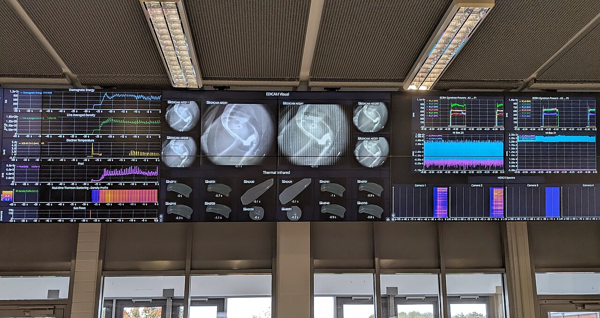

# tmux basics

*The VPN drops mid test-run and the SSH session dies with it -- unless it was running inside tmux. New/attach/detach sessions, panes and windows, and the Ctrl-b prefix key that makes work on a remote box survive a dropped connection.*

> Picture the worst version of this: you SSH into a CI runner, kick off a 40-minute load test with a
> live progress bar you're watching closely, step away for coffee, and your laptop's wifi hiccups for
> four seconds. The SSH connection dies. The remote shell it was running in dies WITH it — because a
> normal shell is a child of your SSH session, and when the parent dies, so does everything running
> inside it. Forty minutes of test run, gone, no output saved, nothing to show for it. **`tmux`**
> (terminal multiplexer) exists specifically to make that scenario impossible: it runs your shell
> session on the SERVER, independent of your SSH connection, so a dropped VPN just means you can't
> SEE it for a moment — the session, and everything running inside it, keeps going untouched. Reattach
> five seconds or five hours later and it's exactly where you left it.

> **In real life**
>
> A normal SSH session is like a phone call to someone reading you a book aloud in real time — hang
> up, and the reading stops, mid-sentence, forever lost. `tmux` is like handing that reader a
> **recorder that keeps running whether you're on the line or not**: you call in, say "keep reading,"
> and hang up whenever — the reader just keeps going, out loud, in an empty room. Call back later
> (from any phone, any device) and you're patched straight back into the same room, same page, same
> sentence, having missed nothing because nothing ever stopped. That's a **tmux session**: A running terminal environment that lives independently of any one connection to it -- started once on a server, it keeps running (and keeps any commands inside it running) even after you disconnect. Reconnecting later 'attaches' you back to the exact same session: same scrollback, same running processes, same panes and windows, as if you'd never left. The session's lifetime is tied to the SERVER staying up, not to any particular SSH connection to it.
> — it lives on the server, not in your SSH connection, and DETACHING from it (on purpose, or by a
> dropped connection) is nothing like hanging up on the reading. The reading never stops.

## Sessions that outlive the connection

The core mechanic is a split between the thing that's RUNNING and the thing that's WATCHING it. A
plain SSH shell fuses the two together — your terminal window IS the process, so losing the
connection kills the process. `tmux` splits them apart: `tmux new -s testrun` starts a named session
that runs as its own independent process tree on the server, and your terminal is just a window
LOOKING at it. Detach on purpose with the prefix key then `d` (more on the prefix below), or get
disconnected by accident — either way the session itself doesn't know or care, and keeps running.
`tmux attach -t testrun` (or the shorthand `tmux a -t testrun`) reconnects a terminal — any terminal,
from any machine with SSH access — to that exact same running session.

Inside one session, `tmux` gives you two more layers of organisation that matter for real work:
**windows** (like browser tabs — a full-screen terminal each, switch between them, one might be
running the test suite, another tailing a log) and **panes** (splits WITHIN a window — side by side
or stacked, so you can watch a log scroll in one pane while running commands in another, both
visible at once, both alive). Neither requires more than one SSH connection; the whole point is that
this multi-pane, multi-window workspace persists as ONE thing on the server, addressable from
wherever you happen to be connecting from.

Every `tmux` command inside a session starts with a **prefix key** — `Ctrl-b` by default — pressed
and released BEFORE the actual command key, not held together. `Ctrl-b` then `d` detaches. `Ctrl-b`
then `c` creates a new window. `Ctrl-b` then `%` splits a pane vertically. It feels like an extra
step compared to a normal keyboard shortcut, and it is — deliberately: `tmux` needs a way to tell
"this keystroke is for tmux itself" apart from "this keystroke should reach the program running
inside it," and the prefix is that signal.


*Diagnostic monitors, Wendelstein 7-X control room — Wikimedia Commons, CC BY-SA 4.0*
- **The labels under every panel = the status bar** — tmux's constant visual tell -- a bar (usually green or dark) listing the session name and every open window by number and name. Glancing here answers 'am I even inside tmux right now' at a glance, which matters because a detached-but-still-running session looks like nothing at all until you check.
- **The live plots panel = a pane tailing a log** — One rectangle of the terminal, running its own independent shell, here tailing a log file continuously. Panes let you WATCH something and WORK on something else in the same screen, both processes alive simultaneously, both surviving a detach.
- **The camera-feed panel = another pane running the actual test** — A second pane in the same window, running the long test command this whole note exists to protect -- the process that must NOT die if the connection drops. This is the pane that would have been lost forever without tmux in the opening story.
- **One wall, many panels = the prefix key switches your focus** — Not a held combination -- press Ctrl-b, let go, THEN press the command key (d to detach, percent to split, c for a new window). This two-step rhythm is what tells tmux 'the next key is for you, not the program running inside the pane.'
- **Numbered, named panel groups = windows in the status bar** — Each window in the session gets a number and can be renamed -- visible right in the status bar, switched between with the prefix key plus the number. A session with meaningfully named windows (0:logs 1:tests 2:shell) is far easier to return to after being away for hours.

**The dropped-VPN story, with and without tmux running. Press Play.**

1. **SSH in, start a 40-minute load test directly** — No tmux: ssh qa@runner, then run the load test straight in that shell. The test process is a DIRECT CHILD of this SSH session -- there is no independence between them, by default.
2. **The VPN drops for four seconds** — Wifi hiccups, the SSH connection dies. On the server, the shell that was the test's parent process also dies -- and when a parent process dies, its children are typically killed too (SIGHUP). The 40-minute test, 25 minutes in, is simply gone. No output, no partial results, nothing.
3. **Replay it WITH tmux: same start, one extra step** — ssh qa@runner, then tmux new -s loadtest FIRST, and only then start the test inside that session. The test's parent is now tmux's session process, not the SSH connection directly -- the dependency that killed the test a moment ago no longer exists.
4. **The VPN drops again -- same four seconds** — The SSH connection dies exactly as before. But this time the shell running the test lives INSIDE tmux, which lives on the server independently of any SSH connection to it. The test keeps running, untouched, in a session with nobody currently watching it.
5. **Reconnect and reattach -- 25 minutes still there** — ssh qa@runner again, then tmux attach -t loadtest. The exact same session reappears, scrollback and all, test still running (or finished, output sitting right there) at whatever point it reached. The only thing that was ever interrupted was the WATCHING, never the WORK.

Starting a session, detaching from it, and finding it again after reconnecting:

*Try it -- start a session, detach, reconnect from scratch*

```bash
# SSH in, then start a NAMED tmux session (naming it matters -- more below):
ssh qa@ci-runner-07.internal
tmux new -s loadtest
# (screen clears, a status bar appears along the bottom -- you're inside tmux now)

# Start the long-running thing INSIDE the session:
./run-load-test.sh --duration 40m
# Running load test... 12% complete...

# Detach on purpose: press Ctrl-b, release, then press d
# [detached (from session loadtest)]
# You're back at your normal SSH shell -- the test keeps running on the server.

# List what's still alive on the server:
tmux ls
# loadtest: 1 windows (created Mon Jul 13 14:02:10 2026) [80x24]

# Walk away. Reconnect later (even after a dropped connection or a new SSH login):
tmux attach -t loadtest
# (screen redraws to EXACTLY where you left it)
# Running load test... 87% complete...
# -- nothing was lost during the time nobody was watching
```

Windows and panes inside one session, so you can watch a log and run commands side by side:

*Try it -- split panes, add windows, jump between them*

```bash
tmux new -s debugging

# Split the current pane VERTICALLY (side by side): prefix then %
# Ctrl-b %
# Now two panes exist side by side in the same window.

# Left pane: tail a log continuously
tail -f /var/log/app/error.log
# 2026-07-13T14:03:01 ERROR request_id=8f2a timeout waiting on upstream

# Move to the right pane: prefix then an arrow key
# Ctrl-b (right arrow)
# Right pane: run commands while still watching the log update on the left
grep -c ERROR /var/log/app/error.log
# 47

# Open a whole NEW window (like a new tab) for something unrelated: prefix then c
# Ctrl-b c
# A fresh full-screen shell appears as window 1; window 0 (with your panes) keeps running.

# Jump back to window 0 by number: prefix then the number key
# Ctrl-b 0
# Back to the split panes, log still tailing, nothing missed.

# See every window at a glance: prefix then w
# Ctrl-b w
# (a list appears -- 0: bash* (2 panes)  1: bash  -- pick one to jump to it)
```

> **Tip**
>
> Two habits that separate a smooth `tmux` day from a confused one. First: **always name your
> sessions** (`tmux new -s loadtest`, not the unnamed default) — `tmux ls` on a server with three
> unnamed sessions called `0`, `1`, `2` tells you nothing about which one has the thing you need;
> `loadtest`, `logs-prod`, `debug-ticket-4021` tell you everything. Second: **check `tmux ls` before
> starting anything new** — a very common beginner trap is SSH-ing in, forgetting a session from
> yesterday is still running, and starting a duplicate that competes for the same log file or port.
> Thirty seconds of `tmux ls` before you `tmux new` saves that confusion every time.

### Your first time: First time? Kill a connection on purpose and watch nothing die

- [ ] Start a named session — SSH into a practice server and run tmux new -s practice. Notice the status bar appear along the bottom -- that's your visual confirmation you're inside tmux now, not a plain shell.
- [ ] Start something that keeps running — Inside the session, run something with visible ongoing output -- a ping to a reliable host (ping example.com) works fine for practice, or a longer real command if you have one.
- [ ] Detach on purpose — Press Ctrl-b, release both keys, then press d. You should land back at a normal shell prompt. Run tmux ls and confirm your session is listed as still alive.
- [ ] Close the terminal entirely, then reconnect — Actually close the terminal window (or deliberately kill the SSH connection). Open a fresh terminal, SSH in again, and run tmux attach -t practice. The ping (or whatever you started) should still be running, output still scrolling.
- [ ] Split a pane and add a window — Inside the reattached session, split with Ctrl-b % and open a new window with Ctrl-b c. Practice switching between panes (Ctrl-b, arrow key) and windows (Ctrl-b, number key) until it's not a lookup anymore.

You've now killed a connection on purpose, proven the session survived it, and organised a workspace with panes and windows -- the exact toolkit for surviving a real dropped VPN mid test-run.

- **tmux: command not found.**
  tmux isn't installed on this box -- it's common but not universal on minimal server images. Install it (apt-get install tmux / yum install tmux, depending on the distro) or check whether the server offers 'screen' instead, an older tool solving the same problem with different keybindings (prefix Ctrl-a instead of Ctrl-b).
- **I pressed Ctrl-b then d, but nothing happened -- or the wrong thing happened.**
  Two likely causes. Timing: the prefix must be pressed and released BEFORE the command key, not held together like a normal shortcut -- Ctrl-b, let go, then d. Or someone changed the prefix key in a shared or customised config (check ~/.tmux.conf for a 'set -g prefix' line) -- run tmux show-options -g prefix to see what's actually active on this server.
- **tmux ls shows several sessions and I can't tell which one has what I need.**
  This is the cost of unnamed or vaguely-named sessions catching up with you. tmux attach -t <name> into each one briefly to check (Ctrl-b d to back out without disturbing anything), or better, adopt the habit going forward: always tmux new -s something-specific so future-you (or a teammate) doesn't have to guess.
- **My session is gone entirely -- tmux ls shows nothing, or 'no server running on socket'.**
  Detaching does NOT kill a session, but the SERVER itself rebooting, crashing, or being redeployed does -- the session's process tree dies with the machine. This is different from a dropped connection and tmux cannot protect against it; if the underlying box goes away, so does everything running on it, tmux session or not.

### Where to check

Where `tmux` earns its place in a QA toolkit:

- **Any test run longer than a few minutes on a remote box** — load tests, long regression suites, anything you'd hate to lose to a flaky connection. Start it inside a named session, always.
- **Multi-thing monitoring during an investigation** — one pane tailing an error log, another running diagnostic commands, another watching resource usage (`top` or `htop`) — all visible, all alive, in one screen.
- **Handoffs across a shift or a team** — a session running on a shared debugging box can be attached to by ANY teammate with SSH access to that account, seeing the exact same scrollback and state, which beats "let me screenshot what I'm looking at."
- **Overnight or unattended jobs** — start it, detach, log off entirely, come back the next morning and reattach to see exactly what happened, including all the scrollback from while nobody was watching.
- **Any SSH work over a connection you don't fully trust** — hotel wifi, a spotty VPN, a laptop about to go to sleep — starting work inside tmux FIRST costs one extra command and removes an entire category of "I lost my work" incident.

Tester's habit: **before starting anything on a remote box that would hurt to lose, ask "am I inside
tmux yet?"** If the answer is no, `tmux new -s something` first — it's cheaper before the fact than
after.

### Worked example: the load test that survived a laptop lid closing

1. **The setup:** a tester is running a two-hour soak test against a staging API from a CI runner,
   watching memory usage climb in real time to catch a suspected leak. It's late, the test has
   ninety minutes left, and the tester needs to leave for the day.
2. **The old habit:** in the past, this meant either staying until the test finished, or accepting
   the risk of leaving the SSH session open on a laptop that might sleep, lose wifi, or get closed —
   any of which would kill the test mid-run with no output to show for the ninety minutes already
   spent.
3. **This time, tmux was running from the start:** `tmux new -s soak-test` was the very first command
   after SSH-ing in, before the test itself started — a habit, not an afterthought.
4. **The tester detaches deliberately** (`Ctrl-b` then `d`), confirms with `tmux ls` that
   `soak-test` is still listed, closes the laptop, and goes home. The SSH connection dies the moment
   the lid closes — completely expected, completely harmless.
5. **The next morning:** SSH back into the same runner, `tmux attach -t soak-test`, and the full two
   hours of scrollback is right there — including a memory graph the test script printed every five
   minutes, and the final summary line from where the test completed on its own around midnight.
6. **The finding stands on solid evidence:** memory climbed steadily for the first ninety minutes
   then plateaued — consistent with a cache warming up, not a leak. Without the full unattended
   run captured, that would have been a guess; with it, it's a documented, reproducible graph
   attached straight to the ticket.
7. **Tester's angle.** The valuable habit isn't reacting well to a dropped connection — it's never
   needing to. Starting long or overnight work inside a named tmux session, as a reflex, turns "I
   hope nothing interrupts this" into a non-issue before the test even begins.

> **Common mistake**
>
> Starting a long test run directly in a bare SSH shell "just this once" because tmux felt like an
> extra step for a quick task — and then watching the connection drop at the worst possible moment,
> losing output that took real time to generate. The instinct that tmux is overhead is backwards: the
> overhead is ONE extra command (`tmux new -s name`) at the start, paid whether or not the connection
> ever drops, against a total loss of everything in progress if it does. The habit that actually
> prevents this isn't "remember to use tmux when a run looks risky" — risk is invisible until the
> connection is already gone — it's **defaulting to tmux for anything on a remote box you'd be sad to
> lose**, the same reflex as saving a document before, not after, the power flickers.

**Quiz.** You SSH into a server and run a 30-minute test directly in that shell (no tmux). Your wifi drops for 3 seconds partway through. What happens to the test?

- [x] The test is killed -- it was a direct child of the SSH session's shell, and when the connection died, that shell (and everything running inside it) died too, with no output saved
- [ ] The test pauses automatically and resumes once the connection is restored, with no data lost
- [ ] The test keeps running fine -- SSH sessions and the processes inside them are independent by default
- [ ] It depends only on how long the test has left to run, not on how the connection was set up

*Without a terminal multiplexer, a command run directly in an SSH shell is a CHILD PROCESS of that shell -- there is no independence between them by default. When the SSH connection drops, the remote shell process typically receives a hangup signal and terminates, taking its child processes (the test) down with it. Nothing pauses and nothing resumes on its own; whatever hadn't been written to a saved file is gone. This is exactly the gap tmux closes: running the same test inside a tmux session makes the SESSION (not the SSH connection) the parent, so a dropped connection only interrupts the WATCHING, never the WORK. Duration doesn't change this outcome -- a 3-second blip is just as fatal to an unprotected process as a longer outage, because the kill happens at the moment of disconnection, not gradually.*

- **tmux new -s NAME** — Starts a new, NAMED tmux session running independently on the server. Naming it (rather than accepting the default number) is the single habit that makes tmux ls useful later.
- **Detach vs kill** — Ctrl-b then d detaches -- you leave, the session and everything inside it keeps running on the server. A dropped connection has the SAME effect as a deliberate detach: the session survives either way, unlike a bare SSH shell.
- **tmux attach -t NAME (or tmux a -t NAME)** — Reconnects any terminal, from anywhere with SSH access, to an existing named session -- same scrollback, same running processes, exactly where it was left.
- **The prefix key -- Ctrl-b** — Pressed and RELEASED before the actual command key (not held together). Tells tmux 'this next keystroke is for you, not the program running inside the pane.' Common follow-ups: d (detach), % (split vertically), c (new window), a number (jump to that window).
- **Windows vs panes** — Windows are like browser tabs -- full-screen, switch with prefix + number. Panes are splits WITHIN one window -- side by side or stacked, for watching multiple things at once (prefix + % or " to split, prefix + arrow key to move between them).
- **tmux ls** — Lists every session currently alive on this server, whether attached or detached. Check it BEFORE starting a new session to avoid duplicating one you (or a teammate) already left running.

### Challenge

On a practice server: (1) start a named session and run something with continuous output (a ping,
or a loop printing the date every few seconds). (2) Detach on purpose with the prefix key and `d`,
then actually close the terminal window entirely -- not just detach, close it. (3) Open a brand new
terminal, SSH back in, and reattach -- confirm the output kept going the whole time you were gone.
(4) Split a pane, open a second window, and practice switching between both using only the prefix
key (no mouse). (5) In one sentence: explain to a teammate who's never used tmux why "I'll just run
it in a normal SSH session, it's only 20 minutes" is the wrong instinct.

### Ask the community

> tmux issue: trying to [start/detach/reattach/split] a session named [name]. Command run: [paste]. Result: [paste error or describe unexpected behaviour]. Output of tmux ls: [paste]. Is this a shared server where a teammate might also have sessions running? [yes/no].

Most tmux confusion traces back to one of three things: forgetting the prefix key needs to be
pressed-then-released rather than held, an unnamed or vaguely-named session making tmux ls
unreadable, or genuinely confusing "detached" (session alive, nobody watching -- totally fine) with
"gone" (server itself restarted -- session is actually gone). State which of those three it sounds
like and the fix is usually one command.

- [tmux wiki -- official documentation and getting-started guide](https://github.com/tmux/tmux/wiki)
- [tmux(1) manual page -- the full command and keybinding reference](https://man.openbsd.org/tmux)
- [tmux cheat sheet -- every default keybinding on one page](https://tmuxcheatsheet.com/)
- [Tmux in 100 seconds — Fireship](https://www.youtube.com/watch?v=vtB1J_zCv8I)

🎬 [Tmux in 100 seconds — Fireship](https://www.youtube.com/watch?v=vtB1J_zCv8I) (2 min)

- tmux runs a session as its own process on the SERVER, independent of any SSH connection -- so a dropped VPN or a closed laptop lid interrupts only the WATCHING, never the WORK running inside it.
- tmux new -s name starts a named session; Ctrl-b then d detaches on purpose (a dropped connection has the same effect); tmux attach -t name (or tmux a -t name) reconnects from anywhere, exactly where you left off.
- Windows (like tabs, prefix + number) and panes (splits within a window, prefix + % or arrow keys) let you watch a log and run commands side by side, all surviving a detach together.
- The prefix key -- Ctrl-b by default -- is pressed and released BEFORE the command key, the signal that tells tmux the next keystroke is for it, not the program running inside the pane.
- For a tester: default to starting a tmux session BEFORE any remote test run, log tail, or investigation you'd be sad to lose -- the cost is one extra command, and it converts an entire category of dropped-connection disaster into a non-event.


---
_Source: `packages/curriculum/content/notes/linux-for-testers/remote-servers/tmux-basics.mdx`_
