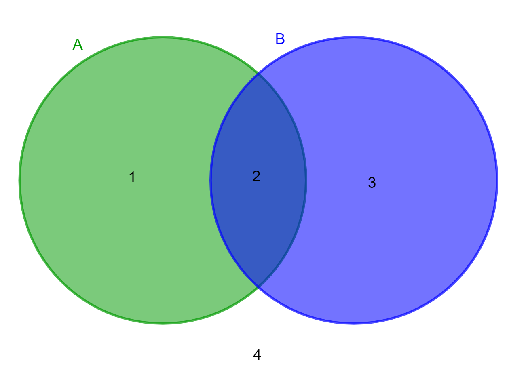

# Comparison & logic

*Real decisions ask more than one thing at once. How to combine conditions with and / or / not, why the computer stops checking early (short-circuit), and how to flip a condition without tying your brain in knots.*

> "Let them in if they're an adult" is easy. "Let them in if they're an adult AND have a ticket, OR
> they're on the guest list" is real life — and real code. A single condition rarely captures a real
> rule; you need to combine several. This note is the toolkit for that: `and`, `or`, `not`, plus a
> sneaky-important behavior called short-circuiting that decides *how much* the computer even bothers to
> check. Get comfortable here and you can express almost any rule a program needs — which is most of
> what logic actually is. Fumble it, and you get the bugs where "everyone gets in" or "nobody does".

> **In real life**
>
> Combining conditions is **Venn diagrams come to life.** Picture two overlapping circles — people who are
> adults (A) and people who have a ticket (B). `A and B` is the *overlap*: only those in BOTH circles get
> in. `A or B` is *everything covered by either circle*: in one, the other, or both. `not A` is *everything
> outside* circle A. Those three operators — `and`, `or`, `not` — are how you carve up possibilities exactly.
> The tools for combining conditions are called
> **logical operators**: Words that combine or flip conditions: and (both true), or (either true), not (flip true/false). Python spells them and/or/not; Java uses &&, ||, !.,
> and once you can picture the circles, writing compound rules stops being guesswork and becomes drawing
> the region you mean.

## and, or, not — the three you'll use forever

Three operators cover almost every compound condition:

- **`and`** — true only when **both** sides are true. `age >= 18 and has_ticket` — an adult *with* a ticket.
- **`or`** — true when **either** side (or both) is true. `is_vip or has_ticket` — a VIP *or* a ticket-holder.
- **`not`** — **flips** true to false and back. `not is_banned` — true when they are *not* banned.

They combine, and you group with parentheses to be clear: `(age >= 18 and has_ticket) or is_vip` reads as
"an adult with a ticket, OR a VIP." Each simple comparison (`age >= 18`) is a yes/no from the last note; the
logical operators glue those yes/no answers into one bigger yes/no. In **Python** the words are `and` / `or`
/ `not`; in **Java** the symbols are `&&` (and), `||` (or), `!` (not) — same meanings, different spelling.


*Diagram: labeled Venn diagram (Addemf) — Wikimedia Commons, CC0. [Source](https://commons.wikimedia.org/wiki/File:Venn_Diagram_with_Labeled_Regions.png)*
- **The overlap (region 2) = A AND B** — This lens where both circles cross is 'and' — true only when BOTH conditions hold. 'age >= 18 and has_ticket' is satisfied ONLY here, by people who are in both circles. 'and' narrows: it's the smallest region, the intersection. If your rule needs two things at once, you want this overlap.
- **Left only (region 1) = A but NOT B** — In circle A, outside B: adult, but no ticket. This is 'A and not B'. Being in one circle doesn't put you in the overlap — a common logic slip is treating 'A' as if it meant 'A and B'. It doesn't; A alone includes this left slice too.
- **Right only (region 3) = B but NOT A** — In circle B, outside A: has a ticket but isn't an adult. Mirror of the left slice. Together, regions 1 + 2 + 3 (everything in EITHER circle) are 'A or B' — 'or' is generous, covering both circles entirely.
- **Either circle at all = A OR B** — 'or' is the whole shaded area of both circles (regions 1, 2 and 3): true if you're in A, in B, or in both. Note 'or' in programming includes the overlap — it means 'at least one', not 'exactly one'. A frequent beginner surprise: 'A or B' is still true when BOTH are true.
- **Outside both (region 4) = NOT A and NOT B** — Out here you're in neither circle: not an adult and no ticket. 'not' flips membership — 'not A' is everything outside circle A (regions 3 and 4). This outside region is where 'and'-of-nots lives, and it's the key to De Morgan's rule below.

## Short-circuiting: the computer stops early

Here's a behavior that's easy to miss and important to know. When evaluating `and` and `or`, the computer
stops as soon as the answer is certain — it doesn't check the rest:

- **`and` stops at the first `False`.** In `A and B`, if A is false, the whole thing is false no matter what
  B is — so the computer never even checks B. Why bother?
- **`or` stops at the first `True`.** In `A or B`, if A is true, the whole thing is true regardless of B — so
  B is never checked.

This is **short-circuit evaluation**: When evaluating and/or, the computer stops as soon as the result is decided: 'and' stops at the first false, 'or' at the first true, skipping the rest. Both a speed win and a safety tool.,
and it's not just an optimization — it's a safety tool you'll use deliberately. The classic pattern:
`if user is not None and user.is_admin:` — the first part guards the second. If `user` is None, the `and`
short-circuits and never runs `user.is_admin` (which would crash on a None). Order your conditions so the
cheap or protective check comes first, and short-circuiting quietly saves you.

**How 'and' and 'or' short-circuit — press Play**

1. **🔎 Evaluate 'A and B' -- check A first** — The computer reads left to right. It evaluates A. Everything depends on what A turns out to be, because 'and' needs BOTH true. So A is the first question asked.
2. **🛑 A is False -> stop, whole thing is False** — If A is false, 'A and B' is false NO MATTER what B is -- so the computer doesn't even look at B. It short-circuits: the answer is already decided. B could be anything, or even something that would crash, and it's never reached.
3. **➡️ A is True -> now B decides** — If A is true, the result now hinges on B, so the computer evaluates B too. 'and' only reaches the second condition when the first was true. That ordering is what makes 'guard first' patterns work.
4. **🔀 'A or B' is the mirror image** — For 'or', the computer stops at the first TRUE: if A is true, the whole 'or' is true and B is skipped. It only checks B when A was false. 'or' needs just one true; the first true ends the search.
5. **🛡️ Use it as a guard** — 'if user is not None and user.is_admin' -- the first check protects the second. If user is None, 'and' short-circuits before touching user.is_admin (which would crash). Ordering conditions so the safe/cheap one comes first turns short-circuiting into a shield.

*Try it — combine conditions with and / or / not (Python). Press Run.*

```python
age = 20
has_ticket = True
is_vip = False
is_banned = False

# and -- both must be true:
print("Adult with ticket?", age >= 18 and has_ticket)      # True and True -> True

# or -- either is enough:
print("VIP or has ticket?", is_vip or has_ticket)          # False or True -> True

# not -- flips it:
print("Allowed in (not banned)?", not is_banned)           # not False -> True

# Combine with parentheses for a real rule:
allowed = (age >= 18 and has_ticket) or is_vip
print("Final decision -- allowed in?", allowed)            # True

# Short-circuit as a guard: the left check protects the right.
user = None
# 'user is not None' is False, so Python NEVER evaluates user.is_admin (no crash):
print("Admin?", user is not None and user == "admin")      # False, safely

# 'or' stops at the first True -- the second part is never reached here:
print(True or (1 / 0))   # True -- the 1/0 (which would crash) is skipped!
```

Here's the **same logic in Java**, runnable — note `&&` (and), `||` (or), `!` (not), and that Java
short-circuits exactly the same way:

*Try it — combining conditions in Java. Press Run.*

```java
public class Main {
    public static void main(String[] args) {
        int age = 20;
        boolean hasTicket = true;
        boolean isVip = false;
        boolean isBanned = false;

        System.out.println("Adult with ticket? " + (age >= 18 && hasTicket));  // &&  = and
        System.out.println("VIP or has ticket? " + (isVip || hasTicket));      // ||  = or
        System.out.println("Allowed (not banned)? " + (!isBanned));            // !   = not

        boolean allowed = (age >= 18 && hasTicket) || isVip;
        System.out.println("Final decision? " + allowed);

        // Short-circuit guard: if the array is null, && stops before length (no crash):
        int[] items = null;
        System.out.println("Has items? " + (items != null && items.length > 0));  // false, safely
    }
}
```

> **Tip**
>
> De Morgan's laws, in plain words, save you from tangled logic: **"not (A and B)" is the same as "(not A)
> or (not B)"**, and **"not (A or B)" is the same as "(not A) and (not B)"**. In everyday terms: the opposite
> of "adult AND has ticket" is "not an adult OR has no ticket" (either failure keeps them out). The opposite
> of "VIP OR ticket" is "not a VIP AND no ticket" (both must fail). When you catch yourself writing a
> confusing "not (this big and/or thing)", apply the rule: flip the outer not inward, and swap and↔or. It
> turns brain-twisting negations into clear conditions, and it's a genuinely useful move when a rule reads
> backwards.

### Your first time: First time? Build compound conditions

- [ ] Run the Python example — Watch and, or, not each produce a True/False, then the combined rule. Change has_ticket to False and re-run — see the 'allowed' decision flip. You're building real rules from simple yes/no parts.
- [ ] Predict before running — For 'True and False', 'False or True', 'not True', guess each result, then print them. and needs both; or needs one; not flips. Getting these three reflexes solid is 90% of combining conditions.
- [ ] See short-circuiting protect you — Run the 'True or (1/0)' line — it prints True and does NOT crash, because 'or' stopped at the first True and never reached the division. That's short-circuiting saving you from an error. Powerful and worth feeling once.
- [ ] Order a guard correctly — Write 'user is not None and ...' with user = None. The second part never runs, so no crash. Now swap the order (put the risky check first) and see it break. Order matters: safe/cheap check first.
- [ ] Apply De Morgan once — Take 'not (age >= 18 and has_ticket)' and rewrite it as '(age < 18) or (not has_ticket)'. Confirm they give the same result for a few values. You just untangled a negation — a real skill.

Ten minutes and you can express almost any rule — the combining is where simple conditions become real
logic.

- **“My 'or' is true even when I only wanted exactly one of the two.”**
  In programming, 'or' means 'at least one' (inclusive) — it's TRUE when both are true, not just when exactly one is. That surprises people expecting 'either... but not both'. If you truly need exactly-one (exclusive or), you write it out: '(A or B) and not (A and B)', or use != on the booleans. But usually inclusive 'or' is what you want; just remember it includes the both-true case (region 2 of the Venn).
- **“I got a crash (like None has no attribute / NullPointerException) inside a condition.”**
  You checked something on a value that might be missing WITHOUT guarding it first, or you ordered the guard wrong. Use short-circuiting: put the existence check first, joined by 'and'. 'user is not None and user.is_admin' is safe (if None, it stops before user.is_admin); 'user.is_admin and user is not None' is NOT (it touches user.is_admin first and crashes). The protective check must come first so 'and' can short-circuit before the risky part.
- **“My compound condition does the wrong thing and I can't tell why.”**
  Two moves. First, add parentheses to make grouping explicit — 'a or b and c' can be ambiguous to read (and has different precedence than or). '(a or b) and c' vs 'a or (b and c)' are different rules; parenthesize what you mean. Second, print each part separately: print(cond_a), print(cond_b), so you see which piece is the wrong value. Compound-condition bugs are almost always one sub-condition being unexpectedly true/false, or a grouping you didn't intend.
- **“A 'not (something and something)' is confusing me / behaving oddly.”**
  Apply De Morgan's law to untangle it. 'not (A and B)' equals '(not A) or (not B)'; 'not (A or B)' equals '(not A) and (not B)'. Rewrite the negation in that flipped form and it usually becomes clear. The mistake people make is distributing the 'not' WITHOUT swapping and↔or — 'not (A and B)' is NOT 'not A and not B'. Flip the not inward AND swap the operator; that's the whole rule.

### Where to check

Debugging compound conditions:

- **Print each sub-condition** — `print(cond_a)`, `print(cond_b)` — to see which piece is the wrong true/false. A compound bug is almost always one part misbehaving.
- **Parenthesize the grouping** — make `(A and B) or C` explicit; `and` binds tighter than `or`, and unclear grouping is a common source of wrong rules.
- **and = both, or = at least one, not = flip** — re-check you used the right one. 'or' includes the both-true case; 'and' needs everything true.
- **Guard order for short-circuit** — the existence/cheap/safe check goes FIRST in an `and`, so it can short-circuit before the risky part (and avoid a crash).
- **De Morgan for negations** — `not (A and B)` = `(not A) or (not B)`; `not (A or B)` = `(not A) and (not B)`. Flip the not inward AND swap and↔or.

### Worked example: the login that let banned users in — a logic bug, traced

Rule intended: allow login only if the account is active AND not banned. But banned users are getting in.
Here's the code and the hunt:

```python
is_active = True
is_banned = True
# Intended: active AND not banned. What was written:
can_login = is_active and not is_banned
print(can_login)      # this is actually correct... but the REAL code said:
can_login = is_active and not is_banned or is_admin_override
```

1. **The symptom:** a banned user (is_banned = True) logged in. The 'not banned' check seems ignored.
2. **Look at the grouping.** The real line was `is_active and not is_banned or is_admin_override`. Without
   parentheses, 'and' binds tighter than 'or', so this reads as `(is_active and not is_banned) or
   is_admin_override`. If is_admin_override is True, the whole thing is True — regardless of the ban.
3. **Print the parts.** `print(is_active and not is_banned)` → False (correctly, they're banned). But
   `print(is_admin_override)` → True. So the 'or' let them in via the override, bypassing the ban entirely.
4. **The fix depends on intent.** If the override should NOT bypass a ban, the grouping was wrong; it should
   be `is_active and not is_banned and (normal_ok or is_admin_override)` or similar — parenthesize so the ban
   check can't be skipped. The bug was operator precedence: an unparenthesized 'and/or' mix grouped in a way
   the author didn't intend.
5. **The general lesson:** when 'and' and 'or' mix in one condition, ALWAYS parenthesize — 'a and b or c' is
   '(a and b) or c', which is easy to misread. Explicit grouping would have made this bug obvious or
   prevented it. And printing each sub-condition pinpointed which part let the banned user through.
6. **Tester's angle:** the tell was 'a rule that should exclude someone includes them via another path'.
   Testing the banned-user case (not just the happy active-user case) exposes it — again, test every branch
   of the logic, including the ones meant to say 'no'.

> **Common mistake**
>
> Mixing `and` and `or` in one condition without parentheses, and assuming they're read left to right. They're
> not: `and` binds tighter than `or` (like × before + in maths), so `a or b and c` means `a or (b and c)`, not
> `(a or b) and c` — a genuinely different rule, and the source of subtle, dangerous bugs (the banned user who
> logs in via an override that was never meant to bypass the ban). The computer follows precedence rules
> precisely; your eye reads left to right; the two disagree, and the gap is where the bug hides. The fix costs
> nothing: whenever `and` and `or` appear in the same condition, add parentheses to say exactly what you mean —
> `(a or b) and c`. It makes the rule unambiguous to the computer AND to the next human reading it. Explicit
> grouping is the cheapest insurance against the most insidious class of logic bug, and reviewers and testers
> learn to distrust any unparenthesized and/or mix on sight.

**Quiz.** In Python, what does  True or (1 / 0)  evaluate to, and why doesn't the division crash?

- [ ] It crashes with a division-by-zero error
- [x] True — 'or' short-circuits: the first operand is True, so the whole 'or' is already True and the (1 / 0) is never evaluated
- [ ] False
- [ ] It divides by zero but ignores the error

*'or' is true if at least one side is true, so the moment it sees the first operand is True, the whole expression is decided — True — and it STOPS, never evaluating the second operand. That's short-circuit evaluation: 'or' stops at the first true, 'and' stops at the first false. So (1 / 0), which would normally crash, is simply never reached. This isn't the computer ignoring the error — it genuinely doesn't execute that part. It's the same mechanism behind the safety pattern 'user is not None and user.is_admin', where the first check short-circuits to protect the second from crashing on a None. Ordering conditions so the guard comes first turns short-circuiting into a shield.*

- **and / or / not** — and = both true; or = at least one true (includes both-true!); not = flips true/false. Python: and/or/not. Java: && / || / !. Combine conditions into compound rules.
- **Venn mapping** — and = the overlap (both circles); or = everything in either circle (union); not A = everything outside circle A. Picture the region you mean.
- **Short-circuit evaluation** — and stops at the first False; or stops at the first True — skipping the rest. Both a speed win and a guard: 'user is not None and user.x' never touches user.x when user is None.
- **Precedence: and before or** — 'a or b and c' means 'a or (b and c)' — and binds tighter, like × before +. ALWAYS parenthesize when mixing and/or, or you get subtle wrong-rule bugs.
- **De Morgan's laws** — not (A and B) = (not A) or (not B). not (A or B) = (not A) and (not B). Flip the not inward AND swap and↔or. Untangles confusing negations.
- **'or' is inclusive** — 'A or B' is TRUE when both are true, not just exactly one. If you need exactly-one, write it explicitly: (A or B) and not (A and B).

### Challenge

Combine and untangle. (1) Run the example and flip has_ticket, is_vip, is_banned to see 'allowed' change. (2)
Predict 'True and False', 'False or False', 'not (True or False)' before printing them. (3) Prove
short-circuiting: run 'False and (1/0)' and 'True or (1/0)' — neither crashes; explain why in one line. (4)
Rewrite 'not (age >= 18 and has_ticket)' using De Morgan and check it matches for a few values. (5) Add
parentheses to 'a or b and c' to show the grouping the computer actually uses. If you can explain why the
division never runs, you understand short-circuiting — the subtlest and most useful behavior in this note.

### Ask the community

> Logic question: I want the rule '[describe in words]' and wrote [paste the condition], but it does [what happened]. Printing each part: cond_a is [T/F], cond_b is [T/F]. I'm using [Python/Java]. What's wrong?

Include the true/false value of each sub-condition and describe the rule in plain words — 'I wanted active
AND not banned, but banned users get in, and is_admin_override prints True' points straight at a
precedence/grouping bug, which causes most compound-condition problems.

- [LearnPython — boolean logic & conditions](https://www.learnpython.org/en/Conditions)
- [Real Python — booleans and logical operators](https://realpython.com/python-boolean/)
- [Booleans & logical operators — Corey Schafer](https://www.youtube.com/watch?v=DZwmZ8Usvnk)

🎬 [Booleans and combining conditions in Python](https://www.youtube.com/watch?v=DZwmZ8Usvnk) (10 min)

- Combine conditions with and (both true), or (at least one true — includes both), and not (flip). Python: and/or/not; Java: &&, ||, !. This is how simple yes/no checks become real rules.
- Picture a Venn diagram: and = the overlap, or = everything in either circle, not = outside the circle. Drawing the region clarifies compound logic.
- Short-circuit evaluation: and stops at the first false, or at the first true, skipping the rest — a speed win and a guard ('check exists before you use it', ordered so the guard runs first).
- Precedence bites: and binds tighter than or, so 'a or b and c' means 'a or (b and c)'. Always parenthesize when mixing them, or you get subtle wrong-rule bugs.
- De Morgan untangles negations: not (A and B) = (not A) or (not B); not (A or B) = (not A) and (not B). Flip the not inward AND swap and↔or.


---
_Source: `packages/curriculum/content/notes/logic-and-control-flow/conditions/comparison-and-logic.mdx`_
