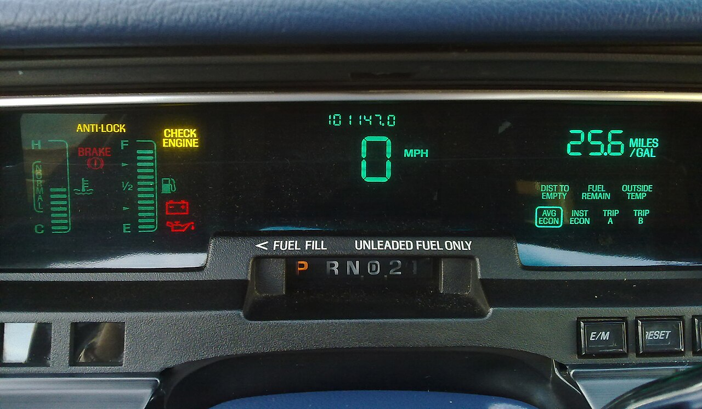

# Reading errors

*An error message is not the computer scolding you — it's the computer handing you a map to the bug, with the exact file and line marked. Beginners see a wall of red and panic; professionals read three specific things and know where to look. That skill is learnable in one sitting.*

> The single biggest difference between someone who's been coding a week and someone who's been
> coding a year is not talent — it's that the beginner sees an error message and feels *fear*,
> and the pro sees the same message and feels *relief*. Because an error is the most helpful
> thing your computer ever says to you. It is not a punishment; it is a **map**, printed at the
> exact moment of failure, with the type of problem, a description, and — this is the gold — the
> precise file and line number where everything went wrong. Learn to read it and you've learned
> the single highest-leverage skill in all of debugging.

> **In real life**
>
> An error message is a car's dashboard warning light. When `CHECK ENGINE` lights up, the car
> isn't insulting you and it isn't "just broken" — it's telling you, specifically, that one
> system needs attention. A panicking driver stares at the red glow and despairs. A calm driver
> *reads which light it is*: oil? battery? brakes? Each lamp points at one subsystem, and knowing
> which one is 90% of the fix. Error messages work identically: the scary red text names exactly
> which thing failed, and where. The whole skill is reading the label instead of fearing the glow.

## The three things every error tells you

Whatever language, whatever error, you are hunting for exactly three pieces of information —
and the rest of the wall of text is just context around them:

**1. The TYPE.** A short name for the *category* of problem: `IndexError`, `NullPointerException`,
`FileNotFoundError`, `SyntaxError`. This alone often tells you the whole story — `IndexError`
means you reached past the end of a list; a null/None error means something you expected to
exist was empty.

**2. The MESSAGE.** A sentence of detail: `list index out of range`, `Index 2 out of bounds for
length 2`. The type says *what kind*; the message says *the specifics*.

**3. The LOCATION.** The file and line number where it blew up — and, above it, the chain of
calls that led there (the **stack trace** / **traceback**). This is where you point your eyes
first. It is, quite literally, an X marking the spot.


*Car dashboard with warning lamps — Rderijcke, Wikimedia Commons, CC BY-SA 3.0. [Source](https://commons.wikimedia.org/wiki/File:Vfd_car.jpg)*
- **CHECK ENGINE — the vague error that says 'go look'** — The amber CHECK ENGINE lamp is the software equivalent of a generic error: it tells you something failed but not exactly what — you have to read the details (the code, the log, the full message) to learn which. Programs do this too: a plain 'Error' or a wrapped exception means 'something went wrong downstream; go read the trace to find the real cause.' Vague on the surface, specific underneath.
- **BRAKE (red) — a fatal error, the program STOPPED** — Red is not amber. The red BRAKE lamp means stop now — like an unhandled exception that halts your program mid-run. When a program 'crashes', this is what happened: it hit something it could not continue past, printed the error, and stopped. The red light isn't the disaster; it's the WARNING that saved you from a bigger one.
- **The oil & battery icons — the error TYPE** — Each little icon names a specific subsystem: oil, battery, brakes. That's exactly what an exception TYPE does — `IndexError`, `NullPointerException`, `FileNotFoundError` each name the category of failure. Learn to recognise a handful of these icons and you diagnose at a glance, before reading another word. The type is the fastest clue you get.
- **The gauges — in range vs warning** — A temperature needle sitting in the normal band is fine; the moment it redlines, a light joins it. Errors have this gradient too: a warning ('deprecated', 'slow query') is a needle creeping up — note it, keep driving — while an exception is the redline lamp that stops you. Part of reading errors is telling a warning apart from a genuine failure.
- **It still shows the ODOMETER and speed — context around the fault** — Even lit up with warnings, the panel keeps showing mileage, speed, fuel. A stack trace is the same: around the one line that failed, it shows the whole journey that led there — every function that called the next. Beginners read only the scary line; pros also read the trip that got them to it, because the real cause is often a few stops back.

**How to read a traceback — press Play**

1. **Don't read top-to-bottom. Find the ENDS first.** — A traceback is not a story you read start to finish. Two lines carry almost all the value: the very last line (the type and message) and the deepest 'File..., line N' (where it actually broke). Jump to those two before reading anything in between.
2. **Read the TYPE and MESSAGE (the last line in Python)** — `IndexError: list index out of range`. Six words that tell you the category (reached past a list's end) and the specifics. Often you now know the bug without reading another line — you asked for an item that isn't there.
3. **Find the LOCATION — the file and line** — Scan for the deepest `File "...", line N, in <function>` (Python) or the top `at Class.method(File.java:N)` (Java). That number is where the failure happened. Open that file, go to that line. You are now standing exactly where the bug lives.
4. **Read the STACK — how you got there** — Above (Python) or below (Java) the crash line is the chain of calls: main called process, which called getThirdItem, which did the bad thing. When the crash line itself looks innocent, the real mistake is one caller up — a bad value passed in from earlier.
5. **Now — and only now — form a theory** — Type + message + location + call chain give you a specific hypothesis: 'the list passed into getThirdItem had only two items, so index 2 failed.' That's a bug you can fix in a minute — versus 'it crashed', which is a bug you can stare at for an hour.

The fastest way to learn this is to cause an error on purpose and read what comes back. This
Python program asks for the third item of a two-item list — run it and read the traceback
**from the bottom up**:

*Run it — a real Python traceback (read it bottom-up)*

```python
def get_third_item(data):
    return data[2]        # the crash happens on THIS line

def process(records):
    return get_third_item(records)   # ...called from here

items = ["apple", "banana"]          # only 2 items -- index 2 does not exist
print("about to read the third item...")
print(process(items))                # ...which was called from here
print("this line never runs")
```

You'll see something like:

```text
Traceback (most recent call last):
  File "prog.py", line 10, in <module>
    print(process(items))
  File "prog.py", line 5, in process
    return get_third_item(records)
  File "prog.py", line 2, in get_third_item
    return data[2]
IndexError: list index out of range
```

Read the **last line first**: `IndexError: list index out of range` — you reached past the
end of a list. Then the **deepest File line**: line 2, `return data[2]` — that's the crash
site. Then walk *up*: it was called from `process`, which was called from the `print` on line
10. The chain tells you the empty-ish list came in from the top. Now the same bug in Java —
notice the stack trace reads the **opposite** direction, top-down:

*Run it — the same bug in Java (stack trace reads top-down)*

```java
public class Main {
    static String getThirdItem(String[] data) {
        return data[2];              // the crash happens on THIS line
    }

    static String process(String[] records) {
        return getThirdItem(records);   // ...called from here
    }

    public static void main(String[] args) {
        String[] items = {"apple", "banana"};   // only 2 items
        System.out.println("about to read the third item...");
        System.out.println(process(items));      // ...called from here
        System.out.println("this line never runs");
    }
}
```

Java prints the type and message on the **first** line
(`Exception ... ArrayIndexOutOfBoundsException: Index 2 out of bounds for length 2`), then the
stack **downward**, most-recent call first: `at Main.getThirdItem` (the crash), then
`at Main.process`, then `at Main.main`. Same bug, same three facts — type, message, location —
just laid out in the reverse order from Python. Learn to spot the three facts and the direction
stops mattering.

stack trace

> **Tip**
>
> When you hit an error you don't recognise, **copy the TYPE and MESSAGE and search them** —
> verbatim, in quotes, minus your specific filenames. `"IndexError: list index out of range"` or
> `"ArrayIndexOutOfBoundsException"` will land you on thousands of people who hit the identical
> wall and the answers that freed them. This is not cheating; it is exactly what senior engineers
> do all day. The error message is a *search key* the language designers handed you for free —
> use it.

### Your first time: Your mission: read three errors without fear

- [ ] Cause the crash — Run the Python playground above. Watch it print 'about to read...', then throw, and NOT print 'this line never runs'. The error stopped execution right at the bad line — that's what an unhandled error does.
- [ ] Find the type and message — Scroll to the LAST line of the traceback: 'IndexError: list index out of range'. Say out loud what it means — 'I asked for an item past the end of a list'. You just diagnosed a bug from one line.
- [ ] Find the crash line — Look for the deepest 'File..., line N' — line 2, 'return data[2]'. That number is where to put your eyes. In a real project you'd open that file and go straight there.
- [ ] Walk the call chain — Read upward: get_third_item was called by process, called by the print on line 10. The trail shows the two-item list came in from the top — the real fix might be up there, not at the crash line.
- [ ] Compare Java's direction — Run the Java version. The exception is on the FIRST line, the stack goes DOWN. Same three facts, mirrored order. Notice you can now read both — because you're hunting facts, not reading prose.

You've now read a real error in two languages and extracted the bug from it. That's the skill — and you'll use it every single working day.

- **The error points at a line that looks completely correct.**
  The crash line is where the bad VALUE landed, not always where the mistake was MADE. `return data[2]` is fine code — the bug is that `data` only had two items, and that was decided by whoever built or passed `data` earlier. Walk UP the stack trace: the real cause is often one or two frames back, where the wrong value was created. The trace shows you exactly which callers to check.
- **There's a huge wall of trace and I don't know where to start.**
  Ignore the middle. Read the very last line (Python) or very first line (Java) for the type and message, then find the ONE 'File/line' that points into YOUR code (not deep inside a library). Long traces are usually mostly framework frames; your bug is at the boundary where your code called into theirs. Two lines out of forty carry the answer.
- **The message mentions 'None' / 'null' and I don't see why.**
  Something you expected to hold a value was empty. `AttributeError: 'NoneType' object has no attribute...` (Python) or `NullPointerException` (Java) means you called a method or read a field on nothing. Trace back to where that variable was set — a function that returned nothing, a lookup that found nothing, an uninitialised field. The fix is upstream: make sure it has a value, or check for empty before you use it.
- **I fixed the line it pointed at and got a NEW error.**
  That's progress, not failure — you peeled off the top layer and revealed the next one. Errors often stack: fix the first, run again, read the next. Each one is a step closer. The mistake is assuming one error means one problem; sometimes it means the first of several, and clearing them one by one is exactly how debugging goes.
- **The program printed a wrong answer but NO error at all.**
  That's a different, harder animal — a logic bug, not a crash. No traceback because nothing 'failed' from the computer's view; it did exactly what you wrote, which wasn't what you meant. Reading errors won't help here; you need print-debugging or a debugger to watch the values. An error at least tells you where to look — a silent wrong answer tells you nothing, which is why crashes are the friendly kind of bug.

### Where to check

When an error appears, resist the reflex to change code immediately. Read first, in this order:

- **The last line (Python) / first line (Java)** — the type and message. Often the whole diagnosis.
- **The deepest file:line that's in YOUR code** — where to point your eyes. Skip the library frames.
- **The call chain** — who called the failing function, and with what. The cause may be a caller up.
- **The exact text, searched verbatim** — someone has hit this exact error; the fix is usually one search away.
- **Whether it's an error or a warning** — a warning lets the program continue; an exception stops it. Don't chase a warning while an exception is the real blocker.

Tester's habit: **a bug report without the full error text is half a report.** "It crashed" is
useless; the traceback — type, message, and the file:line — is the difference between a
developer fixing it in five minutes and asking you three follow-up questions first. Copy the
*whole* error, not your paraphrase of it.

### Worked example: the one-line error that saved a three-hour hunt

1. **The report:** "The checkout page crashes for some users when they click Pay. Others are fine. Intermittent, can't reproduce."
2. **The developer starts guessing.** Maybe the payment gateway? A slow network? They spend an hour poking at systems that turn out to be healthy — because they never looked at the actual error.
3. **A tester reproduces it once and copies the FULL traceback**, not just "it crashed." The last line: `KeyError: 'discount_code'`. The deepest line in their code: `cart.py, line 88, total = subtotal - discounts['discount_code']`.
4. **The type alone cracks it.** `KeyError` means: you asked a dictionary for a key that isn't there. The code assumed every cart has a `discount_code`; the ones that crash are carts *without* a discount.
5. **Why intermittent?** Users who applied a coupon have the key and sail through; users who didn't have no `discount_code`, so line 88 throws. It was never random — it was 'has a coupon vs doesn't', a condition nobody had split their testing by.
6. **The fix is two lines, at the spot the error pointed to.** Use `discounts.get('discount_code', 0)` — return zero when the key is missing — instead of assuming it exists. The error handed over the exact file, the exact line, and the exact wrong assumption.
7. **The contrast that matters.** The developer, error-blind, chased healthy systems for an hour. The tester, error-literate, read one line — `KeyError: 'discount_code'` at `cart.py:88` — and had the diagnosis in a minute. Same bug, same information available to both. One of them read it.
8. **The lesson for a tester.** The most valuable thing you can attach to a bug report is the verbatim error and its location — because it converts 'sometimes crashes' into 'crashes at cart.py line 88 when there's no discount_code', and that second sentence is a fix waiting to happen. Reading errors isn't a developer-only skill; it's how a tester writes a report a developer can act on immediately.

> **Common mistake**
>
> Reporting "it threw an error" or "it crashed" without the error text. This is the single most
> common way testers accidentally slow down a fix. The traceback is the evidence — the type, the
> message, and the file:line are a precise description of the failure that the *computer wrote
> for you*, and paraphrasing it throws that gift away. Never summarise an error; copy it whole,
> in a code block, exactly as it appeared. "NullPointerException at OrderService.java:142" tells a
> developer where to go; "the order thing broke" tells them to come ask you what you saw.

**Quiz.** A Python program stops and prints, as its final line: IndexError: list index out of range. Before reading anything else, what does this tell you?

- [ ] The computer is broken or Python has a bug
- [x] You tried to access a list position that doesn't exist — e.g. item 5 of a 3-item list. The TYPE (IndexError) names the category and the MESSAGE (out of range) confirms it; now you find the file:line in the traceback to see exactly where, and walk up the calls to see why the list was shorter than expected.
- [ ] You need to reinstall Python
- [ ] There is no way to know without running it again

*This is the whole skill in one question: the type and message alone — before you read a single line of the traceback body — already tell you the category of bug. `IndexError: list index out of range` means one specific thing: you asked for a list position past its end. You don't panic, you don't guess; you go find the file:line the traceback marks, look at the indexing, and then walk UP the call chain to see why the list had fewer items than your code assumed. Type, message, location — three facts, and the error handed you all three for free. A tester who reads this fluently writes bug reports developers can act on without a single follow-up question.*

- **The three things every error tells you** — TYPE (category, e.g. IndexError), MESSAGE (specifics, e.g. 'index out of range'), and LOCATION (file:line + the call chain that led there).
- **Which way do you read a Python traceback?** — Bottom-up. The LAST line is the type and message; the deepest 'File..., line N' is the crash site. The frames above are the call chain.
- **Which way do you read a Java stack trace?** — Top-down. The FIRST line is the exception type and message; the stack below goes most-recent-call-first ('at Class.method(File.java:N')).
- **The crash line looks correct — now what?** — The crash is where a bad VALUE landed, not always where the mistake was made. Walk UP the stack — the wrong value usually came from a caller a few frames back.
- **What does a None/null error mean?** — Something you expected to hold a value was empty. `AttributeError: 'NoneType'...` / `NullPointerException`. Fix upstream: ensure it has a value, or check for empty first.
- **Fastest way to decode an unfamiliar error** — Copy the TYPE and MESSAGE verbatim (minus your filenames) and search it in quotes. Thousands hit the same wall; the fix is usually one search away.
- **The tester's rule for error reports** — Never paraphrase an error — copy it whole, in a code block, with the file:line. 'It crashed' is half a report; the traceback is the other, useful half.

### Challenge

In the Python playground, change `items` to a list of three or more strings and run it — the
error vanishes, because index 2 now exists. Then change `data[2]` to `data[20]` and watch the
IndexError come back, pointing at the same line. Finally, in the Java playground, do the same
and read how the stack trace names `Main.getThirdItem` as the crash and `Main.main` as the
origin. Write one sentence: given only the last line of a traceback and the file:line, how
would you word a bug report so a developer needs zero follow-up questions?

### Ask the community

> Error I can't decode: TYPE + MESSAGE (last line Python / first line Java): `[paste verbatim]`. The deepest file:line in MY code: `[paste]`. What that line does: `[paste the line]`. Language: `[Java/Python]`. What I expected vs what happened: `[...]`.

The verbatim type+message and the file:line answer most 'what does this error mean?' questions
before anyone replies — paste them exactly (not paraphrased), and include the one line the
trace points to. That's the difference between a question people can answer and one they can't.

- [Python docs — errors and exceptions (and how to read them)](https://docs.python.org/3/tutorial/errors.html)
- [Java tutorial — exceptions and stack traces](https://docs.oracle.com/javase/tutorial/essential/exceptions/)
- [Real Python — understanding the Python traceback](https://realpython.com/python-traceback/)
- [How to ask a good question — including the full error text](https://stackoverflow.com/help/how-to-ask)

🎬 [How to read a stack trace / traceback without fear](https://www.youtube.com/watch?v=aQ9Uu1F0Yn0) (9 min)

- An error message is a map, not a scolding — it hands you the TYPE, the MESSAGE, and the LOCATION (file:line) of the failure, printed at the exact moment it happened.
- Read a Python traceback BOTTOM-UP (last line = type + message) and a Java stack trace TOP-DOWN (first line = the exception). Same three facts, mirrored order.
- The crash line is where the bad value landed, not always where the mistake was made — walk UP the call chain, because the real cause is often a frame or two back.
- Copy the TYPE and MESSAGE verbatim and search them; it's exactly what senior engineers do, and the fix is usually one search away.
- For a tester: never report 'it crashed' — paste the whole error with its file:line. That one habit turns a vague report into a fix waiting to happen.


---
_Source: `packages/curriculum/content/notes/logic-and-control-flow/first-bugs-and-debugging/reading-errors.mdx`_
