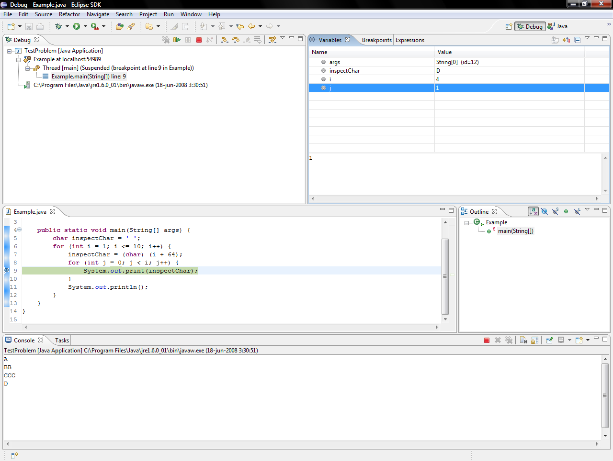

# Using a debugger

*A debugger pauses your program mid-run and lets you inspect every variable, step one line at a time, and see the call chain — without adding a single print. It's print-debugging's grown-up sibling: more setup, but you watch the whole machine think instead of guessing what to print.*

> Print-debugging asks you to guess, in advance, which value matters — you add a print, run, find
> it's the wrong value, add another print, run again. A **debugger** removes the guessing entirely.
> It **freezes your program mid-run**, at a line you choose, and lets you look at *everything* at
> once: every variable's current value, the exact line about to execute, the whole chain of calls
> that got you here. Then you step forward one line at a time and watch the values change with your
> own eyes. It's the difference between taking one photo and hoping it's the right moment, versus
> pausing the film on any frame and studying it as long as you like.

> **In real life**
>
> A debugger is a pause button for a running program. Watching a bug happen at full speed is like
> watching a magic trick — the coin vanishes and you've no idea how. A debugger lets you pause the
> trick at the exact instant of the switch, and even rewind-and-replay frame by frame, until the
> sleight of hand is obvious. Print-debugging is asking the magician to *describe* one moment; the
> debugger is stopping time and walking around the frozen stage yourself. The bug that's invisible
> at speed is usually obvious once you can stand still inside the moment it happens.

## The four powers a debugger gives you

Every debugger — in IntelliJ, VS Code, Eclipse, PyCharm, the browser, or the command line — gives
you the same four abilities. Learn these four and you can drive any of them:

**1. Breakpoints.** You click in the margin next to a line and the program will **pause** there
every time it reaches it — before running that line. No code change, no print; just "stop here so
I can look."

**2. Inspect variables.** While paused, a panel shows the *live value of every variable in scope*.
Not one value you remembered to print — all of them, right now. This is the debugger's superpower.

**3. Step.** Advance execution one line at a time and watch the values update. **Step over** runs
the next line whole; **step into** dives inside a function call; **step out** finishes the current
function and returns to its caller.

**4. The call stack.** A panel showing the chain of function calls that led to this pause — the
same information a stack trace gives after a crash, except now the program is still *alive* and
you can click any frame to inspect its variables.


*Eclipse debugger suspended at a breakpoint — Wikimedia Commons, Public domain. [Source](https://commons.wikimedia.org/wiki/File:Eclipse_suspended_at_breakpoint.png)*
- **The green line = execution is PAUSED right here** — Line 9 is highlighted because the program stopped just before running it — this is the breakpoint. Everything above has run; this line and everything below has not, yet. The single most orienting fact in a debugger is 'where am I paused', and the highlight answers it at a glance. You set this by clicking the margin next to the line.
- **The Variables panel = every value, live, for free** — Look: i=4, j=1, inspectChar=D — the actual values RIGHT NOW, with no print statements added anywhere. This is why a debugger beats printing: you didn't have to guess which variable to inspect, you see them ALL. When a value is wrong, it's sitting right here in the panel, and you didn't touch the code to find it.
- **The Debug panel = the call stack, paused and alive** — 'Thread [main] (Suspended (breakpoint at line 9))' and 'Example.main line: 9' are the call stack — how the program got here. It's the same chain a crash's stack trace shows, but the program is still RUNNING (just paused), so you can click any frame and inspect its variables. A stack trace is a photo of the crash; this is the live scene.
- **The step buttons = advance one line, watch it change** — The little arrows in the toolbar are step over (run the next line), step into (dive inside a function call), and step out (finish this function, return to caller). Each click moves execution forward one step and the Variables panel updates instantly — so you literally watch i and j change as the loops turn. This is 'slow-motion replay' of your own program.
- **The Console = what it has printed SO FAR** — A, BB, CCC, D — the output up to the pause. The program was building a triangle and stopped partway: three full rows plus the first D of the fourth (that's why i=4, j=1 — one D printed so far). Seeing partial output next to the paused state ties 'what it did' to 'where it is' — exactly the connection that makes a bug click.

**A debugging session, step by step. Press Play**

1. **Set a breakpoint where you suspect trouble** — Click the margin next to the line where you think the value goes wrong — say, inside the loop that builds the total. The program will now pause there every time it arrives, before running the line. No print, no code edit; just a red dot in the margin.
2. **Run in debug mode — it stops at the dot** — Instead of Run, you hit Debug. The program executes normally until it reaches your breakpoint, then FREEZES. The current line lights up, and the Variables panel fills with every value in scope, exactly as they are at this instant.
3. **Read the variables — is anything already wrong?** — Scan the panel. Is the total what you expect? Is that list the length you assumed? Half the time the bug is visible immediately — a value is wrong before you even step, and now you know it went bad BEFORE this line, so you move the breakpoint earlier.
4. **Step, and watch the values move** — Click step-over to run one line. The panel updates. Step again. You're watching the program think in slow motion — the exact moment a correct value becomes a wrong one happens right in front of you, on one specific step, and that step is your bug.
5. **Found it — the line where right became wrong** — When the value was fine on one step and wrong on the next, the line between them is the culprit. You didn't add a single print or guess a single value; you paused, looked, and stepped until the bug revealed itself. That's the whole loop, and it works on bugs prints struggle with.

The program frozen in that screenshot is this exact one — a nested loop printing a triangle of
letters. Run it here and you'll get the full output; the screenshot just caught it *paused* at
`i=4, j=1`, which is why its console shows only `A`, `BB`, `CCC`, `D` so far:

*Run it — the program from the screenshot (Python)*

```python
# A good spot for a breakpoint: the inner print line.
# Paused there, a debugger would show i, j, and letter live.
for i in range(1, 11):
    letter = chr(i + 64)        # 65 -> 'A', 66 -> 'B', ...
    for j in range(i):
        print(letter, end="")   # <-- breakpoint here: watch i, j, letter change
    print()
```

*Run it — the exact Example.java from the screenshot*

```java
public class Main {
    public static void main(String[] args) {
        char inspectChar = ' ';
        for (int i = 1; i <= 10; i++) {
            inspectChar = (char) (i + 64);      // 65 -> 'A'
            for (int j = 0; j < i; j++) {
                System.out.print(inspectChar);  // line 9 in the screenshot: paused here at i=4, j=1
            }
            System.out.println();
        }
    }
}
```

At full speed you just see the finished triangle. The debugger's gift is stopping *inside* that
run — at `i=4, j=1` — and seeing that `inspectChar` is `D` and one `D` has printed, so the fourth
row is mid-build. For a bug, that same frozen moment is where a wrong value stands exposed.

breakpoint

> **Tip**
>
> The killer feature once you're comfortable is the **conditional breakpoint**. Right-click a
> breakpoint and add a condition like `i == 7` or `user.id == 4092` or `total < 0`, and the program
> only pauses when that's true. This is how you catch the *one* iteration out of ten thousand where
> things go wrong — the debugger runs full speed through all the fine cases and freezes exactly on
> the bad one. Trying to find that single case with prints means scrolling through ten thousand
> lines of output; the conditional breakpoint hands you the one that matters.

### Your first time: Your mission: set your first breakpoint

- [ ] Open a program in an IDE with a debugger — VS Code (any language), IntelliJ or PyCharm (Java/Python), or even your browser's DevTools for JavaScript. Paste in the triangle program above, or any short program of your own.
- [ ] Set a breakpoint — Click in the left margin next to the inner print line. A red dot appears. That's it — you've told the program 'stop here'. No code was changed.
- [ ] Run in DEBUG mode, not Run — Hit the Debug button (a bug icon), not the plain Run. The program starts, then freezes at your dot. The line highlights and a Variables panel appears.
- [ ] Read the variables — Find i, j, and letter (or inspectChar) in the panel. Note their current values. You're seeing live program state with zero print statements — the debugger's whole point.
- [ ] Step and watch — Click step-over a few times. Watch j climb, then i, and the values update each step. You're now watching your program run in slow motion — the skill that finds bugs prints can't.

You've set a breakpoint, paused a live program, read its variables, and stepped through it — the entire core of debugging, in five minutes.

- **My breakpoint is set but the program never stops there.**
  The line never executed — same discovery as a print that never appears. A condition around it was false, the loop ran zero times, or that code path wasn't taken. Set a breakpoint EARLIER, where you're sure execution reaches, and step forward to see where it branches away from the line you expected to hit.
- **I ran it and it finished without pausing at all.**
  You almost certainly hit Run instead of Debug. Breakpoints are ignored in a normal run — only debug mode honours them. Look for the bug-shaped icon or a 'Start Debugging' command (often F5), not the plain play button.
- **The variable I want shows 'not available' or an odd value.**
  Either it's out of scope at this line (declared in a different function or block), or it hasn't been assigned yet because execution paused BEFORE its line ran. Remember the breakpoint stops just before the highlighted line — a variable set on that very line isn't set yet. Step once and look again.
- **Stepping takes forever — the loop runs thousands of times.**
  Don't step through every iteration. Use a CONDITIONAL breakpoint (`i == 5000`, or `value < 0`) so it runs full speed and stops only on the case you care about. Or set a breakpoint after the loop to inspect the final result, then a conditional one inside if the final result is wrong.
- **The debugger works but I still can't tell what's wrong.**
  Debuggers show you WHAT the values are, not what they SHOULD be — you supply that. Before stepping, write down what you expect each variable to be at the breakpoint. Then the mismatch jumps out: 'total should be 30 here, but it's 3 — so the addition isn't happening'. A debugger without an expectation is just a fancy variable viewer; with one, it's a bug-finder.

### Where to check

A debugger is most powerful when you drive it with a hypothesis, not just poke around:

- **Set the breakpoint where you SUSPECT the value goes wrong** — not randomly. A hypothesis about the location makes every step meaningful.
- **Read ALL the variables at the pause, not just one** — the bug is often a value you weren't even watching. This is the debugger's edge over prints.
- **Use step INTO to follow a suspect function call** — when the bug might be inside a function you called, don't step over it; dive in and watch it work.
- **Use a conditional breakpoint for the needle in the haystack** — the one user, the one iteration, the one negative value. Let the machine find the moment for you.
- **Compare the live value to what you EXPECTED** — write the expectation first; the debugger confirms or refutes it. That's the difference between looking and finding.

Tester's habit: **learning to read a debugger makes you far better at reproducing bugs.** When a
developer says "I can't reproduce it," a tester who can set a breakpoint and inspect the exact
state that triggers the failure turns a vague report into a precise one — "it breaks when this
value is empty, here's the breakpoint that proves it." You don't have to write the fix to find
the exact condition, and the exact condition is what unblocks the fix.

### Worked example: the loop that ran one time too few

1. **The report:** "The report totals are slightly low — like the last row is always missing from the sum. Not always, but often."
2. **The developer adds prints inside the loop** and sees the values look fine — each row's amount prints correctly. The prints show right values, so they conclude the loop is fine and start suspecting the data. Hours lost.
3. **A tester opens the debugger and sets a breakpoint on the line AFTER the loop**, then inspects `total` and, crucially, the loop counter `i` and the list length.
4. **The panel shows it plainly:** the list has 10 rows (indexes 0–9), but `i` ended at 9 and the loop condition was `i < length - 1`. The loop stopped one short — it never processed the last row. The prints inside the loop looked fine because every row it DID process was correct; the bug was the row it *skipped*, which prints inside the loop can't show (that iteration never ran, so no print fired for it).
5. **The debugger made it obvious** because the Variables panel showed `i` maxing at 8, not 9, next to a list of length 10 — two numbers that shouldn't disagree, sitting side by side. A print of `total` alone would never have surfaced the off-by-one; you had to see the counter and the length TOGETHER.
6. **The fix is one character:** `i < length - 1` becomes `i < length`. Found not by reading the loop (which looked correct) but by inspecting the state it left behind.
7. **Why the debugger won where prints lost.** The bug was an iteration that DIDN'T happen. Prints can only report iterations that DO run; the debugger let the tester inspect the *aftermath* — the final counter versus the length — and the discrepancy was the whole story. Some bugs live in what didn't execute, and you find those by inspecting state, not by printing inside the thing that never ran.
8. **The lesson for a tester.** A debugger lets you inspect the scene AFTER an action, comparing what happened to what should have — and off-by-one, skipped-row, never-ran bugs surrender to that comparison in seconds. You don't need to be the one who fixes it; being the one who can point to 'i stopped at 8 but the list has 10 rows' is often the entire diagnosis.

> **Common mistake**
>
> Believing a debugger is 'advanced' and putting off learning it. Beginners often stick to prints
> for a year because a debugger *looks* intimidating — all those panels and buttons. But the core
> is four things (breakpoint, inspect, step, call stack), learnable in an afternoon, and it makes
> whole categories of bug trivial that prints make painful. The mistake isn't using prints — prints
> are great — it's never graduating past them. Spend one afternoon setting breakpoints in your IDE
> and you'll wonder how you debugged without it. The tool that looks hardest here is the one that
> saves you the most time.

**Quiz.** What is the main advantage of a debugger's breakpoint over adding a print statement?

- [ ] It runs the program faster
- [x] When paused at a breakpoint, you can inspect EVERY variable's live value at once (not just one you remembered to print), step forward to watch values change, and see the full call stack — all without editing the code. A print shows one value you guessed in advance; a breakpoint shows the whole state and lets you explore it.
- [ ] It automatically fixes the bug for you
- [ ] It works without running the program

*The heart of it: a print answers ONE question you had to guess in advance ('what is x here?'), while a breakpoint freezes the whole machine and lets you ask any question you like — every variable, the call stack, and what happens on the next step. You often find the bug in a value you weren't even watching, which a targeted print would have missed entirely. Add conditional breakpoints (pause only when `i == 7`) and you can isolate the one bad case out of ten thousand, which prints can't do without burying you in output. None of this makes prints obsolete — they're faster for a quick check and work where a debugger is awkward to attach — but for anything non-trivial, the ability to pause and inspect the entire live state is a different league. It's the single highest-value tool most beginners take too long to pick up.*

- **What are the four core powers of a debugger?** — Breakpoints (pause at a line), inspect variables (see all live values), step (advance line-by-line: over/into/out), and the call stack (the chain of calls, paused and alive).
- **What is a breakpoint?** — A marker on a line that pauses the program there every time execution reaches it, before running the line — no code change needed. Set by clicking the margin.
- **Step over vs step into vs step out** — Over: run the next line whole. Into: dive inside a function call on that line. Out: finish the current function and return to its caller.
- **Debugger vs print — the key edge?** — A print shows ONE value you guessed in advance; a breakpoint shows EVERY variable live, lets you step and watch them change, and shows the call stack — all without editing code.
- **What is a conditional breakpoint?** — A breakpoint that only pauses when a condition is true (`i == 7`, `total < 0`). It catches the one bad iteration out of thousands — impossible to isolate with prints.
- **My breakpoint never pauses — why?** — Either the line never runs (condition false / loop zero times — a real finding), or you hit Run instead of Debug (breakpoints are ignored in a normal run).
- **Debugger + expectation = ?** — A debugger shows what values ARE, not what they should be — you supply the expectation. Write down what you expect at the breakpoint; the mismatch is the bug.

### Challenge

Run the Python triangle program above, then imagine (or actually do it in your IDE) setting a
breakpoint on the inner `print` line with the condition `i == 4`. Predict: what will `j` be the
first time it pauses? (Answer: 0 — the inner loop just started for the fourth row.) Now change
the outer range to `range(1, 4)` and predict how the triangle shrinks. Finally, write one
sentence: describe a bug you'd find with a debugger's Variables panel that a single print
statement would miss entirely.

### Ask the community

> Debugger question: I set a breakpoint at `[file:line]` but `[it never pauses / a variable shows an unexpected value / I can't tell what's wrong]`. Tool: `[VS Code / IntelliJ / PyCharm / browser / pdb]`. Language: `[Java/Python]`. At the pause, the variables show: `[paste the key values]`. What I EXPECTED them to be: `[...]`.

The gold in a debugger question is 'what the variables show' versus 'what you expected them to
be' — paste both. The gap between them is almost always the bug, and stating your expectation is
what turns a screenshot of values into a diagnosis.

- [VS Code — debugging: breakpoints, stepping, the variables panel](https://code.visualstudio.com/docs/editor/debugging)
- [Python docs — pdb, the built-in command-line debugger](https://docs.python.org/3/library/pdb.html)
- [IntelliJ — debug your first Java application](https://www.jetbrains.com/help/idea/debugging-your-first-java-application.html)
- [Chrome DevTools — debugging JavaScript in the browser](https://developer.chrome.com/docs/devtools/javascript/)

🎬 [How to use a debugger — breakpoints, stepping, and watches](https://www.youtube.com/watch?v=7qZBwhSlfOo) (12 min)

- A debugger pauses a live program and shows every variable's value at that instant — no prints, no guessing which value to capture. That's its core advantage.
- Four powers run every debugger: breakpoints (pause here), inspect (see all values), step (over/into/out), and the call stack (how you got here, paused and alive).
- Conditional breakpoints catch the one bad case out of thousands — pause only when `i == 7` or `total < 0` — which prints can't isolate without burying you in output.
- Some bugs live in what DIDN'T run (a skipped iteration, an off-by-one); you find those by inspecting the state left behind, not by printing inside the thing that never executed.
- For a tester, reading a debugger turns 'can't reproduce' into 'it breaks when this value is empty — here's the breakpoint that proves it', which is the diagnosis that unblocks the fix.


---
_Source: `packages/curriculum/content/notes/logic-and-control-flow/first-bugs-and-debugging/using-a-debugger.mdx`_
