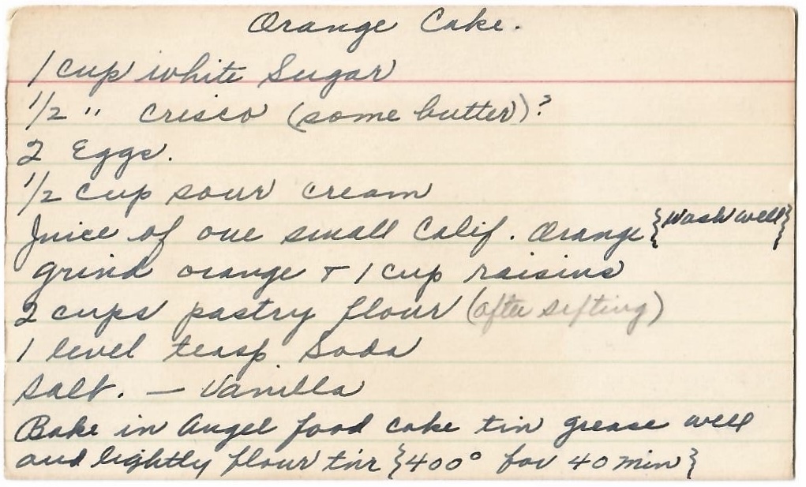

# Defining functions

*Package a block of code under a name so you can run it again and again: the function. How to define one with def (Python) or a method (Java), how to call it, and why 'write once, use many times' is the idea that tames big programs.*

> Up to now your programs have been one long run of instructions. That works until you need the same handful
> of steps in three places — validate an email here, here, and here — and suddenly you're copy-pasting, and
> every copy is a place a bug can hide and a fix can be forgotten. A **function** solves this: you write a
> block of steps *once*, give it a name, and then run it whenever you want just by saying its name. It's the
> single most important tool for keeping programs from collapsing under their own weight — it turns a wall of
> code into named, reusable pieces you can read, test, and fix in one place. Every real program is built out
> of functions calling functions. Learn to define and call one and you've crossed from 'scripts that run
> top to bottom' into 'programs you can actually build and maintain.'

> **In real life**
>
> A function is **a recipe card.** You write the recipe once — a name at the top ("Orange Cake"), and the
> steps below — and then anyone can make that cake any number of times by following the card, without
> re-inventing it each time. Defining a function is writing the card; *calling* it is following the steps to
> actually bake. A
> **function**: A named, reusable block of code you write once and run (call) as many times as you like — optionally taking inputs and handing back a result. Defined with def in Python or as a method in Java.
> is exactly that: a named set of instructions, defined a single time, run on demand by name. The payoff is
> the same as a recipe box: instead of a hundred loose scribbled copies, you have one trusted card per
> dish — fix the recipe once and every future cake improves.

## Define once with a name, then call it

Defining a function has two moves: **define** it (write the named block) and **call** it (run it by name).
In Python you define with `def`; in Java you write a *method*:

**Python:**
```python
def greet():                 # define: name is 'greet', steps are indented below
    print("Hello!")
    print("Welcome to the program.")

greet()                      # call: run the whole block by name
greet()                      # call again -- reuse, no copy-paste
```

**Java** (functions are called methods; this one is `static` so `main` can call it directly):
```java
static void greet() {        // define
    System.out.println("Hello!");
    System.out.println("Welcome to the program.");
}
// ...elsewhere:
greet();                     // call
greet();                     // call again
```

The `def greet():` line (or Java's `static void greet()`) is the *definition* — it doesn't run the code, it
just teaches the program what `greet` means. Nothing happens until you **call** it with `greet()`. Then the
program jumps into the function, runs its body top to bottom, and returns to where the call was. Define once,
call as many times as you like — that reuse is the whole point.


*Photo: a handwritten recipe card — Wikimedia Commons, CC BY-SA 4.0. [Source](https://commons.wikimedia.org/wiki/File:Orange_cake_-_Handwritten_2024-05-21_103943_page_1.jpg)*
- **The title = the function's NAME** — You call a function by its name, like asking someone to 'make the Orange Cake.' The name (def orange_cake, or Java's orange_cake()) is the handle you use to run the whole block. Pick a clear, verb-like name — it's how you and everyone else will invoke these steps.
- **The ingredients = what it needs (inputs)** — The recipe lists what it works with. A function's inputs are its parameters — the values you pass in when you call it (the very next note covers these in full). For now: this is the data the function operates on to do its job.
- **The steps = the function BODY** — Everything written under the name is the body — the actual code that runs each time you call the function. In Python it's the indented block under def; in Java it's inside the braces. Defining the function stores these steps; calling it runs them.
- **The end result = the return value** — Follow the steps and you get a cake — the thing the recipe produces. Likewise a function usually hands back a result with return (detailed in the next note). Some functions just DO something (print, save) and return nothing; others compute and give a value back to the caller.
- **One card, baked many times = define once, call many** — The whole card is the DEFINITION — written a single time. Anyone can follow it any number of times without rewriting it. That reuse is the entire reason functions exist: fix or improve the one card, and every future call gets the better version. No copy-paste, one place to change.

## A function that hands back a result

Many functions don't just *do* something — they *compute* something and give it back with `return`, so the
caller can use the answer. (The next note goes deep on inputs and return; here's a first taste so a function
feels complete.)

```python
def square(x):               # takes an input x
    return x * x             # hands back x times x

answer = square(5)           # call it, capture what it returns
print(answer)                # 25
print(square(9))             # 81 -- use the result directly
```

`return` does two things: it produces the function's result *and* ends the function immediately. So
`square(5)` becomes the value `25`, which you can store, print, or feed into more code — exactly like using
the cake the recipe produced. A function with `return` is a little machine: give it input, get output,
reuse it everywhere. That is how you build big programs out of small, trustworthy parts.

**Define, then call — what the computer does. Press Play.**

1. **Definition: the program LEARNS the recipe** — When Python reads 'def greet():' (or Java reads the method), it does NOT run the body — it just records that 'greet' names this block of steps. Defining is filing the recipe card away, not baking. This is why a defined-but-never-called function produces no output.
2. **Call: jump into the function** — When you write greet(), the program pauses where it is, jumps to the function's body, and starts running its steps top to bottom. The call is the moment the recipe is actually followed. Passing inputs (next note) happens right here, at the call.
3. **Run the body** — The function's steps execute in order — the prints, the calculations, whatever the body contains. If it hits a return, it produces that value and stops immediately. If there's no return, it just finishes its last line.
4. **Return to where you called it** — When the function ends (via return or its last line), control jumps BACK to the spot that called it, carrying any returned value. The program picks up right after the call. That's why you can call greet() twice: each call runs the body, then comes back.
5. **Reuse: call it as often as you like** — The whole win: one definition, unlimited calls. Need those steps in five places? Five calls to one function — not five copies. Fix a bug in the function once and all five callers are fixed. That is how functions keep large programs sane.

*Try it — define and call functions in Python. Press Run.*

```python
# Define a function ONCE with def:
def greet():
    print("Hello!")
    print("Welcome to the program.")

# Call it as many times as you like -- reuse, no copy-paste:
greet()
greet()

print("---")

# A function that RETURNS a value you can use:
def square(x):
    return x * x

answer = square(5)
print("square(5) =", answer)     # 25
print("square(9) =", square(9))  # 81

# Functions calling functions -- how real programs are built:
def describe(x):
    return "The square of " + str(x) + " is " + str(square(x))

print(describe(4))               # The square of 4 is 16
```

Here's the **same in Java** — functions are `static` methods here so `main` can call them directly:

*Try it — define and call methods in Java. Press Run.*

```java
public class Main {
    // define once:
    static void greet() {
        System.out.println("Hello!");
        System.out.println("Welcome to the program.");
    }

    static int square(int x) {
        return x * x;
    }

    public static void main(String[] args) {
        greet();                              // call
        greet();                              // call again
        System.out.println(square(5));        // 25
        System.out.println(square(9));        // 81
    }
}
```

> **Tip**
>
> Name a function for **what it does**, as a verb or verb-phrase — `send_email`, `calculate_total`,
> `is_valid` — so a call reads like a sentence: `if is_valid(email):`. A good name means you can use a
> function without re-reading its body; a vague one (`do_stuff`, `handle`) forces everyone to open it up. And
> keep each function to **one job**: if you're tempted to name it `validate_and_save_and_email`, that's three
> functions. Small, well-named, single-purpose functions are what make a big program readable — you compose
> them like sentences instead of drowning in one giant block.

### Your first time: First time? Write and run your own function

- [ ] Run greet() and watch it reuse — The greet function is defined once but called twice, so its two lines print twice. You wrote the steps a single time and ran them repeatedly by name. That's the core move — define once, call many.
- [ ] Comment out the calls, keep the def — In your head: if you delete the greet() calls but keep 'def greet():', nothing prints. Defining a function doesn't run it — it just teaches the program the recipe. Only a call bakes the cake. This trips up beginners: 'my function does nothing' usually means it was never called.
- [ ] Use a return value — square(5) becomes 25 — you stored it in 'answer' and also printed square(9) directly. A returned value is usable like any other value: store it, print it, pass it on. Change the 5 and 9 and watch the results follow.
- [ ] See functions call functions — describe(4) calls square(4) inside itself to build its sentence. Real programs are layers of functions calling functions — each small and named. Trace how describe uses square's result; that composition is how big things get built from small ones.
- [ ] Write one yourself — Define a function 'double(n)' that returns n + n, then call it with a few numbers. Run it. You've built a reusable, named piece of logic — the unit every program is assembled from. Give it a clear name and one job.

Ten minutes and you can package logic into named, reusable functions — the leap from a single script to a real, maintainable program.

- **“My function doesn't do anything / produces no output.”**
  You probably defined it but never CALLED it. 'def greet():' only teaches the program what greet means — nothing runs until you write greet() somewhere. Check that there's an actual call, not just the definition. This is the number-one beginner function bug: the recipe is written but never followed.
- **“NameError: name 'myfunc' is not defined (Python).”**
  You called the function before Python read its def, or misspelled the name, or defined it in a different scope. Python reads top to bottom, so the def must appear before the call runs. Make sure the function is defined above where you call it (or at least before the call executes), and that the names match exactly — greet() won't find Greet() or greets().
- **“My function computes the right thing but I can't use the result.”**
  You likely printed inside the function instead of returning. print shows a value on screen but doesn't hand it back to the caller — 'answer = square(5)' only works because square RETURNS x*x. If a function just prints, 'answer = square(5)' gets None. Rule of thumb: return the result so callers can use it; print only when displaying is the actual goal (the next note covers this fully).
- **“I copied the same code into several places and now a fix has to be made everywhere.”**
  That's exactly the pain functions remove. Move the repeated code into one function and call it from each place. Now there's a single copy to fix, test, and improve. If you find yourself pasting the same lines a second time, stop and make it a function — 'don't repeat yourself' (a later note) is built on this habit.

### Where to check

Debugging a function:

- **Did you CALL it?** — a definition alone runs nothing. Look for an actual `name()` call, not just `def name():`. 'My function does nothing' is almost always a missing call.
- **Name spelled and cased right?** — `greet()` won't find `Greet` or `greets`. NameError usually means a typo or a call before the def.
- **Defined before it's called?** — Python reads top to bottom; the def must execute before the call does.
- **return vs print** — to USE a result, the function must `return` it. If it only prints, the caller gets nothing back (None).
- **One job?** — if a function is hard to name or test, it may be doing too much; split it. Small single-purpose functions are easier to debug.

### Worked example: the validation copied into three forms — turned into one function

A signup, a profile edit, and a checkout each check an email the same way — by copy-paste. Then the rule
changes, and one copy gets missed. Let's fix the root cause:

```python
# BEFORE: the same check pasted in three places (only two shown)
# signup:
if "@" in email and "." in email:
    proceed()
# checkout (someone later 'improves' only this copy):
if "@" in email and "." in email and len(email) > 5:
    proceed()
# ...the signup copy still uses the old, weaker rule -> inconsistent behaviour
```

1. **The symptom:** the same logic behaves differently in different places, because the copies drifted apart
   — one was updated, the others weren't. Classic copy-paste rot.
2. **The root cause:** the email rule lives in three separate copies. There's no single source of truth, so a
   change to one doesn't reach the rest.
3. **The fix — define it once as a function:**
   ```python
   def is_valid_email(email):
       return "@" in email and "." in email and len(email) > 5
   ```
4. **Call it everywhere instead of pasting:**
   ```python
   if is_valid_email(email):   # signup
       proceed()
   if is_valid_email(email):   # checkout -- same rule, guaranteed
       proceed()
   ```
   Now all three sites run the identical check. Change the rule once inside is_valid_email and every caller
   updates at once — the drift is impossible.
5. **The bonus:** the code also reads better. `if is_valid_email(email):` says what it means; the raw
   `if "@" in email and "." in email...` made you decode the intent every time. A named function documents
   itself.
6. **Tester's angle:** with one function you write ONE set of tests for the email rule (valid, missing @,
   missing dot, too short) and trust it everywhere. With three copies you'd have to test all three and still
   fear a fourth copy exists. Functions shrink the surface you must test — a core reason testable code is
   built from small, named functions.

> **Common mistake**
>
> Defining a function but forgetting to CALL it — the definition just teaches the program the recipe; nothing
> runs until a call follows it. 'My function does nothing' is nearly always this. The mirror-image mistake is
> never defining a function at all and copy-pasting the same lines instead: it works right up until the logic
> changes and one copy gets missed, leaving inconsistent behaviour that's maddening to track down. Two more to
> watch: naming a function vaguely (`do_stuff`) so callers must read its body to know what it does — name it
> for its job, as a verb; and printing a result when you meant to `return` it, so the caller can't use the
> value. The whole power of functions is 'write once, use many, fix in one place' — so define the block, give
> it a clear single-job name, return what it computes, and actually call it.

**Quiz.** What's the difference between DEFINING a function and CALLING it?

- [ ] There's no difference — def runs the code
- [x] Defining (def name(): ...) teaches the program what the function is but does NOT run its body; calling (name()) actually runs the body — nothing happens until you call
- [ ] Calling defines it and defining calls it
- [ ] Defining runs the code once; calling runs it a second time

*Defining a function with def (or a Java method) only records what the name means — it stores the block of steps without executing them. The body runs only when you CALL the function by name, like name(). This is why a defined-but-never-called function produces no output ('my function does nothing' = you forgot the call). def does not run the code, and the two aren't interchangeable. Define once, then call as many times as you like — each call runs the body and returns to where you called it. That define-once/call-many split is exactly what lets one function replace copy-pasted code in many places.*

- **Function** — A named, reusable block of code you write once and run (call) many times. Defined with def (Python) or as a method (Java). Turns copy-pasted logic into one fixable, testable piece. Like a recipe card.
- **Define vs call** — Defining (def name():) teaches the program the recipe but runs nothing. Calling (name()) actually runs the body. Nothing happens until a call. 'My function does nothing' = you forgot to call it.
- **return** — Hands a result back to the caller AND ends the function immediately. 'answer = square(5)' works because square RETURNS x*x. A function that only prints gives the caller nothing back (None).
- **Why functions exist** — Write once, use many, fix in one place. They replace copy-pasted code (which drifts apart and hides bugs) with a single source of truth you can name, test, and improve once for all callers.
- **Naming a function** — Name it for what it DOES, as a verb: send_email, is_valid, calculate_total — so a call reads like a sentence. Vague names (do_stuff, handle) force readers to open the body. One function, one job.
- **Functions calling functions** — Real programs are layers of small functions calling other functions, each named and single-purpose. You compose them like sentences instead of writing one giant block. Composition is how big programs stay readable.

### Challenge

Build with functions. (1) Run greet() twice and confirm the body runs each time. (2) Delete the calls (keep
the def) and predict the output (nothing — a definition runs no code). (3) Write a function double(n) that
returns n + n and call it with 3, 10, and 0. (4) Write a function that calls double inside it (e.g.
quadruple(n) returns double(double(n))) and test it. (5) Write one sentence: what's the difference between
defining and calling a function? If you can say 'defining stores the steps under a name, calling actually
runs them — and nothing runs until you call', you've grasped the tool every program is built from.

### Ask the community

> Function question: I defined [function] but [it does nothing / I get NameError / I can't use its result]. Here's the function and where I call it [paste both]. I'm using [Python/Java]. What's wrong?

Paste both the def AND the line where you call it — 'my function does nothing and I don't see a call to it'
points straight at the missing-call bug (a definition runs nothing). If you get NameError, mention whether
the call comes before or after the def, and double-check the spelling and case of the name.

- [LearnPython — functions (interactive)](https://www.learnpython.org/en/Functions)
- [Python docs — defining functions](https://docs.python.org/3/tutorial/controlflow.html#defining-functions)
- [Python Functions — Socratica](https://www.youtube.com/watch?v=NE97ylAnrz4)

🎬 [Defining & calling functions in Python — Socratica](https://www.youtube.com/watch?v=NE97ylAnrz4) (10 min)

- A function is a named, reusable block of code: define it once (def in Python, a method in Java), then run it any number of times by calling its name. Like a recipe card — written once, cooked on demand.
- Defining and calling are different: def name(): only teaches the program the recipe and runs nothing; name() actually runs the body. 'My function does nothing' almost always means you forgot to call it.
- return hands a result back to the caller and ends the function, so square(5) becomes the value 25 you can store or use. A function that only prints gives the caller nothing back.
- The whole point is 'write once, use many, fix in one place' — functions replace copy-pasted code (which drifts and hides bugs) with a single source of truth you can name, test, and improve once for all callers.
- Name a function for its job, as a verb (is_valid, send_email), and keep it to one job — small, well-named functions compose into readable programs, and shrink the surface you have to test.


---
_Source: `packages/curriculum/content/notes/logic-and-control-flow/functions/defining-functions.mdx`_
