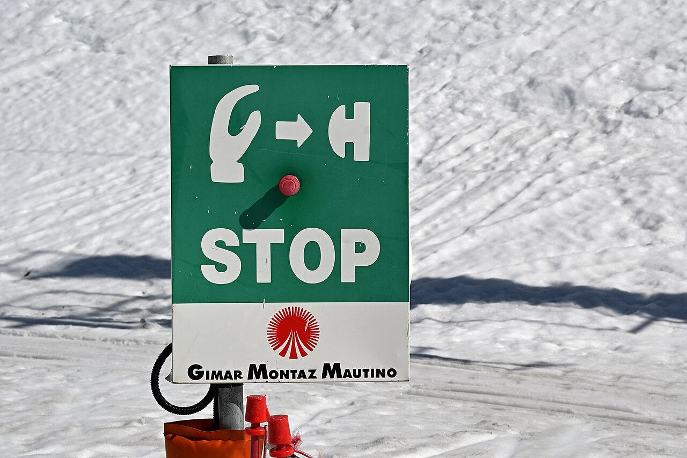

# Break & continue

*The loop's manual controls: break stops the whole loop early, continue skips the rest of this one pass and moves to the next. When each is the right tool, and the continue-before-the-counter trap that hangs a while loop.*

> A loop usually runs to its natural end — every number, every item. But often you want to *bail out early*
> or *skip one*. You're searching a list and you just found the thing — why keep looking? You're processing
> records and this one's blank — skip it and move on. Those two moves are `break` (stop the whole loop right
> now) and `continue` (abandon just this pass and jump to the next). They're the loop's manual override
> controls, and used well they make code faster and clearer — a search that stops the instant it succeeds
> reads better than one that grinds through everything. Used carelessly they hide a nasty trap: a `continue`
> in the wrong spot can skip the very line that ends a `while` loop, and now it runs forever. Learn both
> controls and the one trap, and you can steer a loop precisely instead of only starting and stopping it.

> **In real life**
>
> Think of a machine with a big **STOP button.** Pressing it is `break`: the whole machine halts at once —
> the loop is over, no more items, done. But there's a gentler move that is *not* pressing stop: you spot one
> bad item on the line, wave it past without working on it, and reach for the next — the machine keeps
> running. That's
> **continue**: A loop statement that skips the rest of the current iteration and jumps straight to the next one — the loop keeps running. Contrast with break, which ends the loop entirely.:
> skip the rest of *this* pass, go to the next, loop still going. The whole distinction is stop-the-machine
> versus skip-one-item: `break` ends the loop; `continue` only ends the current lap. Reach for the button
> (break) when you're truly done, and the skip (continue) when just this one item doesn't apply.

## break: leave the loop the moment you're done

`break` immediately ends the loop — control jumps to the first line *after* it, skipping any remaining
iterations. The classic use is search: stop looking the instant you find a match.

**Python:**
```python
names = ["Amir", "Beth", "Carlos", "Dana"]
target = "Carlos"
for name in names:
    if name == target:
        print("Found", target, "-- stop looking")
        break                 # ends the loop NOW; Dana is never checked
    print("Checked", name)
```

**Java:**
```java
String[] names = {"Amir", "Beth", "Carlos", "Dana"};
String target = "Carlos";
for (String name : names) {
    if (name.equals(target)) {
        System.out.println("Found " + target);
        break;                // same: stop the loop immediately
    }
    System.out.println("Checked " + name);
}
```

It prints "Checked Amir", "Checked Beth", "Found Carlos" — and never touches Dana. Without `break`, the
loop would pointlessly keep checking every remaining name after it already found the answer. `break` says
"I'm done here," and the loop obeys at once.


*Photo: a lift STOP button — Wikimedia Commons, CC0. [Source](https://commons.wikimedia.org/wiki/File:Stop_sign_and_button,_T%C3%A9l%C3%A9ski_du_Cloudit,_Villard-Reculas,_2026.jpg)*
- **The red button = break** — Press it and the whole machine halts at once — that's break. The instant break runs, the loop is OVER: it stops immediately, skips every remaining iteration, and control jumps to the first line after the loop. It's the loop's emergency stop.
- **STOP = a FULL stop, no next lap** — break is a total halt, not a pause. Any code after break inside the loop is skipped, and the loop never runs again — unlike continue, which resumes with the next item. When you press this button, the loop's job is finished.
- **The hand = you press it on a condition** — You don't hit break every lap — you trigger it when something happens mid-loop: you found what you searched for, hit an error, or ran out of reasons to keep going. It almost always lives inside an if: 'if this, then break.'
- **The → arrow = continue (skip forward)** — Think of continue as the opposite gesture: instead of pressing stop, you skip FORWARD to the next iteration. It bails on the current item only and the loop keeps running. Same idea of steering the loop, but continue ends the lap, not the whole machine.
- **The machine = the loop itself** — The whole sign-and-button is one loop. break switches it off entirely; continue only skips a single item and it keeps humming. That one difference — end the loop vs end this lap — is the entire lesson of this note.

## continue: skip this one, keep going

`continue` abandons only the *current* iteration — it jumps straight back to the loop's top for the next
one, skipping any code below it in the body. The classic use is filtering: skip the items you don't care
about and process the rest.

```python
# Skip even numbers; print only the odds
for n in range(1, 8):
    if n % 2 == 0:
        continue              # skip the rest of THIS pass -> next n
    print("odd:", n)          # only reached for odd n
```

This prints 1, 3, 5, 7. When `n` is even, `continue` fires and the `print` below is skipped for that pass —
but the loop keeps going with the next `n`. Compare with `break`, which would have *stopped at the first
even number*. Same-looking code, opposite effect: `continue` skips one and carries on; `break` ends the
whole thing. Choosing the wrong one is a common bug — a search that should `break` but uses `continue`
keeps looping, and a filter that should `continue` but uses `break` quits at the first skip.

## Using both, and Java's labelled break

You'll often use both in one loop: skip the items that don't apply, stop entirely on a signal. And in
Java, a plain `break` only exits the *innermost* loop — to break out of nested loops at once, Java has a
*labelled break* (Python has no direct equivalent; you'd use a flag or refactor into a function and
`return`):

```java
outer:
for (int i = 0; i < 3; i++) {
    for (int j = 0; j < 3; j++) {
        if (i + j == 3) break outer;   // jumps out of BOTH loops
    }
}
```

Most of the time you don't need labelled breaks — and if you find yourself reaching for one, it's often a
sign the nested loop wants to become its own function that can simply `return`. But it's worth knowing a
bare `break` escapes only one level, so a `break` inside nested loops doesn't leave the outer one.

**How break and continue redirect the loop. Press Play.**

1. **The loop runs its body, top to bottom** — Normally each iteration runs every line of the body, then goes back for the next item. break and continue interrupt that normal flow at the point where they appear — everything below them in the body may be skipped.
2. **continue -> jump to the NEXT iteration** — When continue runs, the loop abandons the rest of THIS pass and goes straight back to the top for the next item (in a for) or the condition check (in a while). The loop is NOT over — it just cut this lap short. Code below the continue is skipped for this item only.
3. **break -> leave the loop ENTIRELY** — When break runs, the loop ends immediately. No next iteration, no more items — control jumps to the first line after the whole loop. Everything remaining, this pass and all future passes, is skipped. The machine is off.
4. **The while + continue TRAP** — In a while loop, continue jumps back to the CONDITION, skipping any code between it and the loop's bottom — including a counter update like i += 1. If the update sits below the continue, it gets skipped, the condition never changes, and the loop hangs forever. The number-one break/continue bug.
5. **Both are for the exceptional path** — break and continue handle the special cases — found it, skip it, bail out — while the body handles the normal case. Used sparingly they clarify; scattered everywhere they make a loop hard to follow. Reach for them at the edges, not as the main logic.

*Try it — break and continue in Python. Change the data and re-run. Press Run.*

```python
# break: stop searching the instant we find the target.
names = ["Amir", "Beth", "Carlos", "Dana"]
target = "Carlos"
for name in names:
    if name == target:
        print("Found", target, "-- stop looking")
        break                # Dana is never checked
    print("Checked", name)

print("---")

# continue: skip even numbers, print only odds.
for n in range(1, 8):
    if n % 2 == 0:
        continue             # skip the rest of THIS pass
    print("odd:", n)

print("---")

# both together: add up positives, SKIP zeros (continue), STOP at a negative (break).
nums = [4, 0, 7, 2, -1, 9]
total = 0
for x in nums:
    if x == 0:
        continue             # a zero -> skip it, keep going
    if x < 0:
        break                # a negative -> stop entirely (9 is never seen)
    total += x
print("total of positives before the first negative:", total)   # 4+7+2 = 13
```

Here's the **same in Java** — `continue` to skip, `break` to stop — over an array:

*Try it — break and continue in Java. Press Run.*

```java
public class Main {
    public static void main(String[] args) {
        int[] nums = {4, 0, 7, 2, -1, 9};
        int total = 0;
        for (int x : nums) {
            if (x == 0) {
                continue;         // skip zeros, go to the next number
            }
            if (x < 0) {
                break;            // stop at the first negative (9 never seen)
            }
            total += x;
        }
        System.out.println("total: " + total);   // 4+7+2 = 13
    }
}
```

> **Tip**
>
> `break` and `continue` are for the *exceptional* path — the found-it, the skip-this, the bail-out — while
> the loop body handles the normal case. A single `break` in a search or a single `continue` to skip blanks
> reads beautifully. But if a loop has four `continue`s and two `break`s scattered through it, it's hard to
> follow what actually reaches the bottom — that's a smell. Often the cleaner fix is to *filter first* (loop
> only over the items you want) or pull the loop into a function that can `return` early. Rule of thumb: one
> or two, at the edges, for the special case — good. A tangle of them carrying the main logic — refactor.

### Your first time: First time? Steer a loop early

- [ ] Watch break stop a search — Run the names loop. It prints Checked Amir, Checked Beth, Found Carlos — and never checks Dana. break ended the loop the instant it found the target. Change target to 'Dana' and see it check everyone; change it to 'Amir' and it stops almost immediately. break = stop now.
- [ ] Watch continue skip and keep going — The odds loop prints 1,3,5,7 — every even number is skipped by continue, but the loop keeps running to the end. Note the difference from break: continue skipped items but did NOT stop the loop. Skip-one vs stop-all.
- [ ] Combine them — The third loop skips zeros (continue) and stops at the first negative (break), so it sums 4+7+2 = 13 and never sees the 9. Trace it by hand, then run it. You've used both controls in one loop — skip the irrelevant, stop on the signal.
- [ ] Feel the break-vs-continue choice — In the odds loop, change continue to break and re-run: now it stops at the first even number (2), printing only 'odd: 1'. One word flipped skip-and-continue into stop-entirely. Choosing the right one of the two is the whole skill.
- [ ] Learn the while trap (in your head) — Picture a while loop 'while i < 5' with 'if i == 2: continue' ABOVE the 'i += 1'. When i hits 2, continue skips the i += 1, so i stays 2 forever — an infinite loop. continue in a while can skip the counter update. Keep the update above the continue, or use a for loop.

Ten minutes and you can bail out of or skip through any loop — and you know the one continue-in-a-while trap that hangs it.

- **“My while loop hangs the moment I added a continue.”**
  This is THE break/continue trap. In a while loop, continue jumps straight back to the condition, skipping everything below it — including the counter update (i += 1). If that update sits below the continue, it never runs on the skipped pass, the condition never changes, and the loop spins forever. Fix: move the update ABOVE the continue, or (cleaner) use a for loop, where the update is in the header and can't be skipped.
- **“My break didn't leave the outer loop.”**
  A plain break only exits the INNERMOST loop it's in. Inside nested loops, a break in the inner loop drops you back into the outer loop, which keeps going. To leave both at once: in Java use a labelled break (outer: ... break outer;); in Python use a flag you check in the outer loop, or — best — move the nested loop into its own function and return out of it. If your break 'isn't working', check how many loops deep it is.
- **“I used continue but it stopped the whole loop (or break but it kept going).”**
  You swapped them. continue skips just the current iteration and the loop CONTINUES; break ends the loop ENTIRELY. A search that should stop-on-found needs break; a filter that should skip-and-keep-going needs continue. If a loop quits too early, you likely wrote break where you meant continue; if it does needless work after it should've stopped, the reverse. Say out loud 'skip this one' (continue) vs 'stop the loop' (break) and match the word.
- **“Code after my break/continue never runs.”**
  That's by design — both skip the rest of the loop body below them. Everything after a break (in any pass) and everything after a continue (in the current pass) is skipped. So don't put must-run code below them inside the loop. If you see an unreachable line after a break, either it's dead code, or the break is in the wrong place. Put break/continue at the END of the special-case handling, not before code that still needs to run.

### Where to check

Debugging break / continue:

- **while + continue = check the counter** — does a `continue` skip the line that updates the loop variable? If the update is below the continue, the loop hangs. Move it above, or use a for.
- **How many loops deep is the break?** — a plain break exits only the innermost. For nested loops use a labelled break (Java) or a function + return.
- **break or continue — which did you mean?** — stop the loop (break) vs skip this item (continue). Swapping them is a common bug: a search that won't stop, or a filter that quits early.
- **What's below it?** — code after break (always) and after continue (this pass) is skipped. Don't rely on must-run code sitting below them.
- **Too many of them?** — several break/continue carrying the main logic is a smell; consider filtering first or extracting a function.

### Worked example: the importer that froze on the first blank row — a continue trap, traced

A script reads rows and skips blanks, but it hangs forever the moment it hits a blank row. Here's the code:

```python
rows = ["Alice", "", "Bob", "Carol"]   # a blank row in the middle
i = 0
while i < len(rows):
    if rows[i] == "":
        continue              # BUG: skips the i += 1 below -> i never moves
    print("Imported:", rows[i])
    i += 1
```

1. **The symptom:** it prints "Imported: Alice", then hangs — printing nothing, using 100% CPU. A classic
   infinite loop, triggered specifically by the blank row.
2. **Trace to the blank:** i goes 0 (Alice, printed, i becomes 1), then i is 1 and rows[1] is "" — the blank.
   The `if` fires and `continue` runs.
3. **See what continue skips:** continue jumps straight back to the `while i < len(rows)` check, skipping
   everything below it — including `i += 1`. So i stays 1. Next pass, rows[1] is still "", continue again, i
   still 1... forever. The counter update got skipped by the continue.
4. **The fix — advance BEFORE you skip:** move the increment above the continue so it always runs:
   ```python
   i = 0
   while i < len(rows):
       row = rows[i]
       i += 1                # advance FIRST, so continue can't skip it
       if row == "":
           continue          # now safe: i has already moved on
       print("Imported:", row)
   ```
5. **The even simpler fix — use a for loop:** `for row in rows:` has no manual counter to skip, so
   `continue` is always safe. The blank rows are skipped and the loop still ends. This is why for loops are
   the safer home for continue.
6. **Tester's angle:** the bug only appears on the SKIPPED path (a blank row), not the normal one — Alice
   imported fine. Testing the happy path alone (all rows filled) would miss it entirely; you have to test the
   skip case (a blank/invalid row) to expose it. That's exactly why testers feed loops the awkward inputs —
   empties, duplicates, the row that triggers the continue.

> **Common mistake**
>
> Putting a `continue` above the counter update in a `while` loop — the update gets skipped, the loop variable
> never changes, and you have an infinite loop that only triggers on the skipped path. It's the signature
> break/continue bug, and it hides because the normal path works fine; only the item that fires the `continue`
> hangs it. Two cures: advance the counter *before* the continue, or use a `for` loop where the update lives in
> the header and can't be skipped. The other classic mistakes: swapping break (end the loop) and continue (skip
> one item) so a search never stops or a filter quits early; and assuming a plain `break` escapes nested loops
> when it only leaves the innermost. Keep break/continue for the exceptional path, put them where nothing vital
> sits below them, and in a while loop always ask: does this continue skip the line that ends the loop?

**Quiz.** What's the difference between break and continue inside a loop?

- [ ] They're the same; continue is just the newer keyword
- [x] break ends the whole loop immediately (no more iterations); continue skips only the rest of the current iteration and moves on to the next — the loop keeps running
- [ ] break skips one iteration; continue ends the loop
- [ ] break works in for loops and continue works in while loops

*break ENDS the loop entirely — the instant it runs, control jumps to the line after the loop and no further iterations happen. continue only ends the CURRENT iteration — it skips the rest of this pass and jumps to the next item, with the loop still running. So break = stop the machine; continue = skip one item and keep going. They are not the same, they are not swapped (break is the full stop, continue is the skip), and both work in for AND while loops. The most common bug is confusing the two, or putting a continue above a while loop's counter update so the update is skipped and the loop hangs.*

- **break** — Ends the loop immediately — no more iterations; control jumps to the line after the loop. Classic use: stop a search the moment you find a match. The loop's STOP button.
- **continue** — Skips the rest of the CURRENT iteration and jumps to the next one — the loop keeps running. Classic use: skip items you don't care about (blanks, evens) and process the rest.
- **break vs continue** — break = end the whole loop. continue = end just this lap, keep looping. Swapping them is a common bug: a search that won't stop (should break), or a filter that quits early (should continue).
- **The while + continue trap** — In a while loop, continue jumps back to the condition, skipping code below it — including a counter update (i += 1). If the update is below the continue, it's skipped and the loop hangs. Advance before the continue, or use a for loop.
- **break only exits ONE loop** — A plain break leaves only the innermost loop. For nested loops: Java has a labelled break (break outer;); Python uses a flag or a function + return. A break in an inner loop doesn't escape the outer one.
- **When to use them** — For the exceptional path — found it, skip it, bail out — not the main logic. One or two at the edges = clear. Many scattered through a loop = a smell; filter first or extract a function.

### Challenge

Steer a loop. (1) Run the names search and change target to 'Amir', 'Dana', and a name not in the list —
watch where break stops (or doesn't). (2) In the odds loop, swap continue for break and explain why it now
prints only 'odd: 1'. (3) Trace the combined loop by hand to predict the total (13) before running it. (4)
Explain, in one sentence, why the importer worked example hangs on a blank row — and give the two fixes.
(5) Write one sentence: what's the difference between break and continue? If you can say 'break ends the
whole loop, continue skips just this iteration and keeps going', you own the loop's manual controls.

### Ask the community

> Break/continue question: my loop [hangs after a continue / stops too early / doesn't leave the outer loop]. Here's the loop [paste it]. I'm using [Python/Java]. What's wrong?

If it hangs, say whether it's a while loop and where the counter update sits relative to the continue —
'my while hangs on blank rows and my i += 1 is below the continue' is the classic skipped-update trap. If a
break 'doesn't work', mention how many loops deep it is — a plain break only exits the innermost one.

- [LearnPython — loops (break & continue, interactive)](https://www.learnpython.org/en/Loops)
- [Python docs — break & continue](https://docs.python.org/3/tutorial/controlflow.html#break-and-continue-statements-and-else-clauses-on-loops)
- [break, continue & pass in Python — Telusko](https://www.youtube.com/watch?v=yCZBnjF4_tU)

🎬 [break, continue & pass in Python — Telusko](https://www.youtube.com/watch?v=yCZBnjF4_tU) (8 min)

- break ends the whole loop immediately — control jumps to the line after it and no more iterations run. Classic use: stop a search the instant you find a match.
- continue skips only the rest of the current iteration and jumps to the next — the loop keeps running. Classic use: skip items you don't care about (blanks, evens) and process the rest.
- The signature bug: a continue above a while loop's counter update skips the update, so the loop variable never changes and it hangs — but only on the skipped path. Advance before the continue, or use a for loop.
- A plain break exits only the innermost loop. For nested loops use a labelled break (Java) or a flag / function + return (Python).
- Use break and continue for the exceptional path — found it, skip it, bail out — not the main logic. One or two at the edges clarify; a scattered tangle is a smell (filter first or extract a function).


---
_Source: `packages/curriculum/content/notes/logic-and-control-flow/loops/break-and-continue.mdx`_
