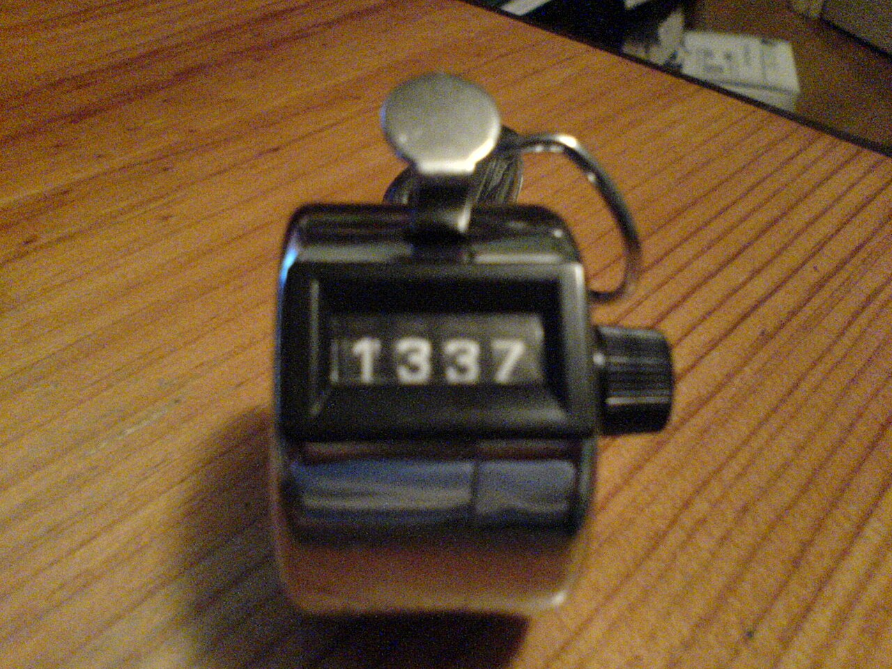

# For loops

*Do the same thing many times without copy-pasting: the counting loop. Python's for-in with range() vs Java's C-style for, and the off-by-one (fencepost) error — the single most common loop bug there is.*

> So far every line of your code runs once. But real work is repetitive: print the numbers 1 to 100,
> send an email to every customer, add up a shopping cart, check each of a thousand test cases. You are
> *not* going to copy-paste a line a hundred times — that's what a loop is for. A `for` loop is the
> **counting loop**: repeat a block a known number of times, or once for each item in a collection. It's
> one of the highest-leverage tools in programming — a few lines that do the work of thousands. It also
> hosts the most common bug there is: the **off-by-one** error, where you loop one time too many or one
> too few. Get the loop and its fencepost right and you can command a computer to do the boring part
> perfectly, every time.

> **In real life**
>
> A `for` loop is **a handheld tally counter.** You click it once for each thing you count, a hidden number
> ticks up by one every click, and you stop at a known total. The loop's counter variable is that number;
> each pass through the loop body is one click. The whole skill is knowing *where you start* (does the
> counter begin at 0 or 1?) and *where you stop* (do you stop at the total, or one before it?) — because
> getting either edge wrong by a single click is the
> **off-by-one error**: A loop that runs one time too many or one time too few — usually from a wrong start value or a stop condition that's off by a single step. Also called a fencepost error. The most common loop bug.,
> the most common bug in all of looping. Master the two edges of the count and the loop in the middle takes
> care of itself.

## The shape: count a known number of times

**Python** uses `for x in ...` — over a `range` of numbers, or straight over a list:
```python
for i in range(5):        # i takes 0, 1, 2, 3, 4  -- FIVE numbers, stops BEFORE 5
    print(i)

for fruit in ["apple", "pear", "kiwi"]:   # once per item, no counting needed
    print(fruit)
```

**Java** uses the C-style `for` with three parts — start, condition, update — in the parentheses:
```java
for (int i = 0; i < 5; i++) {   // start at 0; keep going while i is under 5; add 1 each time
    System.out.println(i);      // prints 0,1,2,3,4
}
```

Read the Java header as three clauses separated by semicolons: `int i = 0` sets the counter *once* at the
start; `i < 5` is checked *before every* pass (stop when it's false); `i++` runs *after every* pass to
move the counter. Python hides all that ceremony inside `range()` — `range(5)` produces exactly those five
numbers. Same loop, two spellings.


*Photo: a handheld tally counter — Wikimedia Commons, CC BY 2.0. [Source](https://commons.wikimedia.org/wiki/File:Tally_counter.jpg)*
- **The number = the loop counter** — The value on the dial is the loop's counter variable — i in 'for i in range(...)' or 'for (int i = ...)'. It holds where you are in the count right now. Each pass through the loop, this number is a different value; reading it tells you which iteration you're on.
- **The click button = one iteration** — Each press bumps the number up by one — exactly one pass through the loop body per click. Run the body n times and the counter climbs to n. This is the loop's engine: do the work, tick the counter, repeat.
- **The reset knob = where you START** — Resetting to zero is the loop's start value — 'int i = 0' or 'range(5)' beginning at 0. Most languages count from 0 by convention, which surprises beginners. Where you begin is half the off-by-one question: start one off, and every iteration is shifted.
- **You count a KNOWN number of times** — You hold the counter and click a set number of times — you know the total up front. That's exactly a for loop: the counting loop, used when you know (or can compute) how many repetitions you need. When you DON'T know the count in advance, that's a while loop (the next note).
- **Where you STOP = the off-by-one trap** — Do you stop AT the total or ONE BEFORE it? range(5) counts 0,1,2,3,4 — five times, stopping BEFORE 5. Java's 'i < 5' does the same; 'i <= 5' would run one extra. This single-step edge is the off-by-one (fencepost) error — the most common loop bug. Always ask: does my last iteration land where I think?

## range(): the fencepost, and why counting starts at 0

`range(5)` is the classic beginner surprise. It does **not** give you 1 to 5 — it gives you `0, 1, 2, 3,
4`: five numbers, starting at 0, **stopping before 5**. That "stop before the end" rule (called
*half-open*) is deliberate — it makes `range(len(mylist))` line up perfectly with a list's indexes
(which also start at 0). But it's exactly where off-by-one bugs breed:

- `range(5)` → `0,1,2,3,4` (five numbers; the end, 5, is excluded)
- `range(1, 6)` → `1,2,3,4,5` (start at 1, stop before 6 — how you count 1 through 5)
- `range(0, 10, 2)` → `0,2,4,6,8` (a third argument is the step)

The *fencepost* nickname comes from a riddle: to build a fence 10 metres long with posts every metre, how
many posts? Not 10 — it's 11, because you need a post at both ends. Loops have the same "count the gaps or
the posts?" trap: off-by-one is almost always a confusion between the number of *steps* and the number of
*points*. When a loop runs once too many or once too few, the start or the stop is off by a single count.

## Java's C-style for: three clauses, spelled out

Where Python hides the mechanics in `range()`, Java shows them. This is worth reading slowly, because
those three clauses are where Java off-by-ones (and accidental infinite loops) come from:

```java
for (int i = 0; i < 5; i++) {
    // 1. int i = 0   -> runs ONCE, before anything: the start
    // 2. i < 5       -> checked BEFORE each pass: keep looping while true, stop when false
    // 3. i++         -> runs AFTER each pass: moves the counter (forget it -> infinite loop!)
}
```

Change `i < 5` to `i <= 5` and the loop runs six times (0 through 5) instead of five — a one-character
off-by-one. Forget the `i++` and the counter never moves, `i < 5` stays true forever, and you get an
infinite loop. The three clauses give you power and rope; the next sections are about not hanging yourself
with the rope.

**How a for loop actually runs — one pass at a time. Press Play.**

1. **Start: set the counter once** — The loop initialises its counter a single time before anything else — i = 0 (Java's 'int i = 0', or where range() begins). This happens once, not every pass. Where you set it is the loop's starting fencepost.
2. **Check the condition BEFORE the body** — Before each pass, the loop asks 'should I keep going?' — i < 5 in Java, or 'are there more numbers in the range?' in Python. If true, run the body; if false, stop immediately. Because the check is first, a loop can run zero times if the condition is false from the start.
3. **Run the loop body** — The code inside the loop runs for this value of the counter — print(i), or process this list item. Everything indented (Python) or braced (Java) under the for is one iteration's work. Then control goes to the update, not back to the top yet.
4. **Update the counter, then re-check** — After the body, the counter moves — i++ in Java, or range hands out its next number in Python. Then it loops back to the condition check. Body, update, check, body, update, check… This is the rhythm; forgetting the update in Java means the check never changes and the loop runs forever.
5. **Condition false -> exit, continue after** — Once the condition finally fails (i reaches 5, or the range is exhausted), the loop ends and the program continues at the line after it. The number of times the body ran is set entirely by the start, the step, and the stop — get those three right and the count is right.

*Try it — for loops in Python. Change the ranges and re-run. Press Run.*

```python
# range(5) is 0,1,2,3,4 -- FIVE numbers, stops BEFORE 5. The classic surprise.
print("range(5):")
for i in range(5):
    print(i)

# To count 1..5 INCLUSIVE, stop before 6:
total = 0
for n in range(1, 6):
    total = total + n
print("sum of 1..5 =", total)     # 15

# Loop straight over a list -- no counting needed, no off-by-one possible:
for fruit in ["apple", "pear", "kiwi"]:
    print("fruit:", fruit)

# Off-by-one demo: how many times does each run?
print("range(3) runs", len(list(range(3))), "times")   # 3
print("range(1, 3) runs", len(list(range(1, 3))), "times")  # 2, not 3!
```

Here's the **same counting in Java**, with the three-clause C-style `for` — watch the `i < 5` (stop
before 5) versus `n <= 5` (stop at 5, inclusive):

*Try it — C-style for loops in Java. Press Run.*

```java
public class Main {
    public static void main(String[] args) {
        System.out.println("i < 5 gives:");
        for (int i = 0; i < 5; i++) {     // 0,1,2,3,4 -- stops BEFORE 5
            System.out.println(i);
        }

        int total = 0;
        for (int n = 1; n <= 5; n++) {    // 1..5 INCLUSIVE (note <=)
            total = total + n;
        }
        System.out.println("sum of 1..5 = " + total);  // 15

        // Enhanced for-each over an array -- no counter, no off-by-one:
        String[] fruits = {"apple", "pear", "kiwi"};
        for (String fruit : fruits) {
            System.out.println("fruit: " + fruit);
        }
    }
}
```

> **Tip**
>
> When you can, loop over the **items directly** (`for fruit in fruits` / `for (String f : fruits)`) instead
> of over indexes (`for i in range(len(fruits))`). Item loops can't have an off-by-one error, because there's
> no counter to miscount — you get each element exactly once, guaranteed. Reach for an index only when you
> genuinely need the position (say, to compare `list[i]` with `list[i+1]`). The rule: if you're only using
> `i` to write `list[i]`, you didn't need `i` at all — loop the items. Most off-by-one bugs simply vanish
> when you stop counting and start iterating.

### Your first time: First time? Make the computer count

- [ ] Run the Python range(5) and count the output — It prints 0,1,2,3,4 — five lines, and NO 5. Burn this in: range(n) gives n numbers, from 0, stopping before n. This one fact prevents a huge share of off-by-one bugs. Change it to range(3) and confirm three lines.
- [ ] Count 1 through 5 inclusive — Notice the sum example uses range(1, 6) — start at 1, stop before 6 — to get 1,2,3,4,5. To include an endpoint, your stop must be one PAST it. Change it to range(1, 5) and watch the sum drop to 10 (it lost the 5). That's an off-by-one in action.
- [ ] Run the Java loop and compare < vs <= — The first loop uses i < 5 (stops before 5, five passes); the sum loop uses n <= 5 (includes 5). Change the first to i <= 5 and count — now it prints 0 through 5, SIX lines. One character changed the count by one. Feel how sharp that edge is.
- [ ] Loop the items instead of the index — Run the fruit loop in either language. No numbers, no range, no off-by-one — each fruit once. When you only need the elements (not their positions), this is the safer, clearer loop. Prefer it.
- [ ] Predict, then check, the count — Before running the last Python lines, guess how many times range(3) and range(1, 3) run. Then run and see: 3 and 2. If range(1, 3) surprised you (it's 2, not 3), that surprise IS the off-by-one instinct forming. Predicting counts is the skill.

Ten minutes and you can make a computer repeat work perfectly — and you've met the one bug (off-by-one) that haunts every loop.

- **“My loop runs one time too many, or one too few.”**
  The classic off-by-one (fencepost) error — your start or stop is off by a single step. Check the boundaries: range(5) is 0..4 (five values, excludes 5); range(1, 6) is 1..5. In Java, i < 5 stops before 5 while i <= 5 includes it. Ask concretely: what's the FIRST value and the LAST value my counter takes? Write them down and compare to what you intended. Nine off-by-ones out of ten are a < that should be <=, or a range endpoint one off.
- **“IndexError / ArrayIndexOutOfBoundsException in my loop.”**
  You indexed past the end of the list — almost always an off-by-one. A list of length 5 has indexes 0..4, so 'for i in range(len(list))' is correct but 'range(len(list) + 1)' or 'i <= list.length' walks off the end. If you're using i only to do list[i], loop the items directly (for x in list) and this whole error class disappears. When you do need indexes, remember the last valid one is length minus one.
- **“My Java for loop runs forever (hangs).”**
  The counter isn't moving toward the stop condition — usually a missing or wrong update clause. 'for (int i = 0; i < 5; )' with no i++ leaves i at 0 forever, so i < 5 is always true. Or you're updating the wrong way (i-- when the condition wants i to grow). Make sure the third clause moves the counter in the direction that will eventually make the condition false.
- **“range() isn't giving me the numbers I expect.”**
  range(stop) starts at 0 and stops BEFORE stop: range(5) is 0,1,2,3,4. range(start, stop) is start up to stop-1. range(start, stop, step) skips by step. There's no version that includes the stop value — to include N you write range(N + 1) (or range(start, N + 1)). Print list(range(...)) to SEE exactly what you're getting before looping over it.

### Where to check

Debugging a for loop:

- **Name the first and last value** — what does the counter start at, and what's its last value? Compare to what you intended. Off-by-ones live at these two edges.
- **`<` vs `<=` (Java) / range endpoint (Python)** — `i < 5` stops before 5; `i <= 5` includes it. `range(5)` excludes 5; `range(6)` reaches 5. A one-character difference in the count.
- **Print the counter** — add a print of `i` (or `list(range(...))`) to see the actual sequence before trusting it. Seeing beats assuming.
- **Do you even need the index?** — if `i` is only used for `list[i]`, loop the items directly and the off-by-one risk is gone.
- **Java update clause** — confirm the counter moves toward the stop each pass, or the loop never ends.

### Worked example: the report that skipped the last row — an off-by-one, traced

A script prints every row of a 5-row table, but the last row is always missing. Let's find the fencepost:

```python
rows = ["Alice", "Bob", "Carol", "Dan", "Eve"]   # 5 rows, indexes 0..4
for i in range(len(rows) - 1):     # BUG: the - 1
    print(rows[i])
# prints Alice, Bob, Carol, Dan -- Eve is missing
```

1. **The symptom:** five rows in, only four printed. The last one (Eve, index 4) never shows. A classic
   "one too few" off-by-one.
2. **Look at the range:** `len(rows)` is 5, so `len(rows) - 1` is 4, and `range(4)` is `0,1,2,3` — only
   four indexes, stopping at 3. Index 4 (Eve) is never generated. The `- 1` is the bug.
3. **Why the author added it:** a common mix-up — they knew the last index is `len - 1` (which is true:
   index 4 is the last), and wrongly put that into range's stop. But range already stops one BEFORE its
   argument, so range needs the full length, not length minus one.
4. **The fix:** `for i in range(len(rows)):` — range(5) gives 0,1,2,3,4, all five indexes. Now Eve prints.
   The half-open rule means range's argument should be the length itself.
5. **The better fix:** don't index at all — `for name in rows: print(name)`. No length, no range, no
   minus-one, no off-by-one possible. This is why item-loops are preferred when you don't need the position.
6. **Tester's angle:** the fingerprint was 'the FIRST or LAST item is missing/extra' — the signature of an
   off-by-one. Testers deliberately check the boundaries (first row, last row, empty table, single row)
   because that's exactly where fencepost bugs hide. A loop that works for the middle can still drop an edge.

> **Common mistake**
>
> The off-by-one (fencepost) error: your loop runs one time too many or one too few because the start or stop
> is off by a single step. It comes from the half-open nature of counting — `range(5)` excludes 5, indexes
> start at 0, the last index is length minus one — and from confusing the number of steps with the number of
> points (the fence-and-posts riddle: 10 metres of fence needs 11 posts). The habits that kill it: name the
> first and last value your counter takes and check them against your intent; remember `range(n)` gives n
> values from 0 and stops before n; use `<` vs `<=` deliberately in Java; and above all, loop over items
> directly instead of indexes whenever you don't need the position — an item-loop literally cannot be off by
> one. This is the most common loop bug in existence; respect the two edges and it stops being yours.

**Quiz.** In Python, how many numbers does range(5) produce, and what are they?

- [ ] Five numbers: 1, 2, 3, 4, 5
- [x] Five numbers: 0, 1, 2, 3, 4 — it starts at 0 and stops BEFORE 5
- [ ] Six numbers: 0, 1, 2, 3, 4, 5
- [ ] Four numbers: 1, 2, 3, 4

*range(5) produces exactly five numbers — 0, 1, 2, 3, 4 — starting at 0 and stopping BEFORE the argument (5 is excluded). This 'half-open' behaviour is deliberate: it makes range(len(list)) line up with the list's 0-based indexes. It's also the number-one source of off-by-one bugs, because beginners expect 1..5. To count 1 through 5 inclusive you'd write range(1, 6) — start at 1, stop before 6. And to include an endpoint N in general, your stop must be N + 1. Print list(range(...)) any time you're unsure what a range actually contains.*

- **for loop** — The counting loop: repeats a block a known number of times, or once per item in a collection. Python: for x in range(n) / for x in list. Java: for (int i=0; i<n; i++) / for (T x : arr).
- **range(n)** — Produces 0,1,...,n-1 — n numbers, from 0, stopping BEFORE n (half-open). range(a, b) is a..b-1; range(a, b, step) skips by step. To include endpoint N, use range(N+1).
- **Off-by-one / fencepost error** — A loop that runs one time too many or too few — from a wrong start or a stop that's off by one step. The most common loop bug. Fence riddle: 10m of fence, posts every 1m = 11 posts, not 10.
- **Java C-style for, three clauses** — for (init; condition; update): init runs once at start; condition is checked before each pass (stop when false); update runs after each pass. Forget the update -> infinite loop. < vs <= changes the count by one.
- **Item loop vs index loop** — Loop items directly (for x in list) when you don't need positions — it CAN'T be off-by-one. Use an index (range(len(list))) only when you truly need i, e.g. comparing list[i] with list[i+1].
- **Why counting starts at 0** — List indexes start at 0, so the last index is length-1, and range(len(list)) lines up exactly with valid indexes. Half-open ranges make this clean — and are why range(5) stops at 4.

### Challenge

Command the count. (1) Run the Python example and confirm range(5) prints 0..4 (five lines, no 5). (2)
Change range(1, 6) to range(1, 5) in the sum and explain why the total drops (it lost the 5 — an
off-by-one). (3) In the Java loop, change `i < 5` to `i <= 5` and count the extra line. (4) Fix the worked
example's bug two ways — range(len(rows)) AND a plain item-loop. (5) Write one sentence: what does range(5)
produce, and why does counting from 0 cause off-by-one confusion? If you can say '0,1,2,3,4 — five numbers
stopping before 5, and the last index is length minus one', you own the counting loop and its famous trap.

### Ask the community

> For-loop question: my loop [runs one too many / drops the first or last item / throws IndexError], with [N] items. Here's the loop [paste it] and what it prints. I'm using [Python/Java]. Where's the off-by-one?

Say how many items you have and which one is missing or extra (first? last?). 'My last row is skipped and I
used range(len(rows) - 1)' points straight at a fencepost bug — the - 1 that range doesn't need. Naming the
first and last value your counter takes usually reveals it instantly.

- [LearnPython — loops (interactive)](https://www.learnpython.org/en/Loops)
- [Python docs — range()](https://docs.python.org/3/library/functions.html#func-range)
- [Loops and iterations (for/while) — Corey Schafer](https://www.youtube.com/watch?v=6iF8Xb7Z3wQ)

🎬 [Python Loops and Iterations — for, range, break — Corey Schafer](https://www.youtube.com/watch?v=6iF8Xb7Z3wQ) (11 min)

- A for loop is the counting loop: repeat a block a known number of times, or once per item in a collection. Python: for x in range(n) / for x in list. Java: for (int i=0; i<n; i++) / for-each.
- range(n) gives 0,1,...,n-1 — n numbers from 0, stopping BEFORE n (half-open). To count 1..N inclusive, use range(1, N+1). Print list(range(...)) when unsure.
- The off-by-one (fencepost) error — running one time too many or too few — is the most common loop bug. It hides at the two edges: the start value and the stop condition. Name your first and last counter value and check them.
- Java's C-style for has three clauses (init once; condition before each pass; update after each pass). < vs <= changes the count by one; a missing update causes an infinite loop.
- Prefer looping over items (for x in list) rather than indexes (range(len(list))) whenever you don't need the position — an item-loop literally can't be off by one.


---
_Source: `packages/curriculum/content/notes/logic-and-control-flow/loops/for-loops.mdx`_
