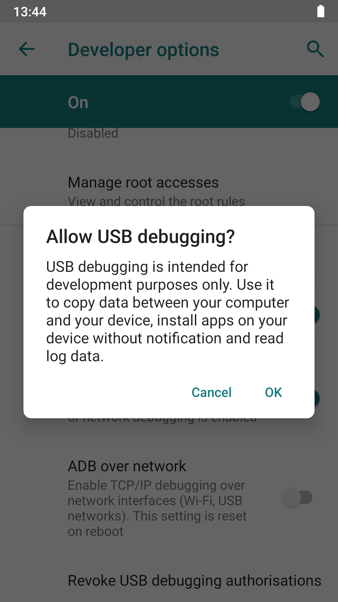

# Setup

*Getting Appium running means three separate pieces working together: the Appium server, a platform driver installed on top of it, and a capabilities object that tells a session which device to attach to.*

> `npm install -g appium` finishes without error, the terminal prints a friendly startup banner, and the
> first test still refuses to start a session. Nothing is actually broken — the server is only one of three
> pieces that all have to be in place before a device ever receives a command.

> **In real life**
>
> Getting Appium running is like opening a call center. Installing the server builds the building and wires
> the phone lines, but no call can be routed yet. Installing a platform driver hires an agent who actually
> speaks the customer's language — one agent for Android, a completely different one for iOS. The
> capabilities object is the intake form a caller fills out before being connected: which language, which
> specific desk, which product they're calling about. Skip any one of the three and the call never connects,
> even though the building is standing and the lights are on.

**Setup**: Setup, in an Appium context, is the process of getting three independent pieces in place before any test can run: the Appium server itself, a platform-specific driver installed on top of that server, and a capabilities object that tells a session which driver, app, and device to use.

## Three pieces, not one install

The Appium server is a thin router: `npm install -g appium` installs it, and running `appium` starts it
listening for WebDriver-protocol sessions on a local port. On its own, a freshly installed server has no
platform drivers attached to it — it can accept a connection but cannot yet do anything with it.

A platform driver is installed separately, on top of the server: `appium driver install uiautomator2` for
Android, `appium driver install xcuitest` for iOS. This is Appium 2's biggest structural change from
Appium 1 — drivers version independently from the core server, so upgrading one does not force upgrading
the other. Each driver brings its own additional prerequisites: UiAutomator2 needs the Android SDK platform
tools and a `JAVA_HOME`/`ANDROID_HOME` environment set up correctly; XCUITest needs a macOS host with Xcode
and, for a real device, a valid developer signing setup.

The capabilities object is what a test sends when it starts a session — a set of key/value pairs naming the
platform, the driver, the target device, and the app under test. Appium 2 requires vendor-specific
capabilities to carry an `appium:` prefix (for example `appium:automationName`, `appium:deviceName`,
`appium:app`), while a small set of W3C-standard keys like `platformName` do not. A session with a missing
or misspelled required capability fails before a single command ever reaches a device — which is why
capability mistakes are the most common reason a first Appium session refuses to start.

## Real device or emulator/simulator — same driver, different capabilities

UiAutomator2 and XCUITest both work identically whether the target is a real, physically connected device or
a virtual one (an Android emulator or an iOS simulator). What differs is which capabilities point at which
target. An Android emulator that Appium is allowed to launch itself typically just needs `appium:deviceName`
naming the AVD; a specific already-running real device needs `appium:udid` naming its exact device id, found
with `adb devices`. On a real Android device, USB debugging has to be enabled in Developer options and the
host machine's ADB connection explicitly authorized on the device the first time it connects — a step that
has no equivalent for an emulator, which trusts the host machine that created it by default.

> **Tip**
>
> Verify each layer independently before blaming a test: `appium driver list --installed` confirms the
> driver is actually installed, `adb devices` confirms a real Android device is visible and authorized, and
> `xcrun simctl list` confirms which iOS simulators exist. A session failure is much faster to diagnose once
> you know which of the three layers is actually missing.

> **Common mistake**
>
> Do not assume a capability name from Appium 1 tutorials still works unprefixed in Appium 2. Vendor-specific
> capabilities need the `appium:` prefix now — `deviceName` alone is silently ignored by a modern server,
> while `appium:deviceName` is read correctly, and the resulting failure looks like a device problem rather
> than the capability-naming mistake it actually is.


*Android Debug Bridge allow — PhotographyEdits, Wikimedia Commons, CC BY-SA 4.0. [Source](https://commons.wikimedia.org/wiki/File:Android_Debug_Bridge_allow.png)*
- **Developer options, unlocked** — This screen only becomes reachable after enabling Developer options — the starting point for every real-device Appium setup guide on Android.
- **USB debugging switched on** — Without this toggle, adb devices never lists the phone at all, and the UiAutomator2 driver has no device to attach a session to.
- **The one-time authorization dialog** — The first time a specific host computer's ADB connects to this device, Android shows this prompt. It must be accepted before a session naming this device's udid will connect.
- **OK, not Cancel** — Tapping Cancel here is a common silent setup failure — the device still shows as physically connected, but every Appium session against it times out waiting for the ADB handshake.

**Getting from a blank machine to a startable session**

1. **Install and start the Appium server** — npm install -g appium, then run appium — a router with no drivers attached yet.
2. **Install a platform driver** — appium driver install uiautomator2 for Android, or xcuitest for iOS — each with its own SDK prerequisites.
3. **Prepare the target device** — Boot an emulator/simulator, or enable and authorize USB debugging on a real device.
4. **Send a capabilities object naming all of it** — platformName, appium:automationName, appium:deviceName, appium:app, and appium:udid for a specific real device.

*A capabilities readiness check (Python)*

```python
capability_sets = [
    {"name": "android_real_device", "platformName": "Android", "appium:automationName": "UiAutomator2", "appium:deviceName": "Pixel8", "appium:udid": "R3CN9026XYZ", "appium:app": "/apps/shop-debug.apk"},
    {"name": "android_emulator", "platformName": "Android", "appium:automationName": "UiAutomator2", "appium:deviceName": "Pixel_8_API_34", "appium:app": "/apps/shop-debug.apk"},
    {"name": "ios_simulator_missing_app", "platformName": "iOS", "appium:automationName": "XCUITest", "appium:deviceName": "iPhone 15"},
]

required_always = ["platformName", "appium:automationName", "appium:deviceName", "appium:app"]

ready_count = 0
for caps in capability_sets:
    missing = [k for k in required_always if k not in caps]
    target = "REAL_DEVICE" if "appium:udid" in caps else "EMULATOR_OR_SIMULATOR"
    status = "READY" if not missing else "MISSING:" + ",".join(missing)
    if not missing:
        ready_count += 1
    print(caps["name"] + "=" + target + " " + status)

print("READY_SESSIONS=" + str(ready_count))
result = "PASS" if ready_count == 2 else "FAIL"
assert result == "PASS", "expected exactly 2 capability sets ready to start a session"
print("RESULT=" + result)
```

*A capabilities readiness check (Java)*

```java
import java.util.ArrayList;
import java.util.LinkedHashMap;
import java.util.List;
import java.util.Map;

public class Main {
    public static void main(String[] args) {
        List<Map<String, String>> capabilitySets = new ArrayList<>();

        Map<String, String> androidReal = new LinkedHashMap<>();
        androidReal.put("name", "android_real_device");
        androidReal.put("platformName", "Android");
        androidReal.put("appium:automationName", "UiAutomator2");
        androidReal.put("appium:deviceName", "Pixel8");
        androidReal.put("appium:udid", "R3CN9026XYZ");
        androidReal.put("appium:app", "/apps/shop-debug.apk");
        capabilitySets.add(androidReal);

        Map<String, String> androidEmulator = new LinkedHashMap<>();
        androidEmulator.put("name", "android_emulator");
        androidEmulator.put("platformName", "Android");
        androidEmulator.put("appium:automationName", "UiAutomator2");
        androidEmulator.put("appium:deviceName", "Pixel_8_API_34");
        androidEmulator.put("appium:app", "/apps/shop-debug.apk");
        capabilitySets.add(androidEmulator);

        Map<String, String> iosMissingApp = new LinkedHashMap<>();
        iosMissingApp.put("name", "ios_simulator_missing_app");
        iosMissingApp.put("platformName", "iOS");
        iosMissingApp.put("appium:automationName", "XCUITest");
        iosMissingApp.put("appium:deviceName", "iPhone 15");
        capabilitySets.add(iosMissingApp);

        String[] requiredAlways = {"platformName", "appium:automationName", "appium:deviceName", "appium:app"};

        int readyCount = 0;
        for (Map<String, String> caps : capabilitySets) {
            StringBuilder missing = new StringBuilder();
            for (String key : requiredAlways) {
                if (!caps.containsKey(key)) {
                    if (missing.length() > 0) missing.append(",");
                    missing.append(key);
                }
            }
            String target = caps.containsKey("appium:udid") ? "REAL_DEVICE" : "EMULATOR_OR_SIMULATOR";
            String status = missing.length() == 0 ? "READY" : "MISSING:" + missing;
            if (missing.length() == 0) readyCount++;
            System.out.println(caps.get("name") + "=" + target + " " + status);
        }

        System.out.println("READY_SESSIONS=" + readyCount);
        String result = readyCount == 2 ? "PASS" : "FAIL";
        if (!result.equals("PASS")) throw new AssertionError("expected exactly 2 capability sets ready to start a session");
        System.out.println("RESULT=" + result);
    }
}
```

### Your first time: Set up Appium for one platform end to end

- [ ] Install and start the server — npm install -g appium, then run appium and confirm the startup banner shows a listening port.
- [ ] Install the platform driver — appium driver install uiautomator2 or xcuitest, then confirm with appium driver list --installed.
- [ ] Prepare exactly one target device — Boot an emulator/simulator, or enable and authorize USB debugging on a real device — confirm it's visible with adb devices or xcrun simctl list.
- [ ] Write a minimal capabilities object — platformName, appium:automationName, appium:deviceName, appium:app, and appium:udid if it's a specific real device.

- **The server starts, but a session request fails with an unknown or unsupported automationName.**
  The matching driver isn't installed. Run appium driver list --installed and install the missing one before retrying.
- **adb devices shows the phone as unauthorized instead of device.**
  The one-time USB-debugging authorization dialog was never accepted on the phone, or was declined. Reconnect the cable and accept the prompt.
- **A session starts against an emulator instead of the real device that's plugged in.**
  appium:udid was omitted, so the driver picked the first available target instead of the specific device intended — add the exact udid from adb devices.
- **A capability that worked in an old Appium 1 tutorial is silently ignored.**
  Appium 2 requires the appium: prefix on vendor-specific capabilities — deviceName alone is ignored where appium:deviceName is read correctly.

### Where to check

- `appium driver list --installed` to confirm which platform drivers are actually available to the server.
- `adb devices` for Android device visibility and authorization state; `xcrun simctl list` for iOS simulators.
- The Appium documentation's capabilities reference for the current required and optional keys.
- [[mobile-testing/appium-intro/what-appium-is]] for why the server, driver, and capabilities are three separate concerns in the first place.
- [[mobile-testing/appium-intro/first-mobile-test]] for what happens once a session actually starts.
- [[mobile-testing/device-and-os-matrix/real-vs-emulated]] for the tradeoffs between testing on a real device versus an emulator or simulator.

### Worked example: a new teammate's first session that refuses to start

1. A new teammate installs the Appium server, sees the startup banner, and writes a test with `platformName`
   and `deviceName` (no prefix) copied from an old tutorial.
2. The session request fails; the server has no driver attached to it because `appium driver install
   uiautomator2` was never run.
3. After installing the driver, the session fails again — this time because `deviceName` without the
   `appium:` prefix is silently ignored by the Appium 2 server, leaving no device target specified.
4. Correcting it to `appium:deviceName` and confirming the emulator is already running, the session starts
   on the first try.

**Quiz.** A session fails immediately after the Appium server starts successfully. What is the most likely first thing to check?

- [x] Whether the matching platform driver is actually installed, since a running server has no drivers attached by default
- [ ] Whether the test framework's assertion library is installed correctly
- [ ] Whether the app under test has a valid app icon
- [ ] Whether the internet connection is fast enough

*The Appium server is only a router. A freshly started server has no platform driver attached until one is installed separately, which is the most common reason a session fails right after a clean install.*

- **The three pieces of Appium setup** — The Appium server, a platform driver installed on top of it (UiAutomator2 or XCUITest), and a capabilities object naming the session's target.
- **appium: prefix** — Appium 2 requires vendor-specific capabilities like automationName and deviceName to carry an appium: prefix — the unprefixed Appium 1 form is silently ignored.
- **Real device vs emulator/simulator capability difference** — A real device typically needs appium:udid naming its exact id; an emulator/simulator Appium can launch itself often just needs appium:deviceName.
- **USB debugging authorization** — The first time a specific host computer's ADB connects to a real Android device, the device shows a one-time Allow USB debugging? dialog that must be accepted.

### Challenge

On a machine you control, run appium driver list --installed and adb devices (or xcrun simctl list), and write down exactly which of the three setup layers — server, driver, or device — would block a session from starting right now.

- [Appium Documentation — Install the UiAutomator2 Driver](https://appium.io/docs/en/2.0/quickstart/uiauto2-driver/)
- [Appium Documentation — Capabilities](https://appium.io/docs/en/2.0/guides/caps/)
- [Appium Beginner Tutorial 3 — How to Install Appium on Windows](https://www.youtube.com/watch?v=x-hBpgM5je8)

🎬 [Appium Beginner Tutorial 3 — How to Install Appium on Windows](https://www.youtube.com/watch?v=x-hBpgM5je8) (20 min)

- Appium setup is three independent pieces: the server, a platform driver installed on top of it, and a capabilities object.
- UiAutomator2 (Android) and XCUITest (iOS) are installed separately from the core server and version independently, since Appium 2.
- Vendor-specific capabilities need the appium: prefix in Appium 2 — the unprefixed Appium 1 form is silently ignored.
- A real device needs USB debugging enabled and the host computer's connection explicitly authorized once; an emulator or simulator trusts its host by default.


## Related notes

- [[Notes/mobile-testing/appium-intro/what-appium-is|What Appium is]]
- [[Notes/mobile-testing/appium-intro/first-mobile-test|First mobile test]]
- [[Notes/mobile-testing/device-and-os-matrix/real-vs-emulated|Real vs emulated]]


---
_Source: `packages/curriculum/content/notes/mobile-testing/appium-intro/setup.mdx`_
