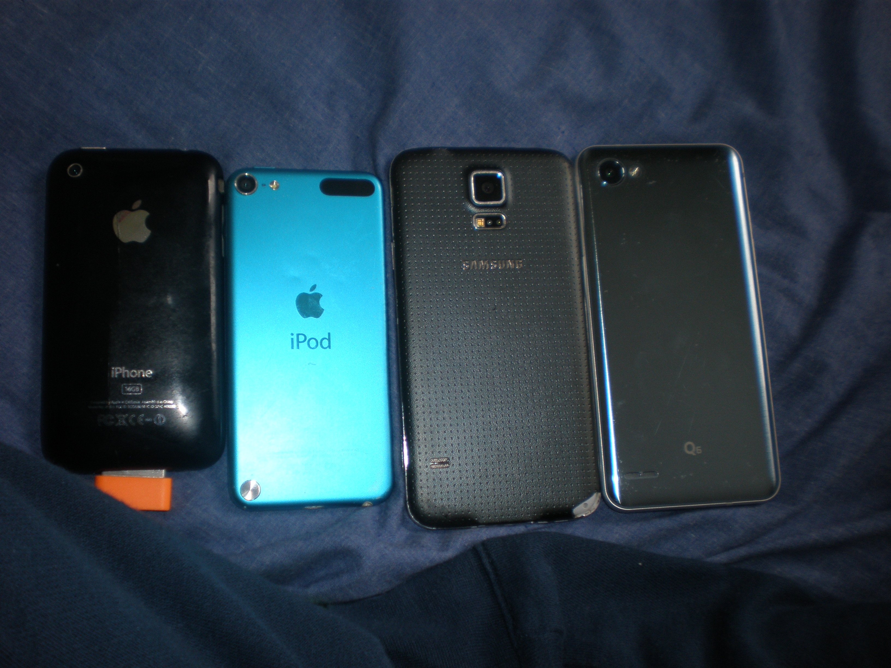

# Real vs emulated

*What Android emulators and the iOS Simulator get right for fast early testing, what only a physical device can catch, and the real technical difference between an emulator and a simulator.*

> A build that runs perfectly on a virtual device on a developer's laptop can still overheat, drop frames,
> or misread a fingerprint the first time it lands on a physical phone in someone's hand. The virtual device
> never lied — it just was never asked the questions only real hardware can answer.

> **In real life**
>
> A flight simulator is genuinely excellent training: cheap to run, safe to repeat, and able to rehearse
> procedures a real cockpit couldn't safely reproduce on demand. But no airline hands a pilot their wings
> from simulator hours alone. A real aircraft has real turbulence, real engine vibration, real fuel weight
> shifting in the tanks, real consequences for a mistake — sensations and failure modes a simulator can
> approximate but never fully replicate. Mobile testing runs the same trade: rehearse fast and cheap in a
> simulator, then confirm on the aircraft your passengers actually fly.

**Real vs emulated testing**: A real device is the physical hardware a user actually holds. An Android emulator virtualizes an entire device, including its CPU architecture, letting it run unmodified Android system images. An iOS Simulator runs app code compiled natively for the host Mac and reproduces iOS's software frameworks, but it does not emulate ARM hardware the way the Android emulator does — simulator and emulator are related ideas, not interchangeable words.

## Two different machines, not two names for one thing

The Android emulator is a true emulator: it virtualizes device hardware, including CPU instructions, so it
can boot a real Android system image much as physical hardware would, at a real (if sometimes slower)
performance cost. The iOS Simulator is not an emulator in that sense — it runs your app's own code
compiled for the Mac's processor and layers in iOS's UI and system frameworks, which is why it starts fast
but cannot reproduce true device-level behavior for anything below the framework layer. Knowing which one
you're using changes what a passing result actually proves.

Both are excellent for early, fast iteration: layout checks, basic navigation, core logic, and quick visual
review, all without needing a physical unit on a desk. What neither reliably reproduces is real sensor
input, camera and biometric hardware, actual cellular handoff between towers, thermal throttling under
sustained load, real battery drain, or the specific behavior of an OEM's own skin running on its own
silicon. Those only show up on the device a user would actually carry.

> **Tip**
>
> Treat a simulator or emulator pass as evidence for logic and layout, and a real-device pass as evidence for
> everything physical: touch latency, camera and sensor behavior, thermal and battery behavior, and true
> network handoff. Neither one substitutes for the other's evidence.

> **Common mistake**
>
> Do not sign off a release on simulator or emulator results alone because "it behaves the same." Camera,
> biometrics, real GPS fixes, carrier switching, and thermal throttling are exactly the categories most
> likely to look fine virtually and fail physically.


*Various Smartphones 2020 (Backs) — Rowanswiki, Wikimedia Commons, CC0. [Source](https://commons.wikimedia.org/wiki/File:Various_Smartphones_2020_(Backs).jpg)*
- **Real, aging hardware** — An iPhone 3GS this old carries real battery wear, a real camera sensor, and real thermal behavior no simulator profile reproduces.
- **Physical wear is data** — Scuffs, a worn charging port, a battery that no longer holds charge the way it did new — evidence only a physical unit accumulates.
- **A real camera module** — The visible lens and flash are real optics and a real sensor — an emulator can fake a camera feed but not this hardware's actual image quality or focus behavior.
- **A different OEM again** — The LG Q6's camera placement and body differ again — each physical unit has its own real sensors, materials, and thermal mass.

**Where each kind of testing earns its keep**

1. **Simulator or emulator first** — Fast, cheap iteration on layout, navigation, and core logic during active development.
2. **Flag anything hardware-dependent** — Camera, biometrics, GPS, cellular, thermal, and battery behavior get marked for real-device confirmation.
3. **Confirm on real, representative devices** — Run the flagged checks on physical hardware from the risk-based matrix, not just whichever device is on the desk.
4. **Only then call it verified** — A feature is confirmed once both virtual and physical evidence agree, not after the faster check alone.

*An emulator-vs-real-device capability comparator (Python)*

```python
capabilities = {
    "basic_ui_layout": {"emulator": True, "real_device": True},
    "app_logic": {"emulator": True, "real_device": True},
    "gps_and_location": {"emulator": True, "real_device": True},
    "camera_and_sensors": {"emulator": False, "real_device": True},
    "biometric_auth": {"emulator": False, "real_device": True},
    "thermal_and_battery": {"emulator": False, "real_device": True},
    "carrier_and_network_switch": {"emulator": False, "real_device": True},
    "oem_skin_behavior": {"emulator": False, "real_device": True},
}
emulator_gaps = 0
for name, support in capabilities.items():
    gap = support["real_device"] and not support["emulator"]
    if gap:
        emulator_gaps += 1
    status = "GAP" if gap else "OK"
    print(name + "=" + status)
print("EMULATOR_GAPS=" + str(emulator_gaps))
result = "PASS" if emulator_gaps == 5 else "FAIL"
assert result == "PASS", "unexpected number of emulator coverage gaps"
print("RESULT=" + result)
```

*An emulator-vs-real-device capability comparator (Java)*

```java
public class Main {
    public static void main(String[] args) {
        String[] names = {
            "basic_ui_layout", "app_logic", "gps_and_location",
            "camera_and_sensors", "biometric_auth", "thermal_and_battery",
            "carrier_and_network_switch", "oem_skin_behavior"
        };
        boolean[] emulatorSupport = {true, true, true, false, false, false, false, false};
        boolean[] realDeviceSupport = {true, true, true, true, true, true, true, true};

        int emulatorGaps = 0;
        for (int i = 0; i < names.length; i++) {
            boolean gap = realDeviceSupport[i] && !emulatorSupport[i];
            if (gap) emulatorGaps++;
            String status = gap ? "GAP" : "OK";
            System.out.println(names[i] + "=" + status);
        }
        System.out.println("EMULATOR_GAPS=" + emulatorGaps);
        String result = emulatorGaps == 5 ? "PASS" : "FAIL";
        if (!result.equals("PASS")) throw new AssertionError("unexpected number of emulator coverage gaps");
        System.out.println("RESULT=" + result);
    }
}
```

### Your first time: Confirm one feature both ways

- [ ] Run the feature in a simulator or emulator — Confirm layout, navigation, and core logic quickly and cheaply first.
- [ ] List what the feature actually touches — Camera, sensors, biometrics, GPS, cellular, or sustained load are the hardware-dependent flags.
- [ ] Run the same feature on a real, representative device — Pick a device from the risk-based matrix, not just whatever is on the desk.
- [ ] Compare the two results — Treat any mismatch as a real finding — the physical result is the one a user will actually experience.

- **Camera or biometric flow works in the simulator but fails on device.**
  Expected — neither the emulator nor the simulator reliably reproduces real camera optics or biometric sensors; treat the device result as ground truth.
- **Performance looks fine virtually but the app stutters on a real phone.**
  Check for thermal throttling and real memory pressure; virtual environments rarely reproduce sustained-load behavior on budget hardware.
- **A team assumes 'simulator' and 'emulator' mean the same thing.**
  Clarify which is in use — the Android emulator virtualizes hardware, the iOS Simulator runs native Mac code against iOS frameworks; the distinction changes what a pass actually proves.

### Where to check

- Android Studio's emulator console and AVD hardware profiles for what is and isn't virtualized.
- Xcode's Simulator device list and its documented limitations versus a physical device.
- Crash and performance reports segmented by real device model versus simulator or emulator origin.
- [[mobile-testing/device-and-os-matrix/device-farms]] for reaching real physical devices at scale without owning them.

### Worked example: a biometric login that only failed on hardware

1. A fingerprint-login flow passes repeatedly on the Android emulator using its simulated fingerprint
   sensor.
2. On a real device, the same flow intermittently fails when the sensor reads a partial or angled touch.
3. The tester confirms the emulator's simulated sensor cannot reproduce partial-print behavior at all.
4. The team adds a real-device retry-and-fallback path and re-tests specifically on physical hardware from
   the matrix before release.

**Quiz.** Which statement accurately distinguishes the Android emulator from the iOS Simulator?

- [ ] They are two names for the exact same technology
- [x] The Android emulator virtualizes device hardware including CPU architecture, while the iOS Simulator runs app code natively on the Mac and simulates iOS's software frameworks
- [ ] The iOS Simulator virtualizes ARM hardware and the Android emulator does not
- [ ] Neither one can be used for any testing before a real device is available

*The Android emulator is a true hardware emulator; the iOS Simulator runs natively compiled code against simulated OS frameworks rather than emulating device hardware — a real technical difference.*

- **What only a real device catches** — Real camera and sensor behavior, biometrics, true cellular handoff, thermal throttling, and actual battery drain.
- **Emulator vs simulator** — Android's emulator virtualizes hardware including CPU architecture; iOS's Simulator runs native Mac code against simulated iOS frameworks — not the same mechanism.
- **Best use of virtual testing** — Fast, cheap iteration on layout, navigation, and core logic early in development, confirmed later on real hardware.

### Challenge

Pick one feature that touches a sensor or biometric hardware, run it in a simulator or emulator, then on a real device, and write down exactly where the two results diverge.

- [Android Developers — Run Apps on the Android Emulator](https://developer.android.com/studio/run/emulator)
- [Apple Developer — Running Your App in Simulator or on a Device](https://developer.apple.com/documentation/xcode/running-your-app-in-simulator-or-on-a-device)
- [Real Devices versus Emulators/Simulators (Mobile Testing, Part 15)](https://www.youtube.com/watch?v=i9_U0DE5F9c)

🎬 [Real Devices versus Emulators/Simulators (Mobile Testing, Part 15)](https://www.youtube.com/watch?v=i9_U0DE5F9c) (11 min)

- The Android emulator virtualizes hardware; the iOS Simulator runs native Mac code against simulated frameworks — related but different mechanisms.
- Both are excellent for fast, cheap iteration on layout, navigation, and core logic.
- Only real hardware reliably shows camera and sensor behavior, biometrics, thermal throttling, and true battery and network behavior.
- Treat a virtual pass as partial evidence, and confirm anything hardware-dependent on a real, representative device.


## Related notes

- [[Notes/mobile-testing/device-and-os-matrix/fragmentation|Fragmentation]]
- [[Notes/mobile-testing/device-and-os-matrix/building-a-matrix|Building a matrix]]
- [[Notes/mobile-testing/device-and-os-matrix/device-farms|Device farms]]


---
_Source: `packages/curriculum/content/notes/mobile-testing/device-and-os-matrix/real-vs-emulated.mdx`_
