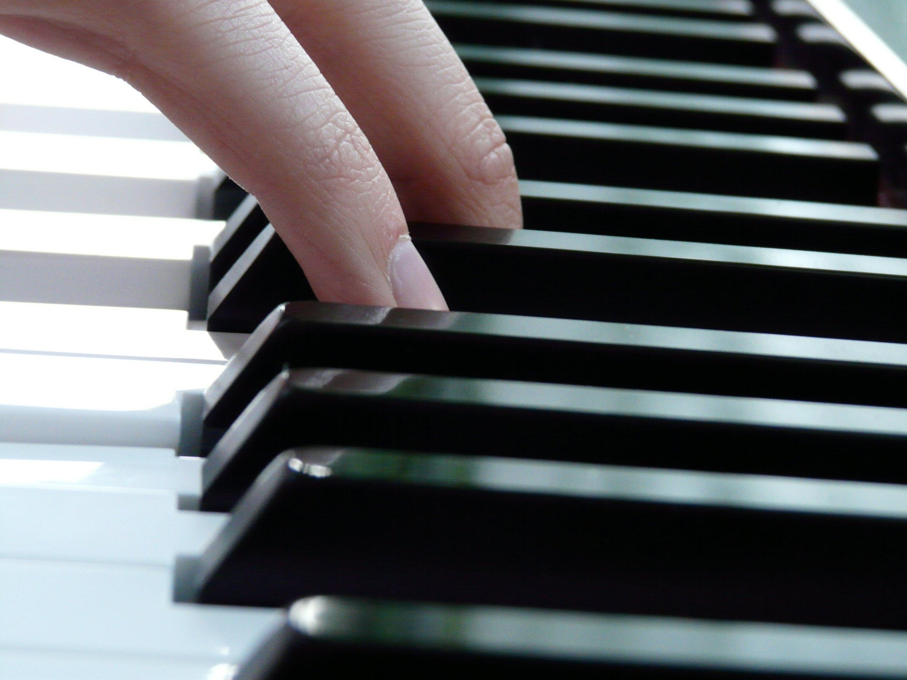

# Touch gestures

*How tap, long-press, double-tap, swipe, pinch, and drag turn the same screen element into several different commands, and where gesture-driven interaction breaks against scroll boundaries, dismiss logic, and the OS's own system gestures.*

> On a desktop, a click is a click. On a phone, touching the exact same pixel can mean four different
> things depending on how long the finger stays down, how many fingers land at once, and whether the
> contact turns into a drag before it lifts. A mobile app doesn't get one input channel — it gets a whole
> vocabulary, and every word in that vocabulary can be mistyped.

> **In real life**
>
> A piano key is a single physical object, but it never produces just one result. Strike it briefly and it
> sounds a short note; hold it down and the note sustains; press two keys together and you get a chord,
> not two separate notes layered by accident. The keyboard has to tell the difference between a light touch
> and full weight, a tap and a hold, one finger and two, and it has to do that reliably or the music comes
> out wrong. A touchscreen is asked to do exactly the same job with a fingertip instead of a hammer and
> string.

**A gesture**: A gesture is an interaction defined not just by where a finger touches the screen, but by how — duration, number of simultaneous contact points, and motion between touch-down and touch-up. The same coordinate can trigger a tap, a long-press, a double-tap, a swipe, a pinch, or a drag depending entirely on that manner of contact, and mobile testing has to verify each one separately.

## The same element, several different commands

A single list row is routinely wired to three or four distinct gestures at once: a tap opens the item, a
long-press opens a context menu, a swipe reveals a delete or archive action, and a drag-and-drop reorders
it in the list. None of these are variations on "touching the row" — each is a separate code path with its
own trigger condition, and each has to be tested as its own case rather than assumed to work because the
others do. Pinch-to-zoom on an image adds a second dimension entirely: two simultaneous contact points
whose distance apart, not their individual positions, is the actual signal being read.

The trigger conditions themselves are also configurable and easy to get wrong. A long-press that fires
after 400ms feels different from one that fires after 900ms, and a swipe-to-delete that activates after
20px of horizontal movement is far more forgiving than one that activates after 80px. Testing a gesture
means testing its threshold, not just its happy path — what happens at 15px, at 25px, at the exact
boundary the app claims to use.

## Where gestures fight the OS, and where they fight each other

Every mobile OS reserves some of its own gestures — Android's edge-swipe-back and notification-shade pull,
iOS's edge-swipe-back and Control Center pull. Any app gesture that starts near those same edges is
competing with a system-level gesture the app cannot override cleanly, and the two commonly conflict: a
horizontal swipe meant to reveal a delete action near the left edge of a list can instead trigger the OS's
back navigation, silently swallowing the app's own gesture. This is a distinct bug category from a gesture
simply not firing — the gesture fires, just to the wrong handler.

The other common failure is a gesture with no dismiss path. A long-press menu that opens easily but has no
tap-outside-to-close, no back-button handling, and no swipe-away leaves a user stuck until they find the
one specific action the developer intended as the exit.

> **Tip**
>
> Test every gesture at its threshold, not just comfortably past it. A swipe-to-delete that needs 30px of
> motion should be tried at 25px (should not trigger), exactly 30px (should trigger), and near a screen edge
> (should not lose to a system gesture) — three separate findings hiding inside what looks like one feature.

> **Common mistake**
>
> Do not test a swipe gesture only in the center of a comfortably large screen. The same swipe implemented
> identically will behave differently near a scroll boundary, near an edge reserved by the OS for its own
> gesture, or on a smaller screen where there is less safe distance between the two.


*Piano keys and fingers — Hans Braxmeier, Wikimedia Commons, CC0. [Source](https://commons.wikimedia.org/wiki/File:Piano_keys_by_Hans_Braxmeier.jpg)*
- **Two fingers, two contact points** — Multi-touch input in its simplest form: two simultaneous points that must be tracked independently, the same mechanism behind pinch-to-zoom or a two-finger scroll.
- **Full weight, held down** — How firmly and how long a key is pressed changes what note comes out — the same key can sustain a note or barely sound one, just like a tap versus a long-press on the same UI element.
- **Narrow black keys packed close together** — Small, closely spaced targets are exactly where an accidental touch lands on the wrong one — the mobile equivalent of two tappable elements sitting too close together.
- **Wider white keys, easier to strike cleanly** — A bigger target is more forgiving of an imprecise touch — the same reasoning behind a minimum recommended tap-target size.

**Verifying one gesture-driven element**

1. **List every gesture wired to the element** — Tap, long-press, double-tap, swipe, drag — name each one instead of assuming a single test covers the row.
2. **Test each gesture at its threshold** — Just under, exactly at, and just past the duration or distance that triggers it.
3. **Check for OS gesture conflicts near edges** — Anything starting near a screen edge competes with the platform's own back-swipe or shade-pull gesture.
4. **Confirm a dismiss path exists** — A long-press menu or swipe reveal needs a clear way out — tap-outside, back button, or re-swipe — not just a way in.

*A gesture-conflict-zone detector (Python)*

```python
edge_zone_dp = 24
screen_width_dp = 400

def classify_duration(ms):
    if ms < 150:
        return "tap"
    if ms >= 500:
        return "long_press"
    return "ambiguous"

gestures = [
    {"name": "swipe_delete_row3", "start_x": 120, "duration_ms": 180},
    {"name": "swipe_back_from_edge", "start_x": 10, "duration_ms": 220},
    {"name": "long_press_menu", "start_x": 200, "duration_ms": 650},
    {"name": "tap_open_item", "start_x": 200, "duration_ms": 90},
    {"name": "double_tap_zoom", "start_x": 300, "duration_ms": 140},
    {"name": "swipe_near_right_edge", "start_x": 385, "duration_ms": 200},
]

conflict_count = 0
for g in gestures:
    in_edge_zone = g["start_x"] < edge_zone_dp or g["start_x"] > screen_width_dp - edge_zone_dp
    gesture_type = classify_duration(g["duration_ms"])
    verdict = "OS_GESTURE_CONFLICT" if in_edge_zone else "APP_OWNS_GESTURE"
    if in_edge_zone:
        conflict_count += 1
    print(g["name"] + "=" + gesture_type.upper() + " (" + verdict + ")")

print("TOTAL_GESTURES=" + str(len(gestures)))
print("EDGE_ZONE_CONFLICTS=" + str(conflict_count))
result = "PASS" if conflict_count == 2 else "FAIL"
assert result == "PASS", "expected exactly 2 edge-zone conflicts in this fixture"
print("RESULT=" + result)
```

*A gesture-conflict-zone detector (Java)*

```java
public class Main {
    static String classifyDuration(int ms) {
        if (ms < 150) return "tap";
        if (ms >= 500) return "long_press";
        return "ambiguous";
    }

    public static void main(String[] args) {
        int edgeZoneDp = 24;
        int screenWidthDp = 400;

        String[] names = {"swipe_delete_row3", "swipe_back_from_edge", "long_press_menu", "tap_open_item", "double_tap_zoom", "swipe_near_right_edge"};
        int[] startX = {120, 10, 200, 200, 300, 385};
        int[] durationMs = {180, 220, 650, 90, 140, 200};

        int conflictCount = 0;
        for (int i = 0; i < names.length; i++) {
            boolean inEdgeZone = startX[i] < edgeZoneDp || startX[i] > screenWidthDp - edgeZoneDp;
            String gestureType = classifyDuration(durationMs[i]);
            String verdict = inEdgeZone ? "OS_GESTURE_CONFLICT" : "APP_OWNS_GESTURE";
            if (inEdgeZone) conflictCount++;
            System.out.println(names[i] + "=" + gestureType.toUpperCase() + " (" + verdict + ")");
        }

        System.out.println("TOTAL_GESTURES=" + names.length);
        System.out.println("EDGE_ZONE_CONFLICTS=" + conflictCount);
        String result = conflictCount == 2 ? "PASS" : "FAIL";
        if (!result.equals("PASS")) throw new AssertionError("expected exactly 2 edge-zone conflicts in this fixture");
        System.out.println("RESULT=" + result);
    }
}
```

### Your first time: Audit one gesture-driven screen

- [ ] List every gesture wired to one element — Tap, long-press, double-tap, swipe, drag — write each one down as its own test case.
- [ ] Find each gesture's trigger threshold — Duration in milliseconds for a long-press, distance in pixels for a swipe — ask the developer if it isn't obvious.
- [ ] Test just under, at, and just past the threshold — The boundary is where gesture bugs concentrate, not the comfortable middle of the range.
- [ ] Check edges and dismiss paths specifically — Anything near a screen edge risks an OS gesture conflict; anything that opens a menu or overlay needs a confirmed way to close it.

- **A swipe-to-delete fires when the user was just scrolling.**
  The trigger threshold is too low relative to normal scroll motion; increase the distance or angle required before the swipe commits.
- **A long-press menu opens but nothing closes it.**
  Missing dismiss path — add tap-outside-to-close, back-button handling, and a re-press or swipe-away option.
- **A swipe near the screen edge triggers OS back navigation instead of the app's gesture.**
  The gesture's active zone overlaps the platform's reserved edge-swipe area; move the trigger zone inward or use the platform API meant to negotiate priority with system gestures.
- **Pinch-to-zoom feels unresponsive or jumps unexpectedly.**
  Check that both contact points are tracked independently frame to frame rather than only the most recent single touch, which is a common multi-touch implementation bug.

### Where to check

- The design spec or ticket for each gesture's exact trigger threshold, in milliseconds or pixels.
- Platform documentation for reserved system gesture zones (Android edge-swipe-back, iOS Control Center pull).
- Session recordings or replay tools that show real touch-down and touch-up coordinates, not just tap events.
- [[mobile-testing/gestures-interrupts-networks/interrupts]] for what happens when a gesture is interrupted mid-motion by an incoming call or notification.
- [[mobile-testing/gestures-interrupts-networks/orientation]] for how the same gesture zones shift when the layout rotates.
- [[mobile-testing/device-and-os-matrix/fragmentation]] for why gesture thresholds tuned on one OEM skin may not hold on another.

### Worked example: a swipe-to-delete that ate a back-navigation

1. A list screen adds swipe-to-delete on each row, triggered by 25px of leftward motion anywhere on the row.
2. On devices with edge-swipe-back enabled, swiping to delete a row near the left edge of the screen
   instead navigates the user back a full screen.
3. The tester reproduces it specifically at the left edge and confirms it does not happen for the same
   swipe started from the row's center.
4. The team narrows the swipe-to-delete's active zone to exclude the outer 24dp the OS reserves for its
   own back gesture, and re-tests at that new boundary.

**Quiz.** A list row supports tap, long-press, and swipe. What is the correct testing approach?

- [ ] Test the tap gesture only, since the others are variations of the same touch
- [x] Test each gesture as its own case, including its exact trigger threshold and any conflict with OS-reserved gesture zones
- [ ] Test all three gestures together in a single combined test case
- [ ] Skip gesture testing entirely if the tap gesture works correctly

*Each gesture is a separate trigger condition and code path. Treating them as one test case, or assuming the working tap gesture proves the others, misses threshold and OS-conflict bugs specific to each.*

- **Why gesture testing needs threshold checks** — The same gesture can fail to trigger just under its threshold or trigger unintentionally just past it; the boundary is where bugs concentrate, not the comfortable middle.
- **Gesture-OS conflict** — An app gesture starting near a screen edge can be intercepted by the platform's own reserved gesture (like edge-swipe-back), silently swallowing the app's intended action.
- **Dismiss path** — Any gesture that opens a menu or overlay (like long-press) needs a confirmed, tested way to close it again — tap-outside, back button, or re-trigger.

### Challenge

Pick one screen with at least two different gestures on the same element, and write down each gesture's exact trigger threshold and what happens 5-10 units just under and just over it.

- [Android Developers — Detect Common Gestures](https://developer.android.com/develop/ui/views/touch-and-input/gestures)
- [Apple Human Interface Guidelines — Gestures](https://developer.apple.com/design/human-interface-guidelines/gestures)
- [Testing Touch Gestures on Mobile Apps](https://www.youtube.com/watch?v=Z5W2ZoR3nWs)

🎬 [Testing Touch Gestures on Mobile Apps](https://www.youtube.com/watch?v=Z5W2ZoR3nWs) (7 min)

- The same screen element can be wired to tap, long-press, double-tap, swipe, and drag, each its own test case.
- Gesture bugs concentrate at the trigger threshold — test just under, at, and just past it, not just the comfortable middle.
- A gesture starting near a screen edge risks losing to the OS's own reserved gesture, like edge-swipe-back.
- Any gesture that opens a menu or overlay needs a verified, tested way to dismiss it again.


## Related notes

- [[Notes/mobile-testing/gestures-interrupts-networks/interrupts|Interrupts]]
- [[Notes/mobile-testing/gestures-interrupts-networks/orientation|Orientation]]
- [[Notes/mobile-testing/device-and-os-matrix/fragmentation|Fragmentation]]


---
_Source: `packages/curriculum/content/notes/mobile-testing/gestures-interrupts-networks/touch-gestures.mdx`_
