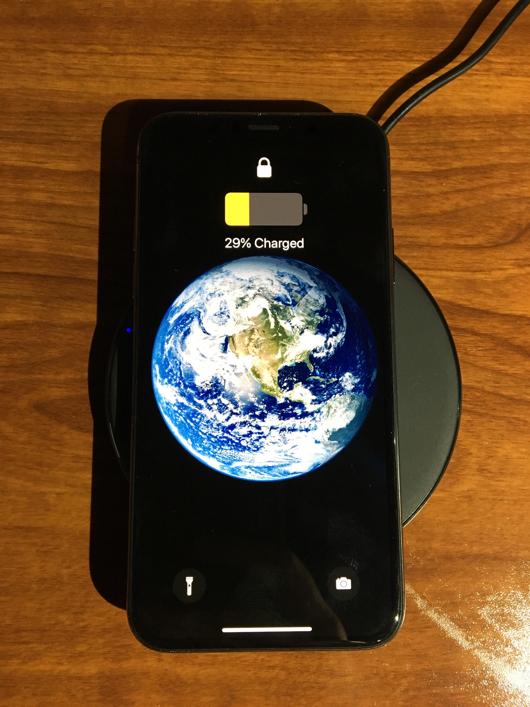

# Battery and performance

*How to test for battery drain caused by background CPU, network, and wake-lock misuse, and how to read Android Studio Profiler and Xcode Instruments to prove where the power is actually going.*

> An app passes every functional test, ships, and within a week the reviews say "kills my battery." Nobody
> can reproduce it by tapping around for five minutes, because the bug isn't in what the app does on screen —
> it's in what the app keeps doing after the user has locked the phone and walked away.

> **In real life**
>
> Picture an office where everyone is supposed to turn off their desk lamp and shut down their computer at the
> end of the day. Most people do. One person leaves their computer running a heavy calculation all night,
> lamp on, for a task that finished hours ago and nobody remembered to stop. The electricity bill doesn't show
> who did it — only that consumption stayed high long after the office should have gone quiet. Battery
> draining while a phone sits locked in someone's pocket is the same story: something kept running past the
> point where it had a reason to.

**Battery drain testing**: Battery drain testing is verifying how much power an app consumes during both active use and while backgrounded or idle, by isolating and measuring CPU wakeups, network activity, and wake locks the app holds when the user is not actively interacting with it.

## Idle drain is a different bug class than active drain

Battery complaints split into two shapes, and they need different tests. Active drain happens while the user
is actively using a feature — a minute of video playback costing a real, visible slice of battery is often
expected and acceptable. Idle drain is the dangerous one: the app sitting backgrounded or the screen locked,
still losing a few percent an hour, with no user-visible activity to explain it. The usual causes are a
background sync loop firing more often than it needs to, a network call retrying aggressively, or a wake
lock a service acquired and never released.

A `PowerManager` wake lock on Android explicitly tells the system "keep the CPU on for me," overriding the
device's normal sleep behavior. Held for a legitimate short task, that's fine. Held for hours because a
callback never fired to release it, it's a direct, measurable battery leak — and Android's own platform
defenses increasingly treat it as a quality signal: Doze mode defers background network access and ignores
non-exempt wake locks once a device has been stationary and screen-off for a while, and Google Play has
begun surfacing wake-lock quality warnings on a store listing when an app's wake-lock usage is consistently
excessive. Testing for this means leaving a device idle and screen-off for an extended stretch, not just
backgrounding the app for thirty seconds and calling it done.

> **Tip**
>
> Always test battery and background behavior on a real device, not only an emulator or simulator — virtualized
> power reporting is unreliable and tends to understate real drain, especially for radio (cellular/Wi-Fi) and
> GPS usage. Compare battery percentage over a fixed idle window with the feature enabled versus disabled to
> get a number worth reporting, rather than a vague "it feels warmer."

> **Common mistake**
>
> Do not test battery behavior only while actively interacting with the app. The complaint that reaches
> support is almost always about the phone in someone's pocket, screen off, hours after they last opened the
> app — a test pass that only covers the five minutes of active tapping will never catch it.


*Phone wireless charge — Seawhelan, Wikimedia Commons, CC BY-SA 4.0. [Source](https://commons.wikimedia.org/wiki/File:Phone_wireless_charge.jpg)*
- **The number a battery test actually reports** — '29% Charged' with the yellow low-battery fill is the kind of concrete, timestamped reading a drain test needs -- not a vague impression of the phone feeling warm.
- **Locked, but not necessarily quiet** — The lock icon confirms the screen is off and the user isn't interacting -- exactly the condition idle-drain bugs hide in, since a wake lock or background loop can keep draining battery well after this point.
- **An external factor a test has to control for** — The charging pad is actively supplying power right now, which will mask real drain -- a battery test has to run unplugged to get a number that means anything.
- **Hardware an app can quietly keep warm** — Camera and flashlight are exactly the kind of hardware-backed capability that keeps consuming power if an app holds onto a session or a wake lock longer than the task actually needed.

**Isolating idle drain from active drain**

1. **Record a baseline: device idle, app not installed or disabled** — Establishes what 'normal' battery loss looks like on this device over the test window with no variable in play.
2. **Install and open the app, use its core features briefly** — Active-use drain is expected here; the goal is not to eliminate it but to have a number to compare against.
3. **Lock the screen and leave the device untouched for the same window** — This isolates idle drain -- any loss beyond baseline now points at something running in the background.
4. **Profile the idle window** — Android Studio's Power Profiler or Xcode's Energy gauge shows exactly which wake locks, radios, or CPU wakeups were active while the screen was off.
5. **Fix and re-measure** — Release the offending wake lock or throttle the background loop, then repeat the same idle window to confirm the number actually moved.

*Flagging excessive idle-window battery drain (Python)*

```python
# percent battery lost during a fixed-length idle window, screen off
baseline_drain_pct = 1.0     # device idle, app not running
active_use_minutes = 5
active_drain_pct = 3.0       # expected cost of 5 minutes of real feature use
idle_window_minutes = 60
observed_idle_drain_pct = 4.5  # measured with the app installed, screen off

# a background loop that fires every N minutes and never releases its wake lock
wakeups_observed = 40
expected_wakeups_for_healthy_sync = 4  # e.g. one sync every 15 minutes

def idle_drain_over_baseline(observed, baseline):
    return round(observed - baseline, 2)

extra_drain = idle_drain_over_baseline(observed_idle_drain_pct, baseline_drain_pct)
print("baseline_drain_pct=" + str(baseline_drain_pct))
print("observed_idle_drain_pct=" + str(observed_idle_drain_pct))
print("extra_drain_over_baseline_pct=" + str(extra_drain))
print("wakeups_observed=" + str(wakeups_observed) + " expected<=" + str(expected_wakeups_for_healthy_sync))

drain_flag = extra_drain > 1.0
wakeup_flag = wakeups_observed > expected_wakeups_for_healthy_sync
print("DRAIN_FLAG=" + str(drain_flag))
print("WAKEUP_FLAG=" + str(wakeup_flag))

result = "FAIL" if (drain_flag and wakeup_flag) else "PASS"
assert result == "FAIL", "expected this scripted scenario to flag excessive idle drain tied to excessive wakeups"
print("RESULT=" + result)
```

*Flagging excessive idle-window battery drain (Java)*

```java
public class Main {
    public static void main(String[] args) {
        double baselineDrainPct = 1.0;      // device idle, app not running
        double observedIdleDrainPct = 4.5;  // measured with the app installed, screen off

        int wakeupsObserved = 40;
        int expectedWakeupsForHealthySync = 4; // e.g. one sync every 15 minutes

        double extraDrain = Math.round((observedIdleDrainPct - baselineDrainPct) * 100.0) / 100.0;
        System.out.println("baseline_drain_pct=" + baselineDrainPct);
        System.out.println("observed_idle_drain_pct=" + observedIdleDrainPct);
        System.out.println("extra_drain_over_baseline_pct=" + extraDrain);
        System.out.println("wakeups_observed=" + wakeupsObserved + " expected<=" + expectedWakeupsForHealthySync);

        boolean drainFlag = extraDrain > 1.0;
        boolean wakeupFlag = wakeupsObserved > expectedWakeupsForHealthySync;
        System.out.println("DRAIN_FLAG=" + drainFlag);
        System.out.println("WAKEUP_FLAG=" + wakeupFlag);

        String result = (drainFlag && wakeupFlag) ? "FAIL" : "PASS";
        if (!result.equals("FAIL")) {
            throw new AssertionError("expected this scripted scenario to flag excessive idle drain tied to excessive wakeups");
        }
        System.out.println("RESULT=" + result);
    }
}
```

### Your first time: Run a first battery and performance pass

- [ ] Record a no-app baseline — Measure idle battery loss on the same real device with the app not running, over the same window you'll test against.
- [ ] Measure active-use drain separately from idle drain — Use the core features for a fixed number of minutes, then lock the screen and leave the device untouched for a matching window.
- [ ] Open the platform profiler during the idle window — Android Studio's Profiler (Power Profiler, CPU, Network) or Xcode's Instruments (Time Profiler, Allocations, Energy gauge) to see exactly what ran while the screen was off.
- [ ] Name the specific cause — A held wake lock, an over-frequent sync job, or an idle network retry loop -- not just 'battery usage is high.'

- **Battery drains noticeably even when the app is backgrounded and the screen is off.**
  Profile the idle window specifically. Look for a wake lock that was acquired but never released, or a background job firing far more often than the feature requires.
- **Drain only shows up after long-term use, not in a five-minute manual test.**
  Extend the idle test window -- Doze mode and standby buckets only kick in after the device has been stationary and screen-off for a while, so short manual tests can miss exactly the behavior they're supposed to catch.
- **The emulator or simulator shows normal battery behavior but real users report drain.**
  Re-test on a real device. Virtualized environments do not model radio and GPS power draw accurately and routinely understate real-world drain.

### Where to check

- Android Developers' guidance on Doze and App Standby for exactly which background restrictions apply and when.
- Android Studio's Profiler documentation for what each profiling tab (CPU, Memory, Network, Power) actually measures.
- Apple's Xcode Instruments documentation for the Time Profiler, Allocations, and Energy tooling used to trace iOS power and performance issues.
- [[mobile-testing/mobile-specifics/app-lifecycle]] for how backgrounding and process death interact with the very wake locks and background jobs this note is about.
- [[mobile-testing/gestures-interrupts-networks/network-conditions]] for how a poor network condition can turn an ordinary sync job into a battery-draining retry loop.

### Worked example: tracing a background sync loop to a held wake lock

1. Support tickets report the app "kills my battery" even when nobody has opened it in hours.
2. A tester runs the baseline-then-idle-window test on a real device: 1% baseline loss per hour, but 4.5%
   with the app installed and idle -- well above the app's own claimed background usage.
3. Opening the platform profiler during a fresh idle window shows a partial wake lock held continuously by a
   sync service, with the CPU never dropping into a deep sleep state.
4. The finding names the exact class holding the lock and the missing release call, not just "battery is
   bad" -- turning an unreproducible review into an actionable bug report.

**Quiz.** Why is testing battery drain only during active app use insufficient?

- [ ] Active use never actually costs meaningful battery, so it isn't worth measuring at all
- [x] The most damaging drain complaints usually come from idle, backgrounded use -- a held wake lock or an over-frequent background job draining battery with no user interaction at all
- [ ] Idle drain is impossible to measure on a real device, only in an emulator
- [ ] Active-use drain and idle drain are always caused by the exact same code path

*Active-use drain is often expected and bounded by how long the user interacts. Idle drain -- battery loss while the screen is off and the app is backgrounded -- is the harder, more damaging bug class because nothing on screen explains it.*

- **Wake lock** — An explicit request that tells the OS to keep the CPU (or screen) on, overriding normal sleep behavior -- battery-safe only if released promptly.
- **Idle drain vs active drain** — Active drain happens while a user is using a feature; idle drain happens while the app is backgrounded or the screen is off, with no visible activity to explain it.
- **Why emulators mislead on battery** — Virtualized environments don't model real radio and GPS power draw accurately, so they routinely understate real-device battery loss.
- **Doze mode** — Android's system that defers background network access and ignores most wake locks once a device has been stationary and screen-off for a while -- it only shows up in long idle windows, not short manual tests.

### Challenge

Pick an app you use daily. Run the baseline-then-idle test: note its battery level, lock the screen, leave it untouched for one hour, and record the drop. If it's higher than you'd expect for "doing nothing," open the platform profiler and try to name the cause.

- [Android Developers — Optimize for Doze and App Standby](https://developer.android.com/training/monitoring-device-state/doze-standby)
- [Android Developers — Keep the Device Awake (Wake Locks)](https://developer.android.com/develop/background-work/background-tasks/awake/wakelock)
- [Android Developers Blog — Optimize Your App Battery Using the Android Vitals Wake Lock Metric](https://android-developers.googleblog.com/2025/09/guide-to-excessive-wake-lock-usage.html)
- [Profiling Android Apps (GDG Boston Android)](https://www.youtube.com/watch?v=dUVSCko3dMs)

🎬 [Profiling Android Apps](https://www.youtube.com/watch?v=dUVSCko3dMs) (40 min)

- Battery bugs split into active-use drain (expected, bounded) and idle drain (unexplained, the one that generates reviews).
- A wake lock that isn't released is one of the most common causes of idle battery drain, and platforms increasingly flag it as a quality signal.
- Doze mode and App Standby only restrict background behavior after real stationary, screen-off idle time -- short manual tests can miss the exact bug they're meant to catch.
- Always profile and measure on a real device; emulators and simulators understate real radio and GPS power draw.


## Related notes

- [[Notes/mobile-testing/mobile-specifics/app-lifecycle|App lifecycle]]
- [[Notes/mobile-testing/mobile-specifics/permissions|Permissions]]
- [[Notes/mobile-testing/gestures-interrupts-networks/network-conditions|Network conditions]]


---
_Source: `packages/curriculum/content/notes/mobile-testing/mobile-specifics/battery-and-performance.mdx`_
