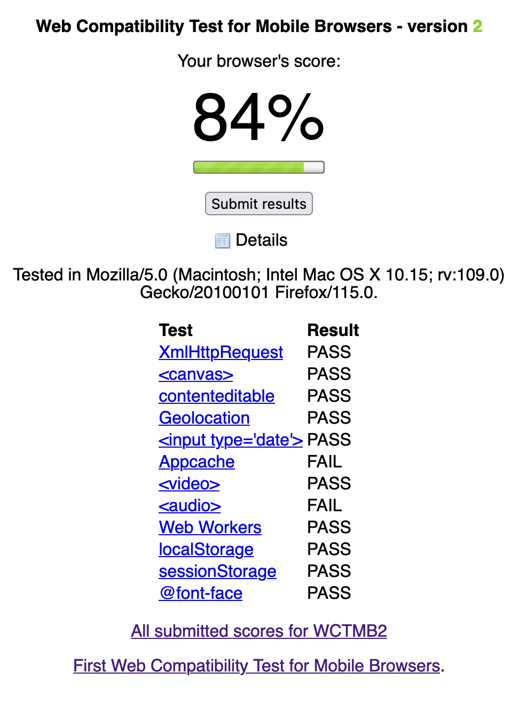

# Cross-browser

*Build a risk-based browser matrix, test engines and features that matter to users, and distinguish graceful fallback from silent incompatibility.*

> The web has shared standards, but users do not run "the standard"—they run a browser engine, version,
> operating system, settings, and extensions. A checkout that works in one combination can lose its date
> picker, layout, or payment callback in another while every backend test remains green.

> **In real life**
>
> Cross-browser testing is checking a key cut by several locksmiths. The design is shared, yet tiny
> differences in manufacturing can stop one lock. Test the doors your users actually open, not every lock
> ever made and not only the one on your desk.

**Cross-browser testing**: Cross-browser testing evaluates important web journeys across a documented, risk-based matrix of browser engines, browser versions, and operating-system combinations. Its goal is an acceptable experience and intentional fallback, not pixel-identical rendering everywhere.

## Build the matrix from evidence

Use supported-product policy, current analytics, customer commitments, and feature risk. Include the
major engines relevant to the audience—Blink, WebKit, and Gecko—because multiple browser brands can
share an engine. Test critical journeys first, then layout, input, media, storage, permissions, and
feature fallbacks. Consult MDN Browser Compatibility Data, but confirm behavior in the real matrix.

> **Tip**
>
> Record browser, full version, engine, OS, viewport, feature flags, and reproduction. "Broken in Safari"
> is a lead; "Safari 18.5 on macOS 15.5, checkout date input rejects keyboard entry" is evidence.

> **Common mistake**
>
> Do not confuse identical screenshots with compatibility. Native controls, fonts, and antialiasing may
> differ acceptably. Prioritize missing actions, unreadable content, data loss, inaccessible behavior, and
> unannounced fallback over harmless pixel variation.


*Web Compatibility Test for Mobile Browsers 2 with Firefox 115 — StreetcarEnjoyer, Wikimedia Commons, CC0. [Source](https://commons.wikimedia.org/wiki/File:Web_Compatability_Test_for_Mobile_Browsers_2_with_Desktop_Firefox_115.png)*
- **A summary is not the user journey** — An overall score can hide a failed feature that a critical flow depends on.
- **Exact browser identity** — Capture the full user agent, browser version, engine, and OS instead of a vague brand name.
- **Feature-level failures** — Investigate whether failed capabilities have an intentional fallback and whether the product actually uses them.
- **Passing capabilities** — Support tables guide selection; only a real end-to-end task establishes product behavior.

**A risk-based browser loop**

1. **Collect support policy, analytics, and critical flows** — Matrix choices must be traceable to users and business risk.
2. **Cover relevant engines and versions** — Choose meaningful combinations instead of multiplying brands that share the same engine.
3. **Run smoke journeys, then targeted feature checks** — Start with value and safety; investigate layout and API differences where the product depends on them.
4. **Document fallback and refresh the matrix** — Browser usage and support change, so date the evidence and retire rows intentionally.

*A browser-matrix oracle (Python)*

```python
checks = {
    "blink_checkout": True,
    "webkit_checkout": True,
    "gecko_checkout": True,
    "fallback_documented": True,
}
for name, passed in checks.items():
    print(name + "=" + ("PASS" if passed else "FAIL"))
result = "PASS" if all(checks.values()) else "FAIL"
assert result == "PASS", "browser matrix rejected"
print("RESULT=" + result)
```

*A browser-matrix oracle (Java)*

```java
import java.util.LinkedHashMap;
import java.util.Map;
public class Main {
    public static void main(String[] args) {
        Map<String, Boolean> checks = new LinkedHashMap<>();
        checks.put("blink_checkout", true);
        checks.put("webkit_checkout", true);
        checks.put("gecko_checkout", true);
        checks.put("fallback_documented", true);
        boolean ok = true;
        for (var e : checks.entrySet()) { System.out.println(e.getKey() + "=" + (e.getValue() ? "PASS" : "FAIL")); ok &= e.getValue(); }
        String result = ok ? "PASS" : "FAIL";
        if (!result.equals("PASS")) throw new AssertionError("browser matrix rejected");
        System.out.println("RESULT=" + result);
    }
}
```

### Your first time: Create a three-engine smoke matrix

- [ ] Name supported browsers from evidence — Use policy, analytics, customer needs, and current feature support; date the matrix.
- [ ] Choose one critical journey — Run the same data and assertions in representative Blink, WebKit, and Gecko combinations.
- [ ] Inspect browser-specific signals — Check console, network, feature support, permissions, controls, and intentional fallbacks.
- [ ] File exact environment evidence — Include full versions, OS, viewport, steps, expected result, actual result, and impact.

- **A feature works in Chrome but is absent elsewhere.**
  Check standards status and MDN compatibility data, then implement or test an intentional feature-detection fallback rather than user-agent guessing.
- **Screenshots differ by a few pixels.**
  Test readability, operation, overflow, and task completion. Treat harmless font or native-control variation as acceptable unless the product specifies otherwise.
- **The matrix grows without bound.**
  Collapse equivalent low-risk combinations, prioritize engines and supported versions, and schedule deeper rows by usage and failure impact.

### Where to check

- MDN Browser Compatibility Data and current browser release/support documentation.
- Console, network, feature detection, permissions, storage, media, and native inputs.
- Product analytics and written support policy, dated with the test run.
- [[non-functional-testing-intro/compatibility/cross-device]] for hardware and interaction differences beyond the browser.

### Worked example: a date field with no safe fallback

1. Checkout uses a new date API and passes in the team's default browser.
2. A supported WebKit combination lacks the behavior; the field appears but cannot submit a valid date.
3. The tester reports exact versions, console evidence, task impact, and the absence of fallback.
4. Feature detection selects a validated text fallback, and the journey is rerun across all matrix rows.

**Quiz.** What is the best basis for a browser matrix?

- [ ] Every browser ever released
- [ ] Only the QA team's default browser
- [x] Supported policy, user analytics, engine coverage, critical flows, and feature risk
- [ ] Pixel-identical screenshots

*A defensible matrix is risk-based and dated. It covers relevant engines and users without pretending exhaustive combinations are possible.*

- **Engine coverage** — Browser brands may share Blink, WebKit, or Gecko; engine diversity often matters more than brand count.
- **Compatibility target** — Acceptable task completion and intentional fallback, not identical pixels everywhere.
- **Reproduction** — Browser and full version, engine, OS, viewport, settings, steps, result, and impact.

### Challenge

Build a dated three-engine matrix for one critical journey, justify each row, and document one intentional fallback.

- [MDN — Introduction to Cross-Browser Testing](https://developer.mozilla.org/en-US/docs/Learn_web_development/Extensions/Testing/Introduction)
- [MDN — Browser Compatibility Data](https://developer.mozilla.org/en-US/docs/MDN/Writing_guidelines/Page_structures/Compatibility_tables)
- [The Testing Academy — Cross Browser Testing - Ultimate Guide (Start to Finish) [With Checklist]](https://www.youtube.com/watch?v=fiPzpMUhaKE)

🎬 [Cross Browser Testing - Ultimate Guide (Start to Finish) [With Checklist]](https://www.youtube.com/watch?v=fiPzpMUhaKE) (14 min)

- Build and date the matrix from supported users, engines, critical journeys, and feature risk.
- Test outcomes and fallbacks rather than demanding pixel identity.
- Use compatibility data to plan, then verify the real product in exact combinations.
- A reproducible browser finding names full environment and user impact.


## Related notes

- [[Notes/non-functional-testing-intro/compatibility/cross-device|Cross-device]]
- [[Notes/non-functional-testing-intro/compatibility/os-and-versions|OS / versions]]
- [[Notes/playwright/parallel-and-cross-browser/projects-and-browsers|Projects & browsers]]


---
_Source: `packages/curriculum/content/notes/non-functional-testing-intro/compatibility/cross-browser.mdx`_
