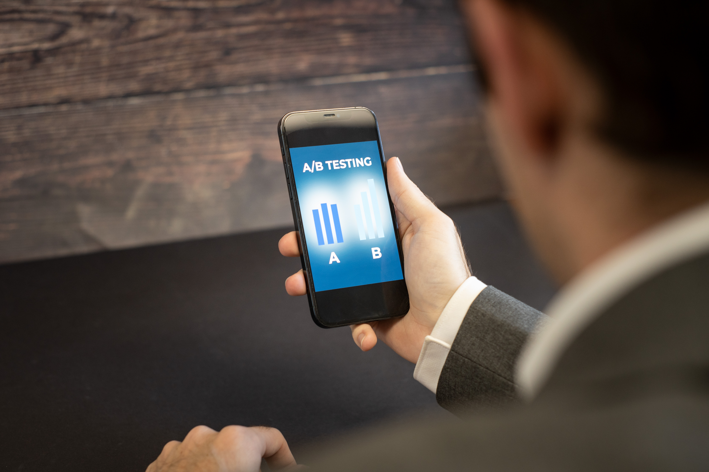

# Cross-device

*Test across meaningful device classes and real hardware constraints, separating viewport emulation from physical-device evidence.*

> A narrow desktop window can imitate screen width, but it cannot grow a thumb, a notch, a virtual
> keyboard, a weak radio, limited memory, or a high-density touch display. Cross-device testing asks what
> changes when software leaves the tester's desk and enters real hands.

> **In real life**
>
> An emulator is a flight simulator: fast, repeatable, and ideal for many rehearsals. Real hardware is the
> aircraft in weather. A responsible test strategy uses the simulator broadly and the aircraft for the
> risks the simulator cannot faithfully create.

**Cross-device testing**: Cross-device testing evaluates important journeys across a risk-based set of device classes and physical characteristics, such as screen and pixel density, touch and keyboard input, orientation, safe areas, memory, sensors, network behavior, and power constraints. Emulation is useful evidence but is not identical to a real device.

## Classify differences before collecting phones

Choose device classes from analytics, audience, support policy, and product features. Cover compact and
large screens, touch and pointer input, relevant densities and orientations, and hardware-dependent
features. Use responsive mode for fast layout sweeps, emulators for controlled OS/device models, device
farms for scale, and a small real-device set for touch, keyboard, camera, sensors, performance, and
browser chrome.

> **Tip**
>
> Record the model, OS, browser/app version, viewport and physical resolution, density, orientation,
> input method, network, and whether the run was real, emulated, or simulated.

> **Common mistake**
>
> Do not name a DevTools preset "tested on iPhone." It tested a viewport and some emulated properties.
> Report it honestly, then schedule real hardware where touch, safe areas, keyboards, sensors, or resource
> limits can change the outcome.


*Split Testing - Analysing AB Test Results on Mobile Device — Zuko.io Images, Wikimedia Commons, CC BY 2.0. [Source](https://commons.wikimedia.org/wiki/File:Split_Testing_-_Analysing_AB_Test_Results_on_Mobile_Device.jpg)*
- **Physical display** — Real density, brightness, safe areas, and browser chrome affect what the user can see and touch.
- **Thumb-held input** — Touch targets, reach, gestures, and accidental activation cannot be inferred from a desktop pointer alone.
- **Content under real constraints** — The critical journey must remain readable and operable when the virtual keyboard, rotation, or network changes available space.
- **Use context** — Mobility, glare, interruptions, and connectivity make device context part of compatibility evidence.

**From emulation breadth to real-device confidence**

1. **Use analytics and features to define device classes** — Avoid brand collecting; choose characteristics tied to users and risk.
2. **Sweep layouts quickly in responsive mode** — Find overflow, breakpoints, and missing content across many widths.
3. **Exercise controlled combinations in emulators or farms** — Repeat OS, density, orientation, and network scenarios at scale.
4. **Validate hardware-sensitive journeys on real devices** — Touch, keyboards, camera, sensors, performance, safe areas, and browser chrome need physical evidence.

*A cross-device evidence oracle (Python)*

```python
checks = {
    "small_touch_journey": True,
    "large_pointer_journey": True,
    "rotation_preserves_state": True,
    "real_device_validated": True,
}
for name, passed in checks.items(): print(name + "=" + ("PASS" if passed else "FAIL"))
result = "PASS" if all(checks.values()) else "FAIL"
assert result == "PASS", "device matrix rejected"
print("RESULT=" + result)
```

*A cross-device evidence oracle (Java)*

```java
import java.util.LinkedHashMap;
import java.util.Map;
public class Main {
    public static void main(String[] args) {
        Map<String, Boolean> checks = new LinkedHashMap<>();
        checks.put("small_touch_journey", true);
        checks.put("large_pointer_journey", true);
        checks.put("rotation_preserves_state", true);
        checks.put("real_device_validated", true);
        boolean ok = true;
        for (var e : checks.entrySet()) { System.out.println(e.getKey() + "=" + (e.getValue() ? "PASS" : "FAIL")); ok &= e.getValue(); }
        String result = ok ? "PASS" : "FAIL";
        if (!result.equals("PASS")) throw new AssertionError("device matrix rejected");
        System.out.println("RESULT=" + result);
    }
}
```

### Your first time: Run an honest device-class check

- [ ] Choose classes from evidence — Use compact touch, large touch, and desktop pointer only when they represent supported users and risks.
- [ ] Sweep widths and orientations — Check content, overflow, controls, and preserved state with responsive tools.
- [ ] Select a hardware-sensitive journey — Exercise keyboard, touch, camera, sensor, safe area, or constrained network behavior.
- [ ] Repeat it on a real device — Record the exact model and environment and compare with the emulated result.

- **The layout works in Device Mode but the real phone hides the submit button.**
  Include browser chrome, safe areas, and the virtual keyboard in the real-device reproduction; test dynamic viewport units and scrolling behavior.
- **The matrix contains many nearly identical phones.**
  Group by risk-bearing characteristics—size, density, input, OS, performance, and feature hardware—then retain exact models only where evidence requires them.
- **Rotation reloads the page and loses the form.**
  Capture lifecycle and state behavior on real hardware, fix persistence or layout handling, and retest both directions during the critical journey.

### Where to check

- Analytics and supported-device policy, dated for the release.
- DevTools responsive mode for layout breadth; emulators and farms for controlled scale.
- Real hardware for touch, keyboard, sensors, camera, performance, safe areas, and browser chrome.
- [[non-functional-testing-intro/compatibility/responsive-checks]] for continuous-width layout checks.

### Worked example: the keyboard that ate checkout

1. Responsive mode at 390px shows the address form and button.
2. On a real phone, focusing the final field opens the virtual keyboard and the fixed footer covers the button.
3. The tester records model, OS, browser, orientation, viewport, and keyboard state.
4. The footer and scroll behavior are fixed; the flow is retested with real touch and keyboard transitions.

**Quiz.** Which statement is accurate?

- [ ] A device preset proves the named phone works
- [ ] Real devices make emulators useless
- [x] Emulation gives fast controlled breadth; real devices validate hardware and context risks
- [ ] Screen width is the only device difference

*The tools answer different questions. Honest evidence labels simulation and reserves physical testing for differences it cannot reproduce faithfully.*

- **Device class** — A group defined by risk-bearing characteristics, not merely brand.
- **Emulation** — Fast, repeatable model of selected properties; not proof of physical-device behavior.
- **Real-device targets** — Touch, keyboards, sensors, camera, safe areas, browser chrome, performance, and network context.

### Challenge

Compare one critical journey in responsive mode and on a real phone. Record one difference the preset did not model.

- [Chrome for Developers — Device Mode](https://developer.chrome.com/docs/devtools/device-mode/)
- [Android Developers — Run apps on the Android Emulator](https://developer.android.com/studio/run/emulator)
- [BrowserStack — How to test a .apk file using BrowserStack App Live](https://www.youtube.com/watch?v=8oKu0njdnt8)

🎬 [How to test a .apk file using BrowserStack App Live](https://www.youtube.com/watch?v=8oKu0njdnt8) (2 min)

- Choose device classes from supported users and risk-bearing characteristics.
- Label responsive simulation, emulation, cloud devices, and real hardware honestly.
- Use fast tools for breadth and real devices for physical input, hardware, context, and resource risks.
- Record the full device and environment so failures can be reproduced.


## Related notes

- [[Notes/non-functional-testing-intro/compatibility/cross-browser|Cross-browser]]
- [[Notes/non-functional-testing-intro/compatibility/responsive-checks|Responsive checks]]
- [[Notes/browser-devtools-mastery/throttling-and-emulation/device-emulation|device-emulation]]


---
_Source: `packages/curriculum/content/notes/non-functional-testing-intro/compatibility/cross-device.mdx`_
