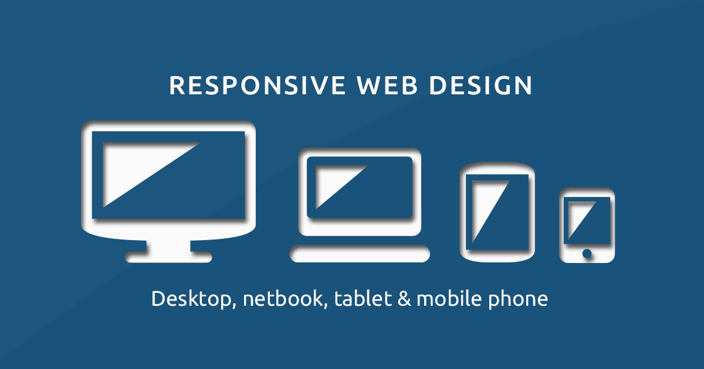

# Responsive checks

*Test layouts continuously across widths, zoom, content extremes, orientation, and input states instead of checking a few fashionable device presets.*

> A responsive page can look perfect at 375px and 768px while breaking at 521px—the width nobody named,
> where a label wraps, a grid loses one column, and the fixed button covers the last row. Breakpoints are
> implementation transitions; users occupy every width between them.

> **In real life**
>
> Responsive testing is slowly opening an accordion. Checking only fully closed and fully open misses the
> moment a fold catches. Drag continuously through widths, then add the heavy cargo: long text, zoom,
> errors, keyboards, and orientation changes.

**Responsive testing**: Responsive testing evaluates whether content and interactions adapt without loss across a continuum of viewport sizes, zoom levels, orientation, content lengths, text settings, input modes, and dynamic browser UI. It tests layout behavior and user outcomes, not device-name presets alone.

## Sweep, stress, and interact

Begin with a continuous width sweep to find horizontal scroll, overlap, clipping, sudden jumps, and
unreachable controls. Test narrow, intermediate, and wide states around observed transitions. Add 200%
and 400% zoom where relevant, large text, long localized labels, validation messages, empty/loading/error
states, navigation open, and the virtual keyboard. Verify content order and keyboard focus still match the
visual layout.

> **Tip**
>
> When you find a cliff, record the smallest passing width and first failing width plus the content and
> zoom state. That boundary gives developers a reproducible CSS condition instead of "looks weird on my
> phone."

> **Common mistake**
>
> Do not test only named presets or resize screenshots. A layout can fit while tab order is wrong, content
> is hidden, the action is unreachable, or a reflow requirement fails under zoom.


*Responsive-web-design-devices — Muhammad Rafizeldi, Wikimedia Commons, CC BY-SA 3.0. [Source](https://commons.wikimedia.org/wiki/File:Responsive-web-design-devices.jpg)*
- **Wide layout** — Wide space may support columns, but reading order and maximum line length still need evaluation.
- **Intermediate width** — Unnamed middle widths often expose wrapping and grid cliffs that endpoint presets miss.
- **Tablet transition** — Orientation, touch, and navigation state can change the available canvas and interaction.
- **Compact layout** — Content must reflow without overlap, hidden actions, or horizontal scrolling for ordinary text.

**A responsive cliff hunt**

1. **Drag continuously from narrow to wide** — Watch for the exact transition where content clips, overlaps, jumps, or disappears.
2. **Bracket the boundary** — Record the nearest passing and failing widths around the cliff.
3. **Stress content and settings** — Add zoom, text size, long labels, errors, menus, keyboard, and orientation.
4. **Verify operation and reading order** — Confirm focus, source order, scrolling, and critical actions—not only pixels.

*A responsive-boundary oracle (Python)*

```python
checks = {
    "narrow_no_overlap": True,
    "middle_no_cliff": True,
    "wide_readable": True,
    "zoom_action_reachable": True,
}
for name, passed in checks.items(): print(name + "=" + ("PASS" if passed else "FAIL"))
result = "PASS" if all(checks.values()) else "FAIL"
assert result == "PASS", "responsive boundary rejected"
print("RESULT=" + result)
```

*A responsive-boundary oracle (Java)*

```java
import java.util.LinkedHashMap;
import java.util.Map;
public class Main {
    public static void main(String[] args) {
        Map<String, Boolean> checks = new LinkedHashMap<>();
        checks.put("narrow_no_overlap", true);
        checks.put("middle_no_cliff", true);
        checks.put("wide_readable", true);
        checks.put("zoom_action_reachable", true);
        boolean ok = true;
        for (var e : checks.entrySet()) { System.out.println(e.getKey() + "=" + (e.getValue() ? "PASS" : "FAIL")); ok &= e.getValue(); }
        String result = ok ? "PASS" : "FAIL";
        if (!result.equals("PASS")) throw new AssertionError("responsive boundary rejected");
        System.out.println("RESULT=" + result);
    }
}
```

### Your first time: Find one layout cliff

- [ ] Open a content-heavy critical page — Use realistic data and all navigation or panels in their active states.
- [ ] Drag the viewport continuously — Move from compact to wide and note the first overlap, clip, horizontal scroll, or hidden action.
- [ ] Bracket and stress the boundary — Record passing/failing widths, then add zoom, long text, errors, and keyboard state.
- [ ] Verify interaction and source order — Tab through the page and complete the journey at the failing boundary.

- **A card title pushes its action outside the container.**
  Reproduce with the exact long text and boundary width; use flexible sizing and wrapping, then test localization and zoom variants.
- **Visual columns reorder but keyboard focus follows the old sequence.**
  Align source order with meaningful reading order; avoid CSS reordering that creates a different keyboard journey.
- **The page passes device presets but users report overlap.**
  Sweep continuously and segment reports by viewport, zoom, text settings, browser UI, and keyboard state; presets leave gaps.

### Where to check

- Responsive mode with continuous drag and exact viewport readout.
- CSS Grid/Flex overlays, computed styles, overflow, and media/container queries.
- Zoom, large text, long localization strings, error states, menus, and virtual keyboard.
- Keyboard focus and DOM/source order at each layout transition.

### Worked example: the 521-pixel checkout cliff

1. Presets at 390px and 768px pass.
2. Continuous dragging reveals that at 521px the promo label wraps, expands a grid row, and the fixed
   pay bar covers the validation message.
3. The report brackets 520px passing and 521px failing with the exact long label and error state.
4. The grid and bar are fixed; the team sweeps the continuum and repeats zoom and keyboard checks.

**Quiz.** Why test continuously between breakpoints?

- [ ] Browsers ignore named devices
- [x] Layout cliffs can occur at content-dependent widths not represented by presets
- [ ] Only screenshots matter
- [ ] Every pixel must be identical

*Wrapping, intrinsic sizing, scrollbars, and content can create failures between planned breakpoints, so endpoint presets leave blind spots.*

- **Layout cliff** — A narrow width transition where content suddenly overlaps, clips, jumps, or becomes unreachable.
- **Boundary evidence** — Nearest passing and first failing width, plus zoom, content, state, browser, and viewport conditions.
- **Beyond pixels** — Reading order, focus, scrolling, virtual keyboard, content visibility, and task completion.

### Challenge

Find the first failing width on a real page, bracket it to within two pixels, then repeat with 200% zoom and one long localized label.

- [web.dev — Responsive web design basics](https://web.dev/articles/responsive-web-design-basics)
- [MDN — Responsive design](https://developer.mozilla.org/en-US/docs/Learn_web_development/Core/CSS_layout/Responsive_Design)
- [Chrome for Developers — Simulate mobile devices with Device Mode #DevToolsTips](https://www.youtube.com/watch?v=f7kokNyRe7U)

🎬 [Simulate mobile devices with Device Mode #DevToolsTips](https://www.youtube.com/watch?v=f7kokNyRe7U) (5 min)

- Sweep the full width continuum; named presets are samples, not coverage.
- Bracket failures with exact passing and failing widths plus content and settings.
- Stress zoom, text, localization, errors, menus, orientation, and keyboard state.
- Verify reading order, focus, reachability, and task completion—not screenshots alone.


## Related notes

- [[Notes/non-functional-testing-intro/compatibility/cross-device|Cross-device]]
- [[Notes/non-functional-testing-intro/compatibility/cross-browser|Cross-browser]]
- [[Notes/the-web-platform-for-testers/css-essentials/why-layouts-break|Why layouts break]]


---
_Source: `packages/curriculum/content/notes/non-functional-testing-intro/compatibility/responsive-checks.mdx`_
