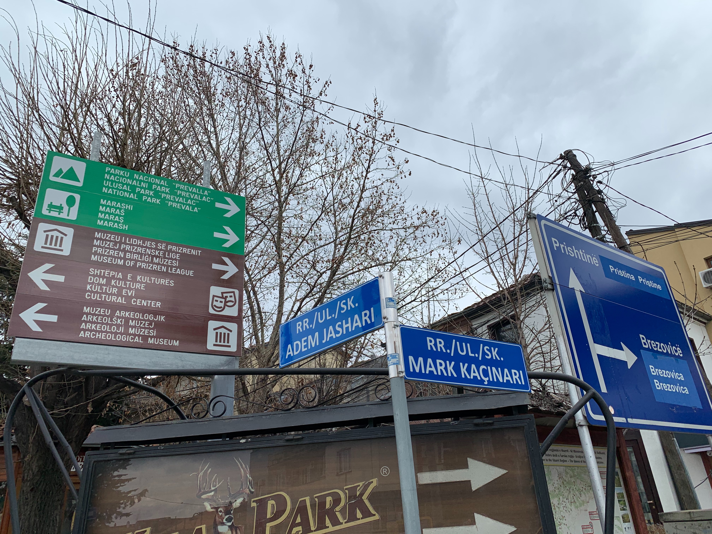

# i18n vs l10n in plain words

*Separate internationalization engineering from localization adaptation, then test the shared product and each locale without confusing translation with readiness.*

> A road sign can carry several languages only because its frame, layout, symbols, and production process
> were designed to accept them. Painting one translation over a fixed one-language sign is localization
> without internationalization: new words forced into a structure that was never ready.

> **In real life**
>
> Internationalization builds a theater with movable scenery, caption systems, and room for different
> scripts. Localization stages one production for one audience—translated dialogue, local dates,
> currency, imagery, and review. A flexible theater does not create a good production, and a good script
> cannot rescue a stage nailed in place.

**Internationalization and localization**: Internationalization (i18n) is the product engineering that enables multiple languages, scripts, regions, and cultural conventions without redesigning the core for each locale. Localization (l10n) adapts content and experience for a particular locale. A locale is a set of language and regional conventions, not merely a country flag.

## Two layers, two kinds of defects

i18n moves user-facing text out of code, uses Unicode, accepts variable length and direction, separates
data from display formatting, supports plural rules, and provides locale fallback. l10n supplies and
reviews translations, terminology, images, formats, and locale-specific content. A hard-coded English
error is an i18n defect; an inaccurate French translation is a localization defect; a clipped German
translation can involve both layout engineering and localized content.

> **Tip**
>
> Triage by asking: "Would this fail in every translation, or only this locale's data?" Route shared
> architecture and extraction defects to engineering; route terminology and locale content to the
> localization workflow; collaborate when both contribute.

> **Common mistake**
>
> Do not use language, country, currency, and timezone as synonyms. Spanish appears in many regions;
> Switzerland uses several languages; a user can choose English while paying in euros and living in a
> different timezone. Model each setting explicitly.


*Multilingual signs in Prizren — Robot8A, Wikimedia Commons, CC BY-SA 4.0. [Source](https://commons.wikimedia.org/wiki/File:Multilingual_signs_in_Prizren.jpg)*
- **Shared sign structure** — Internationalization provides a reusable frame, icon system, direction, and room for several language variants.
- **Localized names** — Each line adapts destination names for a specific audience while preserving the shared meaning.
- **Direction survives translation** — The arrow and grouping connect every localized label to the same action.
- **Regional naming** — Locale choices include more than translated words; regional conventions and names matter too.

**From one codebase to a localized experience**

1. **Externalize messages and model locale-sensitive data** — The product stops embedding English words and display formats in business logic.
2. **Build flexible Unicode, layout, direction, and plural support** — Shared engineering makes diverse locale data possible.
3. **Translate and adapt for a target locale** — Language specialists provide terminology, formats, imagery, and cultural review.
4. **Test shared mechanisms and locale quality** — Pseudo-localization finds engineering gaps; native review and locale scenarios assess the real adaptation.

*An i18n/l10n separation oracle (Python)*

```python
checks = {
    "messages_externalized": True,
    "unicode_supported": True,
    "locale_data_selected": True,
    "translation_reviewed": True,
}
for name, passed in checks.items(): print(name + "=" + ("PASS" if passed else "FAIL"))
result = "PASS" if all(checks.values()) else "FAIL"
assert result == "PASS", "i18n/l10n boundary rejected"
print("RESULT=" + result)
```

*An i18n/l10n separation oracle (Java)*

```java
import java.util.LinkedHashMap;
import java.util.Map;
public class Main {
    public static void main(String[] args) {
        Map<String, Boolean> checks = new LinkedHashMap<>();
        checks.put("messages_externalized", true);
        checks.put("unicode_supported", true);
        checks.put("locale_data_selected", true);
        checks.put("translation_reviewed", true);
        boolean ok = true;
        for (var e : checks.entrySet()) { System.out.println(e.getKey() + "=" + (e.getValue() ? "PASS" : "FAIL")); ok &= e.getValue(); }
        String result = ok ? "PASS" : "FAIL";
        if (!result.equals("PASS")) throw new AssertionError("i18n/l10n boundary rejected");
        System.out.println("RESULT=" + result);
    }
}
```

### Your first time: Classify four global-product defects

- [ ] Switch to a non-default locale — Inspect navigation, forms, errors, emails, and server messages for hard-coded source language.
- [ ] Change language and region independently — Verify currency, date, timezone, units, and content do not follow an invalid country-equals-language assumption.
- [ ] Classify each issue — Mark shared mechanism, locale data/content, or a combined layout-and-content defect.
- [ ] Route with evidence — Include message key, locale tag, exact text, state, expected convention, and screenshot.

- **One error remains English in every non-English locale.**
  Treat it as an internationalization extraction or fallback defect; locate the hard-coded message and add a translatable key.
- **Only one locale uses the wrong product term.**
  Inspect the translation entry, glossary, context, and review workflow rather than changing shared code.
- **Language choice also changes currency unexpectedly.**
  Decouple language from region, currency, and timezone; test explicit settings and documented defaults.

### Where to check

- Message catalogs, keys, fallback chain, and missing-translation logs.
- Locale tags and independent language, region, currency, timezone, and unit settings.
- Unicode input/storage/search and locale-aware formatting APIs.
- Translation context, glossary, screenshots, and linguistic review evidence.

### Worked example: the English-only payment error

1. The French checkout is translated until the bank declines a card.
2. The API error is embedded directly in English frontend code, so every locale leaks English.
3. The tester classifies an i18n extraction defect, not a bad French translation.
4. A message key and fallback are added; French localization supplies reviewed text; all error paths are retested.

**Quiz.** Which is primarily a localization defect?

- [ ] A hard-coded English validation message in every locale
- [ ] The shared layout cannot display RTL
- [x] One reviewed French message uses the wrong domain term
- [ ] Dates are concatenated manually in code

*The shared mechanism works, but one locale's adapted content is wrong. The other options are internationalization engineering defects.*

- **i18n** — Engineering a shared product to support languages, scripts, regions, and conventions.
- **l10n** — Adapting and reviewing content and experience for a target locale.
- **Locale** — Language plus relevant regional conventions; not simply a country flag.

### Challenge

Find four source-language strings in different states, classify mechanism versus locale-content defects, and record the responsible workflow.

- [W3C Internationalization — Localization vs. Internationalization](https://www.w3.org/International/questions/qa-i18n)
- [W3C Internationalization — Quick Tips](https://www.w3.org/International/quicktips/)
- [The Unicode Consortium — Introduction to Internationalization](https://www.youtube.com/watch?v=wMMMyZL0lwY)

🎬 [Introduction to Internationalization](https://www.youtube.com/watch?v=wMMMyZL0lwY) (17 min)

- i18n builds the shared capability; l10n adapts one locale's experience.
- Translation alone does not fix hard-coded strings, rigid layouts, direction, plurals, or formatting.
- Keep language, region, currency, units, and timezone distinct.
- Classify and route shared mechanism defects separately from locale-content defects.


## Related notes

- [[Notes/non-functional-testing-intro/localization-and-i18n/text-expansion-truncation-and-rtl|Text expansion, truncation & RTL]]
- [[Notes/non-functional-testing-intro/localization-and-i18n/dates-currencies-and-formats|Dates, currencies & formats]]
- [[Notes/non-functional-testing-intro/localization-and-i18n/pseudo-localization-tricks|Pseudo-localization tricks]]


---
_Source: `packages/curriculum/content/notes/non-functional-testing-intro/localization-and-i18n/i18n-vs-l10n-in-plain-words.mdx`_
