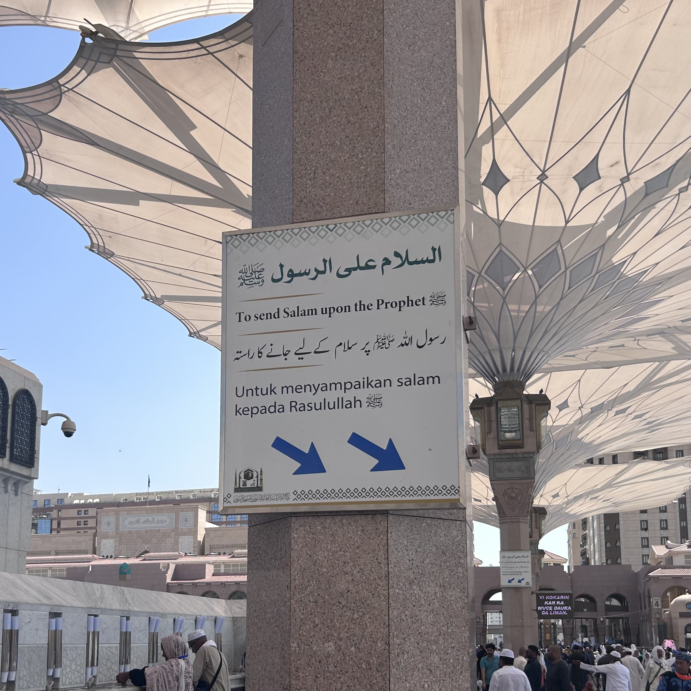

# Text expansion, truncation & RTL

*Stress layouts with expanded strings and bidirectional content, then verify direction, order, isolation, focus, icons, and readable truncation.*

> The English button "Save" is a tiny suitcase. A translation may need a trunk. Meanwhile Arabic and
> Hebrew do more than align the suitcase to the other side: text flows right-to-left while embedded phone
> numbers, codes, and Latin names keep their own direction. Layout and text direction must cooperate.

> **In real life**
>
> Bidirectional text is a two-way railway sharing one station. Each train keeps its travel direction, but
> platform order and signs must prevent passengers from boarding the wrong sequence. Guessing with spaces
> or reversing strings is like rearranging carriages by hand.

**Text expansion and RTL support**: Text expansion is the increase in space a localized string needs. Right-to-left (RTL) support handles scripts whose base direction is RTL while correctly isolating embedded left-to-right segments such as numbers, URLs, and product codes. Direction is semantic behavior, not merely right alignment.

## Stress length and direction separately

Use real long translations and pseudo-localization to expose fixed widths, clipped controls, overlapping
badges, and inaccessible ellipses. For RTL, set document or component direction correctly, prefer
logical CSS properties, mirror directional icons where meaning reverses, and keep universal symbols
unchanged. Check DOM reading order, keyboard focus, form fields, tables, breadcrumbs, mixed numbers,
punctuation, phone numbers, URLs, and copied text. Follow the Unicode Bidirectional Algorithm and W3C
guidance instead of manually reversing strings.

> **Tip**
>
> Test a string that combines Arabic or Hebrew, a Latin product name, punctuation, and a numeric ID. Mixed
> content reveals ordering and isolation defects that monolingual sample text cannot.

> **Common mistake**
>
> Do not implement RTL with `text-align: right` or by reversing characters. Alignment does not change
> semantic direction, and reversal corrupts shaping, numbers, punctuation, cursor movement, selection,
> copy/paste, and assistive-technology output.


*Roza Rasool Information Sign — HolyArtThou, Wikimedia Commons, CC BY-SA 4.0. [Source](https://commons.wikimedia.org/wiki/File:Roza_Rasool_Information_Sign.jpg)*
- **Arabic RTL line** — Base direction, shaping, punctuation, and embedded marks must be interpreted semantically.
- **Short English line** — English length is not a safe container specification for other localized strings.
- **Longer Malay line** — Different translations occupy different widths and heights; containers must flex without collision.
- **Directional arrows** — Mirror icons only when their meaning is directional; test that text order and navigation still match.

**A length-and-direction stress pass**

1. **Expand every translatable message** — Accents and padding reveal hard-coded strings and rigid containers early.
2. **Switch the base direction to RTL** — Use semantic direction and logical layout properties, not alignment hacks.
3. **Mix scripts, numbers, punctuation, and codes** — Isolation problems appear where directional runs meet.
4. **Verify visual, keyboard, copy, and spoken order** — A screenshot alone cannot prove focus, selection, or assistive-technology correctness.

*A length-and-direction oracle (Python)*

```python
checks = {
    "expanded_text_visible": True,
    "rtl_order_correct": True,
    "mixed_id_isolated": True,
    "focus_order_meaningful": True,
}
for name, passed in checks.items(): print(name + "=" + ("PASS" if passed else "FAIL"))
result = "PASS" if all(checks.values()) else "FAIL"
assert result == "PASS", "length/direction oracle rejected"
print("RESULT=" + result)
```

*A length-and-direction oracle (Java)*

```java
import java.util.LinkedHashMap;
import java.util.Map;
public class Main {
    public static void main(String[] args) {
        Map<String, Boolean> checks = new LinkedHashMap<>();
        checks.put("expanded_text_visible", true);
        checks.put("rtl_order_correct", true);
        checks.put("mixed_id_isolated", true);
        checks.put("focus_order_meaningful", true);
        boolean ok = true;
        for (var e : checks.entrySet()) { System.out.println(e.getKey() + "=" + (e.getValue() ? "PASS" : "FAIL")); ok &= e.getValue(); }
        String result = ok ? "PASS" : "FAIL";
        if (!result.equals("PASS")) throw new AssertionError("length/direction oracle rejected");
        System.out.println("RESULT=" + result);
    }
}
```

### Your first time: Run a mixed-direction stress check

- [ ] Enable an expanded pseudo-locale — Visit navigation, buttons, tables, dialogs, toasts, errors, and small-screen states.
- [ ] Switch to a real RTL locale — Verify semantic direction, logical spacing, layout order, and directional icons.
- [ ] Add mixed content — Use an RTL phrase with a Latin product name, punctuation, phone number, and order ID.
- [ ] Test interaction order — Tab, select, edit, copy/paste, and listen with a supported screen reader.

- **An expanded button clips its final word.**
  Remove fixed dimensions, allow wrapping or an approved flexible pattern, and retest at narrow widths and zoom.
- **An order ID appears on the wrong side of punctuation in Arabic.**
  Apply correct base direction and isolate the embedded directional run using suitable HTML/Unicode mechanisms from W3C guidance.
- **The RTL page looks mirrored but tab order is confusing.**
  Inspect DOM order and focus sequence; visual CSS reordering must not create a different semantic journey.

### Where to check

- Navigation, compact buttons, tables, breadcrumbs, badges, dialogs, toasts, and validation.
- Logical CSS properties, `dir`, `bdi`, `bdo`, and Unicode bidi isolation where appropriate.
- Mixed-script identifiers, phone numbers, URLs, punctuation, and input cursor movement.
- Keyboard focus, selection, copy/paste, and supported screen-reader output.

### Worked example: the reversed-looking order number

1. Arabic confirmation text embeds Latin product `QA-Pro` and order `AB-1204`.
2. Without isolation, punctuation and the ID appear in a confusing visual order; copying produces an
   unexpected sequence.
3. The tester records rendered, copied, and accessibility-tree evidence—not just alignment.
4. The inline runs are isolated semantically; Arabic, English, keyboard, and screen-reader paths are retested.

**Quiz.** Which approach correctly supports RTL?

- [ ] Reverse every string
- [ ] Right-align the page
- [x] Set semantic direction, use logical layout properties, and isolate mixed-direction runs
- [ ] Insert spaces until punctuation looks right

*RTL is a Unicode and layout behavior. Semantic direction and isolation preserve shaping, numbers, interaction, copying, and assistive-technology interpretation.*

- **Expansion test** — Use real long strings or pseudo-locales to expose rigid containers and hidden content.
- **RTL is not** — Right alignment or reversed characters.
- **Mixed-direction stress** — RTL text plus Latin names, numbers, punctuation, URLs, and identifiers.

### Challenge

Test one compact form with expanded strings and an RTL mixed-script order ID; verify pixels, focus, selection, copy, and spoken order.

- [W3C Internationalization — Inline Bidi Markup](https://www.w3.org/International/articles/inline-bidi-markup/)
- [W3C Internationalization — Structural markup and right-to-left text](https://www.w3.org/International/questions/qa-html-dir)
- [The Unicode Consortium — Bidirectional Text (Part 3): Mastering Bidirectional Content for Translators and Localizers](https://www.youtube.com/watch?v=rBK9CNIZWLY)

🎬 [Bidirectional Text (Part 3):  Mastering Bidirectional Content for Translators and Localizers](https://www.youtube.com/watch?v=rBK9CNIZWLY) (56 min)

- Stress both text length and semantic direction; they expose different defect classes.
- RTL requires correct direction, logical layout, and mixed-run isolation—not alignment or reversal.
- Test long content at narrow widths and zoom without hiding meaning behind truncation.
- Verify focus, selection, copy, and spoken order as well as screenshots.


## Related notes

- [[Notes/non-functional-testing-intro/localization-and-i18n/i18n-vs-l10n-in-plain-words|i18n vs l10n in plain words]]
- [[Notes/non-functional-testing-intro/localization-and-i18n/pseudo-localization-tricks|Pseudo-localization tricks]]
- [[Notes/non-functional-testing-intro/compatibility/responsive-checks|Responsive checks]]


---
_Source: `packages/curriculum/content/notes/non-functional-testing-intro/localization-and-i18n/text-expansion-truncation-and-rtl.mdx`_
