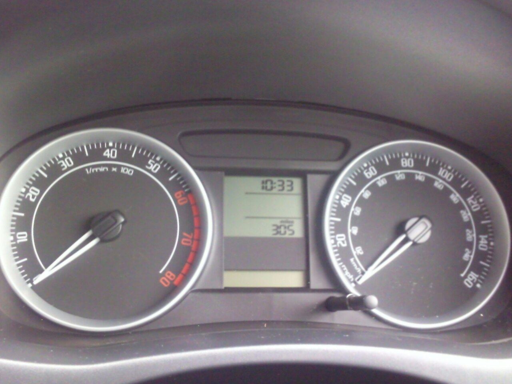

# Key metrics

*Four numbers carry every performance conversation: response-time percentiles (p95/p99 - averages bury the suffering), throughput, error rate, and resource utilization. Read them together - each gauge answers a different question, and any one alone will lie to you.*

> The summary email says: "average response time 753ms - well under our 1-second target, ship it."
> Sounds great. Same hour, same traffic, different arithmetic: six of every hundred checkouts took
> EIGHT TO TWELVE SECONDS. The average didn't lie, exactly - it did what averages do: took six
> catastrophes and ninety-four quick requests and blended them into one flattering smoothie. At a
> million requests a day, that pleasant 753ms contains sixty thousand users staring at a spinner
> long enough to compose a one-star review. The single most valuable habit in performance work is
> refusing the smoothie: ask for the percentiles, read the tail, and find out who's actually
> suffering behind the average.

> **In real life**
>
> A car's instrument cluster, because one gauge is never enough. The speedometer says how fast
> you're going right now - that's throughput, delivery per unit time. The tachometer says how hard
> the engine is WORKING to deliver that speed - that's resource utilization, and the same 100km/h
> can cost 2,000 RPM in sixth gear or a screaming 6,000 in second. The red zone marks where
> sustained effort becomes damage - that's saturation. And the odometer quietly counts everything
> ever delivered - your request totals. A driver who watches only the speedometer misses that the
> engine is redlining to hold the speed; a team that watches only average response time misses
> exactly the same thing. Read the gauges TOGETHER or get lied to separately.

**The key performance metrics**: The core performance metrics, read as a set: RESPONSE-TIME PERCENTILES - p50 (median: the typical user), p95 and p99 (the tail: what 1-in-20 and 1-in-100 users experience; averages hide this tail, which is why professionals report percentiles); THROUGHPUT - completed work per unit time (requests/orders per second), the capacity number; ERROR RATE - the percentage of requests failing, which must be read alongside speed because a server that instantly returns errors looks 'fast'; and RESOURCE UTILIZATION - CPU, memory, connections, queue depth: the effort behind the delivery, where approaching 100% on any one resource (saturation) predicts the cliff before response times show it. One number alone always misleads; the set, read together, tells the story.

## The four gauges, and the lies each one prevents

- **Percentiles, because averages bury the tail.** p50 is the typical user; p95 means 1 in 20
  waits at least this long; p99 is the unluckiest 1%. The demo below has an average of 753ms
  hiding six 8-to-12-second checkouts - visible instantly at p95. Real traffic tails are
  precisely where timeouts, retries, and rage-quits live, and the average is mathematically
  designed to smooth them away.
- **Why the tail deserves the attention: multiply it.** 'Only the p99' sounds like edge-case
  perfectionism until you scale it: at a million requests a day, the worst 1% is ten thousand
  requests. Heavy users - the ones with big accounts, the ones who pay the most - often hit the
  most data-intensive paths, meaning your p99 users can be your best customers. The tail isn't
  noise; it's your VIP room with a broken door.
- **Throughput is the capacity claim.** Requests per second completed - not attempted. It's the
  number that says whether the system can drink from the Friday firehose, and it pairs with
  response time in a fixed dance: past saturation, pushing arrival rate up stops raising
  throughput and starts raising response time instead. When throughput plateaus while load
  climbs, you've found the ceiling.
- **Error rate keeps the other two honest.** A server returning instant 500s posts SPECTACULAR
  response times - failure is fast. Always read speed and errors as a pair: 'p95 of 300ms' means
  nothing next to 'error rate 12%'. In load-test reports, a sudden IMPROVEMENT in response time
  mid-ramp is usually the error rate taking over, not the system getting stronger.
- **Utilization is the cost of the speed - and the early warning.** CPU, memory, connection
  pools, queue depth. Two systems can both respond in 200ms while one idles at 30% CPU and the
  other redlines at 96% - identical speed, radically different headroom. Saturation (any one
  resource pinned at its limit) is the tachometer's red zone: response times may still look
  fine, and the cliff is one gear-shift away.
- **Baselines turn numbers into findings.** 810ms - good or bad? Unanswerable alone; instantly
  answerable against 'it was 350ms last release' or 'the target is 500ms'. Metrics acquire
  meaning only through comparison - against a promise, a baseline, or a trend - which is why
  dated measurements of key flows are among the cheapest high-value artifacts a tester produces.

> **Tip**
>
> When someone hands you an average, ask two questions: 'what's the p95?' and 'what's the error
> rate?' The first exposes the tail the average smoothed; the second exposes whether the speed is
> even real. Most dashboard defaults and summary emails lead with the average precisely because
> it's the most flattering number in the room - the two questions take ten seconds and routinely
> change the meeting's conclusion.

> **Common mistake**
>
> Reporting response time without stating the load and conditions it was measured under. '810ms
> p95' is not a fact about the system; it's a fact about the system AT some load, data size, and
> cache state. The same endpoint might post 200ms at 10 users and 4 seconds at 200. Every number
> you report needs its conditions attached - 'p95 810ms at 150 concurrent users, production-sized
> data, warm cache' - or the next person will compare it against a number measured under different
> conditions and draw a confident, wrong conclusion.


*Skoda Fabia II instrument cluster — Alan (Crawley, UK), Wikimedia Commons, CC BY 2.0. [Source](https://commons.wikimedia.org/wiki/File:Skoda_Fabia_II_Instrument_Cluster.jpg)*
- **Speedometer — throughput, the delivery number** — How much is being delivered right now - your requests-per-second. It's the number everyone watches, and by itself it's incomplete: the same speed can be effortless or a screaming strain, and this gauge alone can't tell you which. That's the next gauge's job.
- **Tachometer — utilization, the effort behind the delivery** — How hard the engine works to produce the speed. Two systems at the same 200ms response time, one at 30% CPU and one at 96%, are this: same speedometer, wildly different tachometer - identical today, and only one of them survives tomorrow's traffic bump.
- **The red zone — saturation, the early warning** — The engine still RUNS at 7,000 rpm - briefly. Any resource pinned near 100% (CPU, connections, queue depth) is here: response times may still look healthy while headroom is already gone. Saturation predicts the cliff before the user-facing numbers confess.
- **The digital display — totals and time windows** — Odometer and clock: everything counted, over a stated period. Every metric you report needs this discipline - 'p95 of 810ms' means nothing without 'measured over 20 minutes at 150 users'. Numbers without their window and conditions get compared wrongly and believed anyway.
- **The inner km/h scale — same needle, different unit** — One needle, two scales - the same reality reported two ways. Response time and throughput are like this: two readings of one system under one load. Quote either without the other (or without the load) and you've told half a story with full confidence.

**How an average hides an outage-in-progress - press Play**

1. **An hour of checkout traffic: 94 quick requests, 6 disasters** — 94 requests between 90 and 210ms - the app most users see. And 6 requests at 8 to 12 seconds: cold cache plus a slow query, hitting the biggest accounts. Both realities are true simultaneously.
2. **The summary email computes the average: 753ms. 'Under target. Ship it.'** — The arithmetic is correct and the conclusion is wrong: ninety-four good numbers dilute six catastrophes into one comfortable figure. No individual user experienced 753ms - it's a number describing nobody.
3. **The percentile view: p50 160ms, p95 8000ms, p99 11600ms** — Same data, no smoothing: the typical user is FINE (160ms - better than the average suggested!), and 1 in 20 is suffering enormously. The tail is now visible, sized, and impossible to unsee.
4. **Scaled to production: 6% of a million requests is 60,000 spinners a day** — And if the slow path correlates with big accounts - it usually does - those are your most valuable users. The average said 'ship it'; the percentiles said 'your VIP room's door is broken'. Same hour, same data, opposite decisions.

Run the exact scenario from the hook - one hundred real response times, then watch the average
and the percentiles tell two different stories about the same hour:

*Run it - the average says ship it, the percentiles say sixty thousand spinners (Python)*

```python
# 100 real response times from one hour of checkout traffic (milliseconds).
# 94 quick ones... and the 6 requests that hit a cold cache + a slow query.
times = [120, 140, 95, 180, 210, 130, 160, 175, 90, 200] * 9 + \\
        [110, 150, 165, 185] + [8000, 8900, 9500, 10800, 11600, 12400]

def percentile(sorted_data, p):
    # nearest-rank method: the value below which p% of requests fall
    rank = max(1, (p * len(sorted_data) + 99) // 100)
    return sorted_data[rank - 1]

s = sorted(times)
avg = sum(s) // len(s)
print(f"requests measured: {len(s)}")
print(f"average:  {avg:>6}ms   <- the number in the summary email")
print(f"median:   {percentile(s, 50):>6}ms   <- the typical user's actual experience")
print(f"p95:      {percentile(s, 95):>6}ms   <- 1 in 20 users waits at least this")
print(f"p99:      {percentile(s, 99):>6}ms   <- 1 in 100 users lives here")
print(f"worst:    {s[-1]:>6}ms   <- somebody actually waited 12 seconds")
print()
print(f"The average says {avg}ms - 'well under a second, ship it'.")
print(f"The median says the TYPICAL user gets {percentile(s, 50)}ms - even better, right?")
print("But percentiles read the tail those first two buried:")
slow = [t for t in s if t >= 8000]
print(f"  {len(slow)} of {len(s)} requests took 8 to 12+ SECONDS - invisible inside")
print("  a pleasant-looking average, unmissable at p95 and p99.")
print()
print("Why testers report percentiles, not averages: 6% of checkouts crawling")
print("is 6% of revenue walking away - and at a million requests a day, 'only")
print("the tail' is sixty thousand furious users. The tail is where users quit;")
print("averages are where slow requests go to hide.")
```

The same hundred requests and the same two verdicts in Java:

*Run it - the average says ship it, the percentiles say sixty thousand spinners (Java)*

```java
import java.util.*;

public class Main {
    static int percentile(int[] sorted, int p) {
        // nearest-rank method: the value below which p% of requests fall
        int rank = Math.max(1, (p * sorted.length + 99) / 100);
        return sorted[rank - 1];
    }

    public static void main(String[] args) {
        // 100 real response times from one hour of checkout traffic (milliseconds).
        // 94 quick ones... and the 6 requests that hit a cold cache + a slow query.
        int[] block = {120, 140, 95, 180, 210, 130, 160, 175, 90, 200};
        List<Integer> all = new ArrayList<>();
        for (int i = 0; i < 9; i++) for (int t : block) all.add(t);
        all.addAll(List.of(110, 150, 165, 185, 8000, 8900, 9500, 10800, 11600, 12400));
        int[] s = all.stream().mapToInt(Integer::intValue).sorted().toArray();

        int avg = Arrays.stream(s).sum() / s.length;
        System.out.printf("requests measured: %d%n", s.length);
        System.out.printf("average:  %6dms   <- the number in the summary email%n", avg);
        System.out.printf("median:   %6dms   <- the typical user's actual experience%n", percentile(s, 50));
        System.out.printf("p95:      %6dms   <- 1 in 20 users waits at least this%n", percentile(s, 95));
        System.out.printf("p99:      %6dms   <- 1 in 100 users lives here%n", percentile(s, 99));
        System.out.printf("worst:    %6dms   <- somebody actually waited 12 seconds%n", s[s.length - 1]);
        System.out.println();
        System.out.printf("The average says %dms - 'well under a second, ship it'.%n", avg);
        System.out.printf("The median says the TYPICAL user gets %dms - even better, right?%n", percentile(s, 50));
        System.out.println("But percentiles read the tail those first two buried:");
        long slow = Arrays.stream(s).filter(t -> t >= 8000).count();
        System.out.printf("  %d of %d requests took 8 to 12+ SECONDS - invisible inside%n", slow, s.length);
        System.out.println("  a pleasant-looking average, unmissable at p95 and p99.");
        System.out.println();
        System.out.println("Why testers report percentiles, not averages: 6% of checkouts crawling");
        System.out.println("is 6% of revenue walking away - and at a million requests a day, 'only");
        System.out.println("the tail' is sixty thousand furious users. The tail is where users quit;");
        System.out.println("averages are where slow requests go to hide.");
    }
}
```

### Your first time: Your mission: read one real dashboard like a performance tester

- [ ] Get read access to whatever monitoring your team has — Grafana, Datadog, CloudWatch, New Relic - almost every team has one, and 'can I get viewer access to the dashboards?' is a request nobody refuses a tester.
- [ ] Find response time for one key endpoint - then switch it from average to p95/p99 — Most dashboards default to the average. The toggle is usually one dropdown - and the moment you flip it is usually the moment the endpoint stops looking healthy.
- [ ] Put throughput and error rate on the same screen as response time — Now you can catch the classic lies: 'response time improved' during an error spike (failures are fast), or throughput flatlining while load grows (the ceiling).
- [ ] Find one utilization graph - CPU, connections, or queue depth - and check its peak — Anything cruising above ~80% at normal load is the tachometer near the red zone: today's fine numbers with no headroom for tomorrow. Write down what you found, with conditions.

Twenty minutes, zero tools installed - and you now read the four gauges together, which is the
actual skill; the load-testing tools in the next note mostly exist to produce these same numbers
on demand.

- **The dashboard average looks fine but users keep complaining about slowness.**
  You're reading the smoothie. Switch the panel to p95/p99 - the complainers live in the tail the average diluted. If the percentiles ARE fine too, check segmentation next: the pain may be concentrated in one region, one device class, or one big-account cohort that a global percentile still averages away. Users complain from THEIR percentile, not the fleet's.
- **Response times suddenly IMPROVED mid load test and the team wants to celebrate.**
  Check the error rate before the toast: failure is fast. A server that starts rejecting or timing-out requests posts beautiful response times on the requests it bothered to serve. Genuine improvement shows speed up WITH errors flat and throughput steady; speed up with errors climbing is the system collapsing, not rallying.
- **Throughput stopped growing during the ramp even though you keep adding virtual users.**
  That plateau is the ceiling - the system now queues what it can't serve, so added load converts to added response time instead of added throughput. Find WHICH resource saturated at the plateau's onset (the utilization graph pinned near 100% - CPU, pool, disk, one hot database) and you've named the bottleneck; fix that one and the plateau moves, which is the entire economics of performance tuning.
- **Your p99 is terrible but the team dismisses it: 'that's one user in a hundred, who cares'.**
  Do the multiplication in their units: at your traffic volume, 1% is N thousand requests a day - then check WHO's in the tail. Slow paths correlate with big data, and big data correlates with big customers; pull three example requests from the p99 and name the accounts. 'Our three largest customers time out daily' is the same statistic as 'only the p99', with the anesthesia removed.

### Where to check

- **Monitoring dashboards, with the percentile toggle flipped** — the same panel that shows a flattering average will show p95/p99 one dropdown away; that toggle is the single highest-value click in this note.
- **Load-tool summary reports** — k6, JMeter, and Gatling all print the percentile table, throughput, and error counts by default; the skill is reading them as a set, not finding them.
- **The error-rate panel next to the speed panel** — always read as a pair; speed without errors is half a claim, and mid-test 'improvements' are usually failures being fast.
- **Utilization graphs at the moment throughput plateaus** — whichever resource pinned first is the bottleneck's name; this correlation is how cliffs get diagnosed rather than just found.
- **[[non-functional-testing-intro/performance/what-it-measures]]** — the conceptual ground under these numbers: what response time, throughput, and degradation mean before any dashboard renders them.

### Worked example: the p99 that turned out to be the three biggest customers

1. A B2B invoicing app's dashboard shows a healthy 640ms average for the invoice-list endpoint.
   A tester, newly in the percentile habit, flips the panel: p50 is 180ms... p99 is 9.4 seconds.
   The team's first reaction is the classic: 'one in a hundred, edge case, backlog it.'
2. The tester does the un-anesthetizing arithmetic: 40,000 requests/day means 400 nine-second
   experiences daily. Then the segmentation question: WHO is in the tail? Pulling ten sample
   slow requests from the logs: every one belongs to accounts with 50,000+ invoices - and the
   three largest customers on the books are all in the list.
3. Root cause, visible once named: the endpoint loads all invoices then paginates in memory.
   Fine at the median account (300 invoices), brutal at 50,000. The tail wasn't random bad
   luck - it was a data-size cliff, and the biggest-paying customers lived on the wrong side
   of it.
4. Re-filed, with conditions attached: 'invoice list p99 9.4s at production load; affects all
   accounts over ~20k invoices, including our 3 largest customers, daily; cause: unpaginated
   query; p50 unaffected (180ms).' Priority changes from backlog to next sprint. A
   database-side pagination fix lands; p99 drops to 610ms; the average barely moves - it was
   never measuring the problem.
5. What changed between 'backlog it' and 'next sprint' was zero new information about the
   system - only which numbers were read (percentiles, not average), multiplied (400/day, not
   1%), and named (three flagship accounts, not 'edge case'). Metrics literacy IS the finding.

**Quiz.** During a load-test ramp, average response time drops from 900ms to 400ms while the ramp continues. What should you check FIRST before reporting an improvement?

- [ ] Whether the caches have warmed up, explaining the speedup
- [x] The error rate - failures return fast, and a rising error rate makes response times look better while the system is actually collapsing
- [ ] Whether more servers were auto-added, explaining the speedup
- [ ] Nothing - faster is faster; report the improvement

*A sudden mid-ramp 'improvement' is guilty until proven innocent, and the usual culprit is the error rate: a server that starts instantly rejecting requests (500s, timeouts, connection refusals) posts excellent times on the shrinking share it still serves - failure is fast. Checking errors takes one glance and changes the story from 'improvement' to 'collapse'. Cache warming (A) and autoscaling (C) are real phenomena worth checking SECOND - but both leave error rates flat, which is exactly the test: speed up with errors flat and throughput steady is genuine; speed up with errors climbing is the system failing faster. Option D is how collapse gets reported as success - the report every load-test reviewer learns to distrust.*

- **Why percentiles instead of averages?** — Averages blend catastrophes into comfort: 94 fast + 6 awful requests = one pleasant number describing nobody. p95/p99 read the tail directly - and the tail is where timeouts, rage-quits, and (usually) your biggest accounts live.
- **p50 / p95 / p99, decoded** — p50 (median): the typical user's experience. p95: 1 in 20 waits at least this. p99: the unluckiest 1% - multiply by daily volume before calling it 'edge case' (1% of a million is 10,000).
- **Throughput, and its dance with response time** — Completed work per second - the capacity number. Past saturation, extra load stops raising throughput and starts raising response time; a throughput plateau under a growing ramp IS the ceiling.
- **Why error rate keeps speed honest** — Failure is fast: a server returning instant 500s posts great response times. Always read speed + errors as a pair; a mid-test 'speedup' with climbing errors is collapse, not improvement.
- **Resource utilization & saturation** — The effort behind the delivery (CPU, memory, pools, queues). Same 200ms at 30% vs 96% CPU = same speed, no headroom. Any resource pinned near 100% predicts the cliff before response times confess.
- **Numbers need conditions** — 'p95 810ms' is meaningless without 'at 150 users, production-sized data, warm cache'. Metrics only mean something against a baseline, a target, or a trend - measured under stated conditions.
- **The two questions to ask any average** — 'What's the p95?' (exposes the buried tail) and 'what's the error rate?' (exposes whether the speed is real). Ten seconds, and they routinely reverse the meeting's conclusion.

### Challenge

Find one average-based performance claim in your team's world - a dashboard panel, a report, a
Slack message ('API is averaging 400ms, we're fine'). Recompute the story with the full set:
p95/p99, error rate, throughput, and one utilization number, all with conditions attached. Write
both versions side by side. If they agree, you've verified a claim; if they don't - and tails
being tails, they often won't - you've found something real wearing a pleasant average as
camouflage.

### Ask the community

> I've started reporting p95/p99 instead of averages and immediately found a scary tail: `[p99 of Xs on our key endpoint, affecting Y% of requests]`. The team's instinct is 'that's just outliers'. How do you present tail latency so it gets prioritized - and where do you draw the line between a real tail problem and genuine one-off noise?

Every metrics-literate tester has fought the 'just outliers' battle; the framings that won it -
multiplication by volume, naming affected accounts, tail-vs-noise heuristics - are exactly what
this thread will collect.

- [Dynatrace — Why averages suck and percentiles are great](https://www.dynatrace.com/news/blog/why-averages-suck-and-percentiles-are-great/)
- [Tyler Treat — Everything You Know About Latency Is Wrong (percentiles & coordinated omission)](https://bravenewgeek.com/everything-you-know-about-latency-is-wrong/)
- [ByteMonk — Mastering Latency Metrics: P90, P95, P99](https://www.youtube.com/watch?v=lJ4NEMNBeS4)

🎬 [ByteMonk — Mastering Latency Metrics: P90, P95, P99](https://www.youtube.com/watch?v=lJ4NEMNBeS4) (7 min)

- Averages are where slow requests go to hide: they blend the suffering tail into a comfortable number describing nobody. Percentiles (p50/p95/p99) read the tail directly.
- Multiply the tail before dismissing it: 1% of a million requests is ten thousand experiences - and slow paths correlate with big data, which correlates with big customers.
- Throughput is the capacity claim; when it plateaus under a growing ramp, you've hit the ceiling, and whichever resource saturated first is the bottleneck's name.
- Error rate keeps speed honest - failure is fast, and a mid-test 'improvement' with climbing errors is collapse wearing makeup.
- Utilization is the cost of the speed: same response time at 30% and 96% CPU is the same today and a very different tomorrow. Saturation warns before the user-facing numbers do.
- Numbers mean nothing naked: attach conditions (load, data size, cache state) and compare against a promise, baseline, or trend - that comparison is what turns a metric into a finding.


## Related notes

- [[Notes/non-functional-testing-intro/performance/what-it-measures|What it measures]]
- [[Notes/non-functional-testing-intro/performance/tools-overview|Tools overview]]
- [[Notes/system-design-for-testers/scaling-building-blocks/caching-redis-and-its-bugs|Caching (Redis) & its bugs]]


---
_Source: `packages/curriculum/content/notes/non-functional-testing-intro/performance/key-metrics.mdx`_
